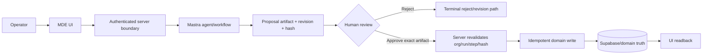

# Mermaid — MDE engineering reasoning standard

Mermaid is not decorative documentation. In MDE it is a **selective thinking, review, and defect-prevention tool**. Do not load it for trivial edits where prose or the diff is clearer.

Use diagrams to answer questions prose hides:

```text
What talks to what?
Who owns the write?
Where is auth enforced?
What must happen before what?
What can fail?
What retries?
What is irreversible?
What blocks the task?
What state is durable?
Where can tenant data cross?
What evidence proves the journey?
```

Mermaid's official purpose is to keep documentation closer to development using text-based diagrams that are easy to edit and version. Keep diagrams close to the task/code they explain and update them when the implementation changes.

## Mandatory MDE diagram pass

Use this skill when a substantial `SAN-*` task has non-trivial relationships, state, sequence, ownership, dependencies, trust boundaries, or failure/recovery paths:

1. **Task overview:** include one diagram showing the end-to-end user/system outcome.
2. **Architecture/ownership:** diagram every material boundary crossed by the task.
3. **Dependencies/blockers:** show predecessor, downstream, external, and human-approval dependencies when material.
4. **Each substantive task section or file/workflow group:** add the diagram that best exposes its behavior, ownership, data, state, or failure path.
5. **Negative/recovery:** include failure/error/retry/rollback branches for risky work.
6. **Verification:** show how expected state/evidence is reached when the path is non-trivial.
7. **PR:** include the smallest diagrams that let a reviewer understand changed architecture/user flow without reconstructing it from code.
8. **Post-merge:** update diagrams if the merged implementation differs from the planned model.

If a section truly has no meaningful relationship, state, dependency, sequence, or decision to visualize, write:

```text
Diagram: N/A — no meaningful relationship/state/sequence to model.
```

Do **not** create filler diagrams merely to satisfy the rule.

## Diagram-first defect discovery

Before implementation, draw the current and target path. Then actively inspect the diagram for:

| Red flag | What to look for in the diagram |
|---|---|
| Missing owner | node/action with no authoritative service/domain owner |
| Second source of truth | two durable stores claiming the same business truth |
| Auth gap | browser/client reaches protected state before server authorization |
| Tenant leak | org/resource ID crosses boundary without revalidation |
| Hidden write | read-looking path triggers mutation/webhook/RPC side effect |
| HITL bypass | AI/tool reaches consequential write without explicit human gate |
| Wrong approval | approval is not tied to exact artifact/revision/hash |
| Retry duplication | retry/resume/callback can traverse a write twice |
| Dead end | failure branch has no recovery/rollback/operator outcome |
| Circular dependency | tasks/services wait on each other |
| Stale dependency | diagram points to deprecated route/service/skill/provider |
| Unowned failure | external/provider error has no caller handling or escalation |
| Missing evidence | final state has no observable test/readback/trace proving it |
| Over-coupling | one file/service owns unrelated responsibilities |
| Race condition | concurrent paths can mutate the same state without arbitration |
| Secret exposure | credential/token enters model, memory, snapshot, client, or trace path |

If the diagram reveals a red flag, **stop and correct the task/architecture before coding** when the issue is load-bearing.

## Choose the right diagram

Use the smallest type that makes the hidden relationship obvious.

| Development question | Preferred Mermaid type | Best MDE use |
|---|---|---|
| What is the end-to-end path or decision? | `flowchart` | task overview, request path, validation, fallback, failure branches |
| Which actor/service calls what, in what order? | `sequenceDiagram` | auth, API, CopilotKit/AG-UI, Mastra tools, webhook/callback, write/readback |
| What states/transitions are legal? | `stateDiagram-v2` | approvals, workflow lifecycle, booking, publish status, retry/cancel/expiry |
| What tables/entities relate? | `erDiagram` | Supabase schemas, FK/cardinality, durable ownership |
| What classes/types/interfaces relate? | `classDiagram` | domain types, SDK interfaces, component/service structure |
| What services/resources are deployed together? | `architecture-beta` / architecture diagram | Cloudflare, Supabase, queues, storage, CI/CD/runtime topology |
| What are the system/container boundaries? | C4 | high-level platform context/container/component views; use carefully because Mermaid C4 remains marked experimental/beta in official docs |
| Where do responsibilities cross teams/services? | swimlane/flowchart with subgraphs | frontend/backend/AI/operator handoffs |
| What does the operator experience? | `journey` | user pain points/satisfaction; use flowchart for system correctness details |
| What must happen over time? | `timeline` | migrations, incidents, release history, dependency chronology |
| What is scheduled and dependency-bound? | `gantt` | roadmap/release/migration sequencing; not runtime control flow |
| Which requirement is satisfied by which design/test? | `requirementDiagram` | acceptance-criteria traceability, safety requirements |
| What is on the board now/next/later? | `kanban` | execution planning/status, not architecture |
| What branches/merges occurred? | `gitGraph` | release/branch history when it clarifies integration risk |
| How do ideas/features decompose? | `mindmap` | discovery, scope decomposition, product taxonomy; not proof of runtime behavior |
| How should options be prioritized? | `quadrantChart` | impact vs effort/risk, vendor/feature choice |
| What quantity changes over time/category? | `xychart-beta` | performance, latency, test counts, trends |
| How does quantity/volume flow between stages? | `sankey-beta` | funnel/data/media processing volume; not authorization flow |
| What network/protocol fields exist? | `packet-beta` | webhook/protocol payload layouts when field order/width matters |
| How are layout blocks related? | `block-beta` | compact topology/layout when flowchart positioning is insufficient |
| What dimensions differ across options? | `radar-beta` | architecture/vendor comparison; label assumptions |
| What events/commands/read models form a domain flow? | event modeling | business process/event-driven design |
| What sets overlap? | Venn | capability/ownership overlap, duplicate scope detection |
| What causes a failure? | Ishikawa | root-cause analysis after incident/test failure |
| What capabilities create value vs maturity? | Wardley | strategic platform/vendor/build-vs-buy discussion only |
| How uncertain/complex is a decision? | Cynefin | problem-classification workshop; not implementation proof |
| What is the hierarchy/tree? | TreeView | route/component/domain hierarchy when hierarchy itself is the question |
| What parts contribute proportionally? | treemap | code/domain/portfolio composition; not workflow order |
| What does control flow look like with richer loops/branches? | ZenUML | complex call sequence when standard sequence syntax becomes unreadable |

Official Mermaid 11.17.2 currently lists flowchart, swimlanes, sequence, class, state, ER, user journey, Gantt, pie, quadrant, requirement, GitGraph, C4, mindmaps, timeline, ZenUML, Sankey, XY, block, packet, Kanban, architecture, radar, event modeling, treemap, Venn, Ishikawa, Wardley, Cynefin, and TreeView among supported syntax families. Verify exact syntax/features against the target renderer before relying on newer/beta types.

## MDE diagram set by development phase

### 1. Task discovery

Minimum useful set for a substantial task:

```text
flowchart       → current → target user/system journey
architecture    → ownership + source-of-truth boundaries
requirement     → AC → implementation/test trace when requirements are complex
```

Use a **current-state diagram first**, then target state. The difference is the actual task scope.

### 2. File/workflow planning

For each substantive file/group, ask:

```text
Does this file change call order?       → sequence
Does it change decisions/branches?      → flowchart
Does it change lifecycle/state?         → state
Does it change durable relationships?   → ER
Does it change service boundaries?      → architecture/C4
Does it implement AC dependencies?      → requirement
Otherwise                               → Diagram: N/A with reason
```

A file diagram should show **why the file exists in the task**, not every import/function.

### 3. Implementation

Keep diagrams synchronized with discovered reality. If code inspection disproves the planned diagram:

```text
update diagram
→ update task assumption
→ update implementation plan
→ only then code
```

Do not force code to match a stale diagram.

### 4. Review / pre-merge

Review diagrams for structural defects before reading every changed line:

```text
entry → auth → trusted context → business logic → side effect → durable state → readback
```

Mark critical branches explicitly:
- unauthorized / cross-org;
- malformed/empty/stale input;
- provider/network failure;
- retry/duplicate/concurrent action;
- reject/cancel/expiry;
- rollback/compensation;
- observable success.

### 5. Post-merge / incident

Use:
- sequence/flowchart to compare expected vs actual runtime path;
- timeline for incident chronology;
- Ishikawa for root-cause categories;
- state diagram for invalid/unexpected state transition;
- architecture/ER for ownership or data-integrity drift.

Convert the discovered failure branch into a permanent regression test when practical.

## MDE canonical examples

### AI proposal → approval → durable write



Review questions: Can AI bypass `R`? Can `V` receive stale/wrong tenant data? Can `W` run twice? Can UI claim success before `DB`?

### External provider failure/retry

```mermaid
sequenceDiagram
    actor Operator
    participant API as MDE server
    participant Provider
    participant DB as Durable state

    Operator->>API: Start action
    API->>Provider: Request with operation/idempotency identity
    alt provider succeeds
        Provider-->>API: Success + provider ID
        API->>DB: Commit/reconcile once
        DB-->>Operator: Durable success
    else timeout / response lost
        Provider--xAPI: Unknown outcome
        API->>DB: Reconcile by stable identity
        API->>Provider: Retry only if safe
    else provider rejects
        Provider-->>API: Typed failure
        API-->>Operator: Recoverable error; no fake success
    end
```

This makes the response-loss/idempotency hole visible before implementation.

## Quality rules

1. **One question per diagram.** Split views when one diagram tries to explain architecture + sequence + states + schedule simultaneously.
2. **Model authoritative boundaries, not visual decoration.** Labels should name real MDE components/services/tasks where known.
3. **Current vs target must be distinguishable.** Never mix them without labels.
4. **Show negative paths for risky work.** A happy-path-only security/HITL/payment/publishing diagram is incomplete.
5. **Show human gates explicitly.** Never imply AI self-approval.
6. **Show durable stores explicitly.** Readers should see where truth is persisted.
7. **Show external systems explicitly.** Do not hide provider behavior inside a generic backend box.
8. **Show trust boundaries explicitly.** Browser-provided IDs are claims until server verified.
9. **Prefer stable IDs/names over volatile implementation detail.** Keep diagrams useful across refactors.
10. **Keep diagrams readable.** If a diagram needs extensive prose to decode, split it.
11. **Use labels on decision edges.** `Yes/No`, `valid/invalid`, `approved/rejected`, `success/failure`.
12. **Do not invent facts.** Unknown edges/nodes should be marked `TBD / unverified` until inspected.
13. **Do not use a diagram as proof.** It defines expected structure; tests/runtime evidence prove actual behavior.
14. **Validate syntax.** Unknown words/misspellings can break Mermaid; parameters may fail silently. Use the target renderer or Mermaid Live Editor when needed.
15. **Version-sensitive syntax:** newer/beta diagram types must not be assumed supported by every Markdown renderer.
16. **No secrets or protected payloads in diagram source.** Use stable IDs/placeholders, not JWTs, cookies, service keys, provider credentials, passwords, raw customer records, or unnecessary PII. Diagram text is source content that may be rendered, stored, copied, indexed, or exported.
17. **Do not weaken renderer security for convenience.** Mermaid's default `securityLevel` is `strict`; interactive links/HTML require looser settings. Any change to renderer trust/security is a separate implementation/security decision, not a diagram-authoring shortcut.
18. **Accessibility:** for important architecture, state, sequence, and user-journey diagrams, provide concise accessible title/description metadata when the target renderer supports it, and keep surrounding prose sufficient to understand the key conclusion without relying only on the visual.

## Syntax pitfalls to remember

- Diagram definitions start with a diagram type declaration; comments use `%%`.
- Unknown words/misspellings can break parsing, while some parameters can fail silently.
- In flowcharts, lowercase `end` can break parsing; prefer `End`/`END` when used as node text.
- Certain leading `o`/`x` characters immediately after an edge can be interpreted as special edge syntax; use spacing/capitalization when needed.
- Quote labels containing troublesome characters rather than relying on parser tolerance.
- Validate against the same renderer/version that will display the task/PR/docs when possible.

## Agent checklist

Before coding:

- [ ] Draw current-state path from verified code/runtime.
- [ ] Draw target-state path.
- [ ] Compare them and identify actual changed edges/nodes/states.
- [ ] Mark auth/tenant/source-of-truth/external/HITL boundaries.
- [ ] Add failure/retry/recovery branches where material.
- [ ] Identify blockers/circular dependencies/unowned responsibilities.
- [ ] Identify where tests/readback prove each critical outcome.
- [ ] Correct Linear if the diagram exposes stale assumptions.

For each task section/file group:

- [ ] Choose the diagram type from the decision table.
- [ ] Add the smallest useful diagram, or explicit N/A reason.
- [ ] Re-check the diagram after code inspection/implementation.
- [ ] Convert newly discovered failure branches into tests or owned follow-ups.

Before Done:

- [ ] PR diagrams match merged architecture.
- [ ] No diagram claims a boundary/test/owner contradicted by code/runtime.
- [ ] Post-merge evidence reaches the same terminal state shown in the diagram.
- [ ] Important diagrams remain understandable with surrounding prose/accessibility metadata.
- [ ] No diagram source contains secrets or unnecessary protected data.

## Sources and syntax

Authoritative current Mermaid sources:

- Official docs: https://mermaid.ai/open-source/intro/index.html
- Official syntax index: https://mermaid.js.org/
- Official repository: https://github.com/mermaid-js/mermaid
- Live editor: https://mermaid.live
- Accessibility: https://mermaid.js.org/config/accessibility
- Security: https://mermaid.js.org/community/security

For exact syntax, load only the relevant local `references/*.md`, then verify newer/beta syntax against the current official docs/target renderer. The local references are convenience material, not authority over a newer or older renderer.
