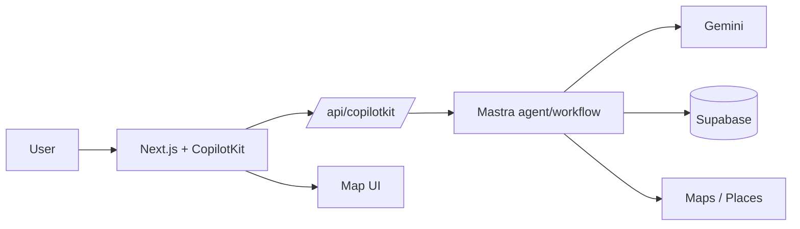
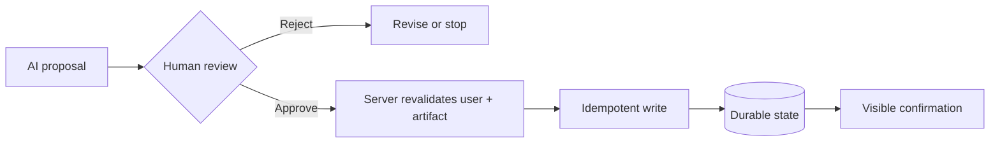

# MDE AI domain diagram patterns

Use these only when they expose a real relationship, state, trust boundary, or failure path.

## Core runtime

## Consequential action

Use domain-specific variants for events publishing, ticket purchase, rental lead/viewing, partner actions, and admin approvals. Show Stripe/webhook retry paths and Supabase/RLS boundaries when they are material.
