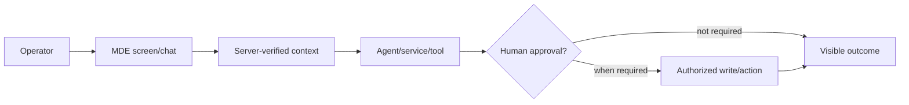
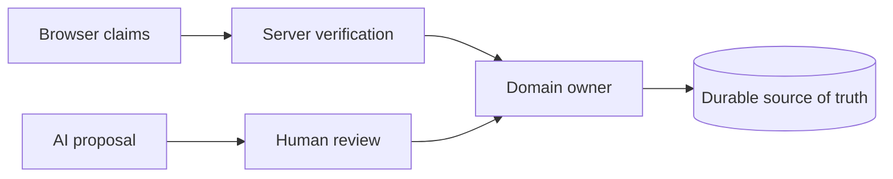

# MDE executable Linear task format

Use this order unless a task-specific reason requires otherwise.

## Top Task Snapshot — put this first

```markdown
**What changes:** <2–4 plain-English lines>
**Real-world example:** <actor → action → visible/durable result>
**Faster/better approach:** <smallest safe proven path>
**Current status:** <state + verified progress %>
**Tech stack touched:** <only affected systems>
**Skills / MCPs / CLI / dashboards:** <only what is actually needed + why>
**Production-ready when:** <one observable success sentence>
```

Unknown values are `Needs verification`, never assumptions.

## Mermaid templates — use only when they expose real flow/risk

**User journey**



**Ownership / trust boundary**



Replace labels with the real task systems. Add failure/recovery/state diagrams only when they reveal a material risk; otherwise record `Diagram: N/A — <reason>`.

1. **Plain-English title + top description** — `SAN-NNN · SPEC — Real-world outcome`; explain in 2–4 lines what changes for the operator/business and why it matters.
2. **Agent Contract** — goal, user outcome, do/do-not, source of truth, successful stop, invalid-assumption stop.
3. **Progress + Handoff State** — overall %, current checkpoint, next action, blocker, do-not-redo evidence.
4. **Summary + Faster/better approach** — ask and answer: “Is there a better, faster, simpler, or more efficient way to complete this task?” Use the better path when equally/more reliable.
5. **Real-world workflow / user journey** — actor → trigger → system steps → human decision when applicable → durable/visible outcome.
6. **Tech stack + affected systems** — exact frameworks/services/runtime/data stores touched; N/A anything not involved.
7. **Skills / MCP / CLI / dashboards** — exact skill/tool and why it is needed.
8. **Known Context / Current-state audit** — verify current code/runtime/live contracts; list existing implementation to reuse.
9. **Audit Findings** — errors, red flags, failure points, blockers, missing pieces, fixes/improvements, and provisional scores /100 when useful.
10. **Definition of Done / Success Criteria** — observable operator/business journey, happy path + required negative paths.
11. **Requirement vs Recommended Implementation** — preserve outcome/invariants while allowing a better verified path.
12. **Architecture connections + ownership** — Mermaid user journey plus architecture/trust/failure diagrams when useful.
13. **Dependencies** — blocked by / blocks / related using full Linear names; identify safe parallel work.
14. **Reference Appendix / research summary** — compact source/action matrix only; never the execution source.
15. **Pre-implementation gate** — clean worktree, code/live-contract recheck, task-relevant dependency discovery (Graphify when needed, otherwise explicit N/A), and required skills/MCPs ready.
16. **Decision branches + STOP conditions** — explicit IF → THEN edge cases and facts that invalidate the plan.
17. **Ordered Implementation Runbook** — authoritative dependency-ordered execution. Each group ends with a named `Checkpoint:` block. Put each important full URL in the exact step that uses it.
18. **Security / data / query / performance contract** when applicable.
19. **Test-data strategy + checkpoint self-check**.
20. **User Journey / AI Journey Certification** when applicable — system correctness and AI correctness are separate gates.
21. **Pre-commit + Pre-merge tests checklist** — use `pre-commit.md` + risk-matched `pre-merge-tests.md`; record N/A with reason.
22. **PR creation + review-comment resolution + exact-head CI**.
23. **Production-ready checklist** — correctness, security/tenant, performance, observability, rollback/cleanup, docs, deployment/runtime, no stale blockers.
24. **Post-merge actions + tests** — use `post-merge.md`; verify merged SHA, main CI, deploy/runtime, real journey, domain-specific proof.
25. **Final implementation report** — result, evidence, scores, residual risks, next task.

## Decomposing a large task

Default to **vertical tracer-bullet tickets**: each child delivers a narrow complete behavior and names its blocking edges. Avoid splitting purely by technical layer (`schema` → `API` → `UI` → `tests`) unless a layer is independently valuable or required as a safe prerequisite.

For wide mechanical refactors that cannot land green vertically, use **expand → migrate → contract**: add the new contract beside the old, migrate callers in green batches, then delete the old contract after all batches pass. Size migration batches from Graphify/dependency evidence, not convenience.

## Minimum substance rule (no empty-box sections)

Filling in a section heading is not the same as satisfying it. Twenty-five sections give a lot of surface to technically "complete" with one-line filler that adds no real information. At minimum:

- **Definition of Done** must name an observable operator/business outcome ("operator sees the saved Brand Brain after refresh"), not a restated task title ("implement Brand DNA save").
- **Decision branches + STOP conditions** must name at least one concrete IF → THEN, not "handle edge cases appropriately."
- **Dependencies** must use full `SAN-NNN · TASK-ID — Full Task Name` references or explicitly say "none," not be left blank.
- A section genuinely not applicable is marked `N/A — <reason>`, not silently omitted or filled with a placeholder sentence.

If a section reads as generic enough to paste into any other task unchanged, it has not met this rule.

## Production-ready checklist — mandatory for substantial implementation

Use applicable rows and mark genuine exclusions `N/A — <reason>`:

- [ ] Observable user/business success criteria pass.
- [ ] Every implementation-group `Checkpoint:` passed on current code/runtime evidence.
- [ ] Required negative/failure paths fail safely.
- [ ] Auth/tenant/RLS/privileged boundaries are proven when applicable.
- [ ] No second source of truth, duplicate runtime, or unnecessary custom rebuild was introduced.
- [ ] Performance/query/runtime limits are acceptable for the changed path.
- [ ] Errors, logging, observability, retry/idempotency, and recovery are sufficient for the risk.
- [ ] Pre-merge risk-matched tests pass on the exact PR head SHA.
- [ ] Review comments are classified and all actionable findings are resolved with evidence.
- [ ] Deployment/config/env changes have an explicit rollback or containment path when applicable.
- [ ] User/AI journey certification passes where applicable.
- [ ] Post-merge actions/tests are named before merge, with the evidence required for 100% / Done.
- [ ] Every residual risk has an exact Linear owner or is closed with evidence.

## Per-file/group section

Every implementation group must state: goal, current MDE pattern, explicit action, exact implementation, Mermaid when helpful, COPY/REWRITE/DROP decisions, success criteria, and a named `Checkpoint:` block.

Required checkpoint shape:

```markdown
**Checkpoint:** <plain-English proof target>
- Success: <observable criterion>
- Verify: <exact targeted test/static/browser/runtime proof>
- Evidence: <test result/SHA/CI/browser/Supabase/etc.>
- STOP if: <condition that prevents advancing>
```

When an external/Reference source is used, put the **full URL in that exact group** and include:

- **Inspect** — exact symbol/API/pattern to read.
- **Action** — COPY / COPY + CLEAN / COPY + CLEAN TOKENS / PORT / EXTRACT + REUSE / REIMPLEMENT USING CURRENT MDE PATTERN / MOVE TO / DROP.
- **Current owner / truth** — the MDE file/service/schema/runtime that wins on conflict.
- **Target** — exact MDE file/symbol/layer.
- **Reuse / adapt** — behavior/schema/test/UX to preserve.
- **Defer / drop** — demo/legacy/runtime/provider/storage/UI pieces not to copy.
- **Constraints** — version, auth/tenant, cost/plan, limits, license/deprecation when relevant.
- **Checkpoint** — exact proof before moving on.

If the same source is used in multiple groups, repeat the full URL with a narrower instruction for the different invariant. Never use `same URL` in the execution runbook. Mutable GitHub sources require an immutable SHA/pinned URL in PR evidence.

**Rule:** do not continue to the next group until the current checkpoint passes, unless the task explicitly documents safe parallel work.


## Audit score block — when useful

Use evidence-backed scores only. A blocker overrides the number.

| Area | Score /100 | Evidence / deduction |
| -- | --: | -- |
| Correctness |  |  |
| Security / tenant safety |  |  |
| Reuse / efficiency |  |  |
| Maintainability |  |  |
| Verification confidence |  |  |
| Production readiness |  |  |
| Overall |  |  |

Mark incomplete-evidence scores **provisional**.


## Agent prompting rules

Use [agent-instructions.md](agent-instructions.md). Give clear sequential gates when order matters, but specify outcomes rather than micromanaging every shell command. Include examples for ambiguous actions and explicit IF → THEN behavior for likely edge cases.

Use [ui-review.md](ui-review.md) for Mermaid/wireframe/state-matrix requirements when diagrams materially reduce implementation ambiguity.

Before commit/PR use [pre-commit.md](pre-commit.md) and [github-pr.md](github-pr.md). Review comments follow [review-comments.md](review-comments.md), [domain-routing.md](domain-routing.md), and [research-evidence.md](research-evidence.md). After merge use [post-merge.md](post-merge.md).


## Agent prompt

```text
Structure the substantial Linear task in this file's execution order. Keep the Agent Contract and progress/handoff state near the top, define the observable business outcome and Definition of Done before implementation detail, and include architecture/dependencies, source-action-target mapping, STOP conditions, ordered file/workflow groups, risk-matched tests, user/AI journey certification when applicable, PR/exact-head CI, and post-merge proof. Every section must meet the minimum substance rule — no generic filler, no silently blank sections. Omit only sections that are genuinely N/A and record why. Do not duplicate stale repository facts; link to the owning task reference or live source of truth.
```
