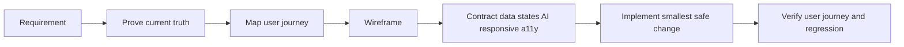

# MDE Wireframe — Turn Product Ideas Into Buildable, Testable Screens

## Start here

**What this changes:** turn a feature idea or existing screen into a verified, buildable UI contract before code.

**Real-world example:** the Events team asks for a faster host-publish flow. The agent first proves the existing `/host/event/new` route, components, data and AI behavior; maps the host journey; creates the wireframe and Mermaid flow; defines draft, approval, error and mobile states; then hands engineering a buildable contract and Playwright proof.

**Faster/better approach:** at task start and each major phase ask: **“Is there a better, faster, more efficient way to complete this without weakening evidence?”** Use that path.

**Production-ready when:** another agent can implement the screen without guessing, every important state has a source of truth, consequential AI writes require approval, and the real user journey can be verified.

**Canonical workflow:** `Prove → Journey → Wireframe → Contract → Implement → Verify`.




## Core rules

1. **Current MDE repository code, runtime, Linear task, and canonical docs are authoritative.** Historical repositories and archived designs are reference-only unless a task explicitly says otherwise.
2. **Inspect before drawing.** Never design from memory when the route, component, data source, or prior design may already exist.
3. **Reuse before creating.** Existing MDE components, hooks, styles, routes, RPCs, and approved design patterns outrank new custom UI.
4. **Wireframes must reflect real data.** Do not invent fields, scores, states, or images that the product cannot supply.
5. **Humans decide. AI assists.** Consequential AI actions must be visibly reviewable and approved before durable writes.
6. **Figma and Mermaid are outputs, not separate workflows.** They should express the same verified journey and contract.
7. **A screen is not ready because it looks good.** It is ready when engineering and QA can implement and verify it without guessing.

## When to use

Use this skill for:
- New MDE screens or flows.
- Existing screens that need redesign or structural changes.
- Discovery/chat, maps, restaurants, cafés, nightlife, events, ticketing, rentals, host/partner dashboards, approvals, checkout, and mobile flows.
- AI-native interactions involving CopilotKit, Mastra, streaming, generative UI, or HITL.
- Converting requirements into wireframe + component/data/state contracts.
- Preparing a screen for Figma, implementation, Linear, or Playwright verification.

Do not use it as a replacement for `tasks`, `nextjs-developer`, `copilotkit`, `mastra`, `supabase`, `cloudinary`, or `task-verifier`. Route to those skills when implementation reaches their layer. `design-to-production` is intentionally not part of current MDE AI; do not reference it as an available skill.


## Tech stack and tool routing

Verify `package.json` and current repo state before relying on versions. Load only the domain skills/tools the screen actually touches. See `references/contracts.md` for the current stack and routing matrix.

## Source-of-truth order

When sources conflict, resolve in this order:

1. Live/current MDE route, data contract, and repository state.
2. `docs/product/prd.md`, `docs/architecture/`, `docs/index.md`, sitemap/accepted ADRs.
3. Approved current designs/wireframes under `docs/design/` and domain-specific design docs.
4. Existing MDE components and design tokens.
5. Screen task + conversion plan + current wireframe/diagram.
6. Historical/reference implementations for proven UX/business logic only.
7. External templates/examples last.

Never let a stale wireframe override a working route, current schema, or accepted architecture.

## Fidelity selection

### Level 1 — Flow sketch
Use for new concepts, screen count, route planning, or stakeholder discussion.
Output: ASCII flow + Mermaid journey/state diagram.

### Level 2 — Implementation wireframe — default
Use for engineering work.
Output: layout, real component targets, data zones, states, AI/HITL behavior, responsive rules, accessibility, reuse map, acceptance criteria, and test scenarios.

### Level 3 — High fidelity
Use after flow/layout are approved or when visual parity matters.
Output: Figma or approved DC design, using the real MDE design system/components where possible.

## 1. PROVE — inspect before drawing

Before creating or changing a wireframe, verify the current state.

Check:
- Canonical route and whether it already exists.
- Current page/workspace implementation.
- Existing components, hooks, CSS modules, utilities, dialogs, sheets, and shells.
- Data source: table/view/RPC/API and nullability.
- Existing AI surface, agent, tools, and approval behavior.
- Existing DC/Figma/wireframe/diagram for the screen.
- Active PR/worktree that may already own the change.
- Related Linear task and dependencies when known.

Use Graphify/repository search before broad reading. Read only load-bearing files first.

### Prove table

| Area | Current truth | Change needed? |
|---|---|---|
| Route | | |
| Workspace/page | | |
| Reusable components | | |
| Data source | | |
| AI/agent behavior | | |
| Existing design | | |
| PR/worktree collision | | |

If the reported gap no longer exists, stop and report that instead of redesigning it.

## 2. JOURNEY — define the outcome before the screen

State the real user and observable outcome in plain language.

Example:
`Host opens Create Event → enters event details → AI proposes draft → host edits/rejects/approves → server validates → event is published → visible success confirms the write.`

Required journey questions:
1. Who starts the flow?
2. What triggers it?
3. What must the user understand or decide?
4. What does the system/AI return?
5. Where can the user edit, reject, retry, or leave?
6. What action commits durable state?
7. What visible success confirms completion?

For multi-step, cross-system, approval, or failure-heavy flows, produce Mermaid.

### Mermaid rule

Use Mermaid to explain behavior, not decorate documentation.
Prefer:
- `flowchart` for navigation/decision paths.
- `sequenceDiagram` for UI → agent → approval → data interactions.
- `stateDiagram-v2` for lifecycle/state machines.
- `journey` for persona experience when useful.

The Mermaid diagram and wireframe must describe the same flow.

## 3. WIREFRAME — show hierarchy and behavior

Wireframe from the verified journey, not from a component wish list.

For each screen:
- Mark primary task and primary CTA.
- Organize information by priority: `P0` required, `P1` important, `P2` supporting, `P3` advanced/optional.
- Show major zones and navigation.
- Annotate interaction, dynamic content, validation, and transitions.
- Keep lo-fi work visually simple; do not spend time polishing color/branding before structure is approved.

### Preferred outputs

**Default:** ASCII + spec tables for fast engineering communication.

**Clickable prototype:** use approved HTML/Figma when interaction needs validation.

**Figma:** first-class output for high-fidelity or collaborative design; use real MDE components/design-system constraints where available rather than generic boxes.

**Existing HTML/Figma/design artifact:** when explicitly approved and current, treat it as visual reference while keeping code, data contracts, accessibility, and current architecture authoritative.

Current screen and reference wireframes live under:
`docs/design/` (including `reference-wireframes/` where applicable)

Current approved design references live under:
`docs/design/`

## 4. CONTRACT — make the wireframe buildable

Every implementation wireframe must make these items explicit:
- component reuse: Reuse / Adapt / Create / Defer;
- data source of truth + empty/missing state + write path;
- relevant UI and recovery states;
- AI/HITL authority and approval path;
- desktop/tablet/mobile behavior;
- accessibility semantics, focus, labels, validation, and announcements;
- P0–P3 information priority when space tradeoffs matter.

Use `references/contracts.md` for the detailed tables and rules. Use `references/ai-hitl.md` for consequential AI flows.

## 5. IMPLEMENT — hand off the smallest safe change

The wireframe skill does not own production implementation. Its job is to make implementation deterministic.

Before handoff, identify:
- Existing files/components to reuse.
- New components genuinely required.
- Data/API/RPC dependencies.
- AI/CopilotKit/Mastra dependencies.
- Explicit out-of-scope work.
- Acceptance criteria tied to the journey.

**Faster/better approach:** prefer the smallest change that reuses current MDE architecture and components. Do not redesign unrelated systems or copy obsolete legacy infrastructure.

Route implementation to the relevant skills only when needed:
- `tasks` — canonical implementation, PR, CI, and post-merge workflow.
- `nextjs-developer` — routes, App Router, server/client boundaries.
- `vercel-react-best-practices` — React performance.
- `supabase` — tables, views, RPCs, RLS, types.
- `copilotkit` — agent UI, generative UI, context, approvals.
- `mastra` — agents, tools, workflows, memory.
- `task-verifier` — final Done gate.

Do not load unrelated skills for a screen that does not touch those layers.

## 6. VERIFY — design intent must be testable

Every implementation wireframe should produce acceptance criteria and QA scenarios.

Minimum verification targets:
- Primary journey completes.
- Loading/empty/error states are honest.
- AI proposal can be edited/rejected/approved as designed.
- Rejection does not commit a durable write.
- Approval commits once and shows visible confirmation.
- Responsive behavior matches the contract.
- Keyboard/focus behavior works.
- Existing routes/data behavior does not regress.

Convert important states directly into Playwright scenarios.

Example:
`No saved rentals → /saved shows an honest EmptyState → Explore Rentals CTA is keyboard reachable.`

AI example:
`Generate proposal → approval card appears → reject writes nothing → regenerate/edit → approve → one committed record.`

For an approved DC/Figma target, also perform visual comparison at the required desktop/mobile widths.

## Ready gate

Before calling a wireframe Ready, perform the forensic checks in `references/verification.md`. Any security, tenant, destructive-write, unsupported-tool, or approval-integrity blocker means **BLOCKED regardless of score**.

## Implementation lifecycle ownership

`wireframe` stops at a buildable, testable UI contract. It does not duplicate the repository lifecycle.

**REQUIRED SUB-SKILL:** use `tasks` for implementation execution, PR creation, exact-head CI, pre-merge gates, post-merge proof, and Linear Done.

Use `references/verification.md` when deriving UI-specific acceptance criteria, Playwright scenarios, visual comparison, responsive checks, or AI/HITL verification from a wireframe.

Use `references/ai-hitl.md` when the screen includes CopilotKit/Mastra proposals, approvals, retries, resume/commit behavior, or consequential writes.

Use `references/contracts.md` when the screen needs a detailed component/data/state/responsive/accessibility contract.

## Canonical output template

```text
# <Screen / Flow>
## Goal
## Prove
## Journey
## Wireframe
## Reuse map
## Data + states
## AI/HITL
## Responsive + accessibility
## Risks / blockers
## Acceptance criteria
## Verification scenarios
```

Keep sections concise. Add Mermaid only when it exposes a meaningful relationship, decision, state, trust boundary, or failure/recovery path. Add Figma/DC only when fidelity or collaboration requires it.

## Required output package

Keep the package concise but complete:
1. Goal and user outcome.
2. Current-state findings.
3. User journey.
4. ASCII implementation wireframe.
5. Component reuse map.
6. State matrix.
7. Data contract.
8. AI/HITL contract, when applicable.
9. Responsive behavior.
10. Accessibility notes.
11. Risks/blockers.
12. Acceptance criteria.
13. Playwright/verification scenarios.
14. Mermaid diagram when the flow crosses systems, approvals, or meaningful branches.
15. Figma/DC artifact when fidelity or collaboration requires it.

## Canonical principle

A good MDE wireframe is not a disposable drawing. It is the smallest shared contract connecting product intent, current system truth, design, engineering, AI governance, and QA.
