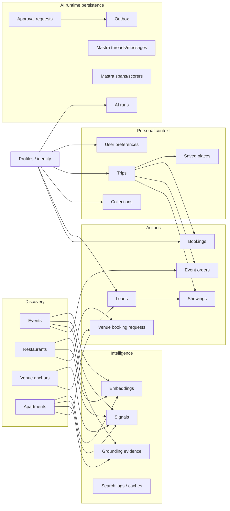
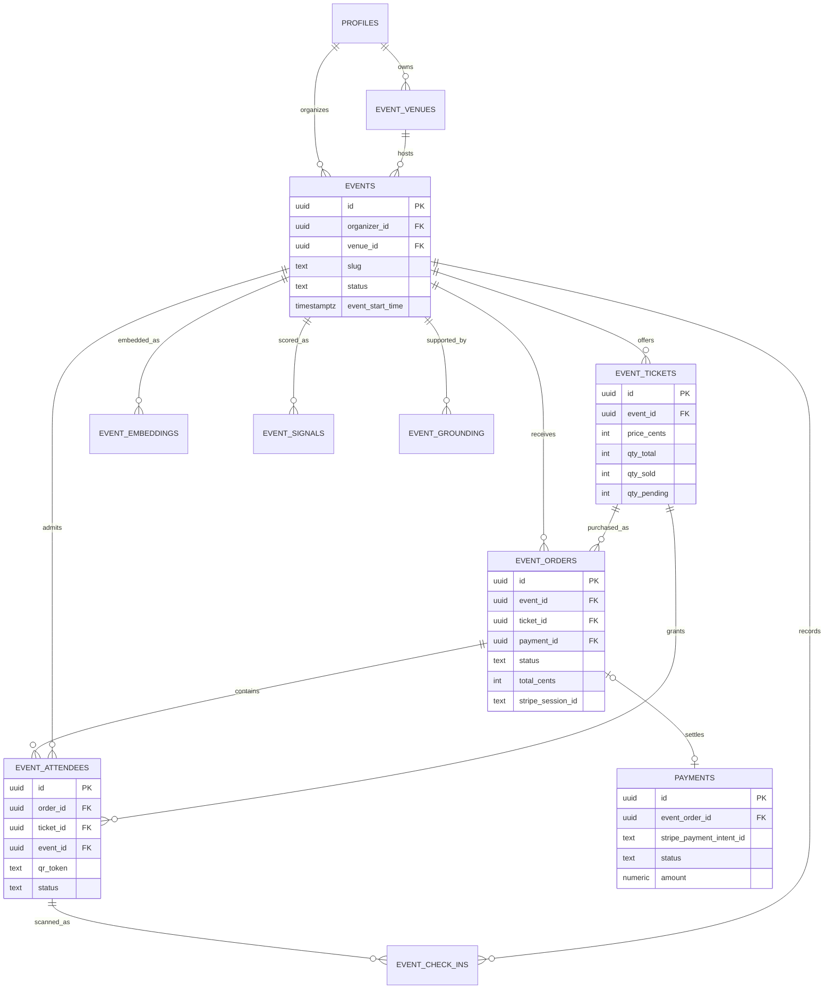
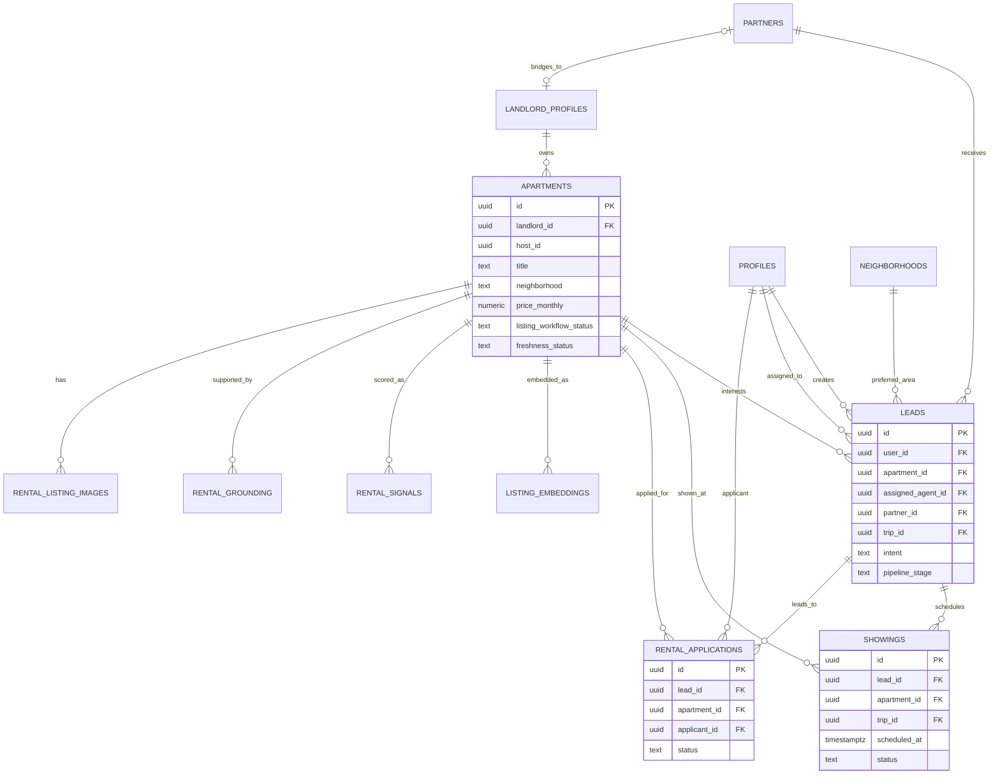
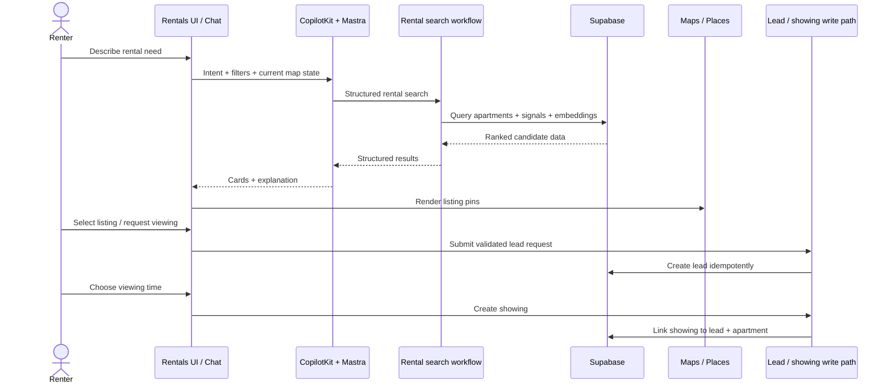
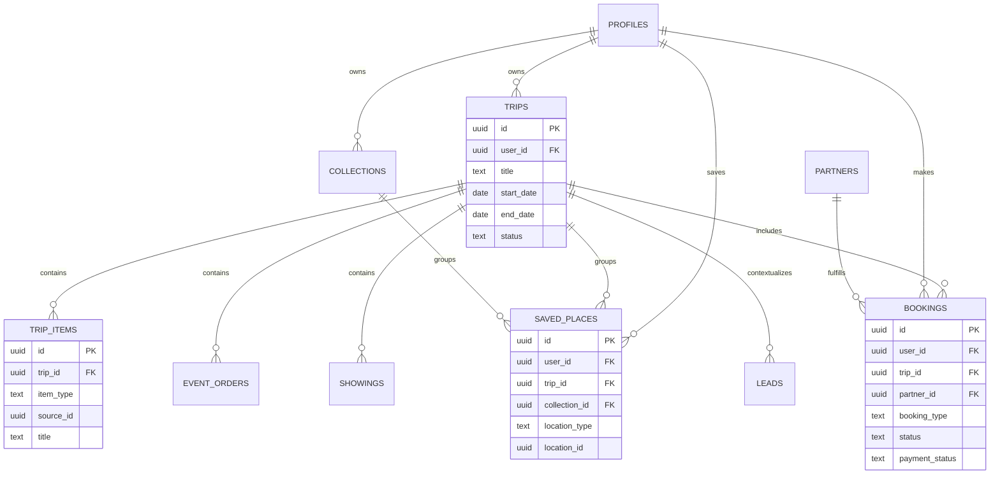
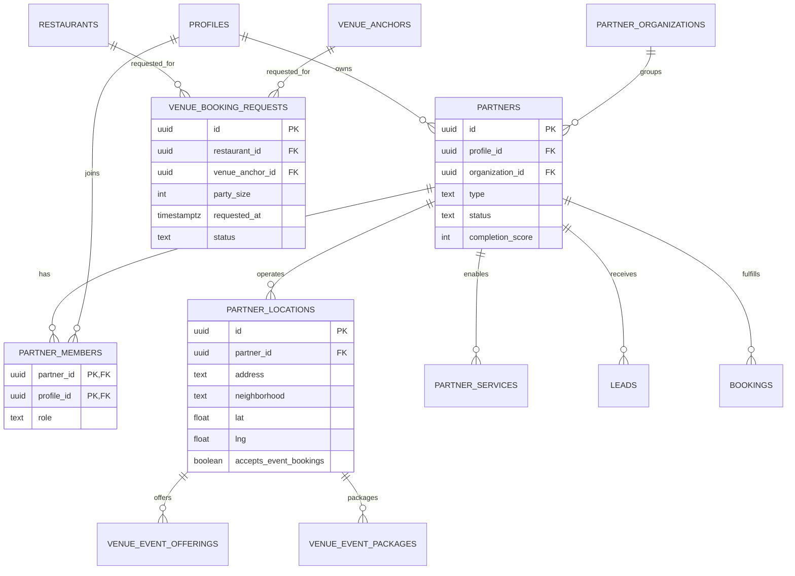
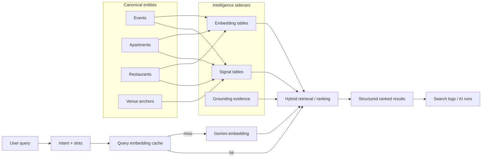
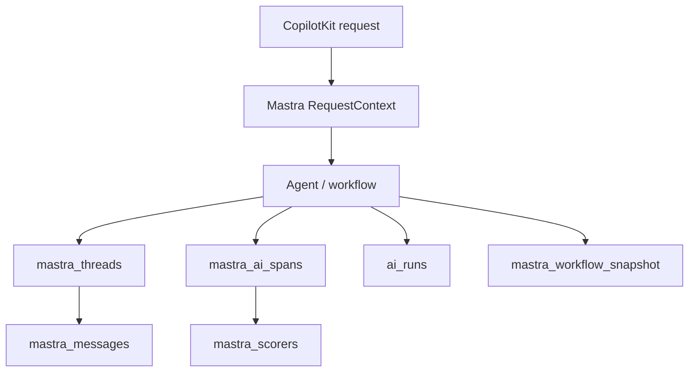
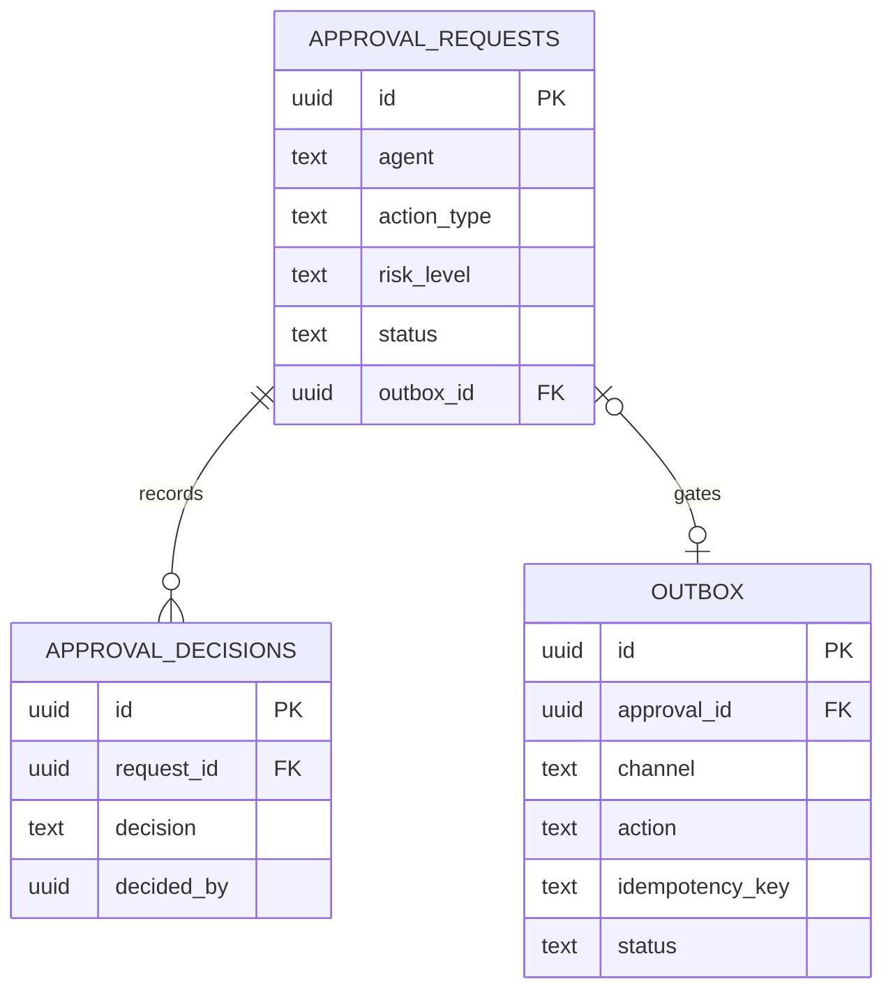
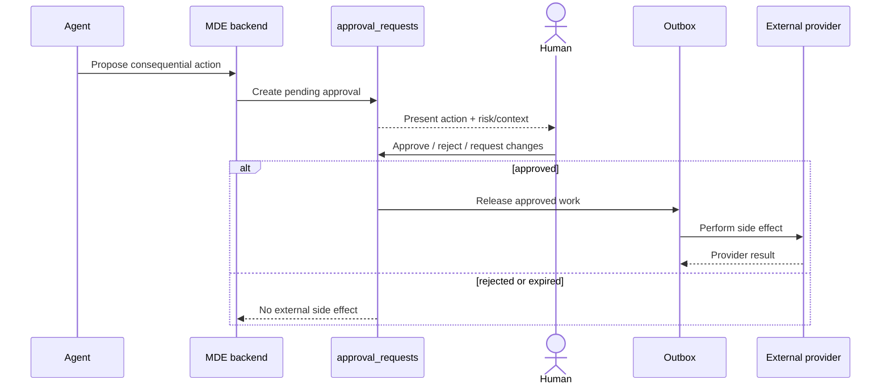

# MDE AI — Data Model and Live Supabase ERDs

This document describes the **current MDE AI data architecture** using the live Supabase project and merged GitHub `main` as evidence.

## Source of truth

Data-model claims are verified in this order:

1. live Supabase project `zkwcbyxiwklihegjhuql` (`medellin`);
2. merged GitHub `main` migrations and application code;
3. current tests and runtime contracts;
4. Linear only for planned work and execution status.

Verified live project:

- project ref: `zkwcbyxiwklihegjhuql`;
- project name: `medellin`;
- status: `ACTIVE_HEALTHY`;
- Postgres: 17.6;
- region: `us-east-1`.

The diagrams intentionally show **logical product domains**, not every table in the database. Large infrastructure/support tables are documented where they affect architecture but omitted from domain ERDs when they would make the diagram unreadable.

Mermaid reference: https://mermaid.ai/open-source/intro/

---

## 1. Domain Data Map



This diagram shows the core pattern:

> **canonical entities → intelligence/evidence → user actions → persistent context → AI/operational audit**

---

## 2. Events and Ticket Commerce ERD



### Event commerce invariants

- `event_tickets` belong to one event.
- `event_orders` reference both the event and ticket tier.
- `event_attendees` are generated from an order and carry the QR identity.
- `event_check_ins` provide the scan/audit trail.
- `payments` can reference an event order.
- inventory tracks both sold and pending quantities.
- final payment state must come from trusted backend/provider confirmation, not the browser.

---

## 3. Rental Marketplace ERD



### Rental data flow



---

## 4. Trips, Saved Context, and Bookings ERD



This is the persistent context layer that lets MDE move from one-off discovery toward ongoing planning.

---

## 5. Partners and Venue Supply ERD



---

## 6. AI, Search, Embeddings, and Observability

The live database already contains an active intelligence layer.

Current examples:

- `listing_embeddings` → `apartments`;
- `event_embeddings` → `events`;
- `restaurant_embeddings` → `restaurants`;
- `event_signals`, `rental_signals`, `venue_signals`;
- `event_grounding`, `rental_grounding`, `venue_source_evidence`;
- `search_logs`, `grounding_failures`, `query_embedding_cache`;
- `embedding_jobs`;
- `ai_runs`;
- Mastra thread/message/span/scorer/workflow persistence tables.

### Intelligence data flow



### Important correction to older planning assumptions

pgvector/semantic retrieval is **not merely a future concept**. Live Supabase already contains vector-backed embedding tables for apartments, events, and restaurants, plus query embedding cache and embedding job infrastructure.

The roadmap may still contain **future expansion** of semantic personalization, but the base vector-search infrastructure exists today.

---

## 7. AI Runtime Persistence



This persistence supports conversation continuity, workflow state, tracing, scoring, cost/performance analysis, and production debugging.

---

## 8. Human Approval and Outbox ERD



### Approval / side-effect data flow



The architectural rule is:

> **AI may propose; authorization, approval, validation, and side effects remain deterministic.**

---

## 9. RLS and Security Boundary

Core MDE product tables inspected in the live project use RLS, including profiles, events, restaurants, apartments, leads, payments, event commerce, partner, trip, booking, intelligence, approval, and Mastra persistence tables.

Supabase security principle:

```text
Auth = who is the caller?
RLS = which rows may the caller access?
Server/tool validation = is this transition valid?
AI = never an authorization boundary
```

### Live schema drift warning

The live `public` schema also contains several `fashionos_*` tables that are outside the canonical MDE product model. At verification time, those tables had RLS disabled. They are intentionally excluded from these MDE ERDs.

This should be treated as **database/schema security drift requiring separate review**, not as part of MDE's canonical architecture. Do not blindly enable RLS without defining the intended access policies because that can break existing consumers.

---

## 10. ERD Maintenance Rules

1. Generate relationships from live foreign keys or merged migrations — never from the PRD alone.
2. Keep domain ERDs focused; do not create one unreadable diagram containing every table.
3. Use real cardinality only where the schema supports it.
4. Mark polymorphic references such as `saved_places.location_id` or `trip_items.source_id` as application-level references rather than pretending they are database FKs.
5. Keep vector/signal/evidence sidecars separate from canonical entity ownership.
6. Re-check the live schema before major documentation releases.
7. Treat RLS and authorization as architecture, not implementation detail.

## Related docs

- [`system-overview.md`](system-overview.md) — system/runtime architecture
- [`README.md`](README.md) — architecture index
- [`../../prd.md`](../../prd.md) — product requirements
- [`../../roadmap.md`](../../roadmap.md) — product strategy
- Mermaid ER diagrams: https://mermaid.ai/open-source/syntax/entityRelationshipDiagram.html
