# MDE AI — System Architecture Overview

This document explains the **current MDE AI architecture** from verified repository and live data truth.

## Source-of-truth rule

Architecture claims must be checked against:

1. live runtime/data evidence where available;
2. merged GitHub `main`;
3. current source code;
4. `src/app` route structure;
5. live Supabase schema + merged migrations;
6. current package manifests and tests;
7. Linear only for live execution status and planned work.

Do not use old SHAs, local machine paths, stale percentages, or historical task descriptions as architecture truth.

Related data architecture: [`data-model.md`](data-model.md)

---

## 1. Architecture Summary

MDE AI is a **Next.js AI-native application** where structured product screens and conversational AI share the same backend capabilities.

| Layer | Primary responsibility |
|---|---|
| Next.js + React | Application shell, pages, route handlers, server/client boundaries |
| CopilotKit / AG-UI | AI interaction layer between UI and agent runtime |
| Mastra | Agents, tools, workflows, memory, tracing, orchestration |
| Gemini | Model reasoning, structured generation, embeddings, grounding where configured |
| Supabase | Authentication, PostgreSQL data, RLS, persistence, vector data, server-side access |
| Google Maps / Places | Spatial display and trusted place/location information |
| Stripe/payment services | Checkout, payment confirmation, ticket/payment workflows where implemented |
| Vitest + Playwright + verification scripts | Unit, integration, browser, smoke, and release proof |

The central rule is:

> **AI coordinates work; deterministic application code owns trusted state changes.**

---

## 2. High-Level System Context

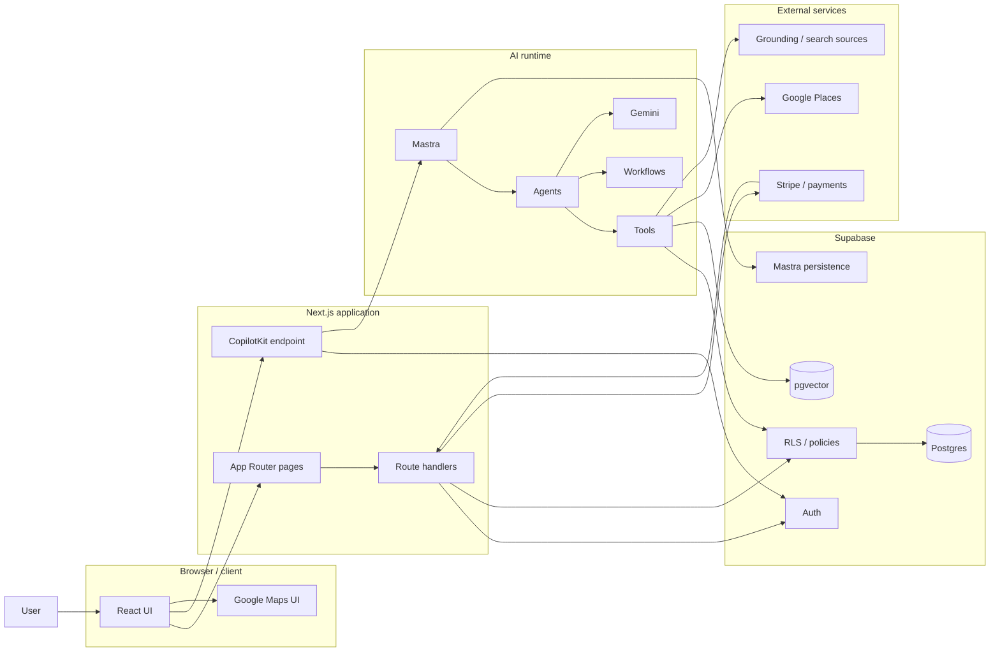

This separates the major trust/runtime boundaries without pretending every call follows one path.

---

## 3. Runtime and Trust Boundaries

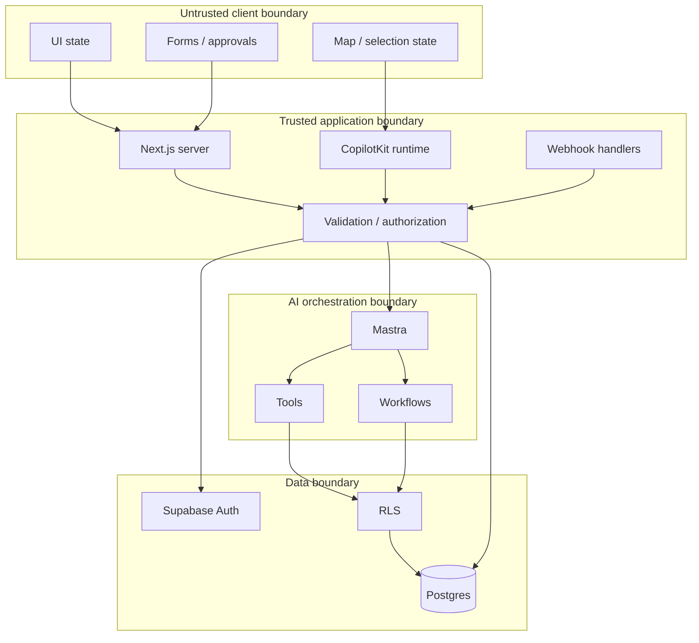

Rules:

1. Browser state is never final authority for privileged mutations.
2. Authentication establishes identity.
3. RLS restricts row access.
4. Server/tool validation enforces business transitions.
5. AI output does not grant authorization.
6. External payment confirmation must be verified in trusted server/webhook code.

---

## 4. Application Layer — Next.js + React

The repository uses the Next.js App Router.

`src/app` owns implemented route truth. Current major surface groups include:

- consumer discovery: `/`, `/chat`, `/events`, `/rentals`, `/restaurants`, `/cafes`, `/nightlife`, `/venues`;
- personal context: `/saved`, `/trips`, `/me/tickets`;
- identity: `/login`, `/signup`, auth callback/signout routes;
- host/operator: `/host/*`;
- partner/sponsor: `/partners/*`, `/sponsors`;
- admin: `/admin/event-bookings`;
- APIs under `/api/*`, including CopilotKit, discovery, rentals, events, tickets, places, approvals, partners, and booking flows.

React owns presentation, local interaction state, maps/cards/forms, wizard steps, degraded states, and explicit user approval surfaces. It does **not** own payment truth, authorization, or irreversible backend state.

---

## 5. Three-Panel Product Model

> **Left = Context**  
> **Main = Work**  
> **Right = Intelligence**

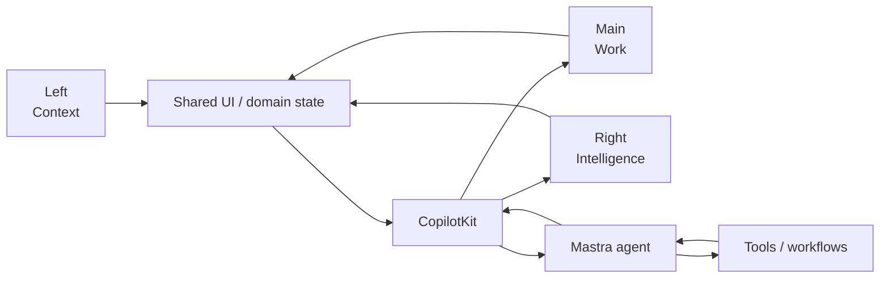

Typical responsibilities:

- **Left / Context:** navigation, saved state, trips, threads, workflow context, filters.
- **Main / Work:** chat, browse results, forms, dashboards, wizard steps, approvals, transactions.
- **Right / Intelligence:** map, selected-item details, recommendations, comparisons, evidence, next actions.

This is a responsibility model, not a requirement for three visible desktop columns. Mobile may collapse panels into sheets, drawers, tabs, or stacked views.

---

## 6. CopilotKit → Mastra Runtime

The implemented CopilotKit endpoint is `/api/copilotkit/[[...path]]`.

Current `main` shows:

- authorization guard;
- distributed IP ceiling/rate limiting;
- Supabase user lookup;
- per-request Mastra `RequestContext`;
- user/resource identity propagation;
- local Mastra agent registration;
- user-scoped Supabase context for host operations;
- AI-run persistence after streamed responses.

### AI request sequence

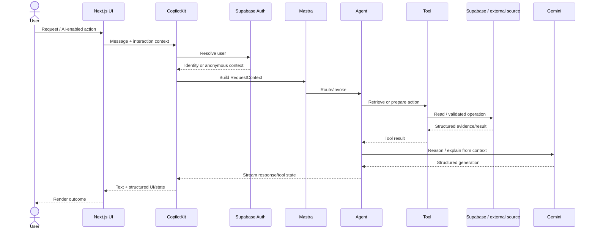

The runtime exists today. Architecture work should improve grounding, tool safety, state propagation, evaluation, and failure handling rather than recreate the bridge.

---

## 7. Current Mastra Agents and Workflows

Merged `main` exports these primary agents:

| Agent | Responsibility |
|---|---|
| `routerAgent` | Intent/domain routing |
| `conciergeAgent` | General concierge interaction |
| `rentalAgent` | Rental-domain reasoning/tools |
| `eventAgent` | Event reasoning/discovery |
| `hostEventAgent` | Host event creation/publishing assistance |
| `hostOpsAgent` | Host operational assistance |
| `evaluationAgent` | Evaluation/quality-oriented behavior |
| `pingAgent` | Minimal runtime connectivity check |

Current workflows:

| Workflow | Purpose |
|---|---|
| `rentalSearchWorkflow` | Multi-step rental search |
| `eventDiscoveryWorkflow` | Event discovery orchestration |
| `eventVenueBookingWorkflow` | Event/venue booking orchestration |
| `salesInsightWorkflow` | Sales/operational insight |

Prefer a **small number of capable agents + explicit tools + deterministic workflows** rather than one agent per screen.

---

## 8. Model Layer — Gemini

Gemini is used through the AI SDK/Mastra integration for reasoning and generation. The live database also confirms Gemini-backed embedding infrastructure.

Appropriate model responsibilities include:

- intent interpretation;
- structured generation;
- explanation;
- evidence-backed ranking/reasoning;
- content drafting for human review;
- embeddings/semantic retrieval support.

Gemini must not become the source of truth for identity, authorization, payment completion, inventory state, place coordinates, or irreversible writes.

---

## 9. Live Supabase Architecture

Verified live Supabase project:

```text
project: zkwcbyxiwklihegjhuql
name: medellin
status: ACTIVE_HEALTHY
Postgres: 17.6
region: us-east-1
```

Supabase owns:

- authentication;
- PostgreSQL application state;
- row-level security;
- trips/saved context;
- events/ticket commerce;
- rentals/leads/showings;
- partners/bookings;
- approvals/outbox;
- AI execution telemetry;
- Mastra persistence;
- search/grounding caches;
- pgvector embeddings.

### Auth + RLS trust path

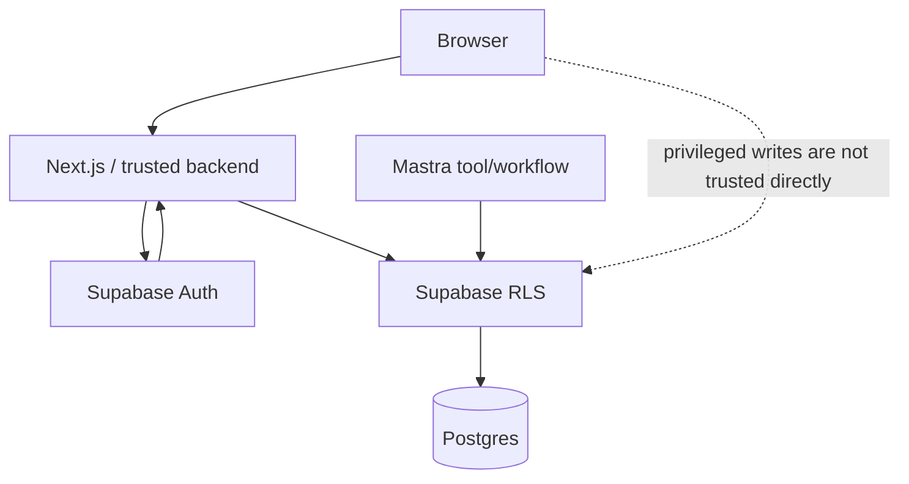

Supabase principle:

> **Auth = who is acting; RLS = which rows may be accessed; validation = whether the state transition is allowed.**

Full domain ERDs: [`data-model.md`](data-model.md)

---

## 10. Semantic Search / pgvector

Live Supabase has the `vector` extension installed (`0.8.0`) and live embedding tables including:

- `listing_embeddings` → `apartments`;
- `event_embeddings` → `events`;
- `restaurant_embeddings` → `restaurants`;
- `query_embedding_cache`;
- `embedding_jobs`.

Therefore the base semantic retrieval layer is **implemented**, while deeper personalization and broader vector use may still be roadmap work.

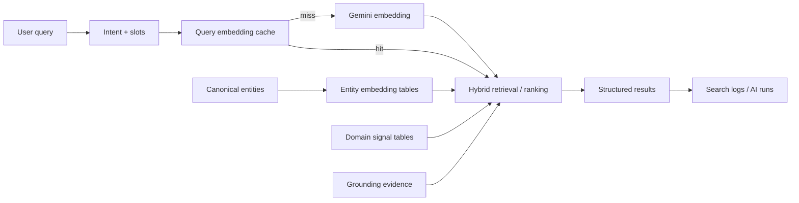

---

## 11. Maps and Places

Google Maps/Places is the spatial layer for map rendering, markers, card↔pin synchronization, selected-location context, and trusted place IDs/coordinates.

The model may rank or explain places. It should not fabricate location identifiers or coordinates.

### Discovery data flow

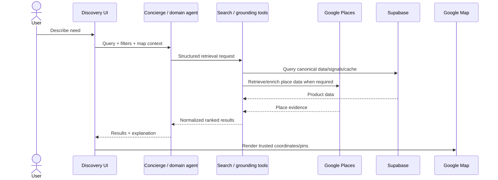

---

## 12. Events and Transaction Flow

The browser may initiate commerce, but payment finalization belongs to trusted backend/provider paths.

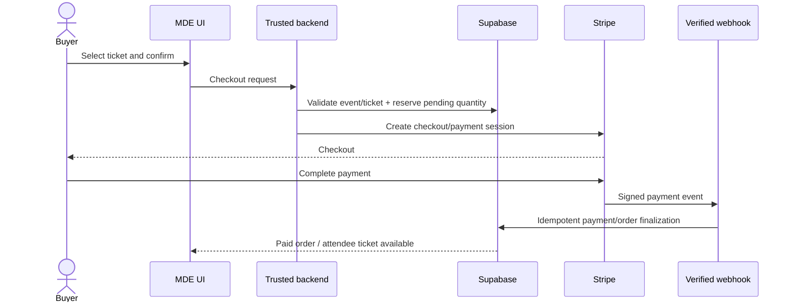

### Event order state model

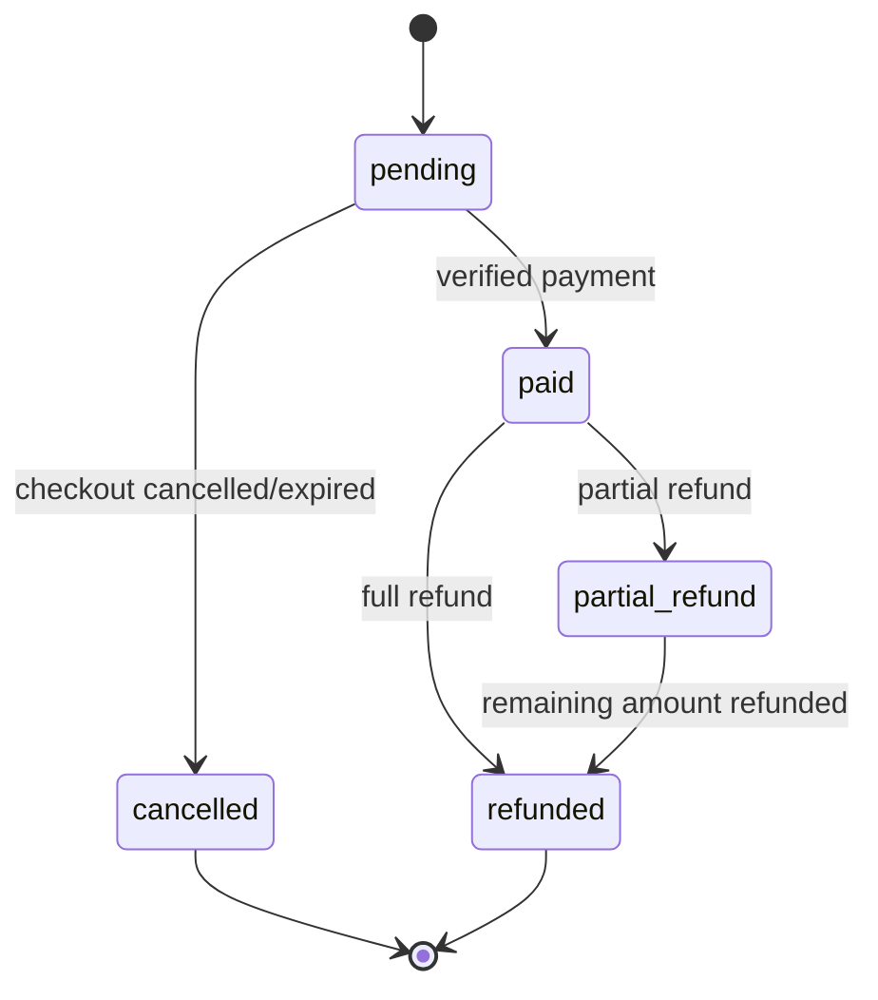

Exact allowed transitions must remain enforced by current backend/database code, not by this diagram alone.

---

## 13. Rental Data Flow

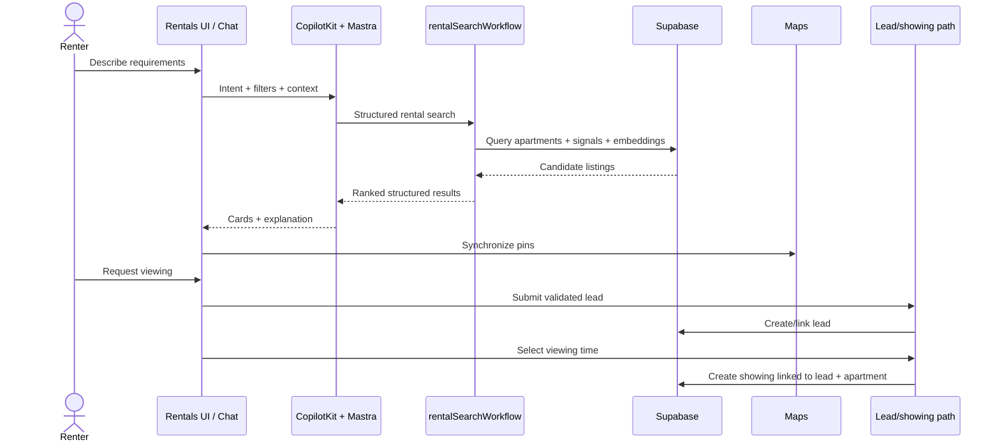

Live foreign keys confirm the `apartments → leads → showings` path and rental application links. See [`data-model.md`](data-model.md).

---

## 14. Human Approval and Side Effects

The live database contains `approval_requests`, `approval_decisions`, and `outbox` with relational links. HITL is therefore both a product principle and a persistence pattern.

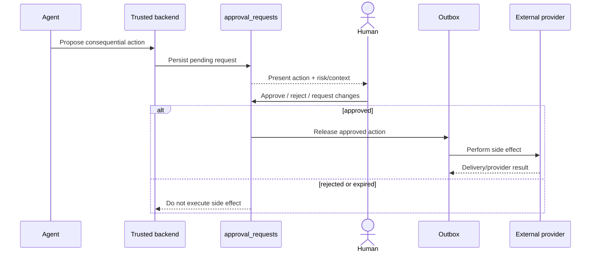

Rule:

> **AI may propose. Deterministic authorization, approval, idempotency, and delivery code performs the side effect.**

---

## 15. Observability and AI Persistence

Current live Supabase includes:

- `ai_runs`;
- `mastra_threads`;
- `mastra_messages`;
- `mastra_workflow_snapshot`;
- `mastra_ai_spans`;
- `mastra_scorers`;
- experiment/dataset/runtime support tables.

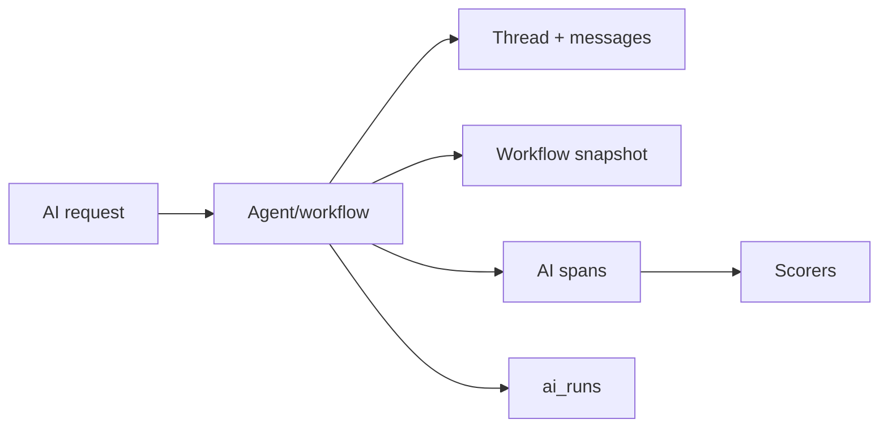

This supports continuity, tracing, evaluation, debugging, latency/token/cost analysis, and production evidence.

---

## 16. Verification and Release Architecture

The repository has targeted verification for Supabase, Maps, rental intelligence, grounding, lead capture, ticket checkout/paid proof, Mastra integrity, model/tool cost tracking, browser journeys, and production synthetic checks.

Architecture changes are complete only when the actual failure boundary is tested.

Examples:

- schema/RLS change → database/security verification;
- agent/tool change → focused agent/tool test + runtime smoke;
- card/map state change → Playwright synchronization journey;
- payment change → webhook/idempotency proof;
- auth/context change → cross-user negative tests;
- production integration → production synthetic evidence.

---

## 17. Security Boundaries and Live Drift

Core MDE product tables inspected in the live Supabase project use RLS across identity-sensitive areas such as profiles, events, rentals, partners, bookings, event commerce, AI runtime persistence, approvals, and intelligence tables.

### Live drift finding

The same live `public` schema also contains multiple `fashionos_*` tables with RLS disabled. These are **not part of the canonical MDE architecture** and are excluded from MDE ERDs.

They should be treated as a separate schema/security drift issue. Do not blindly enable RLS without first defining intended consumers and policies, because enabling RLS with no matching policy can break existing access.

---

## 18. Implemented vs Planned

Implemented now includes:

- CopilotKit ↔ Mastra runtime;
- current agent/workflow set;
- Supabase Auth/Postgres/RLS;
- live pgvector extension and embedding tables;
- event commerce schema;
- rental search/lead/showing schema;
- trips/saved/bookings persistence;
- partners/venue supply schema;
- approvals/outbox persistence;
- AI/Mastra observability persistence.

Linear may still contain future work for deeper personalization, expanded rental request/offer marketplace flows, broader payouts, more complete Host/Partner OS flows, proactive intelligence, and additional automation.

A Linear issue is **planned work until merged code/live schema verifies it**.

---

## 19. Architecture Decision Rules

1. UI/presentation belongs in React/Next.js.
2. AI interaction/state bridging belongs in CopilotKit.
3. Agent reasoning, tools, workflows, memory, and evaluation belong in Mastra.
4. Durable application data and row authorization belong in Supabase.
5. Semantic retrieval should use the existing vector infrastructure rather than parallel stores without a demonstrated need.
6. Spatial truth belongs to trusted Maps/Places data.
7. Model reasoning/generation must be backed by structured/retrieved evidence where factual correctness matters.
8. Transaction finalization belongs in trusted server/webhook paths.
9. Consequential AI-generated actions require deterministic authorization and HITL where appropriate.
10. Prefer one canonical write/state-transition path.
11. Add an agent only when it has a durable responsibility boundary; otherwise add a tool/workflow to an existing owner.
12. Keep ERDs/domain diagrams focused and generated from real foreign keys.

---

## 20. Related Documentation

- [`data-model.md`](data-model.md) — live Supabase ERDs and domain data flows
- [`../../README.md`](../../README.md) — repository overview
- [`../../prd.md`](../../prd.md) — product requirements
- [`../../roadmap.md`](../../roadmap.md) — product strategy and sequencing
- [`../README.md`](../README.md) — canonical documentation home
- [`../03-platform/README.md`](../03-platform/README.md) — platform documentation
- [`../06-testing/README.md`](../06-testing/README.md) — testing documentation
- [`../07-operations/README.md`](../07-operations/README.md) — operations documentation

Mermaid documentation: https://mermaid.ai/open-source/intro/
