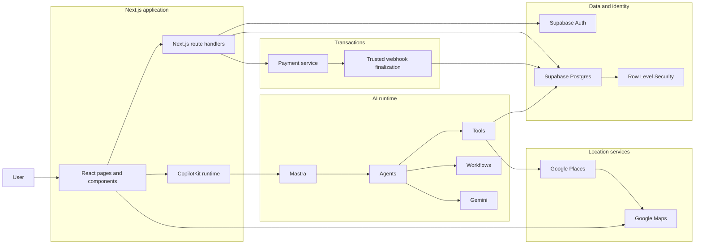
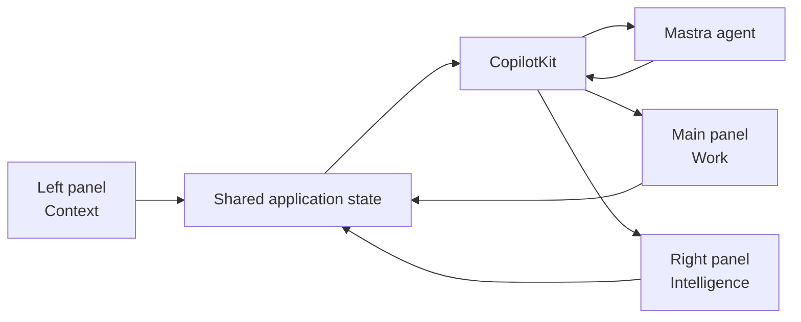
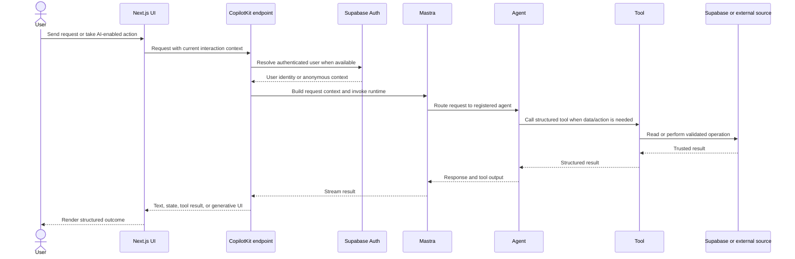
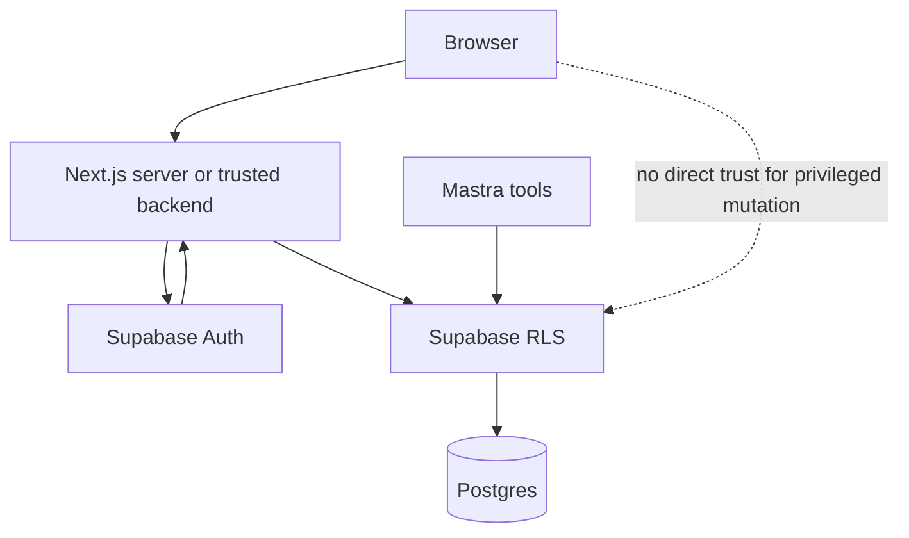
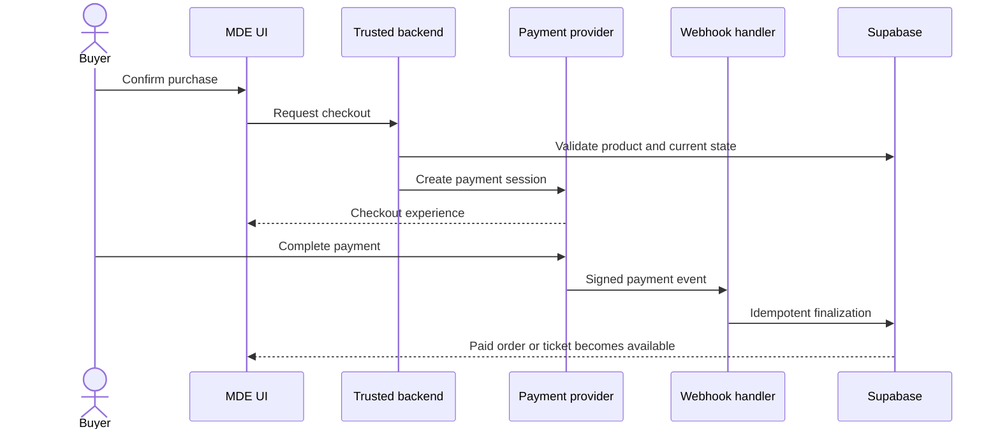

# MDE AI — System Architecture Overview

This document explains the **current MDE AI architecture** from verified repository truth.

## Source-of-truth rule

Architecture claims must be checked against:

1. merged GitHub `main`;
2. current source code;
3. `src/app` route structure;
4. Supabase migrations/current schema evidence;
5. current package manifests and tests;
6. Linear only for live execution status and planned work.

This document must not use old SHAs, local machine paths, stale percentages, or historical task descriptions as architecture truth.

## 1. Architecture Summary

MDE AI is a **Next.js AI-native application** where structured product screens and conversational AI share the same backend capabilities.

The current system separates responsibilities intentionally:

| Layer | Primary responsibility |
|---|---|
| Next.js + React | Application shell, pages, route handlers, server/client boundaries |
| CopilotKit / AG-UI | AI interaction layer between UI and agent runtime |
| Mastra | Agents, tools, workflows, memory, orchestration |
| Gemini | Model reasoning, structured generation, grounding where configured |
| Supabase | Authentication, PostgreSQL data, RLS, persistence, server-side data access |
| Google Maps / Places | Spatial display and place/location information |
| Payment services | Checkout, payment confirmation, ticket/payment workflows where implemented |
| Vitest + Playwright + verification scripts | Unit, integration, browser, smoke, and release proof |

The central design rule is:

> **AI coordinates work; deterministic application code owns trusted state changes.**

## 2. High-Level System Map

The diagram uses standard Mermaid flowchart syntax and subgraphs so the architecture remains editable as plain text. Official reference: https://mermaid.ai/open-source/syntax/flowchart.html

## 3. Application Layer — Next.js + React

The repository uses the Next.js App Router.

`src/app` owns implemented route truth. Product documentation may describe route intent, but route existence must be verified from the source tree.

Major current surface groups include:

- consumer discovery: `/`, `/chat`, `/events`, `/rentals`, `/restaurants`, `/cafes`, `/nightlife`, `/venues`;
- personal state: `/saved`, `/trips`, `/me/tickets`;
- identity: `/login`, `/signup`, auth callback/signout routes;
- host/operator: `/host/*`, including events, analytics, rentals, and onboarding surfaces;
- partner/sponsor surfaces: `/partners/*`, `/sponsors`;
- admin: `/admin/event-bookings`;
- APIs under `/api/*`, including CopilotKit, discovery, rentals, events, tickets, places, approvals, partners, and booking flows.

### UI responsibility

React components own:

- presentation;
- local interaction state;
- maps/cards/forms;
- wizard steps;
- loading/empty/error/degraded states;
- explicit user approvals.

They should not be treated as the final authority for payment status, cross-user authorization, or irreversible backend state.

## 4. Three-Panel Product Model

The reusable interaction model is:

> **Left = Context**  
> **Main = Work**  
> **Right = Intelligence**

Typical responsibilities:

- **Left / Context:** navigation, saved state, trips, threads, workflow context, filters.
- **Main / Work:** chat, browse results, forms, dashboards, wizard steps, approvals, transactions.
- **Right / Intelligence:** map, selected-item details, recommendations, comparisons, supporting evidence, next actions.

The model should not force every page into three visible columns. It defines responsibility and state flow; mobile may collapse panels into sheets, tabs, drawers, or stacked views.

## 5. CopilotKit → Mastra Runtime

The implemented CopilotKit route runs through `/api/copilotkit/[[...path]]`.

The current request path includes:

- authorization guard;
- distributed IP ceiling/rate limiting;
- Supabase user lookup;
- per-request Mastra `RequestContext`;
- user/resource identity propagation;
- local Mastra agent registration;
- AI-run persistence after streamed responses.

This means the AI runtime already exists. Future work should strengthen tool coverage, grounding, context propagation, evaluation, and failure handling rather than recreate the bridge.

### AI request sequence

Official Mermaid sequence-diagram reference: https://mermaid.ai/open-source/syntax/sequenceDiagram.html

## 6. Current Mastra Agents

Merged `main` exports these primary agents:

| Agent | Responsibility |
|---|---|
| `routerAgent` | Intent/domain routing |
| `conciergeAgent` | General MDE concierge interaction |
| `rentalAgent` | Rental-domain reasoning and tools |
| `eventAgent` | Event-domain reasoning and discovery |
| `hostEventAgent` | Event-host creation/publishing assistance |
| `hostOpsAgent` | Host operational assistance |
| `evaluationAgent` | Evaluation/quality-oriented agent behavior |
| `pingAgent` | Minimal runtime connectivity check |

The architecture should prefer a **small number of capable agents plus explicit tools/workflows** rather than creating a new agent for every screen or feature.

## 7. Current Mastra Workflows

Merged `main` exports these workflows:

| Workflow | Purpose |
|---|---|
| `rentalSearchWorkflow` | Multi-step rental search flow |
| `eventDiscoveryWorkflow` | Event discovery orchestration |
| `eventVenueBookingWorkflow` | Event/venue booking orchestration |
| `salesInsightWorkflow` | Sales/operational insight workflow |

Use deterministic workflows when sequencing, validation, retries, approval, or business invariants matter more than open-ended agent reasoning.

## 8. Model Layer — Gemini

Gemini is the primary model family used through the AI SDK/Mastra integration.

Model responsibilities may include:

- intent interpretation;
- structured generation;
- explanation;
- ranking/reasoning where supported by retrieved evidence;
- grounded responses;
- drafting content for human review.

Gemini must not become the source of truth for:

- database identity;
- payment completion;
- authorization;
- coordinates/place IDs not returned by trusted data;
- inventory or booking state;
- irreversible commits.

Those remain deterministic application/data responsibilities.

## 9. Data Layer — Supabase

Supabase is the primary application data and identity layer.

Current architectural responsibilities include:

- authentication;
- PostgreSQL persistence;
- row-level security;
- user-scoped server access;
- product entities such as events, rentals, leads, tickets, threads, bookings, partner data, and operational records where represented by the current schema.

### Trust boundary

Rules:

1. Authentication answers **who is acting**.
2. RLS/data policies answer **which rows they may access**.
3. Server/tool validation answers **whether the requested state transition is valid**.
4. AI should never bypass these layers.

## 10. Maps and Places

Google Maps/Places is the spatial/location layer.

Architecture responsibilities:

- map rendering;
- markers/pins;
- card ↔ pin synchronization;
- selected-location context;
- Places detail/photo/search integrations where implemented;
- grounded place identifiers and coordinates.

The model may explain or rank place results, but it should not fabricate coordinates or place identifiers.

## 11. Transactions and Payments

MDE contains event/ticket commerce flows and roadmap work for broader transactions.

The architectural rule is:

> **The client may start a transaction; trusted backend/payment confirmation owns final state.**

Important invariants:

- browser success pages are not payment truth;
- webhook/event processing must be idempotent;
- retries must not create duplicate orders/tickets/bookings;
- payment and database state must be reconcilable;
- consequential AI-prepared actions should use explicit approval where appropriate.

## 12. Grounding and External Data

Fresh local discovery may require external grounding or place/event sources.

The architecture should separate:

1. **retrieval** — obtain current structured evidence;
2. **normalization** — convert it into MDE contracts;
3. **ranking/explanation** — AI may explain why evidence matches user intent;
4. **rendering** — UI displays cards/maps/details;
5. **action** — deterministic workflows perform writes/transactions.

This prevents the model from being both researcher and source of truth.

## 13. Observability and Verification

The repository includes dedicated verification commands for:

- Supabase environment;
- Maps environment and pin synchronization;
- rental chat/intelligence;
- grounding/attribution;
- lead capture;
- ticket checkout/paid proof;
- Mastra integrity;
- model/tool cost tracking;
- production synthetic tests;
- production journey tests;
- desktop/mobile Playwright flows;
- lint, typecheck, build, Vitest, and audit Floor gates.

Architecture changes are not complete merely because code compiles. The appropriate runtime path must be proven at the layer where it can actually fail.

## 14. Security Boundaries

The architecture relies on layered controls:

- authentication before identity-sensitive operations;
- RLS for row-level access control;
- user-scoped Mastra request context;
- rate limiting around AI runtime endpoints;
- server-side validation for state changes;
- explicit HITL approval for sensitive AI-proposed actions;
- trusted payment/webhook verification;
- environment/secret separation;
- regression tests for critical paths.

A model response alone must never grant authorization.

## 15. Implemented vs Planned

This document describes the architecture visible in merged `main`.

Linear may contain future work such as:

- stronger semantic retrieval / pgvector use;
- expanded rental request/offer marketplace flows;
- broader payments/payouts;
- more complete host/partner operating systems;
- additional proactive intelligence;
- advanced automation.

Those are **planned capabilities until verified in merged code**. Their presence in Linear does not make them part of the current runtime architecture.

## 16. Architecture Decision Rules

When extending MDE:

1. Put UI/presentation in React/Next.js surfaces.
2. Put AI interaction/state bridging in CopilotKit.
3. Put agent reasoning, tools, workflows, and memory in Mastra.
4. Put durable application data and authorization in Supabase.
5. Put spatial truth in Maps/Places.
6. Put model reasoning/generation in Gemini, backed by retrieved evidence.
7. Put transaction finalization in trusted server/webhook paths.
8. Keep human approval for consequential AI-generated changes where required.
9. Prefer one canonical path for each write/state transition.
10. Add an agent only when it has a durable responsibility boundary; otherwise add a tool/workflow to an existing owner.

## 17. Related Documentation

- [`../../README.md`](../../README.md) — repository overview
- [`../../prd.md`](../../prd.md) — product requirements
- [`../../roadmap.md`](../../roadmap.md) — product strategy and sequencing
- [`../README.md`](../README.md) — canonical documentation home
- [`../03-platform/README.md`](../03-platform/README.md) — platform documentation area
- [`../06-testing/README.md`](../06-testing/README.md) — testing documentation area
- [`../07-operations/README.md`](../07-operations/README.md) — operations documentation area

Mermaid documentation: https://mermaid.ai/open-source/intro/
