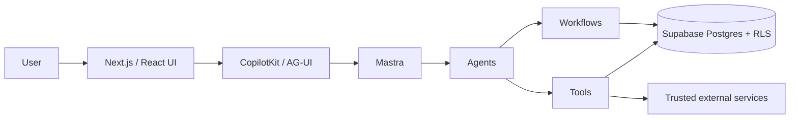
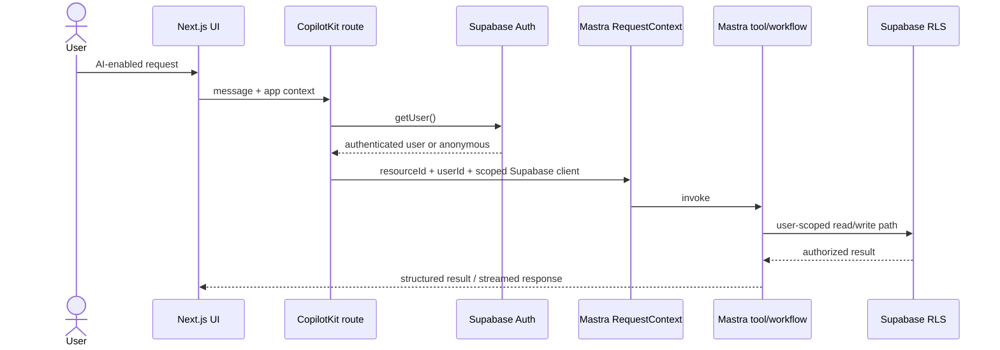
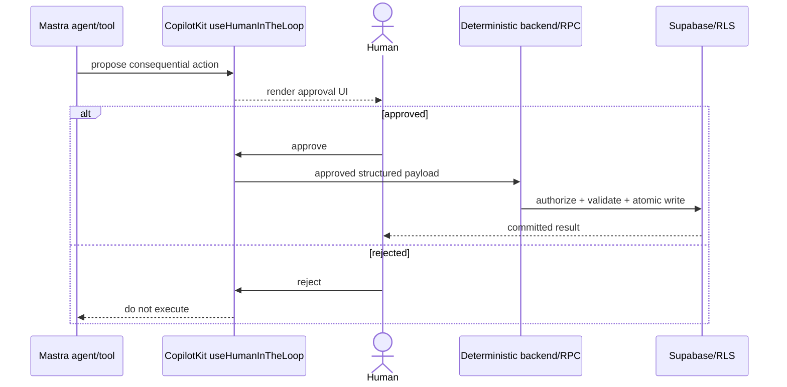
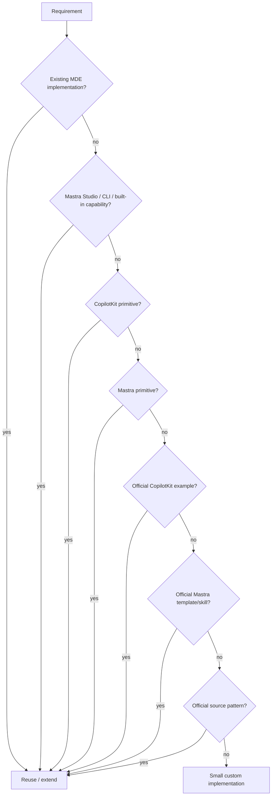

# Task 53.1 · MDE-AI-DOCS-FOUNDATION-001 — CopilotKit + Mastra Platform Guide

This is the canonical MDE guide for the CopilotKit ↔ Mastra runtime boundary.

## Current architecture



Ownership is intentional:

| Layer | Owns |
|---|---|
| Next.js / React | Screens, routing, forms, maps/cards, approval UI, local interaction state |
| CopilotKit / AG-UI | Agent UI bridge, app context, shared state, tool rendering, HITL UI |
| Mastra | Agents, tools, workflows, memory, evaluation, observability, orchestration |
| Supabase | Auth, PostgreSQL state, RLS, transactional truth, durable agent persistence |
| Gemini | Reasoning/generation; never authorization or state truth |

## Verified MDE runtime

Current `main` registers these Mastra agents:

- `pingAgent`
- `routerAgent`
- `rentalAgent`
- `conciergeAgent`
- `eventAgent`
- `evaluationAgent`
- `hostEventAgent`
- `hostOpsAgent`

Current workflows:

- `rentalSearchWorkflow`
- `eventDiscoveryWorkflow`
- `eventVenueBookingWorkflow`
- `salesInsightWorkflow`

The CopilotKit route at `src/app/api/copilotkit/[[...path]]/route.ts`:

1. validates CopilotKit authorization;
2. applies distributed rate limits;
3. resolves the Supabase user;
4. builds a Mastra `RequestContext`;
5. propagates the user/resource identity;
6. passes a user-scoped Supabase client for host tools;
7. registers local Mastra agents with logging;
8. persists AI run metadata after streaming.

## Current package/API rule

MDE currently pins CopilotKit packages to `1.55.2`, while application React code uses the `@copilotkit/react-core/v2` API surface.

Do not describe this as “v1-only.” The production rule is:

> Keep the current pinned package version and `/v2` React API surface stable. Do not reintroduce bare v1 React imports into `src/**`, and do not upgrade CopilotKit packages opportunistically inside feature work.

`npm run check:mastra` already enforces the package pin and rejects bare v1 React imports in app/components.

## Request context and authorization



Rules:

- browser code never receives `service_role` credentials;
- AI output never grants authorization;
- identity comes from Supabase Auth;
- row access comes from RLS;
- business transitions are validated in deterministic server/RPC code;
- privileged/service-role operations remain narrow server-side exceptions.

## Mastra persistence

`src/mastra/lib/storage.ts` uses:

- `PostgresStore` when `DATABASE_URL` is configured, including production;
- in-memory `LibSQLStore` for local development when Postgres is intentionally disabled.

Do not use file-based LibSQL in serverless production.

## Human-in-the-loop standard

Current MDE already uses `useHumanInTheLoop` from `@copilotkit/react-core/v2` for venue booking approval.

Production pattern:



### `useInterrupt` decision

Do not migrate production MDE flows to `useInterrupt` as part of ordinary feature work.

Upstream CopilotKit/Mastra interrupt support is evolving, while MDE already has a proven tool-based HITL path. A future migration must be a dedicated compatibility spike proving:

- exact installed CopilotKit + `@ag-ui/mastra` + Mastra compatibility;
- AG-UI interrupt event transport;
- persistence across refresh and cold start;
- suspend/resume correctness;
- approval/rejection UI;
- no duplicate side effects;
- Playwright proof.

Until then, `useHumanInTheLoop` is the MDE standard.

## Shared state and generative UI

Use CopilotKit primitives for UI-facing agent state and rendering before custom state bridges:

- app/agent context;
- frontend tools;
- shared state;
- tool rendering;
- HITL approval rendering.

Use the existing MDE card/map/domain state where it already solves the problem. Do not introduce a parallel custom event protocol just to render agent results.

## Agent vs tool vs workflow

Use these boundaries:

- **Agent** — durable reasoning responsibility or persona/domain owner.
- **Tool** — one typed capability/read/write operation.
- **Workflow** — explicit multi-step orchestration where ordering/retry/suspend-resume matters.

Prefer a small number of capable agents plus explicit tools/workflows over one agent per screen.

## Studio / CLI before custom tooling

Before building a custom developer/admin UI, first evaluate Mastra's built-in surfaces for:

- agents;
- prompts;
- tools;
- workflows;
- request context;
- workspaces;
- MCP servers;
- scorers;
- datasets;
- experiments;
- traces;
- metrics;
- logs.

Custom MDE tooling is justified only when Studio/CLI cannot satisfy the real production-user requirement.

## Mandatory implementation decision ladder



This lookup sequence is mandatory for new CopilotKit/Mastra tasks.

## Verification gates

For platform/runtime changes use the smallest relevant set, then the release floor when warranted:

```bash
npm run check:mastra
npm run lint
npm run typecheck
npm test -- --run
npm run build
```

Also run focused Playwright tests for UI/thread/HITL behavior and security tests for authorization boundaries.

### Known guardrail gap

`package.json` currently defines:

```bash
npm run audit:copilotkit-v2
```

but current `main` does not contain the referenced `scripts/audit-copilotkit-v2-map.mjs` file. Do not report this gate as passing until the command is repaired or replaced by equivalent verified coverage.

## Exact references

CopilotKit:

- https://docs.copilotkit.ai/mastra
- https://docs.copilotkit.ai/mastra/agent-app-context
- https://docs.copilotkit.ai/mastra/frontend-tools
- https://docs.copilotkit.ai/mastra/shared-state
- https://docs.copilotkit.ai/generative-ui/tool-rendering
- https://docs.copilotkit.ai/human-in-the-loop
- https://github.com/CopilotKit/CopilotKit/tree/main/examples/integrations/mastra
- https://github.com/CopilotKit/CopilotKit/tree/main/examples/canvas/mastra
- https://github.com/CopilotKit/CopilotKit/tree/main/examples/canvas/mastra-pm
- https://github.com/CopilotKit/CopilotKit/tree/main/examples/showcases/generative-ui
- https://github.com/CopilotKit/CopilotKit/blob/main/examples/README.md

Mastra:

- https://mastra.ai/docs
- https://mastra.ai/docs/agents/overview
- https://mastra.ai/docs/workflows/overview
- https://mastra.ai/docs/memory/overview
- https://mastra.ai/docs/observability/overview
- https://mastra.ai/docs/evals/overview
- https://mastra.ai/docs/studio/overview
- https://github.com/mastra-ai/mastra
- https://github.com/mastra-ai/template-agent-harness
- https://github.com/mastra-ai/template-deep-search
- https://github.com/mastra-ai/template-browser-agent
- https://github.com/mastra-ai/skills

## Related MDE docs

- [`../../02-architecture/system-overview.md`](../../02-architecture/system-overview.md)
- [`reference-pack.md`](reference-pack.md)
- [`roadmap.md`](roadmap.md)
- [`../README.md`](../README.md)
