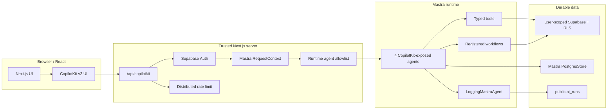
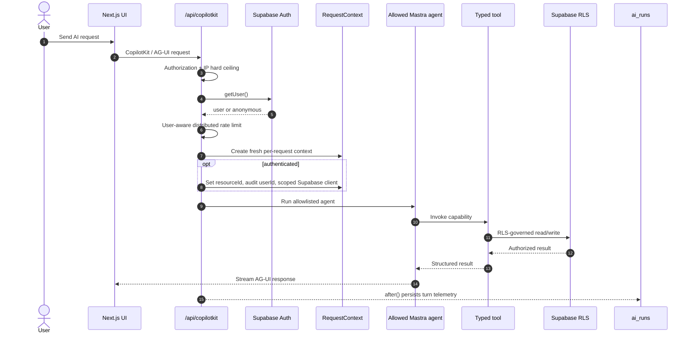
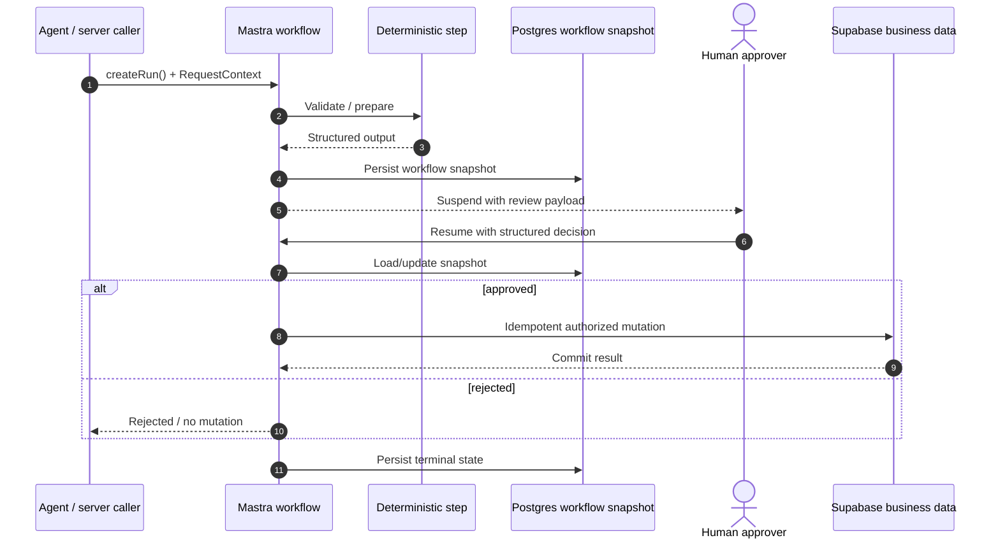
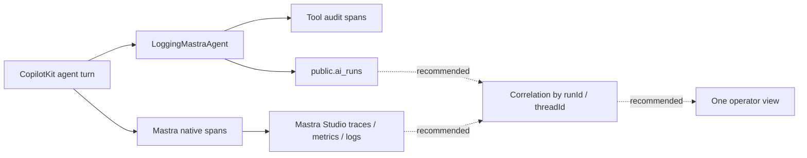
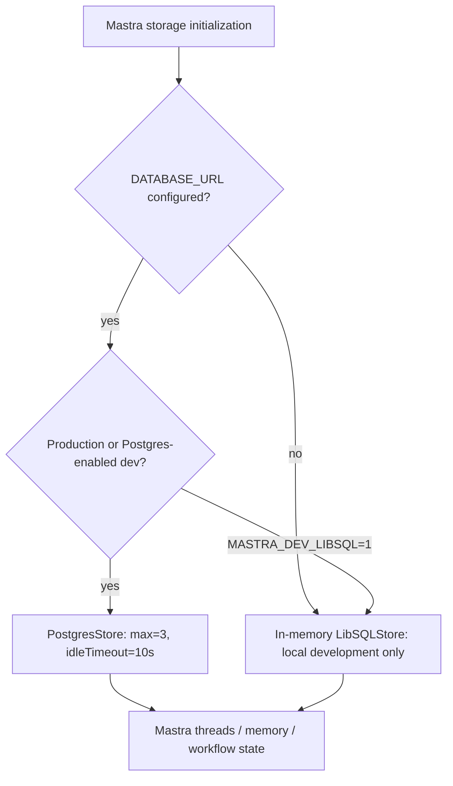

# Task 53.M.40 · MDE-MASTRA-MERMAID-001 — Mastra Architecture Diagrams

These diagrams are the visual architecture reference for the current MDE CopilotKit + Mastra runtime.

## Diagram rules

Use Mermaid as executable documentation, not decoration:

- use `flowchart LR` for system/data flow and `flowchart TD` for decision trees;
- use `sequenceDiagram` when request order, approval, suspend/resume, or retries matter;
- group trust/ownership boundaries with named `subgraph` blocks;
- keep node IDs short and labels explicit; quote labels when punctuation is needed;
- keep one question per diagram; split large diagrams instead of creating a wall of nodes;
- use solid arrows for current behavior and dotted arrows only for clearly labeled proposed behavior;
- do not depend on custom colors/styles for meaning; GitHub, Linear, light and dark themes must all remain readable;
- avoid Mermaid parser hazards such as lower-case `end` as a node identifier;
- prefer stable flowchart/sequence syntax over newer beta-only diagram types when GitHub/Linear rendering compatibility matters.

Official Mermaid references:
- https://mermaid.js.org/intro/
- https://mermaid.js.org/syntax/flowchart.html
- https://mermaid.js.org/syntax/sequenceDiagram

## Current MDE trust boundaries

Current runtime allowlist:
- `conciergeAgent`
- `hostEventAgent`
- `hostOpsAgent`
- `pingAgent`

The other registered agents remain available to Mastra/Studio but are not exposed by the CopilotKit route by default.

## Authenticated CopilotKit request lifecycle

## Durable workflow suspend/resume lifecycle

Use a Mastra workflow when the business process must survive a pause, restart, approval, or multi-step deterministic transition.

Best practice: the approval UI is not authorization. The resumed workflow/server path must still validate identity, state, and idempotency before mutation.

## Observability — current and recommended target

Current state has two evidence paths: MDE `ai_runs` telemetry and native Mastra observability. Do not create a third telemetry store. SAN-1003 and SAN-856 should converge them through shared identifiers and ownership rules.

## Storage mode

Production rule: do not use file-based LibSQL on serverless production.

## Recommended improvements

1. **SAN-1302 · MDE-MASTRA-UPGRADE-001 — Pin Mastra package family.** Exact versions first; coordinated upgrade only after compatibility proof.
2. **SAN-547 · AUTH-009 — Prove RequestContext isolation.** Add user A/user B/anonymous/concurrent tests around the diagrammed trust boundary.
3. **SAN-1303 · MDE-MASTRA-PG-001 — Prove storage durability.** Verify workflow snapshot schema/primary-key requirements and cold-start continuity.
4. **SAN-1003 · MASTRA-RE-006 + SAN-856 · ai_runs capture — Unify observability.** Correlate native spans and `ai_runs` with shared run/thread identifiers; do not build a third dashboard first. After SAN-1302 pins the package baseline, make the supported Mastra `observability` configuration explicit in `new Mastra({...})` rather than relying on historical/default behavior.
5. **SAN-1255 · EVOS-14 — Verify agent exposure before pruning.** Keep the 4-agent runtime allowlist explicit, add a contract test for the exposed agent set, and use traces/journeys before deleting registered agents.
6. **Workflow writes — standardize suspend/resume + idempotency.** Money, publish, booking and other consequential mutations should follow the durable workflow pattern when a pause/retry boundary exists.
7. **Evaluation — make diagrams testable.** Each architecture arrow that crosses auth, persistence, workflow, or telemetry boundaries should map to a focused integration test or production evidence item.
8. **Mermaid maintenance — keep diagrams beside canonical architecture docs.** Update diagrams in the same PR whenever the underlying boundary changes; never maintain a second status tracker in diagram labels.

## Mastra references

- https://mastra.ai/docs/server/request-context
- https://mastra.ai/docs/workflows/overview
- https://mastra.ai/docs/workflows/suspend-and-resume
- https://mastra.ai/docs/memory/overview
- https://mastra.ai/docs/observability/overview
- https://mastra.ai/docs/studio/overview
- https://github.com/mastra-ai/mastra
