# Task 53.4 · MDE-REFADOPT-001 — Reference Adoption Plan: Working Repos, Models, and Examples

Companion to [`roadmap.md`](roadmap.md) (capability direction) and
[`../../04-domains/rentals/rentals-audit-prd-roadmap-2026-09-20.md`](../../04-domains/rentals/rentals-audit-prd-roadmap-2026-09-20.md)
(defect/PRD truth).

**This document is not a capability wish-list.** It answers one question:

> Given what MDE has *actually installed and running today*, which working upstream repos, templates,
> and examples should MDE copy — and what should it delete, replace, or leave alone?

Every "MDE has / MDE lacks" claim below was verified against the checkout on
`ai/san-1203-truthful-viewing-request` (`1c681c590`) and the live Supabase project `zkwcbyxiwklihegjhuql`
on 2026-09-20. Claims that could not be verified are marked **unverified**.

---

## §0 · Bottom line

**MDE does not need to acquire more agent capability. It needs to adopt capability it has already paid for.**

The installed `@mastra/core@1.35.0` already ships `a2a`, `network()`, `channels`, `browser`,
`workspaces`, `background-tasks`, `mcp_clients`/`mcp_servers`, `schedules`, `observational_memory`,
`datasets`, `experiments`, `scorer_definitions`, and `agent-builder`. **15 corresponding live Postgres
tables already exist — with 0 rows.**

> MDE is not missing agent infrastructure. MDE is missing *adoption* of agent infrastructure it already owns.

### Honest MDE-grounded scores

The source research tables scored these references on general merit. Re-scored for **MDE fit given
verified current state**, several drop sharply — mainly because they are Python stacks or duplicate
Mastra capability MDE already has natively.

| Reference | Research | MDE-reality | Why it changed |
|---|---:|---:|---|
| `examples/canvas/mastra` | 99 | **99** | Next.js/TS, shared state, HITL — direct fit. Unchanged. |
| `examples/integrations/mastra` | 99 | **96** | Canonical, but ships Docker + Intelligence compose MDE must not adopt implicitly. |
| Native Mastra `suspend/resume` | 98 | **97** | MDE already uses it in `event-venue-booking-workflow.ts`. |
| Native Mastra `scorers` | 98 | **96** | MDE already ships 2 scorers; live `mastra_scorers`=6, `mastra_ai_spans`=932. |
| `examples/canvas/mastra-pm` | 99 | **95** | Strong PM/plan-progress pattern; MDE has no PM domain, so pattern-only. |
| `examples/showcases/generative-ui` | 96 | **96** | Direct fit for the rental/event card catalog. |
| `template-company-knowledge` | 97 | **93** | pgvector + Linear/GitHub already present; mostly an indexing-hierarchy pattern. |
| `examples/showcases/multi-agent-canvas` | 94 | **90** | LangGraph backend — copy UX/registry, not the runtime. |
| `template-deep-search` | 97 | **88** | Pattern fits; separate research product is not on the critical path. |
| `examples/showcases/open-mcp-client` | 90 | **88** | Fits, but must be governed; MDE has no MCP server yet. |
| `examples/showcases/deep-agents` | 91 | **85** | Python backend; workspace/progress UX is the transferable part. |
| **`examples/showcases/a2a-travel`** | **98** | **72** | ⚠️ **All 5 agents are `.py`.** Mastra has native `A2AAgent`; MDE should not import a Python stack. |
| `observational-memory` | 94 | **80** | Live table exists (0 rows), but requires identity proof (D17) first. |
| `template-browsing-agent` | 91 | **78** | MDE already has `@mastra/core/dist/browser`; Python template is redundant. |
| `template-agent-harness` | 90 | **75** | Useful governance concepts; not a copyable TS base. |
| `examples/showcases/strands-crm` | 87 | **70** | AWS Strands runtime is off-stack. |
| **`CopilotKit/OpenBot`** | **86** | **70** | Explicitly "a template, not a product" and alpha. Concepts only. |
| `template-agent-builder` | 82 | **60** | Requires a Mastra EE license; live `mastra_agents`=0 rows. |
| `a2ui-pdf-analyst` | 80 | **65** | PDF-specific; narrow. |

**Weighted MDE target architecture score:** **94/100** if MDE adopts native primitives first and copies
references only where Mastra has no native answer.

---

## §1 · Method and evidence

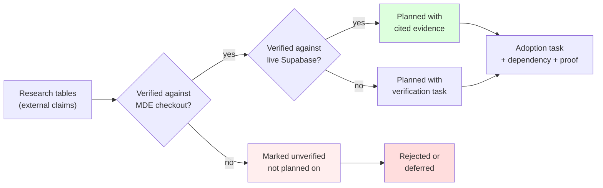

Evidence commands actually executed for this plan:

| Check | Method | Result |
|---|---|---|
| CopilotKit hook usage | `grep -o` over `src/**` | v2 surface confirmed |
| Installed versions | `require('<pkg>/package.json').version` | exact pins captured |
| Mastra native capability | `ls node_modules/@mastra/core/dist/` | `a2a`, `browser`, `channels`, … present |
| Mastra multi-agent API | `grep -n "network(" dist/agent/agent.d.ts` | `agent.network(messages, options)` at `:832` |
| Live agent persistence | Supabase SQL over `information_schema` | 475 / 1143 / 38 / 932 / 6 |
| Upstream example existence | GitHub Contents API per path | all cited paths resolve |
| a2a-travel language | GitHub Contents API on `/agents` | **5 × `.py`** |

---

## §2 · Verified current MDE baseline

### 2.1 CopilotKit React surface — verified, and already correct

| Hook | Occurrences | Verdict |
|---|---:|---|
| `useAgent` | 9 | 🟢 v2 |
| `useFrontendTool` | 7 | 🟢 v2 |
| `useAgentContext` | 7 | 🟢 v2 |
| `useHumanInTheLoop` | 5 | 🟢 v2 |
| `useCopilotAction` (v1) | **0** | 🟢 none |

All **20** `@copilotkit/*` imports resolve to `/v2`. A guard test already enforces this:

```text
src/components/copilot/__tests__/search-tool-renders-v2.test.tsx
  describe("CKV2-RE-001 — rental chat uses V2 hooks only")
  expect(src).not.toMatch(/useCopilotAction/);
```

> **Correction to a plausible-but-wrong hypothesis:** a `useCopilotAction` string *does* appear in the
> tree, but only as the **negative assertion** above. MDE has **no** v1 API leak. Do not "fix" this.

### 2.2 Registered agents and workflows — verified

Agents in `src/mastra/agents/`: `concierge`, `evaluation`, `event-agent`, `host-event`, `host-ops`,
`rental-agent`, `router` (+ `pingAgent` in the registry).

> ⚠️ **The research tables assume MDE has Restaurant, Trip Planner, Research, and Maps agents. It does not.**
> There is **no** restaurant agent, **no** trip agent, **no** research agent, **no** maps agent.
> Any task phrased as "switch between our Restaurant/Trip/Maps agents" describes **agents that do not exist**.

Workflows: `rental-search`, `event-discovery`, `event-venue-booking` (uses suspend/resume),
`sales-insight`.

### 2.3 Mastra capability present but unadopted — the central finding

Live `public.mastra_*` row counts, 2026-09-20:

| Table | Rows | Reading |
|---|---:|---|
| `mastra_threads` | **475** | 🟢 persistence in real use |
| `mastra_messages` | **1,143** | 🟢 persistence in real use |
| `mastra_workflow_snapshot` | **38** | 🟢 suspend/resume in real use |
| `mastra_ai_spans` | **932** | 🟢 tracing live |
| `mastra_scorers` | **6** | 🟢 scoring live |
| `mastra_agents` | 0 | 🔵 Agent Builder unused |
| `mastra_workspaces` | 0 | 🔵 unused |
| `mastra_workspace_versions` | 0 | 🔵 unused |
| `mastra_skills` | 0 | 🔵 unused |
| `mastra_mcp_clients` | 0 | 🔵 unused |
| `mastra_mcp_servers` | 0 | 🔵 unused |
| `mastra_channels` (`channel_config`, `channel_installations`) | 0 | 🔵 unused |
| `mastra_schedules` | 0 | 🔵 unused |
| `mastra_observational_memory` | 0 | 🔵 unused |
| `mastra_datasets` | 0 | 🔵 unused |
| `mastra_experiments` | 0 | 🔵 unused |
| `mastra_background_tasks` | 0 | 🔵 unused |
| `mastra_prompt_blocks` | 0 | 🔵 unused |
| `mastra_resources` | 0 | 🔵 unused |

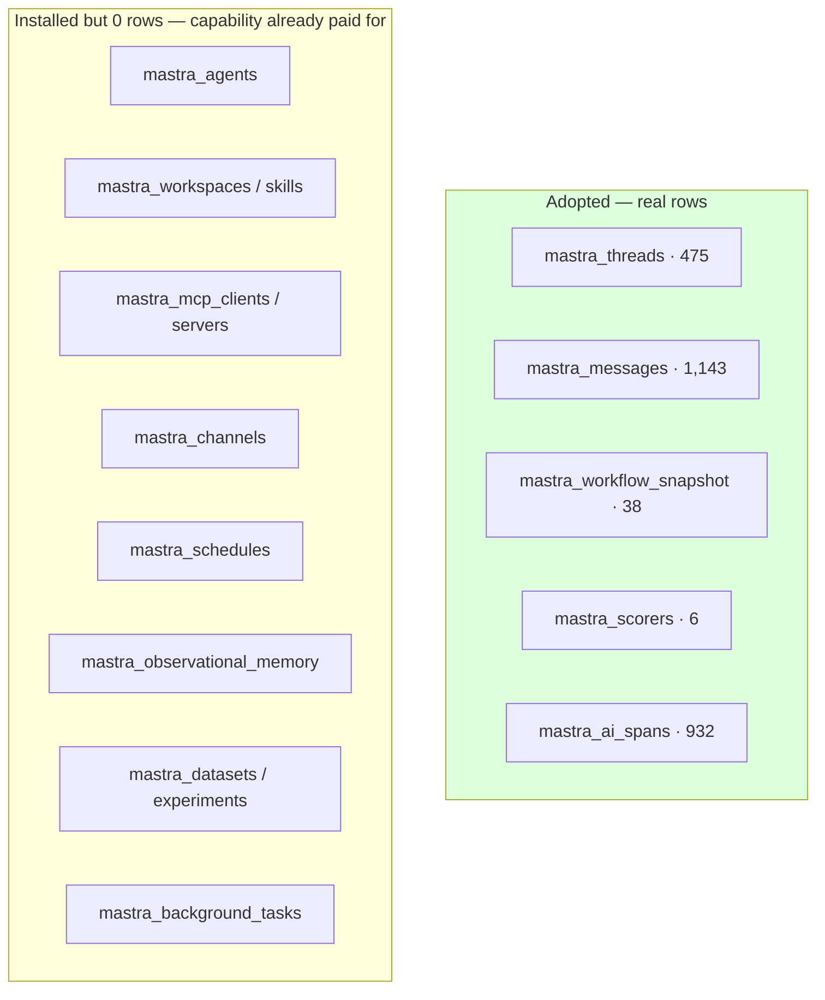

### 2.4 Model layer — verified, mature

`src/mastra/lib/models.ts` is a real central registry, not scattered strings:

```ts
export const FLASH_MODEL = withTokenUsageTracking(google("gemini-3.5-flash"));
export const PRO_MODEL   = withTokenUsageTracking(google("gemini-3.1-pro-preview"));
export const CONCIERGE_MODEL = FLASH_MODEL;   // legacy alias
export const REASONING_MODEL = FLASH_MODEL;   // legacy alias
export const PLANNING_MODEL  = FLASH_MODEL;   // legacy alias
```

Supporting real infrastructure already on disk: `model-cost.ts`, `token-usage-middleware`,
`mastra-telemetry.ts`, `agent-input-processors.ts` (PromptInjectionDetector on `FLASH_MODEL`),
`grounding-quota.ts`, `attach-web-grounding.ts`, `adk-grounding-client.ts`.

Usage: `gemini-3.5-flash` ×22, `gemini-3.1-pro-preview` ×2, `gemini-3.1-flash-lite` ×1,
`gemini-embedding-001` ×2, plus `google-search-grounding` and `google_maps_grounding`.

> **Verdict:** the model layer needs a **patch**, not a redesign.

### 2.5 AG-UI surface already on disk — verified

Not previously recorded in `roadmap.md`. These are **installed today**:

| Package | Installed | Implication |
|---|---:|---|
| `@ag-ui/a2ui-middleware` | 0.0.4 | A2UI (agent-to-UI) capability is **already available** for task #5 |
| `@ag-ui/mcp-apps-middleware` | 0.0.3 | MCP-app rendering capability available for task #11 |
| `@ag-ui/client` · `encoder` · `proto` | 0.0.52 | AG-UI transport core |
| `@ag-ui/langgraph` | 0.0.27 | Installed but **unused** — candidate for removal review |

> **Consequence:** the generative-UI task (#5) is **adoption**, not installation. MDE should evaluate
> `@ag-ui/a2ui-middleware` before adding any new UI-generation dependency.

---

## §3 · Corrections to the source research

| # | Research claim | Verified reality | Verdict |
|---|---|---|---|
| C1 | "A2A Travel is a near-direct MDE blueprint, 98/100 A+" | `agents/` = `budget_agent.py`, `itinerary_agent.py`, `orchestrator.py`, `restaurant_agent.py`, `weather_agent.py` + `requirements.txt` | ⚠️ **Pattern-only.** Mastra has native `A2AAgent`; do not import Python. |
| C2 | "MDE already has the right foundation (useAgent, useAgentContext, useFrontendTool, useHumanInTheLoop)" | Confirmed 9/7/7/5, all `/v2` | ✅ **Correct** |
| C3 | "MDE already has scorer infrastructure" | `src/mastra/scorers/` with `faithfulness`, `grounding-coverage`; live 6 rows | ✅ **Correct** |
| C4 | "MDE uses Mastra persistence (475/1,143/38)" | Exact match against live DB | ✅ **Correct, independently reproduced** |
| C5 | "One conversation can switch between Rental, Events, Restaurants, Trip Planner, Research and Maps agents" | Only rental/event/host/router/concierge/evaluation exist | ❌ **False.** 4 of 6 named agents do not exist. |
| C6 | "Best repository: A2A Travel" | It is Python; `canvas/mastra` is the TS/Next.js fit | ❌ **Ranking inverted for MDE** |
| C7 | "Use OpenBot for autonomy" | README: "a template, not a product", alpha | 🟡 Concepts only |
| C8 | "`examples/v1` and `v2` are legacy" | Both directories exist in upstream | ✅ Correct — do not copy from them |
| C9 | "61 consolidated demos" | `showcases`=33, `canvas`=7, `integrations`=24, → ~64 | ✅ Consistent |
| C10 | "Cloudinary in the stack" | Not installed, zero `src/` usage (per audit doc) | ❌ Never built |
| C11 | "Never collapse anonymous users into one `"anonymous"` resource" | `route.ts:54` — `options.userId ?? "anonymous"` | ⚠️ **Real live defect (D17)** — see §8.2 |
| C12 | `roadmap.md` — "package declarations use moving beta/alpha ranges" | Every Mastra/AG-UI package is **exact-pinned**; `@mastra/pg` is `1.11.0` not `^1.1.0-alpha.2` | ❌ **Stale** — corrected in `roadmap.md`; risk is *distance*, not *drift* |
| C13 | (implied) A2UI capability must be added | `@ag-ui/a2ui-middleware@0.0.4` already installed | 🟡 **Already present** — adopt, don't install |

C11 is notable: the external research independently rediscovered the same defect the code audit found.

---

## §4 · Current vs target architecture

### 4.1 Current — verified

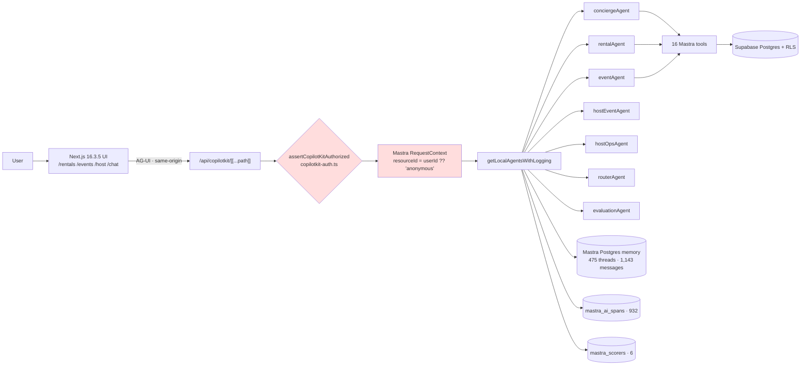

Two red nodes are the **D20** authorization gap and the **D17** anonymous-resource collapse (§8).

### 4.2 Target — reference-anchored, Mastra-native first

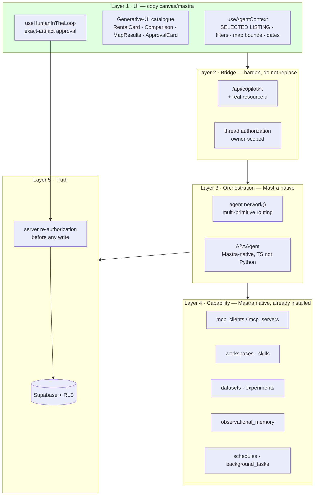

Read the colours as the plan: 🟢 copy/reuse, 🟡 adopt-native, and the unshaded bridge must be **fixed, not rebuilt**.

---

## §5 · The gap is adoption, not architecture

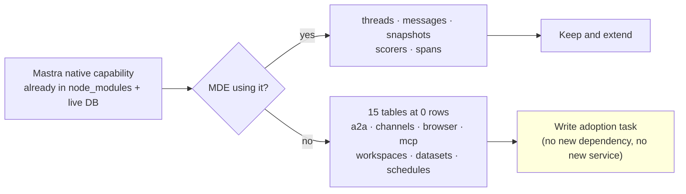

---

## §6 · Mandatory decision ladder (unchanged from roadmap.md)

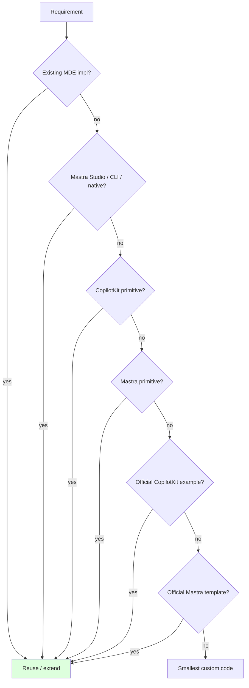

**Applying the ladder to this plan inverts the source research's ranking.** Because Mastra ships
`a2a`, `browser`, `mcp`, `workspaces`, `datasets`, `schedules`, and `observational_memory` natively,
the *template* references for those capabilities are **rung 6 (Mastra primitive) → already satisfied**,
and should be skipped entirely. Only the **UI/UX** references survive to rung 7/8.

---

## §7 · Ordered adoption task list

Legend: 🟢 done+verified · 🟡 partial, proof incomplete · 🔵 not started · 🟥 broken/blocked.
Percentages use the SAN-1299 rubric (25 spec · 50 impl · 70 tests · 85 localhost · 95 staging/prod · 100 accepted).

| # | Task | Status | % | Verified Existing | Missing / Broken | Files / DB | Dependency | Next Action |
|---:|---|:---:|---:|---|---|---|---|---|
| **1** | **MDE-REFADOPT-000 — Pin reference provenance** | 🔵 | 0% | All 24 upstream paths verified to resolve | No pinned commit SHA / read-only vendoring policy | `docs/03-platform/copilotkit-mastra/` | — | Record exact upstream SHA + license for each adopted reference before copying |
| **2** | **MDE-CK-IDENTITY-001 — Fix anonymous resource collapse (D17)** | 🟥 | 15% | Route resolves Supabase user; `resourceId` plumbed | `route.ts:54` `options.userId ?? "anonymous"` merges all anon users | `src/app/api/copilotkit/[[...path]]/route.ts:54` · `logging-mastra-agent.ts:217` | — | Derive a per-session resource id; never default to one shared literal |
| **3** | **MDE-CK-THREAD-AUTHZ-001 — Close thread endpoint authz (D20)** | 🟥 | 0% | Catch-all route exists; key helper exists | `auth.ts:30` allows when key unset; thread read/clear unscoped | `route.ts:55-63,108-110` · `src/lib/copilotkit-auth.ts:30,35` | #2 | Fail closed in production; scope or reject thread paths |
| **4** | **MDE-CK-GUARDRAIL-001 — Repair CopilotKit API-surface gate** | 🟥 | 20% | `check:mastra` enforces pins + v1 import ban | `audit:copilotkit-v2` references a **non-existent** script | `package.json` · `scripts/audit-copilotkit-v2-map.mjs` (missing) | — | Repair or delete; wire survivor into CI (existing SAN-1300) |
| **5** | **MDE-GENUI-CATALOG-001 — Controlled generative-UI catalogue** | 🟡 | 50% | `search-tool-renders.tsx`, `rentalToolRender`, `MASTRA_COPILOT_TOOL_ACTIONS`, **plus `@ag-ui/a2ui-middleware@0.0.4` already installed** | No enumerated catalogue; no Comparison/Approval/ErrorRecovery cards | `src/components/copilot/` · `src/components/chat/` | #1 | Copy `showcases/generative-ui` fixed-schema pattern; enumerate components; evaluate the installed A2UI middleware |
| **6** | **MDE-SHARED-STATE-001 — One app↔agent state contract** | 🟡 | 55% | `useAgentContext` ×7, incl. `concierge-coagent-context.tsx` | Context not yet systematic (map pin, bounds, saved, trip) | `src/components/chat/concierge-coagent-context.tsx` · `chat-filter-copilot-instructions.tsx` | #5 | Copy `canvas/mastra` shared-state contract |
| **7** | **MDE-HITL-STANDARD-001 — HITL for every consequential write** | 🟡 | 70% | `useHumanInTheLoop` ×5; venue-booking approval proven | Rental viewing request not on the HITL path | `src/components/host/host-event-copilot-bridge.tsx` · rentals flow | #6 | Extend proven venue pattern to rental/lead writes |
| **8** | **MDE-MASTRA-SCORERS-001 — Rental quality scorers** | 🟡 | 50% | 2 scorers registered; live `mastra_scorers`=6, spans=932 | No filter-compliance / truthfulness / ownership scorers | `src/mastra/scorers/` | — | Add scorers for D1/D16 defect classes |
| **9** | **MDE-MASTRA-DATASETS-001 — Golden datasets + experiments** | 🔵 | 10% | `golden-queries-smoke.ts` (2 rental cases) exists | Not in CI; `mastra_datasets`/`experiments`=0 | `scripts/intelligence/` · `src/mastra/` | #8 | Promote golden queries to a Mastra dataset + experiment |
| **10** | **MDE-MASTRA-WORKSPACES-001 — Research workspace** | 🔵 | 0% | `dist/workspaces` present; `mastra_workspaces`=0 | No plan/file/progress surface | `@mastra/core` · live tables | #9 | Copy `deep-agents` progress UX; use native workspaces |
| **11** | **MDE-MASTRA-MCP-001 — Governed MCP connectors** | 🔵 | 0% | `dist/mcp`, `mcp_clients`/`servers` tables exist | Zero MCP clients or servers | `@mastra/core` · live tables | #3 | Adopt only where MCP replaces bespoke integration code |
| **12** | **MDE-MASTRA-A2A-001 — Native A2A between agents** | 🔵 | 0% | `dist/a2a/a2a-agent.d.ts` → `class A2AAgent implements SubAgent` | Not used; no agent cards | `@mastra/core/dist/a2a` | #13 | Use Mastra-native A2A; **do not** port the Python example |
| **13** | **MDE-MASTRA-NETWORK-001 — Multi-primitive routing** | 🔵 | 0% | `agent.network(messages, options)` at `agent.d.ts:832` | Not used; router is hand-rolled | `src/mastra/agents/router.ts` | #7 | Evaluate `network()` against the existing routerAgent |
| **14** | **MDE-MASTRA-OBSMEM-001 — Long-term preference memory** | 🔵 | 0% | `mastra_observational_memory` table exists (0 rows) | Needs stable identity first | `@mastra/core` | **#2** | Blocked on identity; then evaluate |
| **15** | **MDE-MASTRA-BROWSER-001 — Governed browser agent** | 🔵 | 0% | `dist/browser` native | No allowlist, no HITL gate, no audit | `@mastra/core/dist/browser` | #7 | Only behind allowlist + approval; never a source of inventory truth |
| **16** | **MDE-MASTRA-SCHEDULES-001 — Scheduled agent routines** | 🔵 | 0% | `dist/background-tasks`; `mastra_schedules`/`triggers`=0 | No recurring jobs | `@mastra/core` · live tables | #3 | Defer until identity + audit exist |
| **17** | **MDE-MASTRA-CHANNELS-001 — CopilotKit Channels** | 🔵 | 0% | Upstream `channels.mts`/`channel-host.mts` exist; tables=0 | No channel host; upstream example needs Docker | upstream `integrations/mastra` | #3 | Defer; **do not** adopt hosted Intelligence implicitly |
| **18** | **MDE-MODEL-REFRESH-001 — Model + provider hygiene** | 🟡 | 60% | Central `models.ts`; cost + telemetry + token tracking | `@ai-sdk/google` 2.0.74 in an advisory range | `src/mastra/lib/models.ts` | — | Patch `@ai-sdk/google` → 2.0.97 (same major) |
| **19** | **MDE-MASTRA-UPGRADE-001 — Package family upgrade (SAN-1302)** | 🔵 | 25% | Installed vs latest matrix documented in `roadmap.md` | `@mastra/core` 1.35.0→1.67.0, `@ag-ui/mastra` 0.2.1-beta.2→1.1.4 | `package.json` | #4 | Isolated compatibility matrix; never partial, never inside feature work |

---

## §8 · Negative paths and traps

Per the MDE diagram standard, a plan without negative branches is incomplete.

### 8.1 Trap: copying a Python reference into a TypeScript stack

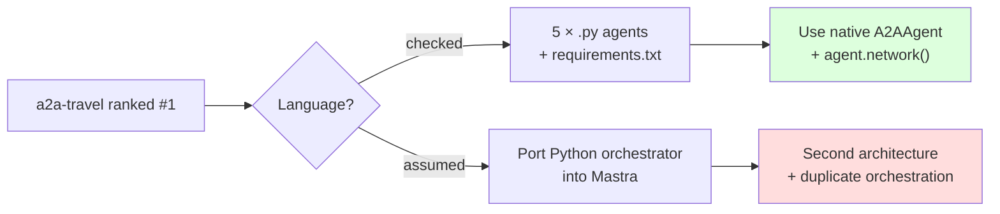

### 8.2 Trap: identity collapse (D17) poisoning memory and research

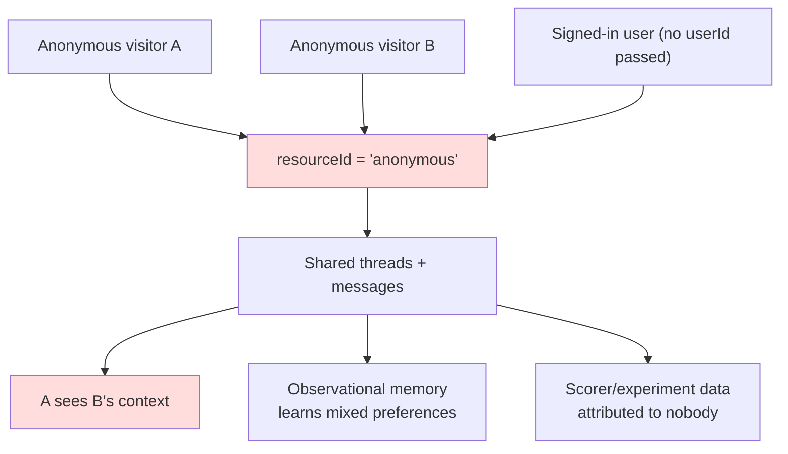

**Consequence for this plan:** task **#14 (Observational Memory) is blocked on #2.**
Adopting long-term memory before fixing identity would durably persist cross-user contamination into
`mastra_observational_memory`. That is why #14 is sequenced after #2, not before.

### 8.3 Trap: thread-endpoint authorization (D20)

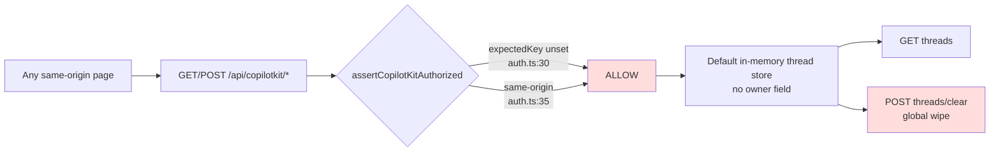

Upstream issue **#7198** was closed with docs and a runner seam — **no default-runner fix**. Therefore
task **#3 cannot be solved by upgrading CopilotKit**; it is application-side by necessity.

### 8.4 Trap: adopting Intelligence or Channels implicitly

`examples/integrations/mastra` ships `docker-compose.intelligence.yml`, `Dockerfile`, and
`docker-compose.production-image.yml`. The `copilotkit` skill is explicit: *browser traffic uses the
same-origin `/api/copilotkit` runtime; do not switch to hosted Intelligence implicitly.* Any Channels or
Intelligence adoption (**#17**) must be a separate, approved architecture decision — not a side effect of
copying a starter.

---

## §9 · Delete / replace / reuse

| Artifact | Verdict | Reason |
|---|---|---|
| `src/components/copilot/search-tool-renders.tsx` | 🟢 **Reuse** | Correct v2 tool-render seam; extend into the catalogue |
| `useAgentContext` call sites (×7) | 🟢 **Reuse + consolidate** | Right primitive; converge on one contract |
| `useHumanInTheLoop` venue pattern | 🟢 **Reuse as the standard** | Proven; extend to rentals |
| `src/mastra/scorers/` | 🟢 **Reuse + extend** | Live data; add defect-class scorers |
| `event-venue-booking-workflow.ts` suspend/resume | 🟢 **Reuse as the model** | Already proves the durable pattern |
| `src/mastra/lib/models.ts` | 🟢 **Reuse** | Central registry; only patch the SDK |
| `routerAgent` | 🟡 **Re-evaluate vs `agent.network()`** | Possibly replaceable by native routing |
| `audit:copilotkit-v2` npm script | 🟥 **Repair or delete** | Points at a file that does not exist |
| `route.ts` `?? "anonymous"` | 🟥 **Replace** | D17 |
| `copilotkit-auth.ts` allow-on-unset | 🟥 **Replace** | D20 |
| `typescript.ignoreBuildErrors: true` | 🟥 **Remove once memory leaves alpha** | Disables the build-time type gate |
| Custom browser automation | ⚪ **Do not build** | `dist/browser` is native |
| Custom long-term summarizer | ⚪ **Do not build** | `observational_memory` native (after #2) |
| Custom agent-admin dashboard | ⚪ **Do not build** | Studio/CLI first (§1 of `roadmap.md`) |
| Second Markdown task queue | ⚪ **Do not build** | Linear is the tracker |

---

## §10 · Model strategy

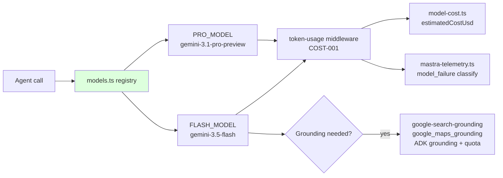

| Element | Verdict |
|---|---|
| Central registry (`models.ts`) | 🟢 Keep — do not scatter model strings |
| `gemini-3.5-flash` default | 🟢 Keep |
| `gemini-3.1-pro-preview` for reasoning | 🟢 Keep |
| Legacy aliases (`CONCIERGE_MODEL`/`REASONING_MODEL`/`PLANNING_MODEL`) | 🟡 All alias FLASH — harmless, but audit before assuming a real tier split |
| Token/cost tracking | 🟢 Keep and surface in evals |
| `@ai-sdk/google` 2.0.74 | 🟥 Patch → 2.0.97 (same major) |
| Model-tier migration (e.g. Morph trial) | ⚪ Out of scope; separate scored trial |

**Do not** introduce a second provider inside this plan. Model changes are their own measurement task.

---

## §11 · Verification ladder

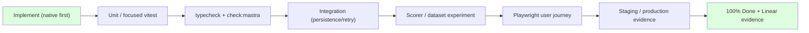

Required gates for any task in §7:

```bash
npm run check:mastra
npm run lint
npm run typecheck
npm test -- --run
npm run build
```

Plus, per task class:

| Task class | Extra required proof |
|---|---|
| Identity / authz (#2, #3) | Negative test: user A cannot read/clear user B's thread; unset key ⇒ deny |
| HITL (#7) | Approved **and** rejected branch; replayed approval cannot double-write |
| Memory (#14) | Cross-user isolation proof before any rollout |
| Native capability adoption (#10–#17) | Live-table row growth + readback, not just route 200 |
| Model/package (#18, #19) | Same-major patch proof; full family matrix, no partial upgrade |

---

## §12 · Reference URLs with adoption instructions

### Mandatory tier

| Reference | URL | Instruction |
|---|---|---|
| CopilotKit + Mastra starter | https://github.com/CopilotKit/CopilotKit/tree/main/examples/integrations/mastra | **Canonical.** Compare `src/app/api/copilotkit/`, `src/mastra/copilotkit/`, agent registration, thread handling. Audit — do **not** rewrite. Ignore its Docker/Intelligence compose unless #17 is separately approved. |
| Mastra canvas | https://github.com/CopilotKit/CopilotKit/tree/main/examples/canvas/mastra | **Highest-value UI reference.** Copy the bidirectional shared-state + Zod state + plan-progress + HITL pattern into the rentals workspace. |
| Examples catalogue | https://github.com/CopilotKit/CopilotKit/tree/main/examples | Orientation only. Never copy from `examples/v1` or `examples/v2` (legacy). |

### Adopt-native (Mastra already ships it — do not copy a template)

| Capability | Where it already is | Instruction |
|---|---|---|
| A2A | `node_modules/@mastra/core/dist/a2a/a2a-agent.d.ts` | Use `A2AAgent`. **Do not** port `showcases/a2a-travel` (Python). |
| Multi-agent routing | `node_modules/@mastra/core/dist/agent/agent.d.ts:832` | Evaluate `agent.network(messages, options)` against `routerAgent`. |
| Browser | `node_modules/@mastra/core/dist/browser` | Use native. Skip `template-browsing-agent` (Python). |
| MCP | `dist/mcp` + `mastra_mcp_clients`/`servers` | Native; governed adoption only. |
| Scorers / datasets / experiments | `dist/evals` + `mastra_scorers` (6 rows) | Extend existing, per https://mastra.ai/docs/evals/overview |
| Suspend/resume | `event-venue-booking-workflow.ts` | Already proven in MDE. Reuse as the template. |
| Workspaces / skills / schedules | `dist/workspaces`, `dist/background-tasks` | Native; sequence after identity. |

### Pattern-only tier (study the UX, do not import the stack)

| Reference | URL | Why pattern-only |
|---|---|---|
| A2A travel | https://github.com/CopilotKit/CopilotKit/tree/main/examples/showcases/a2a-travel | 5 Python agents; copy the *orchestrator → specialist → approval* shape only |
| Generative UI | https://github.com/CopilotKit/CopilotKit/tree/main/examples/showcases/generative-ui | Strong fit; fixed-schema (not open-ended) for transactional flows |
| Multi-agent canvas | https://github.com/CopilotKit/CopilotKit/tree/main/examples/showcases/multi-agent-canvas | Copy agent switching/registry UX, not LangGraph |
| Deep agents | https://github.com/CopilotKit/CopilotKit/tree/main/examples/showcases/deep-agents | Copy plan/progress/files UX |
| Open MCP client | https://github.com/CopilotKit/CopilotKit/tree/main/examples/showcases/open-mcp-client | Copy MCP UX; must be governed |
| OpenBot | https://github.com/CopilotKit/OpenBot | Concepts only: action gateway, audit, policy, takeover. README says "template, not a product", alpha |

### Mastra templates

| Reference | URL | Instruction |
|---|---|---|
| Templates index | https://mastra.ai/templates | Evaluate against `dist/` before cloning anything |
| Company knowledge | https://github.com/mastra-ai/template-company-knowledge | Adapt the *hierarchy*: indexed knowledge → live connector → web |
| Deep search | https://github.com/mastra-ai/template-deep-search | Pattern for research tasks; not critical path |
| Agent harness | https://github.com/mastra-ai/template-agent-harness | Adapt approval/audit concepts only |
| Agent builder | https://github.com/mastra-ai/template-agent-builder | **Requires Mastra EE license.** Do not plan on it |

### Platform docs

| Topic | URL |
|---|---|
| CopilotKit × Mastra | https://docs.copilotkit.ai/mastra |
| Shared state | https://docs.copilotkit.ai/mastra/shared-state |
| Frontend tools | https://docs.copilotkit.ai/mastra/frontend-tools |
| Agent/app context | https://docs.copilotkit.ai/mastra/agent-app-context |
| Generative UI tool rendering | https://docs.copilotkit.ai/generative-ui/tool-rendering |
| HITL | https://docs.copilotkit.ai/human-in-the-loop |
| Mastra workflows | https://mastra.ai/docs/workflows |
| Workflow snapshots | https://mastra.ai/en/reference/workflows/snapshots |
| Mastra Studio | https://mastra.ai/docs/studio/overview |
| Mastra observability | https://mastra.ai/docs/observability/overview |
| Thread authz issue (closed, unfixed default runner) | https://github.com/CopilotKit/CopilotKit/issues/7198 |

---

## §13 · Linear mapping

| Plan task | Linear | Note |
|---|---|---|
| #2 D17 identity | SAN-547 (+ SAN-548 durability) | Existing isolation work; extend to anon/cold-start |
| #3 D20 thread authz | SAN-547 · SAN-1330 | Pairs with the fail-closed release gate |
| #4 API-surface gate | SAN-1300 | Already owns the broken `audit:copilotkit-v2` |
| #8 scorers | SAN-1061 (MASTRA-RE-017) · SAN-611 (AGT-17) | Extend existing scorers rather than new infra |
| #9 datasets | SAN-611 · SAN-1061 | Promote golden queries |
| #13 network/router | SAN-1255 (agent pruning) | Re-evaluate router before adding agents |
| #16 observability | SAN-1003 (MASTRA-RE-006) · SAN-856 | Traces exist (932 spans); repair token/error capture |
| #18/#19 model + packages | SAN-1302 | Package family upgrade, isolated |
| #1 provenance | **new** | Record upstream SHAs/licenses |

> ⚠️ **Linear hygiene precondition.** The rentals audit (§37) recorded that the Real Estate view has
> 125 issues, four conflicting main SHAs, ~45 Duplicate + 61 Canceled issues not parented, and zero
> checked acceptance boxes across critical-path issues. **Create the §7 tasks only after the referenced
> SHAs are re-pinned**, or this plan will inherit the same baseline confusion.

---

## §14 · Anti-patterns this plan rejects

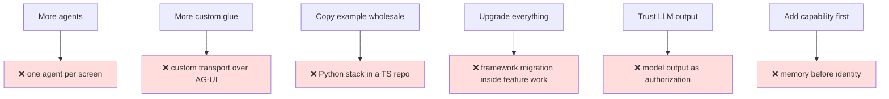

---

## §15 · Executable next step

**Do #1–#4 before any feature work in §7.** They are small, are prerequisites for correctness, and #2/#3
are live security defects that get *worse* the moment more capability (memory, workspaces, channels)
is adopted on top of a collapsible identity.

```text
#1  Pin upstream provenance (SHAs + licenses)
#2  Fix D17 anonymous resource collapse      ← unblocks #14
#3  Fix D20 thread authorization             ← prerequisite for #11, #16, #17
#4  Repair audit:copilotkit-v2 gate
--- then ---
#5  Generative-UI catalogue   (copy canvas/mastra + showcases/generative-ui)
#6  Shared-state contract
#7  HITL for rental writes    (reuse venue pattern)
#8  Rental quality scorers    (extend existing)
#9  Golden datasets + experiments
--- then native adoption, at most one at a time ---
#10 workspaces · #11 mcp · #12 a2a · #13 network · #14 memory · #15 browser · #16 schedules · #17 channels
--- independent tracks ---
#18 model/SDK patch · #19 package family upgrade (SAN-1302)
```

### Why this order and not the research's

The research proposed *A2A Travel first* because it scores well as a demo. For MDE the highest-value,
lowest-risk moves are: **fix identity → fix thread authorization → repair the broken gate → then copy the
two TypeScript UI references (`canvas/mastra`, `showcases/generative-ui`)**. Multi-agent orchestration is
**last**, because MDE's single biggest structural gap is not orchestration — it is that 15 native
capability tables are empty and two identity/authorization defects sit underneath all of them.

---

## §16 · Change log

| Rev | Date | Change |
|---|---|---|
| 1.0.0 | 2026-09-20 | Initial reference-adoption plan. Verified hooks/versions/live-DB/upstream paths. Corrected 3 research errors (A2A-travel language, non-existent agents C5, OpenBot maturity) and confirmed 5 claims. Re-scored all references for MDE fit. |
| 1.1.0 | 2026-09-20 | Added C12 (stale "moving beta ranges" claim in `roadmap.md` — packages are exact-pinned) and C13 (`@ag-ui/a2ui-middleware` already installed). Raised task #5 to 50%. Corrected `roadmap.md` version table + added transitively-installed AG-UI surface. |
