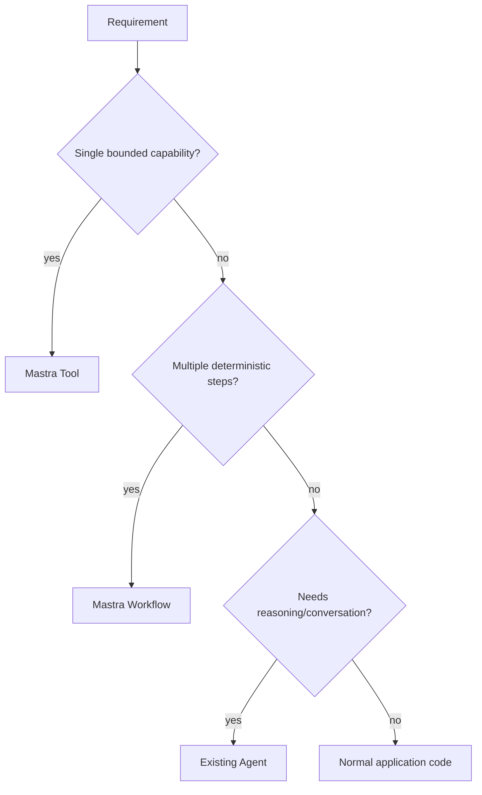
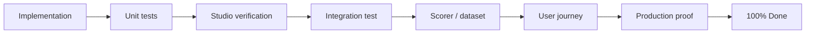

# Task 53.3 · MDE-AI-ROADMAP-001 — CopilotKit + Mastra Technical Roadmap

This is a durable capability roadmap, not a live task tracker. Linear owns issue status, priority, ownership, and sequencing.

## Roadmap principles

1. Keep the existing runtime architecture unless a measured problem justifies change.
2. Use built-in platform capability before custom infrastructure.
3. Extend a small number of durable agents instead of creating an agent per screen.
4. Use tools for single typed capabilities and workflows for explicit multi-step orchestration.
5. Keep privileged state changes deterministic, authorized, idempotent, and RLS-aware.
6. Upgrade CopilotKit/Mastra APIs only in dedicated compatibility work, never incidentally inside feature tasks.

## NOW — stabilize and standardize

### Task 53.3A · MDE-CK-MASTRA-BRIDGE-001 — Keep the current bridge boring

Success criteria:

- one canonical `/api/copilotkit` route;
- per-request user/resource identity propagated into Mastra;
- host tools keep the user-scoped Supabase client;
- AI-run persistence continues after streamed responses;
- no duplicate/parallel agent runtime introduced.

### Task 53.3B · MDE-CK-GUARDRAIL-001 — Repair CopilotKit API-surface verification

Current gap: `package.json` defines `npm run audit:copilotkit-v2`, but current `main` does not contain the referenced script.

Required outcome:

- restore the missing verification script **or** replace the command with equivalent tested coverage;
- fail CI on new bare-v1 `@copilotkit/react-core` imports in active source;
- verify registered UI agent IDs exist in the Mastra registry;
- keep package pins explicit.

Do not leave a dead npm command that gives false confidence.

### Task 53.3C · MDE-HITL-STANDARD-001 — Standardize consequential actions

Keep `useHumanInTheLoop` as the production UI approval primitive for current MDE.

For every consequential action:

```text
agent proposal
→ human review
→ deterministic authorization
→ atomic/idempotent backend operation
→ Supabase/RLS truth
```

Do not treat frontend approval UI as authorization by itself.

### Task 53.3D · MDE-MASTRA-STUDIO-001 — Studio/CLI before custom admin tooling

Use Mastra's built-in Agents, Tools, Workflows, Request Context, Workspaces, MCP, Scorers, Datasets, Experiments, Traces, Metrics and Logs before planning custom developer dashboards.

Custom MDE admin tooling is justified only for product/user requirements that Studio cannot satisfy.

### Task 53.3E · MDE-MASTRA-PERSISTENCE-001 — Prove production continuity

Verify Postgres-backed Mastra persistence across:

- multi-turn chat;
- page navigation;
- Vercel/serverless cold start;
- user/resource isolation;
- workflow state where used;
- failure/retry behavior.

Local in-memory LibSQL remains a development convenience, not production truth.

### Task 53.3F · MDE-CK-SHARED-STATE-001 — Standardize app context and render state

Use official CopilotKit primitives for:

- app context;
- agent/shared state;
- frontend tools;
- tool rendering;
- HITL rendering.

Map/card/chat state should converge on one domain state contract instead of parallel custom bridges.

## NEXT — evaluation, reuse and observability

### Task 53.3G · MDE-MASTRA-EVALS-001 — Make scorers/datasets part of delivery

Use Mastra scorers, datasets and experiments for repeatable quality checks on:

- tool selection;
- groundedness/faithfulness;
- structured result completeness;
- workflow outcomes;
- latency/cost regressions where measurable.

A feature is stronger when quality can be rerun against a stable dataset instead of relying only on manual chat testing.

### Task 53.3H · MDE-GENUI-REUSE-001 — Reusable generative UI patterns

Create/reuse a small catalog of controlled components for:

- search result cards;
- approval cards;
- comparison blocks;
- booking/payment status;
- host operational summaries;
- map-linked results.

Prefer controlled tool rendering for trusted product workflows before open-ended UI generation.

### Task 53.3I · MDE-CROSS-SCREEN-STATE-001 — Persistent workspace context

Extend proven Host OS persistence patterns to other multi-screen experiences only where the product needs continuity.

Success means thread/context survives navigation without remounting providers unnecessarily or duplicating chat chrome.

### Task 53.3J · MDE-AI-OBSERVABILITY-001 — One traceable AI execution path

Connect current AI-run logging and Mastra observability so an operator can answer:

- which agent ran;
- which tools/workflows ran;
- which user/resource context applied;
- what failed;
- latency/token/cost where available;
- whether the final state change committed.

Use built-in Mastra observability first.

## LATER — only after measured need

### Task 53.3K · MDE-INTERRUPT-SPIKE-001 — Evaluate native interrupt flow

This is a compatibility spike, not a migration commitment.

Prove:

- exact pinned/new package compatibility;
- AG-UI interrupt transport;
- suspend/resume;
- Postgres persistence;
- page refresh;
- cold start;
- approval/rejection UX;
- duplicate-action prevention;
- Playwright proof.

Adopt only if it is clearly safer/simpler than current `useHumanInTheLoop` flows.

### Task 53.3L · MDE-COPILOTKIT-UPGRADE-001 — Evaluate package upgrade

Do not combine this with product features.

Required before upgrade:

- official migration docs;
- API/import diff;
- example compatibility review;
- current runtime/auth parity;
- thread/HITL/shared-state regression suite;
- rollback plan.

### Task 53.3M · MDE-MCP-001 — Add MCP where it removes bespoke integration code

Use MCP only where a maintained MCP server gives a simpler, auditable capability boundary than a custom integration.

Do not convert existing safe typed tools to MCP solely for architectural novelty.

### Task 53.3N · MDE-MULTI-AGENT-001 — Add agents only for durable ownership boundaries

A new agent requires a durable reason such as:

- distinct tool/security boundary;
- persistent domain responsibility;
- independently evaluated behavior;
- separate long-lived context.

Otherwise add a tool/workflow to an existing agent.

## Reference-first implementation flow


Stop at the earliest layer that solves the requirement correctly.

## Production readiness checklist

- [ ] Auth identity resolved server-side.
- [ ] Supabase RLS/user scoping preserved.
- [ ] No browser `service_role` usage.
- [ ] Consequential actions require deterministic authorization and approval when appropriate.
- [ ] Tool/workflow input and output schemas are typed/validated.
- [ ] Thread/resource IDs do not cross users.
- [ ] Postgres persistence proven where continuity matters.
- [ ] Focused unit/integration tests pass.
- [ ] Relevant Playwright user journey passes.
- [ ] `npm run check:mastra` passes.
- [ ] Production build passes for runtime changes.
- [ ] Observability/evidence exists for the failure boundary changed.

## Anti-patterns

Avoid:

- one agent per screen;
- custom transport when AG-UI already carries the interaction;
- custom developer dashboards before Studio/CLI evaluation;
- LLM output as authorization;
- service-role browser access;
- feature work mixed with framework migration;
- copying upstream examples without checking pinned MDE APIs;
- maintaining a second execution queue in Markdown.

## Official references

- https://docs.copilotkit.ai/mastra
- https://github.com/CopilotKit/CopilotKit/blob/main/examples/README.md
- https://github.com/CopilotKit/CopilotKit/tree/main/examples/integrations/mastra
- https://github.com/CopilotKit/CopilotKit/tree/main/examples/canvas/mastra
- https://github.com/CopilotKit/CopilotKit/tree/main/examples/canvas/mastra-pm
- https://mastra.ai/docs
- https://mastra.ai/docs/studio/overview
- https://mastra.ai/docs/evals/overview
- https://github.com/mastra-ai/mastra
- https://github.com/mastra-ai/template-agent-harness
- https://github.com/mastra-ai/skills


## Mastra forensic progress tracker — 2026-09-17

Status legend: 🟢 completed + verified · 🟡 implemented/in progress, proof incomplete · 🔴 broken/blocked · 🔵 not started/required.

| Order | Task | Status | % | Current proof | Missing / next action |
|---:|---|:---:|---:|---|---|
| 1 | SAN-1302 · MDE-MASTRA-UPGRADE-001 — package pin/upgrade | 🔵 | 25% | Declared/installed/latest versions audited | Pin exact baseline; isolated compatibility matrix |
| 2 | SAN-547 · AUTH-009 — RequestContext isolation | 🟡 | 70% | Fresh RequestContext + user-scoped client implemented | User A/B/anonymous/concurrent proof |
| 3 | SAN-1303 · MDE-MASTRA-PG-001 — Postgres hardening | 🟡 | 50% | Live schema/rows/RLS/grants audited | Schema/PK/pooler decision + cold-start proof |
| 4 | SAN-548 · Cold-start persistence | 🟡 | 70% | Postgres persistence code + integration evidence | Current production continuity + cross-user proof |
| 5 | SAN-1255 · EVOS-14 — Agent pruning | 🔵 | 25% | 8-agent registry audited | Trace/journey proof before removal |
| 6 | SAN-1003 · MASTRA-RE-006 — Observability | 🔴 | 25% | Studio native observability verified | Restore current traces + ownership boundary |
| 7 | SAN-856 · ai_runs token/cost/error capture | 🔴 | 25% | Live drift quantified | Repair usage/error capture + correlate traces |
| 8 | SAN-1061 · MASTRA-RE-017 — Rental evals | 🔵 | 25% | Native eval surfaces verified | Dataset/experiment from existing scorers |
| 9 | SAN-611 · AGT-17 — Golden queries | 🔵 | 25% | Corpus/scorers identified | Native experiment + failing fixture + CI |
| 10 | SAN-606/593/596/598 · Runtime guardrails | 🔵 | 25% | Current processor APIs reviewed | Implement only proven safety gaps |
| 11 | SAN-607 · Workflow compensation/errors | 🔵 | 25% | Affected write workflows identified | Compensation policy before new money/write flows |
| 12 | SAN-1226 · Rental match workflow | 🔵 | 25% | Existing RentalSearchEngine reuse contract | Deterministic rank + explainable soft match |
| 13 | SAN-597/610 · Memory + preference extraction | 🔵 | 25% | Scope defined | Privacy-safe resource schema then processors |
| 14 | SAN-599/609/600/627 · Performance/streaming | 🔵 | 25% | Current patterns identified | Benchmark after P0/P1 correctness |

Percentages follow the SAN-1299 rubric: 25% means spec/research exists; 50% implementation exists; 70% tests/integration proof; 85% localhost/Studio journey; 95% staging/production proof; 100% acceptance + production evidence.

### Registered workflow inventory

| Workflow | Registered | Current use | Reliability / persistence | Status |
|---|:---:|---|---|:---:|
| `salesInsightWorkflow` | yes | Host Ops analytics | deterministic numeric core + dedicated tests | 🟢 |
| `eventVenueBookingWorkflow` | yes | admin booking review/resume | suspend/resume + Postgres durability evidence | 🟢 |
| `rentalSearchWorkflow` | yes | router/Studio/demo-oriented path | tests exist; not canonical consumer runtime | 🟡 |
| `eventDiscoveryWorkflow` | yes | discovery workflow available | simple DB/card pipeline; live fast paths may bypass it | 🟡 |

Green means direct implementation/caller/test evidence for the workflow itself, not that every surrounding product journey is production-complete.

## Canonical architecture diagrams

See [`diagrams.md`](diagrams.md) for the current trust-boundary, request-lifecycle, workflow suspend/resume, storage-mode, and observability diagrams plus the Mermaid maintenance rules.

The diagrams distinguish current behavior from proposed improvements: solid arrows are current behavior; dotted arrows are explicitly labeled recommendations.

## Mastra production architecture

```mermaid
flowchart LR
  U[User] --> CK[CopilotKit]
  CK --> API[/api/copilotkit]
  API --> RC[Mastra RequestContext]
  RC --> A[Approved Mastra Agent]
  A --> T[Typed Tools]
  A --> W[Deterministic Workflows]
  T --> SB[User-scoped Supabase]
  W --> SB
  A --> M[Postgres Memory]
  A --> O[Mastra Observability]
  O --> ST[Mastra Studio]
```

## Tool vs workflow decision



## Production verification ladder



## Mastra production-readiness checklist

- [x] Declared, installed, and latest Mastra versions documented.
- [ ] Moving `beta`/alpha dependency strategy resolved by SAN-1302.
- [ ] Explicit pin/upgrade decision recorded.
- [x] All 8 registered agents inventoried.
- [ ] Exposed agents allowlisted and unused agents removed/justified.
- [x] All 4 registered workflows inventoried.
- [ ] SAN-547 user A/B/anonymous/concurrent RequestContext isolation proven.
- [x] Live Postgres Mastra persistence exists.
- [ ] SAN-1303 storage schema/pooler/PK decision completed.
- [ ] Vercel cold-start continuity proven on current production.
- [x] Studio core routes verified on the installed stack.
- [x] Native observability evaluated before custom dashboard work.
- [ ] Current native traces/tool timings/errors restored and proven.
- [ ] Token/cost/error capture repaired and correlated with native traces.
- [ ] Scorers + datasets + experiments form a repeatable quality gate.
- [ ] Workflow compensation/error policy documented for money/write workflows.
- [x] `npm run check:mastra` passed on the audited checkout.
- [x] `npm run test:mastra` passed: 293 passed / 12 skipped.
- [x] `npm run typecheck` passed on the audited checkout.
- [ ] Relevant Playwright journeys green for each changed product flow.
- [ ] Production evidence linked for each task claiming 95–100%.
- [x] SAN-588 marked historical/superseded; SAN-1299 is canonical.
- [ ] SAN-1299 remains open until unchecked production gates are closed.

## Supabase storage boundary

Mastra infrastructure storage and application authorization are separate concerns:

- `PostgresStore` uses trusted server-side `DATABASE_URL` infrastructure access.
- user/domain reads and writes use user-scoped Supabase clients and RLS where authorization applies.
- browser code must never receive Mastra database credentials or Supabase `service_role`.
- live `public.mastra_*` tables currently use RLS/service-role-only access in the audited database.
- `mastra_workflow_snapshot` was observed without a primary key; SAN-1303 owns exact-adapter verification and any migration.
- moving Mastra storage to a private schema is an option to evaluate, not a change to make ad hoc.

## Version strategy

| Package | package.json | Installed | Latest official (2026-09-17) |
|---|---|---:|---:|
| `@mastra/core` | `beta` | 1.35.0 | 1.67.0 |
| `mastra` | `beta` | 1.1.0-alpha.3 | 1.30.0 |
| `@mastra/pg` | `^1.1.0-alpha.2` | 1.1.0-alpha.2 | 1.25.0 |
| `@mastra/memory` | `beta` | 1.0.1-alpha.1 | 1.30.0 |
| `@mastra/libsql` | `beta` | 1.1.0-alpha.2 | 1.23.0 |
| `@mastra/client-js` | `beta` | 1.19.1 | 1.46.0 |
| `@ag-ui/mastra` | `beta` | 0.2.1-beta.2 | 1.1.4 |

Current audited installation is materially behind the current stable Mastra family, while package declarations use moving beta/alpha ranges. Safe sequence:

1. pin the exact currently working package family;
2. prove the current baseline;
3. run SAN-1302 in an isolated worktree;
4. compare MDE-relevant APIs and storage behavior;
5. upgrade the compatible package family together only if the matrix is green.

Do not partially upgrade `@mastra/core`, `@mastra/pg`, memory/client, or AG-UI packages inside feature work.
