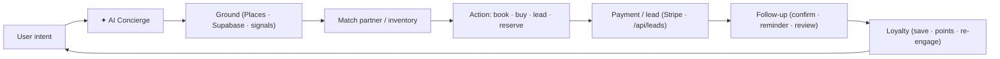
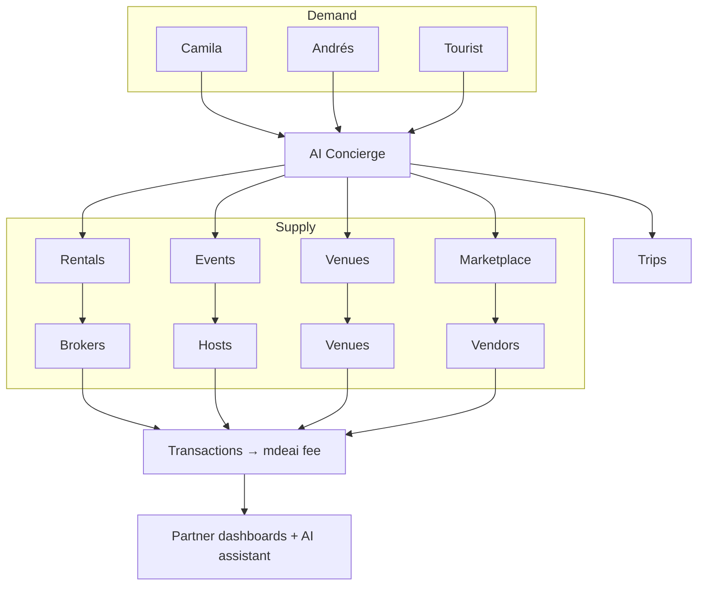

# Part 11 — AI Concierge Interaction Model

The concierge is the connective tissue: it turns a user intent into a partner transaction, then a relationship. Same brain (Mastra/Gemini via CopilotKit/AG-UI), many verticals.

## Universal pattern

## Per-vertical mapping

| Vertical | Intent | Partner | Action | Money | Follow-up → Loyalty |
|---|---|---|---|---|---|
| Events | "what's on Friday" | host/nightclub | buy ticket | ticket fee | QR + "rate it" → points |
| Restaurants | "dinner in Provenza" | restaurant | reserve | reservation fee | "how was it" → saved |
| Cafés | "café to work from" | café | visit/save | featured | "back again?" → loyalty |
| Nightlife | "rooftop tonight" | club/bar | table booking | table % | "next weekend" → re-engage |
| Real estate | "2-bed Laureles" | broker | schedule viewing | lead fee | viewing reminder → trip |
| Trips | "plan my weekend" | many | multi-book | bundled fees | itinerary saved → return |
| Marketplace | "DJ for my event" | vendor | book service | commission | review → repeat |

## Two-sided view (concierge as router)

## Principles
- **Grounded** — every recommendation cites real inventory/signals; sponsored = labeled.
- **One brain, many renderers** — web, chat, future WhatsApp use the same Mastra agents.
- **HITL on money** — checkout, lead reply, publish all pause for a human.
- The **same co-pilot** spans consumer concierge → partner signup → partner dashboard (continuity is the moat).
