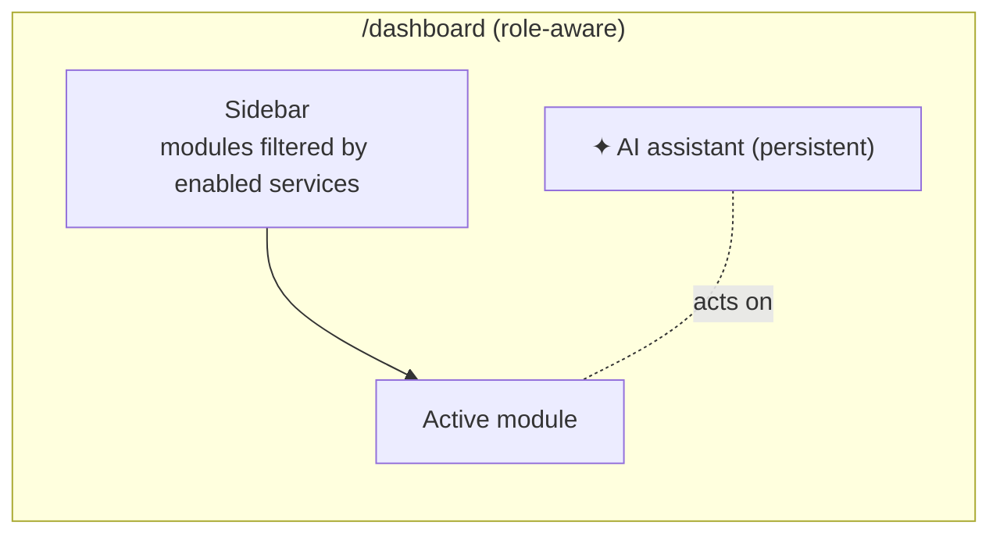

# Part 5 — Partner Dashboards

**One role-aware dashboard shell** — tabs render only for the services a partner enabled. Built on shadcn `sidebar` + `tabs` (installed). Same co-pilot from signup continues here.

## Module → which partner sees it

| Module | Restaurant | Café | Nightclub | Host | Broker | Sponsor | Vendor |
|---|:--:|:--:|:--:|:--:|:--:|:--:|:--:|
| **Overview** (KPIs, next steps, completion score) | ✅ | ✅ | ✅ | ✅ | ✅ | ✅ | ✅ |
| **Leads** | ✅ | ◑ | ✅ | ◑ | ✅ | ✅ | ✅ |
| **Bookings** | ✅ | ◑ | ✅ | ✅ | — | — | ✅ |
| **Revenue** | ✅ | ✅ | ✅ | ✅ | ✅ | ✅ | ✅ |
| **Campaigns** (Postiz) | ✅ | ✅ | ✅ | ✅ | ◑ | ✅ | ✅ |
| **AI Assistant** | ✅ | ✅ | ✅ | ✅ | ✅ | ✅ | ✅ |
| **Automations** | ✅ | ✅ | ✅ | ✅ | ✅ | ◑ | ✅ |
| **Analytics** | ✅ | ✅ | ✅ | ✅ | ✅ | ✅ | ✅ |
| **Reviews** | ✅ | ✅ | ✅ | ◑ | ◑ | — | ✅ |
| **Marketplace** | — | — | — | — | — | — | ✅ |
| **Opportunities** (AI-suggested) | ✅ | ✅ | ✅ | ✅ | ✅ | ✅ | ✅ |

✅ default · ◑ optional/limited · — hidden

## Module wireframe descriptions

- **Overview** — top KPI row (leads · live items · views · revenue), completion score ring, "next best actions" from the AI, recent activity feed.
- **Leads** — table (source · status · value); row → HITL panel where AI drafts a reply, partner approves/sends. (Reuses `/api/leads` + schedule-viewing HITL.)
- **Bookings** — calendar + list; confirm/decline; Stripe status for paid.
- **Revenue** — chart (gross · net · fees), payout schedule, invoices.
- **Campaigns** — Postiz scheduler: drafts, calendar, per-post performance.
- **AI Assistant** — full co-pilot pane ("draft a Friday post", "reply to lead #12", "why are views down?").
- **Automations** — toggle list (AI lead reply · OpenClaw ingest · review replies · reminders) with HITL gates on money actions.
- **Analytics** — funnel (views → leads → bookings), top items, neighborhood/time heat.
- **Reviews** — inbox + AI-drafted replies (HITL).
- **Marketplace** (vendors) — catalog, orders, payouts.
- **Opportunities** — AI cards: "add 2 photos (+30% views)", "feature this event", "respond to 3 stale leads".

## Layout (Mermaid)

## Decision — new `/dashboard`, not extend `/broker/*`

**Verdict: build a new unified, role-aware `/dashboard`; fold `/broker/*` into it as the broker role-view (redirect/alias).**

| | Extend `/broker/*` | New `/dashboard` ✅ |
|---|---|---|
| Naming fit | ❌ "broker" = real-estate only; wrong for venues/hosts/sponsors/agencies | ✅ neutral, fits all partner types |
| Routing | reuse existing shells | one new shell, role-guarded |
| Auth scope | broker-scoped today | one partner-role model (cleaner long-term) |
| Scales to 8 partner types | ❌ would need per-type forks | ✅ tabs filtered by enabled services |
| Effort | low now, high later | moderate now, low later |

**Why:** partners are *many* types, not just brokers. A single `/dashboard` with role guards + service-filtered tabs is the one shell every journey (Part 3) and the signup wizard (Part 4) already point at. `/broker/listings|leads|payouts` become views inside it (301 to `/dashboard?role=broker`), so no work is thrown away. Avoids 8 divergent dashboards — the anti-overengineering call.

## Build notes
- New role-aware `/dashboard`; `/broker/*` → alias/redirect into it (no rebuild of broker work).
- Service-role only in server routes per F13 carve-out; partner identity verified first.
- Charts: keep simple (recharts/shadcn chart) — no heavy BI at MVP.
