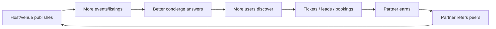
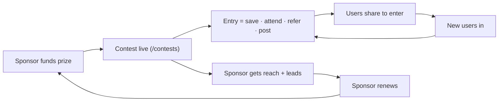
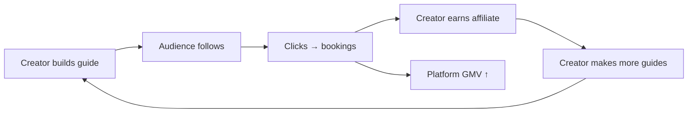

# Part 9 — Contests & Growth Loops

Growth = supply ↔ demand flywheel + sponsor-funded contests. Map to existing `prefix:CONT` contest vertical.

## Programs

| Program | Who | Mechanic | Loop it feeds |
|---|---|---|---|
| **Referral** | partners | invite a venue/host → both get credit | supply growth |
| **Ambassador** | power users/locals | curate guides, earn perks | content + demand |
| **Creator program** | influencers | build guides, affiliate revenue | demand + content |
| **Sponsor contests** | sponsors + consumers | brand-funded giveaway, entry = action | demand + sponsor $ |
| **Venue contests** | venues | "best Tuesday night" leaderboard | supply engagement |
| **Restaurant challenges** | restaurants + foodies | dish-of-the-month votes | demand + UGC |
| **Event attendance rewards** | attendees | points per ticket → perks | repeat purchase |
| **Loyalty system** | all consumers | tiers, streaks, saved-based perks | retention |
| **Gamification** | partners | completion score, badges, fill-rate | activation |

## Core viral loop

## Contest loop (sponsor-funded)

## Creator loop

## Guardrails
- Contests must stay **honest/grounded** (real entries, labeled sponsor content).
- Anti-abuse: dedupe entries, rate-limit referrals, verify before payout.
- Start with ONE loop (referral) — prove it before layering gamification.
