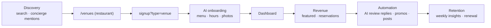
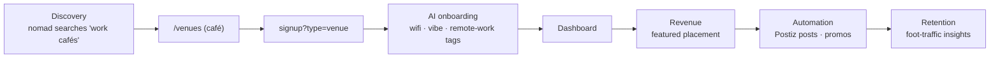
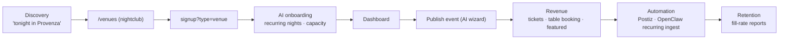
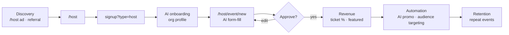
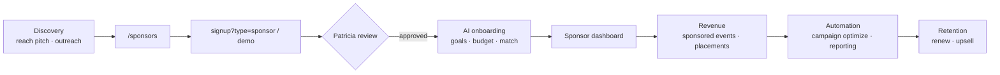
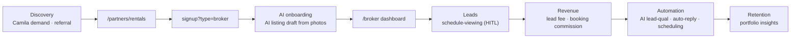
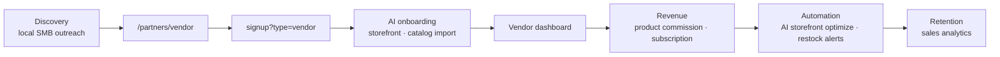
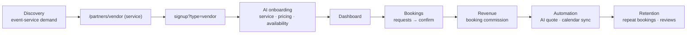
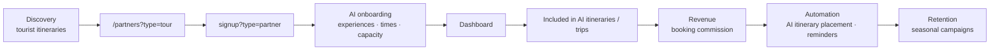

# Part 3 — Partner Journey Maps

Common spine (all 10): `Discovery → Marketing page → Signup (typed wizard) → AI onboarding → Dashboard → Revenue → Automation → Retention`. Diagrams show the vertical-specific deltas.

## 1. Restaurant

## 2. Café

## 3. Nightclub

## 4. Event Host (Roberto)

## 5. Sponsor

## 6. Real Estate Host / Broker

## 7. Vendor (marketplace — Phase 3)

## 8. Marketplace Seller (services)

## 9. Tour Operator

## 10. Influencer / Creator

```mermaid
flowchart LR
  D["Discovery<br/>creator program ad"] --> M["/partners/creator"]
  M --> S["signup?type=partner (creator)"] --> AO["AI onboarding<br/>niche · audience"]
  AO --> BUILD["AI guide builder"] --> SHARE["Share guides · affiliate links"]
  SHARE --> REV["Revenue<br/>affiliate · commission · tips"]
  REV --> AU["Automation<br/>auto-update guides · payout"] --> RET["Retention<br/>leaderboard · tiers"]
```

**Reuse note:** every "AI onboarding" node = the same `/partners/signup` co-pilot (see Part 4); every "Dashboard" = the same shell (Part 5). Verticals differ only in fields + which services switch on.
