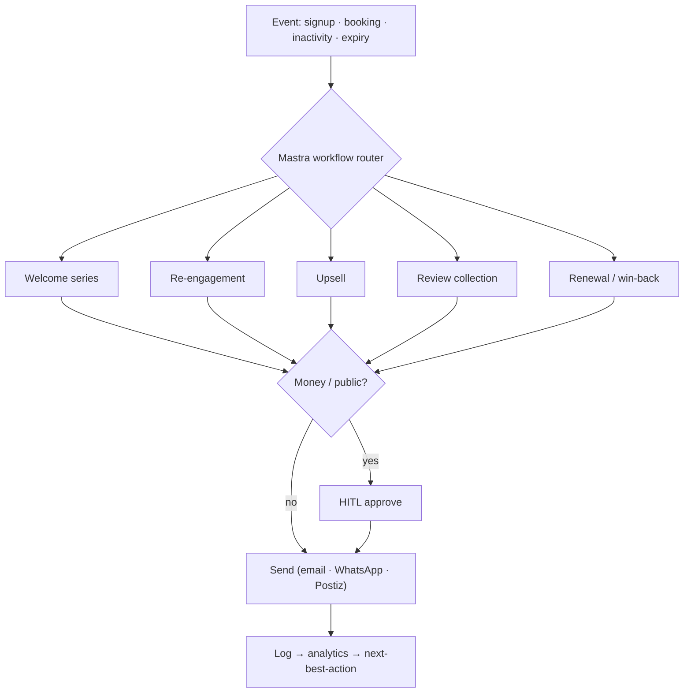

# Part 8 — Marketing Automation

Lifecycle automations per stakeholder. Engine = Mastra workflows + Postiz (social) + email/WhatsApp (Chatwoot). HITL on anything money/public.

## Lifecycle matrix

| Stage | Trigger | Partner action automated | Channel |
|---|---|---|---|
| **Lead capture** | landing form / concierge intent | create lead, tag, route | form → CRM |
| **Welcome series** | signup complete | 3-touch onboarding nudges + completion-score reminders | email/WhatsApp |
| **Re-engagement** | draft stalled / inactive 14d | "finish your listing" / "you have 3 unanswered leads" | email/WhatsApp |
| **Upsell** | usage threshold | "you hit 50 leads — Pro unlocks auto-reply" | in-app + email |
| **Referral** | first revenue | "invite a venue, both get a month free" | in-app |
| **Loyalty** | renewal streak | tier badges, featured credits | in-app |
| **Review collection** | post-booking/event | ask attendee for review → partner | WhatsApp |
| **Renewal** | sub expiry −7d | renew reminder + value recap | email |
| **Win-back** | churned 30d | "here's what you missed" + offer | email |

## Consumer-side (drives partner GMV)
Attendee/seeker automations feed partners: post-purchase upsell ("add to trip"), abandoned-checkout nudge, "tonight near you", saved-place price/availability alerts.

## Automation flow (Mermaid)

## Build notes
- Reuse Mastra workflows (AGT-11/12 patterns) + Chatwoot for WhatsApp/human handoff.
- Postiz handles scheduled social; email via existing provider.
- Every automation logged → dashboard "Opportunities" feeds the AI next-best-action.
