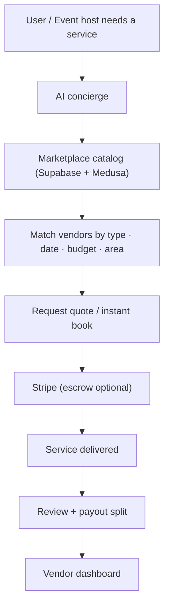
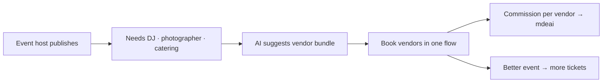

# Part 10 — Marketplace Expansion

Phase 3+ — after supply + B2B are proven. Aligns to the existing `COMM` commerce track (Medusa). Don't build early.

## Vendor categories

| Group | Vendors | Booking type | Revenue |
|---|---|---|---|
| **Vendors (goods)** | Fashion · Food · Merchandise | product order | commission + sub |
| **Experiences** | Activities · classes · tastings | timed booking | commission |
| **Services** | local services | quote/booking | commission |
| **Event services** | Photographers · DJs · Decorators · Security · Catering | event booking | commission |
| **Tourism services** | Guides · Transportation · Activities | booking | commission/affiliate |

## Marketplace architecture

## Event-services bundle (high-value tie-in)

## Build notes
- Sits on existing COMM/Medusa track — reuse, don't rebuild a cart.
- Entry wedge = **event services** (DJs/photographers/catering) because event hosts are already on-platform and have budget.
- Keep AI as the matcher/concierge, not a new browse UI at first.
