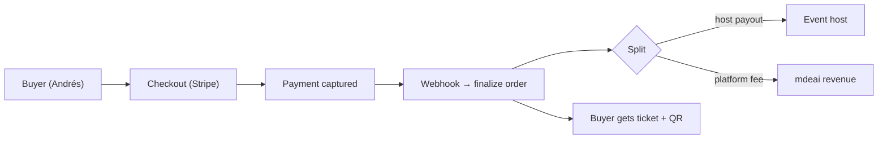
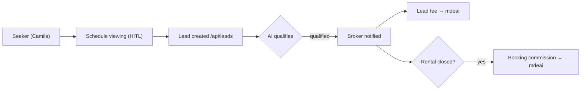
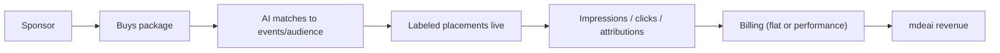

# Part 6 — Revenue Architecture

Recurring (R) vs one-time (O). Priority P0–P2. Numbers are model placeholders to tune.

## Streams by vertical

| Vertical | Revenue stream | Description | Take | R/O | Priority |
|---|---|---|---|:--:|:--:|
| **Events** | Ticket fee | % per ticket via Stripe | 3–7% + flat | O | P0 |
| | Host subscription | pro tools/analytics | $/mo | R | P1 |
| | Featured event | promoted in browse/concierge | $/event | O | P1 |
| **Venues** | Reservation/table fee | per booking | flat/% | O | P1 |
| | Premium placement | featured in concierge/map | $/mo | R | P1 |
| | Event-space commission | space rented for events | % | O | P2 |
| **Real Estate** | Lead fee | per qualified viewing lead | $/lead | O | P0 |
| | Booking commission | on closed rental | % | O | P1 |
| | Featured listing | top of `/rentals` | $/mo | R | P1 |
| **Sponsors** | Sponsored events | brand sponsors an event | $/campaign | O | P1 |
| | Sponsored placements | labeled concierge/venue promos | $/mo | R | P2 |
| | Contests | sponsor-funded giveaways | $/contest | O | P2 |
| **Marketplace** | Product commission | vendor sales | % | O | P3 |
| | Vendor subscription | storefront tools | $/mo | R | P3 |
| **Tourism** | Affiliate / experience booking | tours/activities | % | O | P2 |
| **AI Services** | AI builds / automation | agency retainers | $/mo + setup | R+O | P1 |
| | Postiz social mgmt | done-for-you posting | $/mo | R | P2 |

## Revenue flow — ticket purchase (live path)

## Revenue flow — rental lead (live path)

## Revenue flow — sponsorship

## Priority verdict
**P0 cash now:** ticket fees (live) + rental lead fees (live path). **P1 expansion:** featured/subscriptions + AI-services retainers + sponsorship. **P2/3:** marketplace + tourism affiliate. Build order follows cash proximity — monetize the surfaces already shipping before adding new rails.
