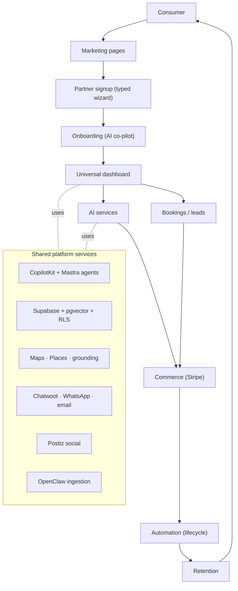
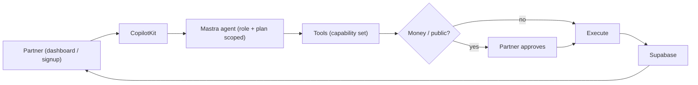
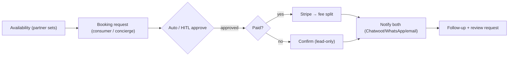
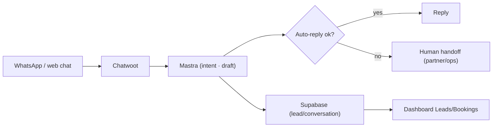
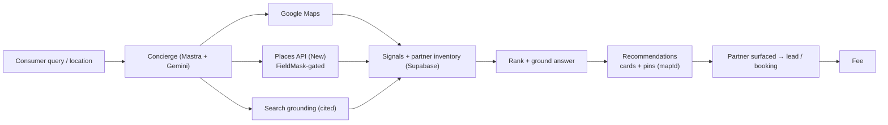
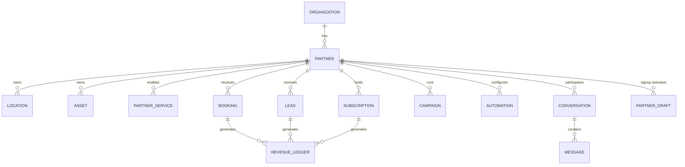

# mdeai Partners Platform — PRD

> This PRD is the **canonical top-level spec**. Detailed designs live in the linked docs; this document states the *requirements, decisions, architecture, data model, and roadmap*. Diagrams render to SVG in `diagrams/` (mermaid-cli validated).

## 1. Executive summary

**What:** an AI-powered partner ecosystem on top of the mdeai concierge — one platform that handles partner acquisition, onboarding, dashboards, lead generation, bookings, commerce, AI services, marketing automation, analytics, and retention, for **18 partner types**.

**Why:** demand (consumers via the concierge) is largely built; the business needs **supply + monetization**. Partners are where revenue lives (ticket %, lead fees, booking commissions, subscriptions, sponsorship, AI-service packages).

**Revenue opportunities:** transaction fees (live), subscriptions, AI-service packages, sponsorships, marketplace commissions, white-label/embed (later).

**Competitive advantage:** (1) **grounded AI concierge** that already routes demand to partners; (2) **AI that does the partner's work** (drafts events/listings/posts, replies to leads, matches sponsors) — agency-grade marketing for a subscription; (3) **maps-first**, Medellín-local data moat.

**How AI creates value:** it removes partner labor at every stage — a small venue gets event creation, social posting, lead replies, and analytics from one assistant. That is both the retention hook and the upsell engine.

## 2. Goals, non-goals, success metrics

**Goals (P1):** ship marketing pages + one signup wizard + one dashboard; monetize live surfaces (tickets, rental leads); onboard the P0 verticals (host, nightclub, broker).
**Non-goals (now):** marketplace cart, white-label/embed, multi-city, public API, 18 bespoke dashboards.

| KPI | Target (per phase) |
|---|---|
| Active partners | P1: first cohort live · P2: retention ≥ 90-day |
| Weekly GMV | P1 baseline → grow |
| MRR (subs + AI packages) | P2 |
| Lead→conversion rate | P2 |
| Partner activation rate (completion score ≥ threshold) | P1 |
| Sponsorship revenue | P2 |

## 3. Personas (partner types)

18 types, one platform. Full table + revenue/priority: `./02-stakeholder-audit.md`, `./index-partners.md`.
**P0:** Event Host · Nightclub · Real-estate broker. **P1:** Restaurant · Café · Venue · Sponsor · Agency. **P2:** Tour operator · Hotel · Transportation · Coworking · Wellness. **P3:** Vendor · Influencer · Property manager · Airbnb host · Coliving.

## 4. System architecture

## 5. Partner lifecycle

7 stages — **Acquire → Onboard → Activate → Monetize → Automate → Grow → Retain** — identical engine per type; config differs. Per-stage user/AI/platform/revenue actions + 10 journey diagrams: `./04-journey-maps.md` + `./index-partners.md`.

## 6. Functional requirements (by system)

### 6.1 Marketing website
Pages: `/partners` hub · `/host` · `/venues` (restaurant/café/nightclub/space) · `/partners/rentals` · `/business/ai` · `/business/social` · `/sponsors` · `/contests` · `/pricing` · `/contact`. Per-page hero/benefits/AI/CTA/funnel: `./03-landing-pages.md` + `../docs/marketing-pages.md`. **Every CTA funnels to one wizard.**

### 6.2 Signup & onboarding
**Decision: one engine, per-partner-type config** (steps/fields toggle by `type`); AI co-pilot reads+writes the form (generative UI). 10 steps + completion score + activation checklist + per-type matrix: `./05-signup-wizard.md`. Wireframe: `./wireframes/partner-signup-wireframe.html`.

### 6.3 Dashboard
**Decision: one role-aware `/dashboard`**; `/broker/*` folds in as alias. Modules (Overview · Leads · Customers · Revenue · Bookings · Marketing · Assets · AI Services · Automation · Analytics · Team · Settings) filtered by enabled services. Matrix: `./06-dashboards.md`.

### 6.4 AI Copilot architecture (NEW)
One CopilotKit surface, Mastra agents, **role/skill-scoped** — not separate copilots, but one assistant with capability sets gated by partner role + plan. HITL on money/public.

| Capability set | Tools (Mastra) | Permissions | HITL |
|---|---|---|---|
| Onboarding | set_profile · set_services · suggest_pricing · geocode | during signup | — |
| Marketing | draft_post · schedule (Postiz) · draft_listing | partner | publish |
| Revenue | summarize_revenue · suggest_plan | partner (read) | charges |
| Booking | check_availability · draft_reply · confirm_booking | partner | confirm/charge |
| Lead | qualify_lead · draft_reply · route | partner | send |
| Sponsor | match_campaign · roi_report | sponsor | go-live |

### 6.5 Lead generation
12 channels → one lead store → AI qualify → route → convert. `./revenue/02-lead-generation.md`.

### 6.6 Booking system (NEW)
For restaurants · cafés · nightlife · venues · tours · hotels · wellness. Availability → request → approval (HITL) → payment (if paid) → notifications → follow-up.

### 6.7 Revenue & commerce
Subscriptions · lead · booking · ticket · marketplace · sponsored · AI-package · white-label · commission. Flows + take rates: `./revenue/04-commerce-payments.md` + `./07-revenue.md`. Stripe live for tickets; add subscriptions + Connect payouts.

### 6.8 AI marketing services
Per-vertical catalog + Free/Growth/Pro/Custom tiers + delivery: `./08-ai-services.md` + `./revenue/05-service-delivery.md`.

### 6.9 Social media + brand assets
Postiz (IG/FB/TikTok/LinkedIn/WhatsApp/GBP): content → AI draft → approve → schedule → publish → analytics. Assets: upload → validate → AI process → store → use. `./revenue/06-assets-and-social.md`.

### 6.10 Chatwoot + WhatsApp (NEW)

Used for lead capture · support · bookings · campaigns · follow-ups.

### 6.11 Data intelligence + Maps/Places/grounding
OpenClaw/Places/grounding enrichment with compliance + HITL QA: `./revenue/03-data-intelligence.md`. Maps→grounding→AI→recommendations powers concierge surfacing (hard rules: `mapId`, FieldMask).

## 7. Database architecture (NEW)

Core entities (Supabase, RLS, pgvector for recall). New partner tables alongside existing app tables.

Key tables: `organizations`, `partners` (type, status, completion_score), `locations`, `assets`, `partner_services`, `subscriptions`, `leads`, `bookings`, `campaigns`, `automations`, `conversations`, `messages`, `revenue_ledger`, `partner_drafts`. **RLS-tight**; service-role only in server routes (F13 carve-out). Reuse existing `events`, `rentals`, `venue_signals`.

## 8. Tech stack
Next.js 16 · React 19 · Tailwind v4 · shadcn/ui · CopilotKit 1.55.2 · Mastra · Gemini (`gemini-3.5-flash`) · Supabase (PG · pgvector · RLS · realtime) · Maps/Places/grounding · Chatwoot/WhatsApp/email · Postiz · OpenClaw · Stripe. **No non-Gemini LLM SDK in prod.**

## 9. MVP roadmap
Phase 1 MVP → Phase 5 Automation Platform, with features/revenue/dependencies/KPIs: `./13-roadmap.md`. Milestones (M1 Acquire → M5 Expand): `./revenue/07-linear-structure.md`.

## 10. Linear breakdown
One Partners project · epic **SAN-667** · horizontal workstreams (SAN-665/690/668–673) · per-partner verticals (SAN-675–682) · pages (SAN-660/661/663/664). Hierarchy + net-new tasks: `./revenue/07-linear-structure.md`.

## 11. Anti-overengineering review

| Verdict | Items |
|---|---|
| **Ship now (P1)** | marketing pages · one signup wizard · one dashboard · ticket/lead monetization · host/nightclub/broker verticals |
| **Wait (P2–3)** | subscriptions/AI packages · sponsorships · automation engine · social/assets · marketplace · more verticals |
| **Never (or far future)** | per-type dashboards · per-type codebases · multiple copilots · multi-city before single-city revenue · public API before marketplace supply |

Rules enforced: build once / configure many · no duplicate dashboards/onboarding/agents · everything config-driven by `type` + plan.

## 12. Risks & open questions
- **Thin supply at launch** → seed P0 verticals manually first.
- **Postiz/OpenClaw first-party vs resold** → decides copy + cost (open).
- **Verification depth gating "go live"** (open, PRD §6.2).
- **Sponsored placements in concierge** must stay labeled + grounded (trust risk).
- **Stripe Connect payouts** — onboarding/KYC complexity (P2).
