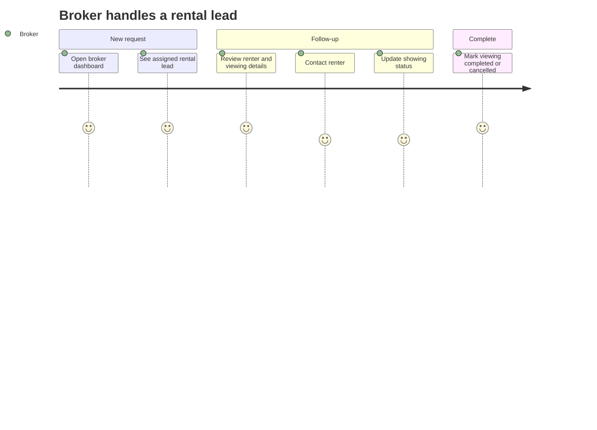
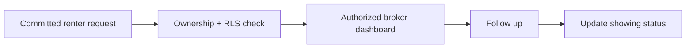

# MDE Rentals — Broker Dashboard

**Purpose:** define what an authorized broker sees and does after a renter commits a viewing request.

## Broker journey

## Responsibility flow

## Rules

- Broker A cannot see Broker B's private leads/showings.
- The dashboard reads committed data; it does not trust AI-generated authorization.
