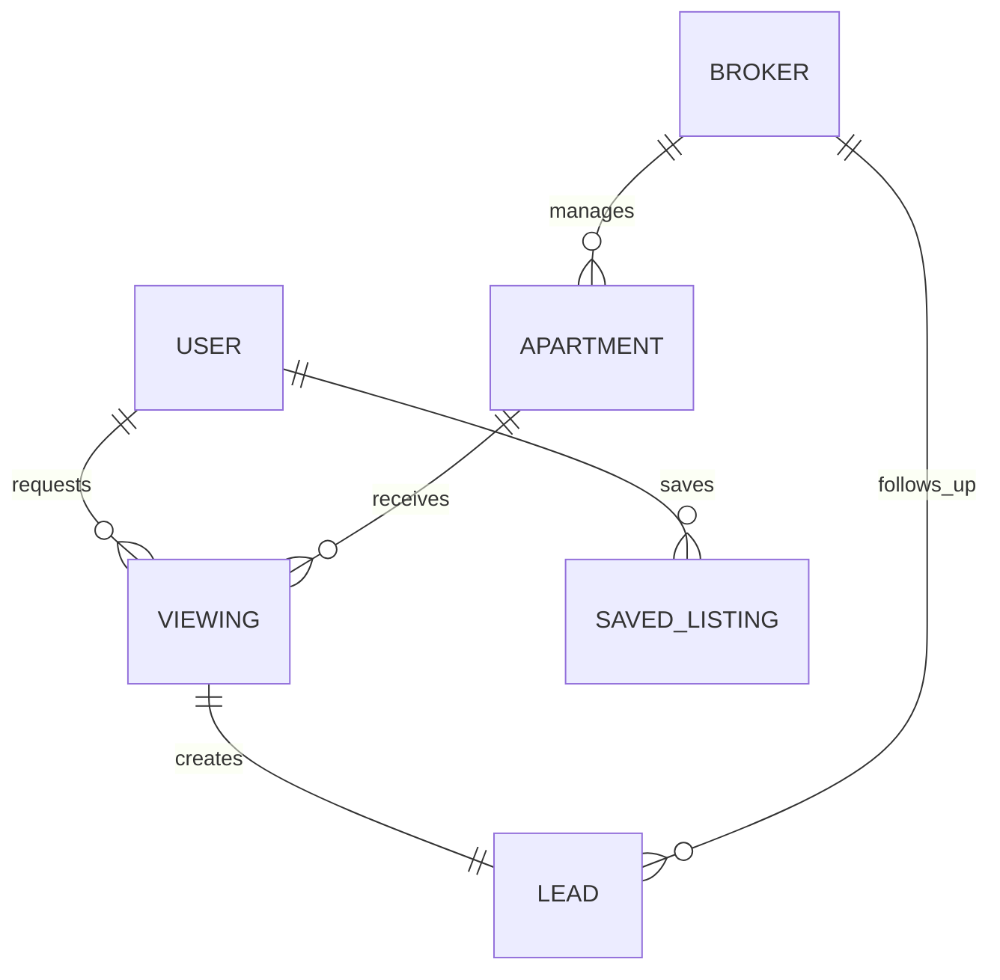
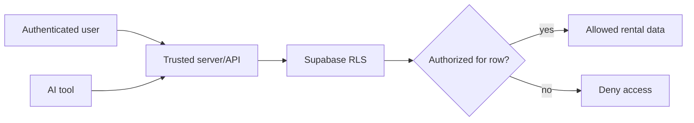

# MDE Rentals — Accounts & Permissions

**Purpose:** define ownership and data visibility for renters, brokers, admins and AI tools.

## Core data relationships

## Access boundary

## Rules

- Ownership and authorization are database/server concerns, not prompt instructions.
- AI tools receive only the data the current user is authorized to access.
- Two-user negative tests must prove cross-broker and cross-user isolation.
