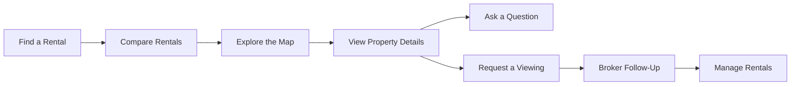

# MDE Rentals / Real Estate — Reference & Planning Index

One page to find the current Real Estate docs, Linear plans/tasks, reference repos, and the next docs worth creating.

## Table of contents

1. [Start here](#1--start-here)
2. [Product areas and documentation plan](#2--product-areas-and-documentation-plan)
3. [Canonical GitHub docs](#3--canonical-github-docs)
4. [Linear planning and task views](#4--linear-planning-and-task-views)
5. [Core/MVP task map](#5--coremvp-task-map)
6. [Shared platform docs](#6--shared-platform-docs)
7. [Reference repos and local clones](#7--reference-repos-and-local-clones)
8. [Product docs](#8--product-docs)
9. [Strategy and advanced work](#9--strategy-and-advanced-work)
10. [Source-of-truth rules](#10--source-of-truth-rules)
11. [How to keep this index current](#11--how-to-keep-this-index-current)

## 1 · Start here

For Core/MVP, read in this order:

1. [`RENTALS.md`](./RENTALS.md) — what MDE Rentals does and the target Core/MVP journey.
2. [`REUSE-MATRIX.md`](./REUSE-MATRIX.md) — what MDE keeps, adapts, models, references, or skips.
3. [`REFERENCES.md`](./REFERENCES.md) — the repo/template catalog and exactly what MDE takes from each source.
4. [Linear Real Estate view](https://linear.app/amo100/view/real-estate-mde-61c961d1bd58) — live task status and sequencing.
5. [MDE AI project](https://linear.app/amo100/project/mde-ai-bb25cababf6c) — project milestones and cross-platform blockers.

Core/MVP journey:

```text
search
→ compare
→ map
→ listing
→ viewing request
→ committed lead/showing
→ authorized broker follow-up
```

Do not make this journey depend on MCP, A2A, browser agents, deep research, observational memory, autonomous broker agents, or agent swarms.

### Summary

| Status | % Complete | Area | Current state | Next |
|---|---:|---|---|---|
| 🟢 | 100% | Core rental docs | Complete | Maintain |
| 🟢 | 100% | Reference index | Complete | Maintain |
| 🟢 | 100% | Reuse matrix | Complete | Maintain |
| 🟢 | 100% | Reference repos | Core/MVP set cloned | Inspect exact commits/licenses before reuse |
| 🟢 | 100% | Test plan | Created | Maintain + add evidence |
| 🟢 | 100% | Data boundaries | Created | Maintain with RLS evidence |
| 🔵 | 0% | Migration plan | Not required yet | Create only if a real schema/data cutover appears |
| 🟢 | 100% | Operations runbook | Created | Maintain before launch/support |
| 🟡 | 70% | Core/MVP implementation | In progress | Finish rental journey blockers in Linear |
| 🔵 | 0% | Advanced real-estate features | Deferred | Start only after Core/MVP production proof |

**Legend:** 🟢 Complete · 🟡 In progress · 🔴 Blocked/failed · 🔵 Not started

This is a summary only. Linear remains the live source for implementation task status.

## Visual rental journey



## 2 · Product areas and documentation plan

The primary path follows how a real renter uses MDE. Technical docs come after the user journey. Whole numbers are major product areas; decimals leave room for future tasks without renumbering later.

### 1.0 · Rental Experience

**Main doc:** [`RENTALS.md`](./RENTALS.md)

| Task | Status | % Complete | What the user does | Doc |
|---:|---|---:|---|---|
| **1.0** | 🟢 | 100% | Understand the complete rental journey | [`RENTALS.md`](./RENTALS.md) |
| 1.1 | 🟢 | 100% | See the current product path | [`INDEX.md`](./INDEX.md) |
| 1.2 | 🟢 | 100% | Understand what MDE already has vs reuses | [`REUSE-MATRIX.md`](./REUSE-MATRIX.md) |
| 1.3 | 🟢 | 100% | Find source repos and official references | [`REFERENCES.md`](./REFERENCES.md) |

### 2.0 · Find a Rental

**Current doc:** [`SEARCH.md`](./SEARCH.md)

| Task | Status | % Complete | What the user does |
|---:|---|---:|---|
| **2.0** | 🟢 | 100% | Find rentals that match their needs |
| 2.1 | 🔵 | 0% | Search by neighborhood |
| 2.2 | 🔵 | 0% | Search by bedrooms |
| 2.3 | 🔵 | 0% | Search by budget |
| 2.4 | 🔵 | 0% | Search by move-in dates and availability |
| 2.5 | 🔵 | 0% | Refine results with AI without breaking hard requirements |

### 3.0 · Compare Rentals

**Current coverage:** [`RENTALS.md`](./RENTALS.md) + rental browse UI

| Task | Status | % Complete | What the user does |
|---:|---|---:|---|
| **3.0** | 🟡 | 70% | Compare available rentals |
| 3.1 | 🟡 | 70% | Compare rental cards |
| 3.2 | 🟡 | 70% | Compare price, bedrooms and amenities |
| 3.3 | 🟡 | 70% | Select a rental to inspect |
| 3.4 | 🔵 | 0% | Save a shortlist for later |

### 4.0 · Explore the Map

**Current doc:** [`MAPS.md`](./MAPS.md)

| Task | Status | % Complete | What the user does |
|---:|---|---:|---|
| **4.0** | 🟢 | 100% | See where rentals are located |
| 4.1 | 🟡 | 70% | Select a rental card and see the matching map pin |
| 4.2 | 🟡 | 70% | Select a map pin and see the matching rental |
| 4.3 | 🔵 | 0% | Understand the neighborhood and nearby area |

### 5.0 · View Property Details

**Current doc:** [`LISTINGS.md`](./LISTINGS.md)

| Task | Status | % Complete | What the user does |
|---:|---|---:|---|
| **5.0** | 🟢 | 100% | Open a rental and decide whether it fits |
| 5.1 | 🟢 | 100% | View photos |
| 5.2 | 🟢 | 100% | Review price, bedrooms, bathrooms and guest capacity |
| 5.3 | 🟢 | 100% | Review amenities and description |
| 5.4 | 🟢 | 100% | Review availability and minimum stay |
| 5.5 | 🟢 | 100% | Review house rules and location |
| 5.6 | 🟢 | 100% | See the host and rental terms |

### 6.0 · Ask About a Rental

**Current coverage:** property detail + rental concierge

| Task | Status | % Complete | What the user does |
|---:|---|---:|---|
| **6.0** | 🟡 | 70% | Ask questions before committing |
| 6.1 | 🟡 | 70% | Ask about the selected rental |
| 6.2 | 🟡 | 70% | Keep the selected property in conversation context |
| 6.3 | 🔵 | 0% | Get clear answers when property data is missing or pending |

### 7.0 · Request a Viewing

**Current doc:** [`VIEWINGS.md`](./VIEWINGS.md)

| Task | Status | % Complete | What the user does |
|---:|---|---:|---|
| **7.0** | 🟢 | 100% | Request to see a property |
| 7.1 | 🟡 | 70% | Choose the property and preferred time |
| 7.2 | 🟡 | 70% | Explicitly confirm the request |
| 7.3 | 🟡 | 70% | Save the request exactly once |
| 7.4 | 🟡 | 70% | Receive confirmation only after the database commits |

### 8.0 · Broker Follow-Up

**Current coverage:** [`VIEWINGS.md`](./VIEWINGS.md) + [`BROKER-DASHBOARD.md`](./BROKER-DASHBOARD.md)

| Task | Status | % Complete | What happens next |
|---:|---|---:|---|
| **8.0** | 🟡 | 70% | The correct broker receives the committed request |
| 8.1 | 🟡 | 70% | Broker sees the renter's lead/viewing |
| 8.2 | 🟡 | 70% | Broker follows up with the renter |
| 8.3 | 🔵 | 0% | Viewing status stays current through completion/cancellation |

### 9.0 · Manage Rentals

**Current doc:** [`BROKER-DASHBOARD.md`](./BROKER-DASHBOARD.md)

| Task | Status | % Complete | What the broker/host does |
|---:|---|---:|---|
| **9.0** | 🟡 | 70% | Manage rental activity |
| 9.1 | 🟡 | 70% | View owned/authorized listings |
| 9.2 | 🟡 | 70% | Review leads and viewing requests |
| 9.3 | 🟡 | 70% | Follow up and update status |

### 10.0 · Save Rentals

**Status:** future / incomplete

| Task | Status | % Complete | What the user does |
|---:|---|---:|---|
| **10.0** | 🔵 | 0% | Save rentals to revisit later |
| 10.1 | 🔵 | 0% | Save a favorite |
| 10.2 | 🔵 | 0% | Return to saved rentals |
| 10.3 | 🔵 | 0% | Resume with the correct signed-in user |

### Engineering & Operations

These docs support the rental journey but are not primary user-facing product areas.

| Area | Status | Doc | Purpose |
|---|---|---|---|
| Accounts & permissions | 🟢 | [`DATA-BOUNDARIES.md`](./DATA-BOUNDARIES.md) | Ownership, RLS, renter/broker/admin/AI access |
| Testing the rental journey | 🟢 | [`TEST-PLAN.md`](./TEST-PLAN.md) | Unit, API, DB, RLS, browser and production proof |
| Production support | 🟢 | [`OPERATIONS-RUNBOOK.md`](./OPERATIONS-RUNBOOK.md) | Diagnose failures and recover safely |
| Reuse decisions | 🟢 | [`REUSE-MATRIX.md`](./REUSE-MATRIX.md) | What MDE keeps, adapts, models, references or skips |
| Reference sources | 🟢 | [`REFERENCES.md`](./REFERENCES.md) | Official docs, repos, templates and local clones |
| Shared AI platform | 🟢 | [CopilotKit + Mastra docs](../../03-platform/copilotkit-mastra/README.md) | Runtime, agents, tools, memory, HITL and shared platform behavior |
| Data migration | 🔵 | `MIGRATION-PLAN.md` | Create only if a real schema/data cutover is needed |

Add future work as the next decimal inside the relevant user journey area—for example `7.5`—instead of renumbering later sections.

## 3 · Canonical GitHub docs

| Status | % Complete | Document | Purpose | Next |
|---|---:|---|---|---|
| 🟢 | 100% | [`INDEX.md`](./INDEX.md) | Navigation across docs, Linear, tasks, and references | Maintain |
| 🟢 | 100% | [`README.md`](./README.md) | Small folder router and source-of-truth rules | Maintain |
| 🟢 | 100% | [`RENTALS.md`](./RENTALS.md) | Product, journeys, architecture, blockers, success criteria | Maintain as architecture changes |
| 🟢 | 100% | [`REUSE-MATRIX.md`](./REUSE-MATRIX.md) | KEEP / COPY / ADAPT / MODEL / REFERENCE / SKIP decisions | Pin exact commit/license before direct reuse |
| 🟢 | 100% | [`REFERENCES.md`](./REFERENCES.md) | GitHub repos, official templates, local clones, and MDE adaptations | Keep sources and local paths current |

GitHub docs root:
https://github.com/amoai-tech/mdeai/tree/main/docs

Rentals folder on `main` after merge:
https://github.com/amoai-tech/mdeai/tree/main/docs/04-domains/rentals

## 4 · Linear planning and task views

### Main navigation

- MDE AI project: https://linear.app/amo100/project/mde-ai-bb25cababf6c
- Real Estate MDE view: https://linear.app/amo100/view/real-estate-mde-61c961d1bd58
- Rentals & Real Estate PRD + Roadmap: https://linear.app/amo100/document/mde-ai-rentals-and-real-estate-prd-roadmap-7881940afa3a
- MDE Product PRD: https://linear.app/amo100/document/mde-ai-product-requirements-document-dd9b302ec327
- MDE Product Roadmap: https://linear.app/amo100/document/mde-ai-product-roadmap-888fc22cc000
- Ordered Production Todo: https://linear.app/amo100/document/mde-ai-ordered-production-todo-97d23ef23d1e

### Shared AI/platform planning

- MDE Agent Platform PRD: https://linear.app/amo100/document/mde-agent-platform-prd-2d1bd0e59dbc
- MDE Agent Platform Roadmap: https://linear.app/amo100/document/mde-agent-platform-roadmap-886de8dab1ad
- MDE Reference Reuse Matrix: https://linear.app/amo100/document/mde-reference-reuse-matrix-883571644ed8
- MDE Agent Platform Migration Plan: https://linear.app/amo100/document/mde-agent-platform-migration-plan-5c76cd7d8032

### Data/security planning

- MDE Supabase Production Hardening: https://linear.app/amo100/document/mde-supabase-production-hardening-audit-and-fix-plan-34f9502b44f5

### Documentation governance

- Documentation index + cleanup map: https://linear.app/amo100/document/mde-ai-documentation-index-and-cleanup-map-5b15f46fc21b
- Documentation cleanup plan: https://linear.app/amo100/document/mde-documentation-audit-and-cleanup-plan-pr-108-3f81419eaf3f
- SAN-1271 canonical docs index: https://linear.app/amo100/issue/SAN-1271/san-1271-finish-the-canonical-docs-index-and-make-documentation-drift
- SAN-1278 domain docs: https://linear.app/amo100/issue/SAN-1278/task-47-mde-docs-domains-001-rewrite-current-domain-documentation
- SAN-1280 docs drift prevention: https://linear.app/amo100/issue/SAN-1280/task-49-mde-docs-drift-001-add-documentation-validation-and-drift

## 5 · Core/MVP task map

Use Linear for live status. These percentages are a simple planning snapshot for this index; update them when the underlying Linear task meaningfully changes.

| Status | % Complete | Area | Primary Linear task | What becomes true |
|---|---:|---|---|---|
| 🟡 | 70% | Rental launch coordinator | [SAN-1315](https://linear.app/amo100/issue/SAN-1315/san-1315-finish-the-rental-journey-from-apartment-discovery-to) | Discovery → detail → committed viewing works as one journey |
| 🟡 | 70% | Rental readiness tracker | [SAN-1270](https://linear.app/amo100/issue/SAN-1270/san-1270-keep-the-rental-production-readiness-tracker-current) | One current rental readiness view |
| 🟡 | 70% | Viewing UI truth | [SAN-1203](https://linear.app/amo100/issue/SAN-1203/san-1203-make-a-viewing-request-count-only-after-the-database-commits) | UI confirms only after the DB commits |
| 🟡 | 70% | Atomic viewing write | [SAN-1286](https://linear.app/amo100/issue/SAN-1286/san-1286-make-rental-viewing-requests-one-atomic-database-write) | One atomic lead + showing write path |
| 🟡 | 70% | Lead capture proof | [SAN-474](https://linear.app/amo100/issue/SAN-474/san-474-re-007-prove-rental-lead-capture-through-the-real-edge-atomic) | Real edge/API path reaches the atomic write |
| 🟡 | 70% | Broker Sees Their Rentals & Leads | [SAN-476](https://linear.app/amo100/issue/SAN-476/real-009-prove-committed-showing-authorized-broker-visibility) | Correct broker sees committed showing |
| 🟡 | 70% | Host workspace | [SAN-1204](https://linear.app/amo100/issue/SAN-1204/re-des-009-host-workspace-surfaces-real-consumer-leads-viewings) | Real leads/viewings appear in host UI |
| 🟡 | 70% | End-to-end rental journey | [SAN-1205](https://linear.app/amo100/issue/SAN-1205/re-wire-004-prove-the-complete-rental-conversion-journey-end-to-end) | Full browser journey is proven |
| 🔵 | 0% | Production smoke | [SAN-483](https://linear.app/amo100/issue/SAN-483/real-016-final-production-rental-conversion-smoke-floor) | Production rental conversion stays green |
| 🟡 | 70% | Rental ownership model | [SAN-1104](https://linear.app/amo100/issue/SAN-1104/d-01-ptr-rentals-001-landlord-id-ownership-model) | Every rental has authoritative owner identity |
| 🟡 | 70% | Broker isolation | [SAN-1105](https://linear.app/amo100/issue/SAN-1105/d-02-ptr-rentals-002-broker-rls-two-user-test) | Broker A cannot read Broker B data |
| 🟡 | 70% | Production data boundary | [SAN-1349](https://linear.app/amo100/issue/SAN-1349/supa-re-015-close-rental-production-data-boundary-gaps) | Ownership/RLS/data gaps are closed |
| 🟡 | 70% | Rental test harness | [SAN-482](https://linear.app/amo100/issue/SAN-482/san-482-shared-rental-test-harness-fixtures-auth-states-and-rls-proof) | Repeatable renter/broker/RLS fixtures exist |
| 🟡 | 70% | Cards ↔ map sync | [SAN-472](https://linear.app/amo100/issue/SAN-472/san-472-re-005-map-pin-sync-with-rental-cards) | Cards and pins select the same listing |
| 🟡 | 70% | Listing Quality | [SAN-468](https://linear.app/amo100/issue/SAN-468/real-002-apartment-inventory-quality) | Core listings are trustworthy enough for MVP |
| 🟡 | 70% | Move-in Dates & Availability | [SAN-486](https://linear.app/amo100/issue/SAN-486/real-019-rental-search-availability-date-filters) | Dates are deterministic search constraints |
| 🟡 | 70% | AI/data isolation | [SAN-547](https://linear.app/amo100/issue/SAN-547/san-547-keep-each-users-ai-tools-and-supabase-data-isolated) | User/thread/tool data stays isolated |
| 🟡 | 70% | AI safety | [SAN-1054](https://linear.app/amo100/issue/SAN-1054/san-1054-prove-rental-ai-cannot-leak-prompts-data-or-perform) | Rental AI cannot leak or perform unauthorized actions |

## 6 · Shared platform docs

Do not duplicate these inside rentals. Link to them.

- CopilotKit + Mastra platform README: https://github.com/amoai-tech/mdeai/blob/main/docs/03-platform/copilotkit-mastra/README.md
- Platform diagrams: https://github.com/amoai-tech/mdeai/blob/main/docs/03-platform/copilotkit-mastra/diagrams.md
- Official reference pack: https://github.com/amoai-tech/mdeai/blob/main/docs/03-platform/copilotkit-mastra/reference-pack.md
- Platform roadmap: https://github.com/amoai-tech/mdeai/blob/main/docs/03-platform/copilotkit-mastra/roadmap.md

Platform tasks that can affect Rentals:

- CopilotKit standardization: https://linear.app/amo100/issue/SAN-1298/task-53ck-mde-copilotkit-epic-001-standardize-copilotkit-ui-shared
- Mastra runtime standardization: https://linear.app/amo100/issue/SAN-1299/san-1299-standardize-the-mastra-runtime-before-adding-more-agents-or
- CopilotKit audit guard: https://linear.app/amo100/issue/SAN-1300/task-5510-mde-ck-guard-001-repair-copilotkit-audit-guardrail
- Mastra storage certification: https://linear.app/amo100/issue/SAN-1311/task-5410-mde-mastra-storage-cert-001-certify-mastra-storage-for
- Chat memory durability: https://linear.app/amo100/issue/SAN-548/san-548-prove-chat-memory-survives-a-vercel-restart

## 7 · Reference repos and local clones

### Local clone cache

Use local clones for source inspection instead of repeatedly browsing moving `main` branches.

| Source | Local path | Main MDE use |
|---|---|---|
| CopilotKit | `/home/sk/github-repos/copilotkit/CopilotKit` | Mastra integration, shared state, GenUI patterns |
| Mastra monorepo | `/home/sk/github-repos/mastra/mastra` | Native agents/tools/workflows/storage APIs |
| Mastra Agent Harness | `/home/sk/github-repos/mastra/template-agent-harness` | Advanced governance reference; not Core/MVP requirement |
| Mastra Browsing Agent | `/home/sk/github-repos/mastra/template-browsing-agent` | Future external verification reference |
| Mastra Company Knowledge | `/home/sk/github-repos/mastra/template-company-knowledge` | Future grounded knowledge reference |
| Mastra Deep Search | `/home/sk/github-repos/mastra/template-deep-search` | Future neighborhood/market research reference |
| Mastra Text-to-SQL | `/home/sk/github-repos/mastra/template-text-to-sql` | Broker/admin analytics model only |
| OpenBot | `/home/sk/github-repos/copilotkit/OpenBot` | Advanced broker coworker reference; not Core/MVP |
| Mastra Supabase starter | `/home/sk/github-repos/community/mastra-supabase-starter` | Supabase integration comparison |
| Mastra auth examples | `/home/sk/github-repos/mastra/mastra-auth-examples` | Auth pattern comparison |
| Observational memory workshop | `/home/sk/github-repos/mastra/mastra-observational-memory-workshop` | Advanced-only memory research |

Real Estate Core/MVP clones:

| Status | % Complete | Repo | Local path | Main MDE use |
|---|---:|---|---|---|
| 🟢 | 100% | Dubai Real Estate | `/home/sk/github-repos/real-estate/dubai-real-estate` | SQL-first hard truth before AI ranking |
| 🟢 | 100% | HomeRecoEngine | `/home/sk/github-repos/real-estate/HomeRecoEngine` | Structured + semantic + geospatial ranking pattern |
| 🟢 | 100% | Real Estate AI Chatbot | `/home/sk/github-repos/real-estate/real-estate-ai-chatbot` | Lead qualification and authorized broker handoff |
| 🟢 | 100% | HomeMatch | `/home/sk/github-repos/real-estate/HomeMatch` | Soft lifestyle ranking after hard filters |

Full external repo classification belongs in [`REFERENCES.md`](./REFERENCES.md) and [`REUSE-MATRIX.md`](./REUSE-MATRIX.md).

When adapting code, record the exact local clone commit/tag and license. A local path is convenient evidence; it is not an implementation authority by itself.

## 8 · Product docs

The index now follows the real user journey. Existing filenames stay stable in this change; the next documentation pass can rename them to match the user-facing language below.

### Primary user-journey docs

| Order | Current doc | Real-world purpose | Better filename for next pass |
|---:|---|---|---|
| 1.0 | [`RENTALS.md`](./RENTALS.md) | Complete rental experience | Keep `RENTALS.md` |
| 2.0 | [`SEARCH.md`](./SEARCH.md) | Find a rental | `FIND-A-RENTAL.md` |
| 3.0 | Covered in `RENTALS.md` + browse UI | Compare rentals | `COMPARE-RENTALS.md` |
| 4.0 | [`MAPS.md`](./MAPS.md) | Explore rentals on the map | `EXPLORE-THE-MAP.md` |
| 5.0 | [`LISTINGS.md`](./LISTINGS.md) | View property details | `PROPERTY-DETAILS.md` |
| 6.0 | Covered by property detail + concierge | Ask about a rental | `ASK-ABOUT-A-RENTAL.md` |
| 7.0 | [`VIEWINGS.md`](./VIEWINGS.md) | Request a viewing | `REQUEST-A-VIEWING.md` |
| 8.0 | Split across viewing + broker docs | Broker follow-up | `BROKER-FOLLOW-UP.md` |
| 9.0 | [`BROKER-DASHBOARD.md`](./BROKER-DASHBOARD.md) | Manage rentals, leads and viewings | `MANAGE-RENTALS.md` |
| 10.0 | Not implemented as a complete flow | Save rentals for later | `SAVE-RENTALS.md` when implemented |

### Engineering & operations docs

| Doc | Purpose |
|---|---|
| [`DATA-BOUNDARIES.md`](./DATA-BOUNDARIES.md) | Accounts, ownership, permissions and RLS |
| [`TEST-PLAN.md`](./TEST-PLAN.md) | Rental journey verification |
| [`OPERATIONS-RUNBOOK.md`](./OPERATIONS-RUNBOOK.md) | Production diagnosis and recovery |
| [`REUSE-MATRIX.md`](./REUSE-MATRIX.md) | Reuse decisions |
| [`REFERENCES.md`](./REFERENCES.md) | Source repos and official references |
| `MIGRATION-PLAN.md` | Create only when a real data/schema migration exists |

### Docs we should NOT create now

- `STRATEGY.md` — strategy already lives in the Rentals PRD/Roadmap and MDE Product Roadmap.
- `MVP-PLAN.md` — Linear already owns live MVP sequencing.
- `AGENTS.md` for rentals — agent/platform behavior belongs in shared platform docs unless the rental agent gets a stable domain-specific contract worth documenting.
- separate docs for every external repo — use `REFERENCES.md` + `REUSE-MATRIX.md` instead.

## 9 · Strategy and advanced work

### Current strategy source

Use these instead of creating another strategy document:

1. Rentals & Real Estate PRD + Roadmap:
   https://linear.app/amo100/document/mde-ai-rentals-and-real-estate-prd-roadmap-7881940afa3a
2. MDE Product Roadmap:
   https://linear.app/amo100/document/mde-ai-product-roadmap-888fc22cc000
3. [`RENTALS.md`](./RENTALS.md) for the durable Core/MVP architecture.

### Advanced backlog — explicitly not Core/MVP dependencies

Examples:

- Neighborhood intelligence: https://linear.app/amo100/issue/SAN-1036/mastra-re-013-neighborhood-intelligence-workflow
- Property Intelligence Agent: https://linear.app/amo100/issue/SAN-1318/re-ai-research-001-property-intelligence-agent
- Market intelligence: https://linear.app/amo100/issue/SAN-1317/re-market-001-medellin-rental-market-intelligence
- Saved searches: https://linear.app/amo100/issue/SAN-1077/re-savedsearch-001-saved-searches
- Similar listings: https://linear.app/amo100/issue/SAN-1078/re-recs-001-similar-listings
- Rental booking/payment prep: https://linear.app/amo100/issue/SAN-481/real-014-booking-payment-prep-rental-stripe
- Application wizard: https://linear.app/amo100/issue/SAN-480/real-013-rental-application-wizard

These can become later phases only after the Core/MVP journey is production-proven.

## 10 · Source-of-truth rules

When information conflicts, use this order:

1. Merged MDE `main` implementation.
2. Supabase migrations + verified live read-only evidence.
3. Linear for live task status, ownership, and sequencing.
4. Canonical rental docs for durable product/architecture guidance.
5. Installed package source/types.
6. Official upstream docs/repos/templates.
7. External real-estate OSS as MODEL/REFERENCE unless explicitly verified for stronger reuse.

Real-world example:

> If an old planning doc says viewing creation uses two writes, but current `main` and Supabase show a certified atomic RPC path, the current implementation/database wins. Update the docs; do not rebuild the old design.

## 11 · How to keep this index current

Update this file when one of these changes:

- a canonical rental doc is added/removed;
- a new primary Linear owner replaces an old one;
- a reference repo moves from MODEL → ADAPT/COPY;
- a new local clone becomes an implementation source;
- Core/MVP scope changes;
- a planned document is created.

Do not update this index for every PR status change. Linear owns volatile execution state.

Verification command:

```bash
npm run check:docs
git diff --check
```
