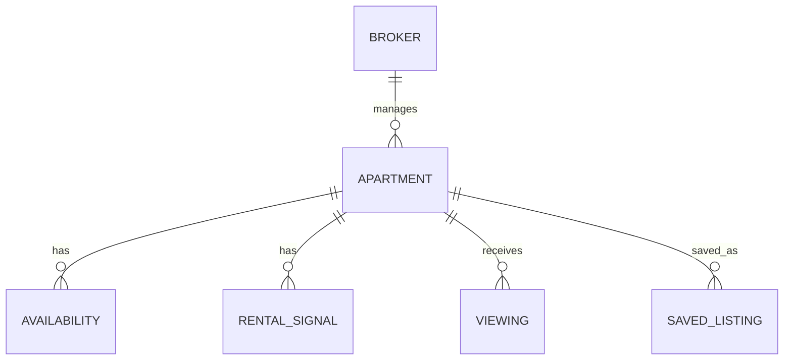

# MDE Rentals — Property Listings

**Purpose:** define the canonical rental listing contract used by search, cards, maps and broker workflows.

## Listing relationships

## Listing truth

A listing shown in MDE should have one canonical apartment identity used by:

- search results;
- rental cards;
- map pins;
- detail pages;
- viewing requests;
- broker views.

Inactive, stale, unauthorized or invalid listings must not proceed to a viewing request.
