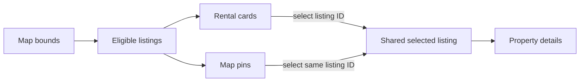

# MDE Rentals — Map & Neighborhood

**Purpose:** define how rental cards, map pins and location context stay synchronized.

## Map interaction

## Rules

- Card and pin selection must resolve to the same canonical apartment ID.
- Map bounds may refine search, but cannot bypass hard eligibility rules.
- Location enrichment must not create a second source of listing truth.
