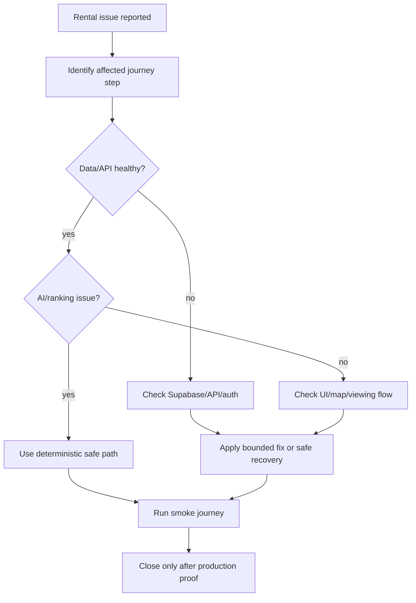

# MDE Rentals — Production Support

**Purpose:** provide a simple diagnosis and recovery path when the rental journey fails in production.

## Incident flow

## Production rules

- Never substitute mock inventory for live data without an explicit demo label.
- Consequential writes fail closed when authorization or transaction proof is unavailable.
- Recovery ends with a renter + broker smoke test.
