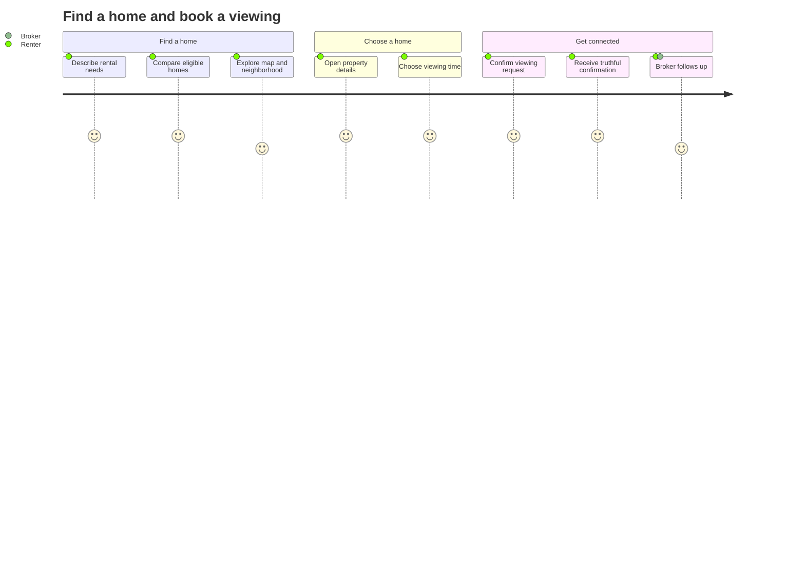
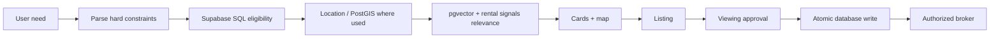

# MDE Rentals / Real Estate

**Purpose:** canonical product and architecture document for the MDE rental journey.

This document explains what exists now, what Core/MVP should become, what MDE keeps, what patterns it adapts from references, and what is intentionally deferred.

Live task status belongs in Linear. Merged code and Supabase remain implementation/data truth.

---

## Task 1 · Product goal

MDE Rentals should let a person describe what they need in normal language, see trustworthy matching apartments on cards and a map, inspect a listing, request a viewing, and hand that committed request to the correct broker/owner.

The MVP is successful when this simple loop is reliable:

```text
need
→ valid listings
→ compare
→ map
→ listing
→ viewing request
→ broker follow-up
```

Do not make the MVP depend on an autonomous real-estate agent platform.

### Renter journey diagram




---

## Task 2 · Core user journeys

### J-RE-01 · Find a rental

**User:** renter / visitor / digital nomad.

**Example:**

> “I need a furnished 2-bedroom apartment in Laureles under COP 5M for October.”

**Expected flow:**

```text
intent
→ hard constraints
→ Supabase eligible listings
→ location/relevance ranking
→ rental cards + map
→ refine
```

**Important:** budget, bedrooms, dates, active status, ownership and authorization are not AI guesses.

---

### J-RE-02 · Inspect a listing

```text
select card or pin
→ load canonical apartment
→ see price / bedrooms / amenities / availability / location
→ save or request viewing
```

A card and a map pin must identify the same canonical apartment.

---

### J-RE-03 · Request a viewing

**Example:**

> “I want to see this Saturday at 2 PM.”

**Expected flow:**

```text
selected listing
→ choose time
→ explicit confirmation
→ server authorization
→ atomic database commit
→ truthful confirmation
```

MDE already has an atomic-tour RPC foundation (`p1_schedule_tour_atomic`). The product path must use one proven atomic write path rather than separate best-effort lead/showing writes.

---

### J-RE-04 · Broker receives the committed request

```text
committed lead/showing
→ ownership/RLS check
→ authorized broker workspace
→ follow-up/status
```

Broker B must never see Broker A's private lead merely because both use the same application.

---

### J-RE-05 · Save and resume

A user should eventually be able to save listings/preferences and return without losing authorized context.

For MVP, do not expand this into advanced observational memory until identity and durability are proven.

---

### J-RE-06 · Failure/recovery

The product needs explicit behavior for:

- Supabase unavailable;
- embedding/model failure;
- rate-limit failure;
- inactive/stale listing;
- duplicate viewing submission;
- ownership mismatch;
- interrupted request;
- no matching listings.

A failure must not become a fake success.

---

## Task 3 · Current MDE foundation — KEEP

Current MDE already has substantial rental infrastructure.

### Consumer routes / UI

- `/rentals` browse route: `src/app/rentals/page.tsx`
- existing rental browse components under `src/components/rentals/`
- rental data-to-map conversion and verification

### AI / search

- `src/mastra/agents/rental-agent.ts`
- `src/mastra/tools/search-rentals.ts`
- `src/mastra/lib/rental-search-engine.ts`
- intelligent/hybrid search path plus structured search fallback

### Backend / data

- Supabase `apartments` as the current rental inventory source
- active-status filtering
- neighborhood, bedroom, price and date filtering
- rental signals/embedding infrastructure where currently verified
- `p1_schedule_tour_atomic` database function foundation

### Broker surfaces

Current route tree includes:

```text
/host/rentals
/host/rentals/dashboard
/host/rentals/listings
/host/rentals/onboarding
```

### Core principle

Do not replace these foundations just because an external repo implements the same idea differently.

---

## Task 4 · Core search architecture

Use one simple rule:

> **SQL decides what is eligible. AI decides what is relevant among eligible listings.**

### Why

Suppose the user says:

> “2 bedrooms, under COP 5M, available October 1.”

A language model should not decide whether COP 5.5M is “close enough.”

The database should remove it before ranking.

### Core/MVP flow



### Hard constraints

Keep deterministic:

- active listing status;
- price/budget;
- bedroom count;
- availability dates;
- exact apartment identity;
- ownership;
- authorization;
- counts/aggregates;
- transaction/idempotency rules.

### Soft relevance

AI/vector/signals may help rank:

- quiet vs nightlife;
- remote-work fit;
- family fit;
- walkability preference;
- amenity preference;
- explanation of why one valid option fits better.

---

## Task 5 · Reference adaptations for MVP

See [`REFERENCES.md`](./REFERENCES.md) and [`REUSE-MATRIX.md`](./REUSE-MATRIX.md) for full details.

### 5.1 Dubai Real Estate → deterministic filtering boundary

Reference:
https://github.com/nazsats/dubai-real-estate

**Adapt:** the idea that SQL owns factual/numeric filtering before RAG/AI reasoning.

**MDE example:**

> User wants “2BR under COP 5M.” Supabase produces only valid candidates. AI ranks/explains those candidates.

**Keep MDE-native:** Supabase, current search tool, current schema, current auth.

---

### 5.2 HomeRecoEngine → hybrid ranking sequence

Reference:
https://github.com/yuehong136/HomeRecoEngine

**Adapt:** combine structured filters + location + semantic ranking.

**MDE example:**

> “Quiet near cafés but away from nightlife.”

SQL handles hard limits, location logic handles distance, and semantic/rental signals order the valid set.

**Keep MDE-native:** one Supabase-backed search system; no second search database.

---

### 5.3 CopilotKit Mastra Canvas → shared rental UI state

Reference:
https://github.com/CopilotKit/CopilotKit/tree/main/examples/canvas/mastra

**Adapt:** bidirectional state pattern.

**MDE example:**

> User says “only Laureles.” Cards change, pins change, and the agent sees the same filter/selection.

**Keep MDE-native:** existing runtime, auth, routes and components.

---

### 5.4 CopilotKit Generative UI → typed rental results

Reference:
https://github.com/CopilotKit/CopilotKit/tree/main/examples/showcases/generative-ui

**Adapt:** structured AI results rendered by fixed components.

**MDE example:**

> Agent finds three listings → MDE renders three `RentalCard`-style results → user selects one.

Do not let generated UI itself authorize a write.

---

### 5.5 Real Estate AI Chatbot → qualification + broker handoff

Reference:
https://github.com/JoaoVitorCarvalhoPR/real-estate-ai-chatbot

**Adapt:** conversational qualification leading to a human handoff.

**MDE example:**

> User confirms listing, date and contact intent → MDE commits the viewing once → authorized broker gets the lead/showing.

**Keep MDE-native:** RLS, ownership, atomic RPC, broker routes.

---

### 5.6 HomeMatch → lifestyle ranking

Reference:
https://github.com/GretaGalliani/HomeMatch

**Adapt:** extract soft preferences for ranking.

**MDE example:**

> “Quiet, strong Wi-Fi, walkable, no steep hills.”

These preferences order the valid candidates; they do not override price/date/bedroom requirements.

---

## Task 6 · Current gaps / blockers

### 6.1 Mock fallback can misrepresent production truth

Current `search-rentals.ts` falls back to demo data after Supabase failure.

That is fine for local/offline development.

It is unsafe if production presents demo listings as current inventory.

**Target:** production degrades honestly; mock/demo data is clearly isolated from live production truth.

### 6.2 Rental agent truth wording is stale

The current rental-agent prompt says “Mock data is the only truth,” while the actual tool queries Supabase first.

**Target:** agent instructions and runtime data contract must agree.

### 6.3 Search correctness before more AI

Hard filters must be proven before expanding semantic intelligence.

### 6.4 Viewing must use one atomic committed path

A success message is only truthful after the database transaction succeeds.

### 6.5 Ownership/RLS must be proven before broker automation

Landlord/broker ownership and two-user negative tests are prerequisites for more autonomous broker behavior.

### 6.6 Identity/memory isolation must be proven before advanced memory

Do not make rental personalization depend on observational memory until the platform identity/durability work is green.

---

## Task 7 · Core vs MVP vs Advanced

### Core

Build/prove only:

- canonical apartment inventory;
- ownership/RLS;
- SQL hard filters;
- rental browse/detail;
- cards + map consistency;
- atomic viewing request;
- authorized broker visibility;
- truthful degraded states.

### MVP

Add only when Core is reliable:

- semantic/pgvector ranking after hard filters;
- simple lifestyle preferences;
- structured AI rental cards/comparison;
- simple lead qualification;
- save/resume where identity is safe;
- end-to-end production proof.

### Advanced / deferred

Not required for Core/MVP:

- multi-agent swarms;
- A2A;
- MCP;
- browser agents;
- deep research loops;
- autonomous broker agents;
- schedules/background agents;
- observational memory;
- automated market valuation;
- complex RAG pipelines.

These may be useful later. They are not reasons to delay the basic renter journey.

---

## Task 8 · Target MVP architecture

```text
Next.js rental UI
        ↓
CopilotKit shared application state
        ↓
Rental agent / deterministic fast path
        ↓
search-rentals
        ↓
Supabase hard filters
        ↓
optional geo/vector/signal ranking
        ↓
typed rental results
        ↓
cards + map
        ↓
explicit viewing confirmation
        ↓
server authorization
        ↓
atomic RPC
        ↓
authorized broker workspace
```

One database truth. One rental search contract. One committed viewing path.

---

## Task 9 · Failure behavior

| Failure | Correct MVP behavior |
|---|---|
| Supabase unavailable | Show unavailable/degraded state; do not silently claim demo inventory is live |
| Embedding/model unavailable | Fall back to deterministic search/ranking where possible |
| No results | Explain which constraint caused the narrow result and allow user-controlled relaxation |
| Duplicate viewing submit | Return the existing/idempotent result or deterministic conflict; do not create duplicates |
| Inactive listing | Reject viewing request |
| Wrong broker/owner | Deny access |
| Rate limiter fails on consequential write | Fail closed |
| AI unavailable | Keep deterministic browse/detail/viewing paths usable where possible |

---

## Task 10 · Production proof

Core/MVP is not done because a unit test passes.

Required proof ladder:

1. **Search tests** — price/bedrooms/dates/status stay hard constraints.
2. **Ranking tests** — semantic ranking never reintroduces an ineligible listing.
3. **Map/card tests** — selected pin/card refer to the same apartment.
4. **RLS A/B tests** — Broker A and Broker B cannot cross-read private records.
5. **Viewing transaction tests** — duplicate/concurrent submission cannot create inconsistent lead/showing state.
6. **Playwright renter journey** — search → listing → viewing request.
7. **Broker journey** — committed request appears for the authorized broker.
8. **Failure path** — Supabase/model failures are honest and recoverable.
9. **Production smoke** — run against the real deployed candidate before declaring production-ready.

---

## Task 11 · Success criteria

The MVP is successful when a real user can:

```text
describe a need
→ receive only eligible real listings
→ understand why results fit
→ use cards and map consistently
→ open the correct listing
→ request a viewing exactly once
→ receive truthful confirmation
→ have the request visible only to the correct broker/owner
```

And when a service failure does not turn demo/mock data into fake production truth.

---

## Task 12 · Related planning sources

- MDE repository: https://github.com/amoai-tech/mdeai
- Rental reference index: [`REFERENCES.md`](./REFERENCES.md)
- Rental reuse decisions: [`REUSE-MATRIX.md`](./REUSE-MATRIX.md)
- MDE Agent Platform PRD: https://linear.app/amo100/document/mde-agent-platform-prd-2d1bd0e59dbc
- MDE Agent Platform Roadmap: https://linear.app/amo100/document/mde-agent-platform-roadmap-886de8dab1ad
- MDE Reference Reuse Matrix: https://linear.app/amo100/document/mde-reference-reuse-matrix-883571644ed8
- MDE Agent Platform Migration Plan: https://linear.app/amo100/document/mde-agent-platform-migration-plan-5c76cd7d8032
- MDE Rentals & Real Estate PRD + Roadmap: https://linear.app/amo100/document/mde-ai-rentals-and-real-estate-prd-roadmap-7881940afa3a
