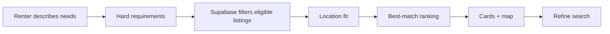
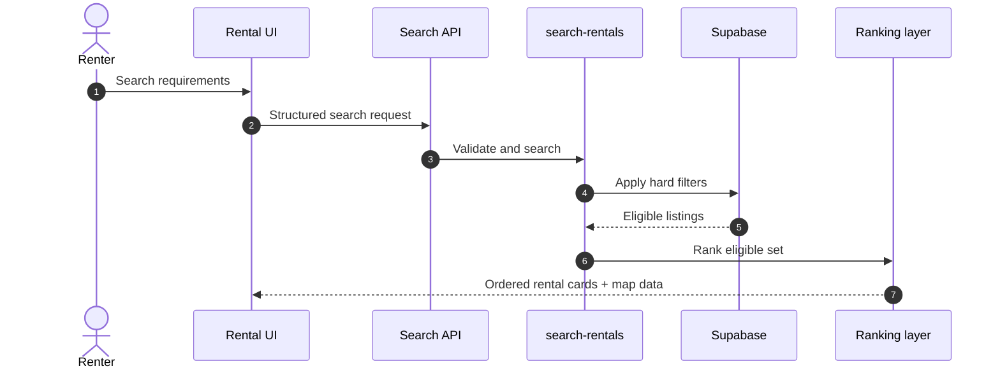

# MDE Rentals — Finding a Home

**Purpose:** define how renters search for eligible homes and how MDE ranks the valid results.

## Search flow

## Request sequence

## Rules

- Price, bedrooms, active status, dates, ownership and authorization are deterministic constraints.
- AI may rank or explain eligible listings; it must not reintroduce ineligible listings.
- Production search must not silently present demo inventory as live inventory.
