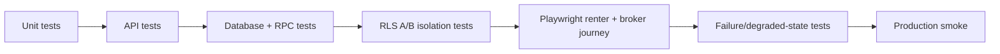

# MDE Rentals — Testing the Rental Journey

**Purpose:** define the proof ladder required before the rental journey is production-ready.

## Test path

## Core journeys

1. Search returns only eligible listings.
2. Cards and map resolve to the same apartment.
3. Viewing confirmation happens only after atomic commit.
4. Correct broker sees the committed request.
5. Wrong broker/user cannot read private data.
6. Supabase/model failure is honest and recoverable.

Production-ready means the full ladder passes against the deployed candidate, not only unit tests.
