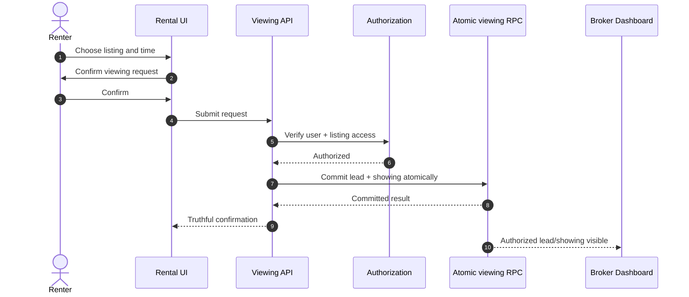
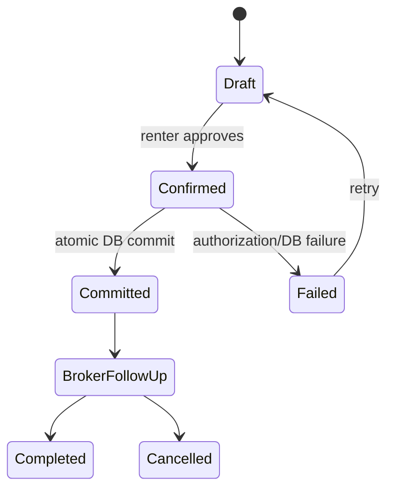

# MDE Rentals — Book a Viewing

**Purpose:** define the renter-to-broker viewing request path.

## Viewing request sequence

## Viewing state

## Rules

- A success message appears only after the database commit succeeds.
- Duplicate/concurrent submissions must not create inconsistent records.
- Only the authorized broker/owner can see the committed request.
