# MDE Rentals / Real Estate — Verified Audit, PRD and Roadmap

> **Read this first.** Every claim in this document was verified against current `main`, the live
> site, or the live Supabase catalogue on 2026-09-20. Where a claim could not be verified it is
> labelled **Unverified**. Section §21 lists confirmed defects with exact file/line/object
> citations. The central framing is **built vs production-trustworthy**, not built vs missing.
>
> **Correction notice (rev 3.2).** The first Linear sweep was scoped by label
> (`REAL_ESTATE` ∪ `RENTV2`) and **missed 13 completed rental tasks that carry neither label**,
> which caused this document to under-credit shipped work. §19A reconciles all 13 against code, git
> history, the live catalogue **and their Linear bodies**; §21 carries three correction notes
> (D1a, D4a, D13a) plus one rewritten finding (D13) and one new defect (D18); §23.5–23.6 correct the
> SAN-409/SAN-486 and SAN-348 relationships; §23.8 lists the 20 ownership overlaps the epic graph
> hides; §27 is revised upward. **No finding was retracted** — the defect set stands; its
> *severity distribution*, the *credit for completed work*, and *who owns what* all changed.
>
> Three characterizations were corrected twice (first under-credited, then over-credited) as
> stronger evidence arrived: SAN-381 does **not** seed apartments or signals; SAN-486 **is** a
> duplicate/successor of SAN-409 rather than a separate scope; and SAN-1333 fixed the *cause* of the
> mock fallback, not the fallback. Where this document's code/git evidence and a Linear body
> disagree, the code is treated as authoritative and the Linear text is flagged.
>
> **Correction notice (rev 3.3).** An external forensic review of PR #112 disproved **one claim this
> audit made**: that malformed viewing times were rejected. Out-of-range *clock* components were in
> fact silently accepted (`10:99` → `11:39`). Recorded as **D19**, **fixed** in `c29d124f7`, and
> retracted explicitly in §33.1 — this is the first finding in this document whose correction came
> from outside, and it was corrected because the claim was *reasoned* rather than *executed*. §33
> also records the bot-finding calibration (3 confirmed / 1 false), corrects an over-strong statement
> that SAN-386 is *literally* blocked on SAN-1305 (§33.3), and records the independent scores as a
> cross-check rather than merging them (§33.4).
>
> **Pattern worth naming:** both the rev 3.2 and rev 3.3 corrections share a cause — a claim was
> accepted because the surrounding tests were green. `10:99` passed a 52-test suite. Under-crediting
> 13 tasks and over-crediting validation coverage are the same failure mode: trusting a proxy
> (labels, green tests) instead of executing the check.

---

## §0 · Verified current state (summary)

| Axis | Verified state |
|---|---|
| UI surface | **Large and largely complete** — 31 pages, 24 component domains, 72 E2E specs |
| Broker product | **Fully built** — dashboard, listings, onboarding wizard, publish FSM, 24 lib files |
| Backend | Present but **split-write** on the conversion path |
| Database | Healthy schema, strong RLS coverage, but **44/44 active apartments unowned** |
| Authorization | Policies exist and are correctly written; **not proven A/B against live data** |
| AI truthfulness | **3 confirmed untruths** in prompts/tools |
| Tests | 255 files / 1452 tests; broad but **miss the exact production failure modes** |
| Live production proof | **Absent** — no certified end-to-end journey |
| Linear reality | 219 unique `REAL_ESTATE`/`RENTV2` issues · 96 children of SAN-1315 · **every critical-path acceptance box unchecked** · 4 conflicting readiness figures |
| Off-label completed work | **13 tasks** shipped rental work with neither label (SAN-1333, SAN-478, SAN-381, SAN-348, SAN-545, SAN-242, SAN-409, SAN-433, SAN-243, SAN-347, SAN-349, SAN-327, SAN-331) — reconciled in §19A |
| Confirmed defects | **20** (D1–D20, §21) with exact file/object citations, plus 4 correction notes and 1 rewritten finding. **D19** came from external review and disproved a claim this audit made (§33.1); **D20** was a verified auth-open AI surface (§38.1), **now fixed in PR #122** |
| **Production readiness** | **≈35%** (see §27, and its reconciliation with the forensic audit's ~53%) — **D20 has since been fixed (PR #122); recompute before reuse** |

**The one-sentence diagnosis:** the rental product is *built, wired, and not yet provably truthful.*

---

## §1 · Executive summary

MDE has shipped a real rental marketplace: renter discovery (`/rentals`, `/rentals/[id]`), map sync,
an AI concierge (CopilotKit + Mastra), Supabase inventory with pgvector hybrid search, a viewing
request flow, and a complete broker workspace with onboarding and a publication state machine.

The gap is not feature coverage. The gap is that **the system can tell a user something that is not
true**, and nothing currently proves otherwise:

1. Five apartments whose availability ended in **2025** render as bookable on the live site today (2026-09-20).
2. The AI search path can return a listing that violates the user's explicit price/bedroom constraint.
3. If Supabase fails, the site silently serves **fabricated inventory**.
4. A viewing request can be reported as successful when only half of it was committed.
5. The rental agent's own system prompt asserts that **mock data is the source of truth**.
6. The entire broker publish path **cannot succeed in production** because no apartment has an owner.
7. The rate limiter guarding anonymous lead capture **fails open** on any database error.
8. Every signed-out visitor shares **one** Mastra memory resource, so per-visitor memory isolation is
   not established.

These are trust defects, not missing features. Fixing them is cheaper than building anything new,
and it is the difference between a demo and a product.

**Recommended posture:** freeze new rental feature work. Land the trust floor (atomic write, canonical
eligibility, honest failure, ownership) on the existing architecture. Then resume feature work on a
foundation that can be certified.

---

## §2 · Problem statement

MDE Rentals exhibits a consistent pattern: **each layer was built to work in the happy path, and no
layer was built to fail closed.**

| Layer | Happy path | Failure behaviour | Consequence |
|---|---|---|---|
| Search (structured) | Filters apply correctly | No date eligibility → expired rows pass | User sees unavailable homes |
| Search (semantic) | Ranking is relevant | Hard filters never applied → ineligible results | AI ignores stated constraints |
| Data access | Supabase returns rows | Falls back to hard-coded demo array | Site fabricates inventory |
| Mutations | Lead + showing both insert | Second write fails → best-effort delete, UI already succeeded | User believes a viewing exists |
| Broker publishing | Ownership check works | No apartment has an owner → every publish raises | Broker product is dead |
| Agent prompts | Concierge correctly says "tool results are the only truth" | Rental agent still says "mock data is the only truth" | Agent may present demo data as real |

The problem to solve is therefore: **make every rental boundary fail closed, and prove it.**

---

## §3 · Target users

| Persona | Goal | Current experience | Trust risk |
|---|---|---|---|
| **Camila — relocating renter** | Find a furnished long-stay apartment in Medellín, see it, move in | Works until a filtered/expired/fabricated listing appears | High — will abandon on first false listing |
| **Andrés — owning broker / landlord** | Publish listings, receive and answer viewing requests | Cannot publish at all (no ownership); no committed lead reaches him | Critical — product unusable |
| **Ana — unrelated broker** | See only her own portfolio | RLS policies exist and would deny correctly | Must be *proven*, not assumed |
| **Lucía — MDE operator** | Keep inventory truthful, track readiness | No freshness/eligibility gate; no ownership backfill | Medium |
| **AI concierge (system actor)** | Rank eligible inventory and surface viewing links | Can bypass constraints, may claim demo data is real | Critical |

---

## §4 · Directory structure / routes

```
src/
  app/          Next.js App Router — 31 pages, 25 API route handlers
  components/   24 domains (rentals, host/rentals, chat, maps, cards, browse, modals, ui, …)
  hooks/        shared React hooks
  lib/          domain logic — rentals (24 files), leads (4), auth, browse, supabase, venues, …
  mastra/       agents (10) · tools (16) · workflows (5) · lib (32) · scorers · copilotkit
  platform/     maps (context/config/pin contracts) · copilot (tool-action names, rich cards) · contracts
  proxy.ts      middleware/proxy entry
e2e/            72 Playwright specs + helpers
supabase/
  migrations/   119 SQL migrations
  functions/    5 Edge Functions (approval-commit, chat-lead-capture, ticket-checkout, ticket-payment-webhook, _shared)
  tests/        10 pgTAP suites
  seeds/        partners, venues, events
```

**Rental-relevant routes**

| Route | Purpose | Data | Status |
|---|---|---|---|
| `/rentals` | Renter browse: cards + filters + map | `searchRentals()` → `apartments` | 🟡 works, not truthful |
| `/rentals/[id]` | Renter detail + schedule CTA | `getRentalDetail()` → `apartments` | 🟢 works, honest about missing data |
| `/host/rentals` | Broker workspace shell | broker context | 🟡 307 auth-gated |
| `/host/rentals/dashboard` | Broker overview KPIs | `fetch-broker-dashboard()` | 🟡 built, data-unusable |
| `/host/rentals/listings` | Broker inventory grid/map/drawer | `fetch-broker-listings()` + `filter-owned-broker-listings` | 🟡 built, data-unusable |
| `/host/rentals/onboarding` | Broker onboarding wizard | `create_broker_onboarding_draft` RPC | 🟢 built + E2E covered |
| `/partners/rentals` | Partner/rental landing | static + partner data | 🟢 live |

**Rental-relevant API routes**

| Route | Purpose |
|---|---|
| `POST /api/rentals/search` | Fast-path rental search (rate-limited, `searchRentals`) |
| `POST /api/leads/schedule-viewing` | Canonical viewing request boundary |
| `POST /api/host/rentals/listings/publish` | Broker publish transition |
| `GET  /api/host/rentals/listings/[id]/detail` | Broker listing detail |
| `POST /api/copilotkit/[[...path]]` | CopilotKit runtime (all chat) |

---

## §5 · Core features (built)

| # | Feature | Where | Truth status |
|---|---|---|---|
| C1 | Rental browse with neighborhood/beds/price filters | `rentals/page.tsx`, `rental-browse-filters.tsx` | 🟡 filters work; no availability rule |
| C2 | Rental cards | `rental-browse-card.tsx` | 🟢 |
| C3 | Rental detail page | `rentals/[id]/page.tsx`, `rental-detail-view.tsx` | 🟢 renders `Data pending` rather than faking |
| C4 | Map shell + card/pin sync | `platform/maps`, `use-browse-map-sync` | 🟢 |
| C5 | Availability calendar widget | `rental-availability-calendar.tsx` | 🟢 UI only |
| C6 | Schedule viewing modal | `schedule-viewing-modal.tsx` | 🟢 contract fixed (PR #112) |
| C7 | Lead + showing capture | route → `chat-lead-capture` Edge → bridge | 🟥 split write |
| C8 | Broker onboarding wizard | `rentals-onboarding-wizard.tsx` | 🟢 |
| C9 | Broker listing inventory (grid/map/drawer) | `src/components/host/rentals/*` | 🟡 built, unusable data |
| C10 | Listing publish FSM | `publish-transition-mapper`, `publish_listing` RPC | 🟥 blocked by unowned inventory |
| C11 | Broker dashboard KPIs | `build-broker-dashboard-view.ts` | 🟡 |
| C12 | RLS for renter/broker/admin | `leads`, `showings`, `apartments` policies | 🟡 written, unproven A/B |

---

## §6 · Advanced / AI features (built)

| # | Feature | Where | Status |
|---|---|---|---|
| A1 | Rental agent (working memory, clarification gate) | `agents/rental-agent.ts` | 🟡 prompt contains false claim |
| A2 | Concierge + intent router | `agents/concierge.ts`, `router.ts`, `search-intent-router.ts` | 🟢 |
| A3 | Rental search tool | `tools/search-rentals.ts` | 🟡 mock fallback |
| A4 | Hybrid semantic + FTS search | `intelligence-rental-search.ts` + `hybrid_search_listings` | 🟥 bypasses hard filters |
| A5 | Rental signals ranking | `rental_signals` (44 rows) | 🟢 |
| A6 | Neighborhood intelligence | `neighborhoods`, `neighborhood_profiles` | 🟢 |
| A7 | pgvector embeddings | `listing_embeddings` (44 rows), HNSW index | 🟢 |
| A8 | Rental search workflow | `workflows/rental-search-workflow.ts` | 🟢 |
| A9 | CopilotKit v2 bridge + rich cards | `copilotkit/logging-mastra-agent.ts`, `platform/copilot/rich-card-results.ts` | 🟢 |
| A10 | Mastra memory (three-level durability) | `mastra_threads`, `mastra_messages` | 🟥 unproven restart |
| A11 | Grounding + Maps grounding | `search-grounded-places.ts`, `grounding_quota_log` | 🟢 |
| A12 | Tool audit trail | `run-audited-search.ts`, `ai_runs`, `search_logs` | 🟢 |

---

## §7 · Use cases — three real-world examples per major feature

### 7.1 Rental discovery

1. **Camila, remote worker.** *"Furnished 2BR in Laureles under $80/night for November."* Expects only
   real, currently-available inventory. **Today:** works for price/bedrooms, but expired 2025 rows can
   appear because no date eligibility rule exists.
2. **Diego, family of four.** *"3BR in Envigado, quiet, near parks."* Expects semantic ranking
   (quiet, family) to reorder *eligible* homes. **Today:** the semantic branch can return a 1BR above
   his budget — semantic ranking is not constrained by his hard filters.
3. **Ana, budget student.** *"Cheapest studio in Centro."* Expects a truthful empty state if nothing
   matches. **Today:** the neighborhood post-filter falls back to *unfiltered* results when its filter
   yields zero, so she may be shown other neighborhoods.

### 7.2 Viewing request

1. **Camila** picks *next Tuesday 3pm* (Medellín time), submits once. Expects acknowledgement only if
   something was actually recorded. **Today:** fixed in PR #112 — success requires both committed IDs.
2. **Camila on a flaky connection** taps submit twice. Expects one viewing, not two. **Today:** the
   modal has a submit lock, but the Edge path's only guest dedupe is a read-then-write check, so a race
   can still double-write.
3. **Camila's request must reach the owner.** Expects the owning broker to see it and nobody else to.
   **Today:** no apartment has an owner, so no broker can ever be shown it.

### 7.3 Broker publishing

1. **Andrés onboards** as a broker. Works — `create_broker_onboarding_draft` succeeds.
2. **Andrés publishes a listing.** Expects it to go live. **Today:** `transition_listing_workflow`
   raises `broker does not own this apartment` because `landlord_id IS NULL` on all 44 active rows.
3. **Andrés views his dashboard.** Expects only his listings. RLS would enforce this correctly — but
   there are no owned listings to display, so the screen is empty and unproven.

### 7.4 AI concierge

1. **Camila asks in chat**, gets up to 5 grounded cards with viewing links. Works.
2. **Camila asks a follow-up** ("show cheaper"). Working memory (`lastQuery`) refines rather than resets.
3. **A malicious listing description** tries to make the agent act outside its authority. Expects the
   tool/data boundary to hold. **Unproven** — the adversarial matrix is not executed.

---

## §8 · User stories

| ID | As a… | I want… | So that… | Status |
|---|---|---|---|---|
| US-1 | renter | to browse only currently-available apartments | I don't waste time on expired listings | 🟥 |
| US-2 | renter | my stated budget/bedrooms to be respected | the AI doesn't ignore my constraints | 🟥 |
| US-3 | renter | an honest "nothing found" | I trust the results | 🟥 |
| US-4 | renter | to request a future viewing time | the broker knows when to meet me | 🟢 PR #112 |
| US-5 | renter | to see confirmation only when it is real | I don't wait for a call that never comes | 🟢 PR #112 |
| US-6 | renter | one viewing per tap | I'm not double-booked | 🟡 |
| US-7 | broker | to onboard and publish listings | I can list my inventory | 🟥 |
| US-8 | broker | to see requests for my apartments only | my pipeline is private | 🟥 |
| US-9 | broker (other) | to be denied access to others' leads | tenant isolation holds | 🟥 |
| US-10 | operator | inventory freshness to be enforced | the catalogue stays truthful | 🟥 |
| US-11 | operator | the exact release candidate certified | I can promote safely | 🟥 |
| US-12 | renter | my conversation to survive a restart | I don't repeat myself | 🟥 |

---

## §9 · User journeys

**Renter (target)**
```
describe need → deterministic eligibility → semantic ranking of eligible only
→ cards + synced map → open property → pick future local time → confirm
→ ONE atomic authorized transaction → one lead + one showing
→ UI confirms only after both IDs exist
```

**Broker (target)**
```
onboard → own an apartment (landlord_id set) → draft → ready_for_review → published
→ receive committed lead + showing → respond
→ unrelated broker denied by RLS
```

**Operator (target)**
```
exact SHA + deployment → rerun canonical E2E → consume lower-level gate evidence
→ enforce measured budgets → one red drill → one evidence manifest → promote
```

---

## §10 · System + user workflows

| Workflow | Type | Entry | Steps | Truth status |
|---|---|---|---|---|
| `rental-search-workflow` | Mastra | tool/API | normalize → search → deterministic cards | 🟡 inherits search defects |
| Broker publish FSM | DB RPC | `/api/host/rentals/listings/publish` | `draft → ready_for_review → published/paused/rejected` guarded by `assert_listing_workflow_transition` | 🟥 blocked by ownership |
| Broker onboarding | RPC | `/host/rentals/onboarding` | create draft → wizard → activate | 🟢 |
| Viewing request | API → Edge → DB | modal | validate → resolve apartment → dedupe check → insert lead → insert showing | 🟥 split write |
| CopilotKit chat | AG-UI | `/api/copilotkit` | router → agent → tool → rich card → map pin | 🟢 |
| Embedding pipeline | DB trigger | `trigger_ai_embed` → `embedding_jobs` → `enqueue_embedding_job` | content → embed → `listing_embeddings` | 🟢 |

---

## §11 · Mermaid diagrams

### 11.1 Current architecture (as built)

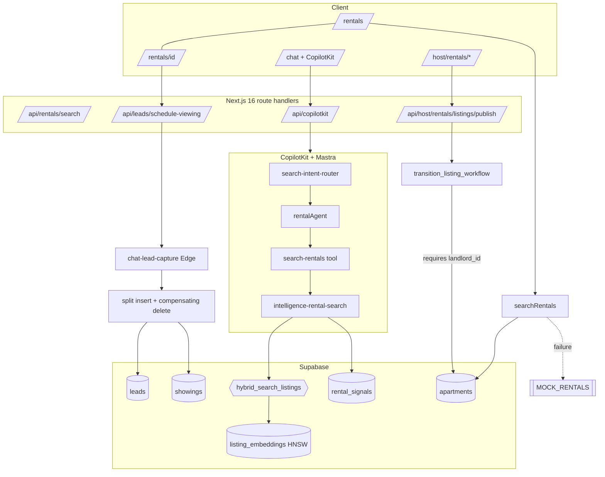

### 11.2 Renter journey (target vs today)

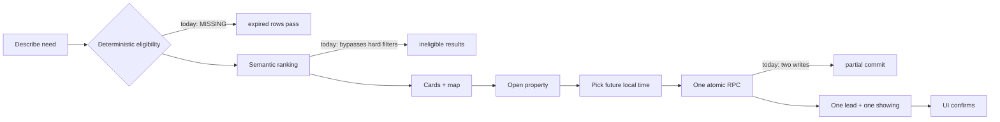

### 11.3 Broker journey

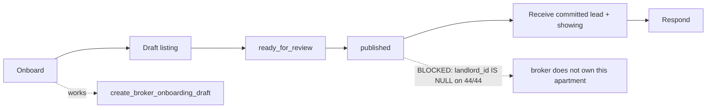

### 11.4 Viewing request sequence (today)

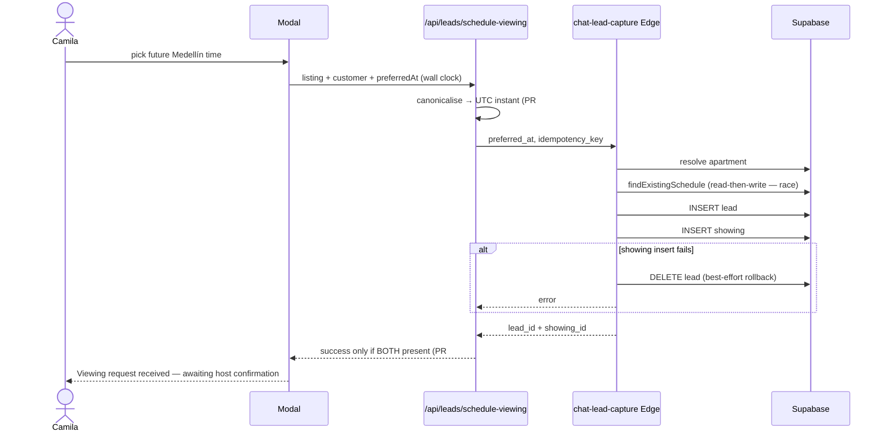

### 11.5 Task dependency roadmap

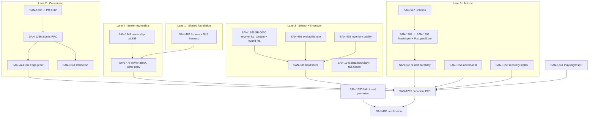

---

## §12 · Dashboard pages

| Screen | Purpose | Data shown | Actions | Agent | Workflow | Business logic |
|---|---|---|---|---|---|---|
| `/host/rentals/dashboard` | Broker portfolio overview | KPIs from `build-broker-dashboard-view` (`apartments`, `leads`, `showings` scoped by `acting_landlord_ids()`) | navigate to listings, open requests | rentals concierge | publish FSM | ownership-scoped rollups; 🟥 empty because 0 owned |
| `/host/rentals/listings` | Inventory management | `fetch-broker-listings` + `filter-owned-broker-listings` | draft, request review, publish, pause | rentals concierge | publish FSM | `assert_listing_workflow_transition`; 🟥 unusable |
| `/host/rentals/onboarding` | Broker activation | `partner_drafts`, `landlord_profiles` | wizard submit → `create_broker_onboarding_draft` | — | onboarding | 🟢 |
| `/admin/event-bookings` | Ops (non-rental) | event orders | review | — | — | 🟢 |
| `/host/dashboard` | Host (events) | events | manage | host-ops agent | — | 🟢 |

---

## §13 · Three-panel CopilotKit model

```
┌────────────────────┬──────────────────────────────┬─────────────────────────┐
│ LEFT = CONTEXT     │ MAIN = WORK                  │ RIGHT = INTELLIGENCE    │
├────────────────────┼──────────────────────────────┼─────────────────────────┤
│ Filters, saved     │ Rental cards + map + detail  │ Concierge chat, rich    │
│ searches, shortlist│ Schedule-viewing modal       │ cards, grounding,       │
│ Map layer toggles  │ Broker listing forms/wizard  │ reasoning, next actions │
├────────────────────┼──────────────────────────────┼─────────────────────────┤
│ rental-browse-     │ rental-browse-view,          │ /api/copilotkit,        │
│ filters,           │ rental-detail-view,          │ rentalAgent,            │
│ BrowseMapPanel,    │ schedule-viewing-modal,      │ search-rentals tool,    │
│ active-map-category│ onboarding wizard            │ rich-card-results       │
└────────────────────┴──────────────────────────────┴─────────────────────────┘
```
Status: 🟡 structurally present (browse + map + chat + modal all exist); panels are not a single
composed three-pane rental workspace — `/rentals` is card+map, chat is separate. **This is the largest
genuine UI gap** and the least urgent.

---

## §14 · Wizards

| Wizard | File | Steps | Status |
|---|---|---|---|
| Broker onboarding | `rentals-onboarding-wizard.tsx` + `broker-onboarding-validate.ts` | business → listing seed → activate | 🟢 E2E `san-1092-broker-onboarding` |
| Listing setup / publish | `listing-workflow.ts`, `listing-completeness.ts`, `publish-transition-mapper.ts` | draft → completeness → ready_for_review → published | 🟡 built; 🟥 blocked by ownership |
| Viewing request | `schedule-viewing-modal.tsx` | name/email/phone → future time → submit | 🟢 PR #112 |
| Event wizard (non-rental) | `SCREEN-016-host-wizard` | — | 🟢 |

---

## §15 · Chatbots / CopilotKit

| Surface | Entry | Agent | Tools | Context | Actions |
|---|---|---|---|---|---|
| Concierge chat | `/chat`, `ConciergeDock` | `concierge` → `router` → domain agent | all domain search tools | thread memory, working memory, filter chips | open detail, schedule viewing, add to trip, map pins |
| Rental concierge | `/rentals` chat, `/host/rentals/*` | `rentalAgent` | `search-rentals` | `lastQuery`, `lastResults`, `selectedListingId` | schedule viewing, compare, refine |
| Broker concierge | `rentals-concierge-shell.tsx` | `rentalAgent` | `search-rentals`, hostops read tools | broker context | publish, insights |

**Agent prompt truth audit (verified):**

| File | Line | Text | Verdict |
|---|---|---|---|
| `agents/concierge.ts` | 296 | "Tool results are the only truth — never invent…" | ✅ correct |
| `agents/rental-agent.ts` | 117 | "**Mock data is the only truth.** Never invent listings…" | 🟥 **false and dangerous** |
| `tools/search-rentals.ts` | 424 | tool description: "…falls back to demo data if DB is unavailable." | 🟡 documents the fallback honestly, but the fallback itself is unsafe in production |

---

## §16 · Data model

| Table | Rows (live) | RLS | Policies | Role |
|---|---|---|---|---|
| `apartments` | 49 (44 active) | ✅ | 6 | Canonical rental inventory |
| `landlord_profiles` | 5 | ✅ | 4 | Broker identity |
| `leads` | 17 (9 rental) | ✅ | 9 | CRM lead; renter + broker scoped |
| `showings` | 6 | ✅ | 5 | Viewing appointments |
| `rental_signals` | 44 | ✅ | 2 | Ranking signals |
| `listing_embeddings` | 44 | ✅ | 6 | pgvector (HNSW, cosine) |
| `neighborhoods` / `neighborhood_profiles` | 13 / 8 | ✅ | 5 / 2 | Neighborhood intelligence |
| `rental_applications` | 0 | ✅ | 5 | Post-viewing |
| `rental_freshness_log`, `rental_listing_images`, `rental_listing_sources`, `rental_search_sessions` | 0 | ✅ | 3–5 | Supporting |
| `partner_*`, `verification_requests`, `property_verifications` | 0–9 | ✅ | 3–5 | Onboarding/verification |

**Ownership chain (canonical):** `landlord_profiles.id → apartments.landlord_id → acting_landlord_ids() → RLS`.
**Verified defect:** all 44 active apartments have `landlord_id IS NULL` **and** `host_id IS NULL`.

**RLS on `apartments` (live, verified):**
```sql
anyone_can_view_active_apartments  SELECT public      USING (status IN ('active','featured'))
apartments_select_admin            SELECT authenticated USING (is_admin())
apartments_select_broker_or_catalog SELECT authenticated USING (landlord_id IN acting_landlord_ids() OR status IN ('active','booked') OR is_admin())
apartments_insert_broker           INSERT authenticated
apartments_update_broker           UPDATE authenticated USING (landlord_id IN acting_landlord_ids() OR is_admin())
service_role_full_access_apartments ALL   service_role
```

**Key RPCs**

| RPC | SECDEF | ACL (live) | Purpose |
|---|---|---|---|
| `p1_schedule_tour_atomic` | ✅ | `postgres`, `service_role` | **Atomic** lead+showing, idempotent. **Unused.** |
| `transition_listing_workflow` | ❌ | `postgres`, `service_role` | Ownership + FSM guarded transition |
| `publish_listing` / `request_listing_publish` | ✅ | +PUBLIC, `anon` | Thin wrappers; safe (inner auth check verified) |
| `broker_owns_apartment` | ❌ | +PUBLIC, `anon` | Ownership predicate |
| `hybrid_search_listings` | ❌ | +PUBLIC, `anon` | Semantic+FTS — **no hard filters** |
| `acting_landlord_ids` | ✅ | `authenticated` | Broker scope resolver |

---

## §17 · AI functions

| Component | Implementation | Truth status |
|---|---|---|
| Models | Gemini (`FLASH_MODEL` via `lib/models.ts`) | 🟢 |
| Agents | 10 (concierge, router, rental, event, host-event, host-ops, evaluation + prompt modules) | 🟡 one false prompt |
| Tools | 16, all wrapped by `run-audited-search` → `ai_runs`/`search_logs` | 🟢 |
| Workflows | 5 (`rental-search`, `event-discovery`, `event-venue-booking`, `sales-insight`) | 🟢 |
| pgvector | HNSW cosine, `listing_embeddings` (44) | 🟢 |
| Memory | `mastra_threads` (475), `mastra_messages` (1143), working memory schema | 🟥 restart-unproven |
| Grounding | Maps/Places grounding + daily quota (`grounding_quota_log`, `search_grounding_quota_log`) | 🟢 |
| Scorers / evals | `mastra_scorers`, `faithfulness-core`, `evaluation` agent | 🟡 not wired as a release gate |

---

## §18 · Supabase architecture, RLS, and migration parity

**Ledger parity:** ✅ clean — `docs/02-architecture/migration-drift.md` records 0 LIVE_ONLY / 0 REPO_ONLY
across 109 migrations as of 2026-09-17 (task MDE-SB-001).

**Object reproducibility parity:** 🟡 **not** clean. Comparing live non-extension `public` functions
against `CREATE FUNCTION` statements in `supabase/migrations/*.sql` (verified 2026-09-20):

| Category | Count | Detail |
|---|---|---|
| **LIVE-ONLY** | **9** | `hybrid_search_listings`, `hybrid_search_events`, `hybrid_search_restaurants` + 6 dead functions (`fn_audit_agent_run`, `fn_audit_agent_approval`, `fn_record_tool_call_start`, `fn_record_tool_call_end`, `fn_record_conversion`, `auto_create_landlord_inbox_from_message`) |
| **MIGRATION-ONLY** | **8** | `*_agent_job*` family — intentionally dropped by `20260918073010_san1313a_drop_dead_agent_jobs_functions.sql` |

Both sets are **documented and deliberate**: `20260917220000_sb002_recover_live_only_objects.sql`
explicitly quarantines the 6 dead functions (they write to tables dropped by
`20260524022749_mdeapp_canonical_schema_cleanup.sql`) and deliberately excludes the 3 hybrid
functions because they reference `apartments.fts_content`.

**Critical consequence for rentals:** `hybrid_search_listings` cannot be written into a migration
until `apartments.fts_content` is recovered. `20260918090603_san1304a_recover_missing_column_contracts.sql:62`
explicitly defers those columns to **SAN-1305 (SB-002C)**: *"These are not ordinary columns; restoring
them reactivates hybrid search."*

> **Therefore SAN-386 (hard filters in hybrid search) depends on SAN-1305.** Two graphs matter here
> and they disagree: **this document's lane graph shows the edge** (§11.5 — `SAN-1305 → SAN-386`),
> while the **SAN-1315 epic's own dependency graph does not** (§23.7).
>
> Per §33.3 the dependency is a prerequisite for the **chosen** architecture — a replay-safe
> extension of `hybrid_search_listings` — **not** for the invariant itself. SAN-386 can be made
> correct today by constraining the structured path, so the recommendation to land SAN-1305 first
> is a deliberate design choice rather than a hard block.

**Also verified:** `20260510000000_vdb01_hybrid_fts_search.sql` is an **audit record only**
("SQL applied directly via MCP; this file is the audit record") — it creates nothing on replay.

---

## §19 · Complete inventory (built vs trustworthy)

**Pages / routes**
🟢 `/`, `/chat`, `/rentals`, `/rentals/[id]`, `/events`, `/events/[slug]`, `/restaurants`, `/cafes`, `/nightlife`, `/venues`, `/partners`, `/partners/rentals`, `/partners/signup`, `/login`, `/signup`, `/saved`, `/trips`, `/trips/[id]`, `/business/ai`, `/sponsors`, `/me/tickets`, `/me/tickets/[id]`, `/admin/event-bookings`
🟢 (auth-gated) `/host`, `/host/dashboard`, `/host/events`, `/host/event/new`, `/host/analytics`, `/host/rentals/(broker)/dashboard`, `/host/rentals/(broker)/listings`, `/host/rentals/onboarding`
🟡 `/rentals` — renders 5 expired 2025 listings

**API routes** — all 25 🟢 structurally; `POST /api/leads/schedule-viewing` 🟢 truthful as of PR #112; `POST /api/host/rentals/listings/publish` 🟥 cannot succeed with current data.

**Agents** — 10 🟢 · **Tools** — 16 🟢 · **Workflows** — 5 🟢 · **Mastra lib** — 32 🟢

**Supabase** — 119 migrations · 5 Edge Functions · 10 pgTAP suites · 133 public tables · RLS on all
rental tables · 3 rental tables with data (`apartments` 49, `rental_signals` 44, `listing_embeddings` 44)

**Tests** — 255 Vitest files / 1452 tests · 72 Playwright specs · 3 Deno edge tests · 10 pgTAP suites

**CI** — `floor.yml` (PR + push: lint, typecheck, env, build, test, mastra, audit) · `supabase-acl.yml` ·
`live-integration.yml` (schedule) · `prod-synthetic-smoke.yml` (schedule) · `ci.yml` (legacy, manual)

---

## §19A · Completed rental work that carries no `REAL_ESTATE` label

> **Methodology correction.** This audit's first Linear sweep was scoped by label
> (`REAL_ESTATE` ∪ `RENTV2`). **Thirteen completed rental tasks carry neither label** and were
> therefore missed, which caused this document to under-credit work that already shipped. They have
> since been added to the *Real Estate (MDE)* view. Each is verified below against code, git history,
> and the live catalogue — not against status alone.

| Task | What actually shipped | Independently verified | Correction to this audit |
|---|---|---|---|
| **SAN-478** | `/rentals` browse page: filter chips, card grid, nav link, redesign | `rentals/page.tsx` carries `REAL-011 / SAN-478`; commits `dce429268`, `4325e57d1` (PR #122) | UI was already credited; **now attributed** |
| **SAN-381** | `rental_signals` **table + RLS only** — its own body says "1 migration = rental_signals only" | `20260601120500_data043_rental_signals.sql` contains `CREATE TABLE` + RLS and **no `INSERT`**; `grep` finds no `INSERT INTO rental_signals` anywhere in the repo | ⚠️ **Correction:** SAN-381 did **not** seed the 44 apartments *or* seed `rental_signals` rows. The 44 apartments come from earlier seed work (`20260423130000_apartments_seed_enrichment.sql`, which backfills `host_name` and adds 10 listings and never sets `host_id`/`landlord_id`). Live counts (44 signals / 44 active apartments) are consistent but were not produced by this task |
| **SAN-348** (DATA-023) | Rental golden-query pack | `docs/_archive/…/data-023-rental-golden-queries.{json,sql}` — **6 JSON cases**, incl. negative `rental-005` ("10BR castle Medellín"). **Archived and unwired**: no script, test, npm script or workflow references `data-023` | Eval **data exists but is orphaned**. The only rental-touching runner is `smoke:golden-queries` (DATA-046) with just **2** rental cases |
| **SAN-409** (INT-006) | Rental availability **date filters**: `parseDateRange`, `checkIn`/`checkOut`, null-safe availability overlap filter, `sortForMonthlyStay` | commit `48ac166d3`; `src/lib/rental-query-parser.ts`; `src/lib/__tests__/rental-date-filter.test.ts` (12 tests). **Linear: 0/2 AC checked and no evidence attached — Done without proof** | **Major correction** — see §23.5 |
| **SAN-1333** (MDE-ENV-002) | Production `SUPABASE_URL` fix: shared resolver + bare-env-read regression test | `src/lib/supabase/server-env.ts`; `src/__tests__/supabase-url-env-contract.test.ts`; deployment `dpl_79QosuJ3…` = SHA `5c250c6a7`. **Linear: 0/7 AC.** Production logs showed **200×** `[search-rentals] Supabase query failed, falling back to mock: Supabase client unavailable` and **600×** `[search-logs] service role unavailable` | Sharpens D4: the mock fallback was **not hypothetical — it fired in production**. Root cause was 11 modules reading bare `process.env.SUPABASE_URL`. See D4a |
| **SAN-347** (DATA-020) | `leads.apartment_id` + `leads.preferred_showing_at` + indexes + backfill | `20260529235041_data020_leads_rental_fk_columns.sql` | Core conversion data model — was already credited |
| **SAN-349** | Lead → showing lifecycle bridge | `p1_schedule_tour_atomic`, `_shared/schedule-viewing-bridge.ts` | Foundation for SAN-1286 |
| **SAN-331** | Supabase rental indexes | `idx_apartments_rental_search`, `idx_apartments_rental_search_daily` (`…data009_apartments_price_daily_indexes.sql`), `idx_leads_intent_apartment` | Search index foundation — was already credited live |
| **SAN-327** | Rental live-schema vs PRD inventory | Basis for `docs/02-architecture/snapshots/*` | Data foundation |
| **SAN-545** | Rental embedding API 403 fix + hybrid embed telemetry + fast-path routing | commit `1c2d2f80d` (SAN-545, SAN-823) | Hybrid search works today because of this |
| **SAN-242** | Rental card polish + CTAs | `rental-browse-card.tsx` | UI credited |
| **SAN-243** | In-thread rental search | chat + `searchRentals` wiring | UI credited |
| **SAN-433** | Verify rental parser in production | `rental-query-parser` + `rental-date-filter.test.ts` | Parser credited |

**Consequences for this document**

1. **§19's inventory was incomplete.** The rental surface is *more* complete than stated. Readiness is
   revised upward in §27.
2. **SAN-486 is much smaller than it appeared** — SAN-409 already built the filter mechanism (§23.6).
3. **SAN-348 means SAN-386 must extend an existing eval pack**, not create one — exactly as SAN-386's
   own Task 16 requires.
4. **`SAN-1333` explains the mock-fallback trigger** without removing the fallback (D4).
5. **Nobody ever backfilled ownership.** The apartment seed work
   (`20260423130000_apartments_seed_enrichment.sql`) predates the ownership model
   (`20260617022503_ptr_rentals_broker_rls.sql`) and sets **0** `landlord_id`/`host_id` values — so
   D9/D10 are a *missing backfill when the ownership model landed*, not a seeding oversight.
   SAN-381 is unrelated to apartments entirely (§19A row 3).
6. **Done ≠ evidenced.** Within the 13: SAN-1333 is **0/7 AC**, SAN-409 is **0/2 AC with no attached
   evidence**, SAN-348 is 2/3, SAN-347 is 3/4, SAN-349 is 6/7; seven carry no AC checkboxes at all.
   The labelled 23 have **0** checked boxes in total. Status is not a proxy for proof anywhere in
   this domain.

**Remaining methodology risk:** a label-scoped sweep can still miss unlabelled work. The corrected
view is now the source; future audits should reconcile by *outcome* (git history + live objects), not
by label alone. Two related completed tasks (**SAN-823**, **SAN-1202**) already appeared in the epic's
Done set.

---

## §20 · Progress tracker

Percentages are evidence-weighted across seven independent axes:
**UI** · **Backend** · **DB** · **Authz** · **AI truth** · **Tests** · **Live proof**.

| # | Task Name | Description | Status | % | ✅ Confirmed | ⚠️ Missing / Failing | 💡 Next Action |
|---|---|---|---|---|---|---|---|
| 1 | SAN-1203 truthful viewing | Success only with both committed IDs | 🟡 | 96 | Contract, timezone, typed errors, **67 focused tests**, PR #112 @ `c29d124f7`; D19 fixed; 4/4 review threads resolved | Not merged; no live Edge proof | **Merge PR #112** |
| 2 | SAN-1286 atomic write | One atomic lead+showing | 🔵 | 20 | `p1_schedule_tour_atomic` exists & is atomic | Bridge split-writes; `idx_showings_lead_apt_day` missing live; guest idempotency unenforced | One migration + one RPC path |
| 3 | SAN-482 shared harness | Fixtures + auth states + RLS proof | 🔵 | 10 | Contract defined | No fixture, no storageState, no cleanup proof | Build once, reuse |
| 4 | SAN-386 hard filters | Eligibility before ranking | 🔵 | 30 | Structured path filters | Hybrid passes no bed/price/status; neighborhood fails open; RPC unreplayable | **Blocked by SAN-1305** |
| 5 | SAN-486 availability rule | One date eligibility contract | 🔵 | 20 | Columns + indexes exist | No default current/future rule; 5 expired rows live | Define rule, fail closed |
| 6 | SAN-1349 data boundary | No mock/fabricated inventory | 🔵 | 20 | Gap measured | `MOCK_RENTALS` fallback live; `source` ignored by UI | Fail closed in production |
| 7 | SAN-468 inventory quality | Authoritative stale-row repair | 🟥 | 25 | Owner identified | 5 stale active rows; 44/44 unowned | Repair + drift gate |
| 8 | SAN-474 real Edge proof | Deployed Edge + DB parity | 🔵 | 15 | Edge path exists | No replay/parity proof | After SAN-1286 |
| 9 | SAN-1044 attribution | Every lead has correct apartment | 🟡 | 55 | FK + index exist | 4/9 live rental leads NULL `apartment_id` | Backfill + guard |
| 10 | SAN-476 broker visibility | Owner allow + other deny | 🔵 | 20 | Correct RLS policies exist | 0 owned apartments; no A/B proof | Seed ownership, prove both ways |
| 11 | SAN-1341 Playwright split | PR vs production suites | 🟡 | 69 | Config + specs exist | Not enforced as selector | Close before SAN-1205 |
| 12 | SAN-1205 canonical E2E | One unmocked desktop+mobile journey | 🔵 | 15 | SCREEN-008/REAL-011 exist (mocked) | No unmocked journey; no p50/p95; no cleanup proof | Compose from 482+474+476 |
| 13 | SAN-547 isolation | User/data isolation proven | 🟡 | 60 | RLS + RequestContext exist | No real A/B identity proof | Run matrix |
| 14 | SAN-1054 adversarial | Prompt/tool/data leakage | 🟡 | 45 | Injection unit tests exist | No real tool/mutation adversarial matrix | Extend to real boundary |
| 15 | SAN-1302 Mastra pin | Certify package family | 🔵 | 10 | `check:mastra` green; pins recorded | Family not certified | Certify |
| 16 | SAN-1303 PostgresStore | Harden Mastra storage | 🔵 | 10 | 32 `mastra_*` tables, RLS on | Hardening unproven | After SAN-1302 |
| 17 | SAN-548 restart durability | L1→L2→L3 proof | 🟥 | 65 | Durability test exists (skipped) | Never executed | Run levels |
| 18 | SAN-1059 recovery matrix | Deterministic failure rows | 🔵 | 20 | Recovery lib + tests exist | Not run against atomic path | After SAN-1286 |
| 19 | SAN-1330 fail-closed promotion | Block broken releases | 🟡 | 80 | Staged design + workflow exist | Promotion not fail-closed | Wire gate |
| 20 | SAN-458 main protection | Floor + review enforcement | 🟡 | 90 | Floor red/green proof | Final admin snapshot | Close |
| 21 | SAN-483 certification | Exact candidate proof | 🔵 | 5 | — | Convergence only | Last |
| **N1** | **NEW · Rental agent truth** | Remove "mock data is the only truth" | 🔵 | 0 | Concierge prompt is correct | `rental-agent.ts:117` false | **1-line fix** |
| **N2** | **NEW · SAN-1305 unblock** | Recover `fts_content` + hybrid RPCs | 🔵 | 0 | Columns exist live; blocker documented | Unreplayable; blocks SAN-386 | Own as SAN-1305 |
| **N3** | **NEW · Ownership backfill** | Give active apartments an owner | 🔵 | 0 | Ownership chain correct | 44/44 NULL → broker product dead | Seed or backfill |
| **N4** | **NEW · Browse/detail honesty** | Browse should follow detail's pattern | 🔵 | 0 | `get-rental-detail` refuses to fake | `/rentals` shows mock + expired | Align |
| **N5** | **NEW · Limiter fail-closed** | Sensitive writes must not fail open | 🔵 | 0 | Limiter exists and is wired | `rate-limit.ts:35-40` fails open on RPC error **and** on null (D16) | Own in **SAN-1286** |
| **N6** | **NEW · Anonymous memory scope** | Per-visitor memory isolation | 🔵 | 0 | `resourceId` is plumbed end-to-end | All anonymous users share `resourceId="anonymous"` (D17) | Own in **SAN-547** |

**Axis breakdown (verified, not Linear status):**

| Area | UI | Backend | DB | Authz | AI truth | Tests | Live proof |
|---|---|---|---|---|---|---|---|
| Discovery | 95% | 80% | 60% | 90% | 40% | 70% | 20% |
| Conversion | 95% | 50% | 55% | 70% | 80% | 75% | 10% |
| Broker | 90% | 75% | 30% | 75% | 60% | 60% | 0% |
| AI trust | 90% | 80% | 85% | 60% | 45% | 50% | 5% |

---

## §21 · Confirmed defects / red flags

| # | Defect | Exact location | Live impact | Owner | Test that should prove the fix |
|---|---|---|---|---|---|
| **D1** | Expired 2025 availability rendered as available | `src/mastra/tools/search-rentals.ts:145-154` (`isAvailableForStay` returns `true` with no dates) + `src/app/rentals/page.tsx:29-34` (no dates passed) | **5 of 15 live cards** (`750e8400-…0001..0005`) show 2025 windows | SAN-486 | Vitest: `searchRentals({})` excludes `available_to < today`; E2E: no card shows a past window |
| **D1a** | *(correction)* the filter **mechanism** already exists | SAN-409/INT-006 built `parseDateRange` + the null-safe `available_to`/`available_from` overlap filter + `sortForMonthlyStay` (commit `48ac166d3`, 12 tests) | — | SAN-486 | SAN-486 is therefore the **default-rule + boundary semantics**, not a new filter system. Reuse `isAvailableForStay` / `parseDateRange` |
| **D2** | Semantic ranking bypasses hard filters | `src/mastra/lib/intelligence-rental-search.ts:148-152` (RPC called with no bed/price/status) | AI can return a listing violating explicit budget/bedrooms | SAN-386 (preferred fix needs SAN-1305 — see §33.3) | Vitest: high-similarity ineligible row never in results |
| **D3** | Neighborhood filter fails open | `intelligence-rental-search.ts:350-356` — `if (filtered.length) scored.splice(...)` | Empty neighborhood match returns other neighborhoods | SAN-386 | Vitest: explicit neighborhood mismatch ⇒ empty, not unfiltered |
| **D4** | Fabricated inventory on Supabase failure | `search-rentals.ts:409-419` returns `MOCK_RENTALS`; `page.tsx` ignores `source` | Real users can be shown 7 fake listings with fake hosts/prices | SAN-1349 | Vitest: Supabase error in production ⇒ throw/empty, never `source:'mock'` |
| **D4a** | *(correction)* SAN-1333 fixed the **cause**, not the fallback — and the fallback **did fire in production** | SAN-1333/MDE-ENV-002 fixed 11 modules that read bare `process.env.SUPABASE_URL` (→ null client → catch → mock), via a shared resolver in `src/lib/supabase/server-env.ts` + `src/__tests__/supabase-url-env-contract.test.ts`; deployment `dpl_79QosuJ3…` (SHA `5c250c6a7`). Production logs recorded **200×** `[search-rentals] Supabase query failed, falling back to mock: Supabase client unavailable` and **600×** `[search-logs] service role unavailable` | This is not a theoretical risk: **real users were served mock listings.** The `MOCK_RENTALS` array and `searchRentalsFromMock` catch remain on `main`, so the behaviour is one env regression away from returning | SAN-1349 (which explicitly inherits "reuse, do not redo" SAN-1333) | Keep both halves: env correctness (**done**) **and** fail-closed behaviour (**open**). Vitest: Supabase error in production ⇒ throw/empty, never `source:'mock'` |
| **D18** | Production holds smoke-test data; **all 6 showings are past-dated yet still `status='scheduled'`**; and **every rental showing sits on an expired apartment** | Live, verified together: (a) one `leads` row has `listing_id='smoke-1779608858227'` — non-UUID, non-existent; (b) all **6** showings have `scheduled_at` in the past (June–July 2026, now September) and **none** has advanced past `scheduled` — no completed/cancelled/no-show state exists; (c) the **4** rental showings attach to `750e8400-…0001` (`available_to` 2025-12-31) and `…0002` (`available_to` 2025-06-30), both **expired**; (d) the other 2 showings hang off non-rental apartments with `intent = NULL` | The only inventory that has *ever* converted is inventory that is now unavailable and still rendering — **the conversion history and the live defect are the same rows**. Separately, the showing lifecycle never closes, so "scheduled" is not a meaningful state | SAN-1349 (data) + SAN-1044 (attribution policy) + SAN-1056 (lead lifecycle) | Drift gate: no `leads.listing_id` matching a smoke/test pattern in production; no showing may remain `scheduled` past its date; no expired listing may carry an attributed lead |
| **D5** | Split write on viewing request | `supabase/functions/_shared/schedule-viewing-bridge.ts:168-207` (insert lead → insert showing → compensating `delete`) | Partial commit is possible; UI can succeed with no showing (mitigated in PR #112 client-side only) | SAN-1286 | Deno: showing-insert failure ⇒ **zero** rows; retry ⇒ exactly one lead+showing |
| **D6** | Atomic RPC exists but is unused | `p1_schedule_tour_atomic` live, ACL `postgres`+`service_role` only; bridge never calls it | Duplicate architecture; the safe path is dead code | SAN-1286 | pgTAP: bridge path and RPC produce identical rows |
| **D7** | Same-day dedupe index missing in production | `idx_showings_lead_apt_day` defined in `20260405120000_core_phase_corrections.sql:105`, **absent live** (`pg_indexes` verified) | `p1_schedule_tour_atomic`'s `unique_violation` branch is dead; duplicate same-day showings possible | SAN-1286 | pgTAP: two same-day showings for one lead+apartment ⇒ unique violation |
| **D8** | Guest idempotency unenforced in DB | `idx_leads_user_idempotency_unique` = `(user_id, idempotency_key) WHERE idempotency_key IS NOT NULL`; NULL `user_id` never collides | Anonymous double-submit can create two leads | SAN-1286 | pgTAP: two anon inserts with same key ⇒ one row |
| **D9** | All active apartments unowned | `apartments.landlord_id IS NULL` on **44/44** active (verified) | Broker RLS has nothing to authorize; publish impossible | SAN-1349 / SAN-476 | pgTAP: owner SELECT succeeds, other-broker SELECT returns 0 |
| **D19** | *(found by external review of PR #112; also a correction to this audit)* out-of-range **clock** components were silently accepted | `src/lib/leads/schedule-viewing-time.ts` — the round trip compared only year/month/day, so `10:99` → `11:39`, `10:60` → `11:00`, `10:00:99` → `10:01:39`, `10:00:60` → `10:01:00` were **accepted and rewritten** | A renter typing an invalid time had it silently changed into a valid one; the audit's "malformed times are rejected" claim was **false for component overflow** | SAN-1203 | ✅ **Fixed** in `c29d124f7` — component range checks before `Date.UTC`; 9 regression cases + boundary values + midnight test. See §33.1 |
| **D10** | Broker publish path cannot succeed | `transition_listing_workflow` raises `broker does not own this apartment` when `landlord_id IS NULL` (function body verified) | **The entire broker product is dead in production** | SAN-1349 | E2E: broker publishes an owned listing; DB row shows `published_at` |
| **D20** | ~~**CopilotKit thread endpoints are authorization-open**~~ → **✅ FIXED 2026-09-26 in PR #122 (merge `979940c5b`)** | Was: `src/app/api/copilotkit/[[...path]]/route.ts` catch-all `GET`+`POST` with no `runner`; `src/lib/copilotkit-auth.ts:30` `if (!expectedKey) return null` (allow everything when the key is unset) and `:35` (same-origin allowed); `COPILOTKIT_API_KEY` absent from `scripts/check-env-contract.mjs`. **Now:** a pure two-path decision — a presented bearer is validated or rejected (`401`, *including* when the key is unconfigured), identity is server-derived, and **thread ownership is enforced** (foreign thread → `403`, shared `anonymous`/unowned → `401`); the route runs IP ceiling → `getUser()` → ownership → rate limit → runtime so a rejected request never reaches CopilotKit/AG-UI; `COPILOTKIT_API_KEY` is required in the runtime env contract. The same-origin check was **also spoofable** (it compared the `Origin` host to the `Host` header — both attacker-supplied) and is now removed entirely. | Reachability was real: a foreign-origin unauthenticated `{"method":"info"}` returned `200` + agent inventory on the stale production build. Fixed and proven on current `main` (all four probes now `401`; valid service bearer still `200`). | **Closed** — remaining follow-ups: `SAN-547` (D17 anonymous durable identity) and redeploying `main` to production | Reject thread paths pre-runtime is now implemented; test: foreign-origin unauthenticated `info` ⇒ `401` |
| **D11** | Rental agent prompt asserts mock data is truth | `src/mastra/agents/rental-agent.ts:117` | Agent may present demo data as authoritative | **NEW (N1)** | Prompt-contract test asserting no `mock`/`demo` truth claim in rental agent instructions |
| **D12** | `hybrid_search_listings` unreplayable | Live-only; excluded by SB-002 because `apartments.fts_content` is production-only; `san1304a…:62` defers to **SAN-1305** | `supabase db reset` cannot reproduce hybrid search; SAN-386 cannot ship a migration | SAN-1305 | Replay test: fresh reset contains `hybrid_search_listings` |
| **D13** | *(rewritten — the original "4/9 unattributed" framing was misleading)* | Live `leads` where `intent='rental'`: **3** rows have `listing_id = NULL` **and** no `preferred_at` (chat/form leads created with no listing at all); **1** row is `source='form'` with `listing_id='smoke-1779608858227'` — a **smoke-test artifact**, correctly skipped by the DATA-020 backfill regex `^[0-9a-f-]{36}$` | There is **no evidence of a genuine mis-attribution bug**. The real issues are (a) test data polluting production (D18) and (b) leads legally created without a listing | SAN-1044 needs **re-scoping** | pgTAP: no rental lead in production carries a smoke/test `listing_id`; a rental lead without a listing is either rejected or explicitly typed |
| **D13a** | *(correction)* the backfill already ran | `20260529235041_data020_leads_rental_fk_columns.sql` (SAN-347) adds `apartment_id`, `preferred_showing_at`, two indexes, **and** backfills `apartment_id` from `metadata->>'listing_id'` where UUID-shaped | The mechanism shipped; the residual rows are non-UUID or listing-less by construction | SAN-1044 | Extend the backfill only for genuinely attributable rows; do not force `NOT NULL` |
| **D14** | `next.config.ts` ignores build type errors | `next.config.ts:10-12` `typescript.ignoreBuildErrors: true` | `next build` green ≠ types correct | SAN-458 / infra | CI relies on separate `npm run typecheck` (present in Floor) — keep it |
| **D15** | `public.outbox` inserts fail in production | `tg_audit_outbox` → dead `fn_audit_outbox()` (documented `sb002…:33`, `san1306…:13-19`) | Every outbox insert errors | SAN-1306 | pgTAP: outbox insert succeeds |

| **D16** | Rate limiter fails **open** | `supabase/functions/_shared/rate-limit.ts:35-40` — `if (error) { … return { allowed: true, … } }`; line 41 also fails open when the RPC returns null | A database/RPC error silently disables anonymous lead-capture throttling — the exact boundary that guards `chat-lead-capture` | SAN-1286 (shared limiter) | Deno: `check_rate_limit` error ⇒ request **denied**, not allowed |
| **D17** | Signed-out visitors share one Mastra memory resource | `src/app/api/copilotkit/[[...path]]/route.ts:54` (`options.userId ?? "anonymous"`) and `src/mastra/copilotkit/logging-mastra-agent.ts:217` (`resourceId = "anonymous"`) | Every anonymous user is scoped to the same `resourceId`; per-visitor memory isolation is therefore not established | SAN-547 | Isolation test: two anonymous sessions cannot recall each other's memory |

**Verified NOT a defect (checked, not assumed):**
`publish_listing` / `request_listing_publish` granted to `anon` — safe; they are `SECURITY DEFINER`
wrappers over `transition_listing_workflow`, which requires `auth.uid()` and ownership and raises
`42501` otherwise. Ledger migration parity is clean (0/0).

---

## §22 · Missing features

| # | Missing | Why it matters | Owner |
|---|---|---|---|
| M1 | Canonical rental eligibility rule (`isRentalRequestable`) | One predicate shared by search, detail, and the mutation RPC | SAN-486 + SAN-1286 |
| M2 | Default current/future availability semantics | Prevents expired inventory from ever rendering | SAN-486 |
| M3 | Fail-closed production data boundary | Prevents fabricated inventory | SAN-1349 |
| M4 | Atomic + idempotent conversion mutation | Prevents partial commits | SAN-1286 |
| M5 | Ownership backfill + proof | Makes the broker product functional and provable | SAN-1349 / SAN-476 |
| M6 | Canonical unattributed-lead guard | Makes attribution invariant | SAN-1044 |
| M7 | Unmocked desktop+mobile conversion E2E | Only real proof of the journey | SAN-1205 |
| M8 | Cold-start / restart durability proof | Renter does not repeat themselves | SAN-548 |
| M9 | Adversarial AI boundary proof | Prevents prompt/data leakage | SAN-1054 |
| M10 | Replay-safe hybrid search | Unblocks search correctness | SAN-1305 |
| M11 | Measured p50/p95 budgets | Release regression control | SAN-1205 |
| M12 | Three-pane rental workspace | Product gap, not a trust gap | Future |
| M13 | Saved searches / re-match alerts | Post-MVP feature | SAN-1237 |
| M14 | Rental application wizard, booking/payment | Post-MVP | SAN-480 / SAN-481 |
| M15 | Broker CopilotKit KPI bridge | Post-MVP | SAN-1124 / SAN-1132 |

---

## §23 · Duplicate / stale tasks (Linear reconciliation)

**Linear universe:** `label=REAL_ESTATE` 112 + `label=RENTV2` 203 → **219 unique issues**
(Backlog 66 · Canceled 61 · **Duplicate 45** · Todo 27 · Done 10 · In Review 6 · In Progress 4).
**SAN-1315 has 96 children.** Every acceptance-criteria checkbox on all 23 critical-path issues
is **unchecked** — there is no partially-completed acceptance list anywhere in the set.

### 23.1 Statuses that contradict verified code

| Finding | Verified evidence | Recommendation |
|---|---|---|
| **SAN-386 "In Review" for ~16 weeks while the defect is live** | Linear `In Review` since 2026-05-31; `intelligence-rental-search.ts:148-152` still passes no hard filters to `hybrid_search_listings` | Reset to Todo; it is not done. It is a SAN-483 release gate |
| **SAN-548 "In Review" while its blocker is unstarted** | `blockedBy SAN-1303` = Todo; the decisive durability test is skipped | Not ready; run L1→L2→L3 |
| **SAN-1044 "In Review" with the defect live** | `blockedBy SAN-1286` at 32%; 4/9 live rental leads still have NULL `apartment_id` | Back to In Progress |
| **SAN-547 "In Review" without an A/B matrix** | No real-identity isolation proof; D17 (shared `anonymous` resourceId) is live | Back to In Progress |
| **SAN-1203 moved to In Review ~3h after the forensic audit recorded the defect** | Audit (`11ea63d3`) found `preferredAt`/`showingId` optional; this audit confirms they were optional on `47728db6b` and are fixed in **PR #112** | The status move is now *supported* — but its body % and 8 AC boxes are stale, and its 11 epic ACs remain unchecked |
| **SAN-468 / SAN-486 are declared release blockers yet sit in Backlog** | PRD calls SAN-468 "Blocked for production quality"; the expired-2025 defect is live on `/rentals` today | Promote both; SAN-486 is the code fix |
| **SAN-482 appears in three states** | Linear Todo (moved 2026-09-20), body "Backlog · foundation task", PRD/SAN-1270 "10% / Not Started" | Reconcile to one state |
| **SAN-1315's body is internally corrupted** | Contains a fragment with a PR id inside `href="httpt;`, orphaned prose, and a truncated Task-6 table row | Fix during the PRD/tracker refresh |

### 23.2 Duplicate / orphaned outcomes (no live owner)

| Cluster | Members | Problem | Recommendation |
|---|---|---|---|
| **SAN-473 ↔ SAN-1203** | SAN-473 (In Review) + SAN-1203 (In Review) | Two In-Review issues for one outcome. SAN-473's comment claims `preferredAt` is required (verified optional), and it carries a historical `amo-tech-ai/mdeapp` attachment as closure evidence | Close SAN-473 as superseded by SAN-1203 |
| **RE-WIRE-002** | SAN-1102 + SAN-1110 — **both Duplicate** | No live owner for kit tokens + shared broker primitives, while SAN-1095 is Done | Create one owner or explicitly drop |
| **RE-WIRE-003** | SAN-1103 + SAN-1111 — **both Duplicate** | No live owner for broker data hooks + Class U proof | Same |
| **SAN-469 + SAN-470** | both Duplicate | SAN-1043 is the de-facto Done owner | Confirm and close |
| **SAN-1091 "PTR-RENTALS-P0"** | Urgent Todo | Duplicates outcomes owned by SAN-1104 + SAN-1105 + SAN-1106 → a phantom parallel lane in the epic graph | Close or scope to genuinely new work |
| **Bookkeeping noise** | 45 Duplicate + 61 Canceled issues still labeled `RENTV2`/`REAL_ESTATE` and still inside SAN-1315's child list (e.g. SAN-1316 is Duplicate, still Urgent, still a child) | Distorts every count-based readiness number | Unparent + de-label the closed set |

### 23.3 Missing graph edges

| Finding | Evidence | Recommendation |
|---|---|---|
| **7 epic release gates are not children of SAN-1315** | SAN-1286 (parent = **SAN-1281**), SAN-386, SAN-547, SAN-548, SAN-1341, SAN-1330, SAN-458 | Reparent or add explicit relations; the epic is otherwise un-navigable |
| **SAN-1305 → SAN-386 is undocumented** | `san1304a_recover_missing_column_contracts.sql:62` defers `fts_content` to SAN-1305; `hybrid_search_listings` is live-only (D12) | Add the edge to SAN-1315's graph — SAN-386's **preferred** fix (extending the RPC, replay-safe) requires it; see §33.3 for why a bypass exists but is inferior |

### 23.4 Conflicting readiness numbers (all four stale or unsupported)

| Source | Figure | Verdict |
|---|---|---|
| Archived PRD v2.0.0 | **74/100** | Superseded; predates D1, D2, D9 |
| Forensic audit (SHA `11ea63d3`) | **~53%**, "production NOT READY" | Closest to correct; its 6 P0s match D1/D2/D5/D7/D9/D16 |
| SAN-1315 body | **42%** | Status-derived |
| SAN-1270 tracker body | **50%** | Contains the status-only tracker it exists to remove |
| **This audit (§27)** | **≈38%** | Trust-weighted across 6 gates; see §27 reconciliation |
| SAN-1268 | second scoreboard owner | Consolidate: one scoreboard |

### 23.5 SAN-409 vs SAN-486 — **duplicate/successor on REAL-019**, with a hardening delta

This corrects an earlier reading in this document ("related, not duplicates"). The Linear evidence
resolves it the other way:

| | SAN-409 (INT-006) — **Done** | SAN-486 (REAL-019) — Backlog |
|---|---|---|
| Scope | *Mechanism*: parse a date range from natural language and apply an overlap filter | *Policy*: the default current/future eligibility rule, boundary semantics, pgTAP/API fixtures, Playwright proof |
| Evidence | commit `48ac166d3`; `parseDateRange`, `checkIn`/`checkOut` on `RentalQuerySignals`, null-safe `available_to`/`available_from` PostgREST overlap, `sortForMonthlyStay`, `route.ts` pass-through, 12 tests in `rental-date-filter.test.ts` | No implementation |
| Linear | **0/2 AC checked, no evidence attached** — Done without proof | Backlog |
| Gap it leaves | The filter is **opt-in** — it does nothing unless a query supplies dates | `/rentals` supplies none, so `isAvailableForStay` returns `true` and D1 renders |

**The decisive link:** SAN-409's acceptance criteria literally included *"Implements RE-019"*, and
**SAN-486's title is "REAL-019"** — created the day after SAN-409 completed. They are the **same
scope**, split so that the hardening/evidence half was never done.

**Conclusion:** SAN-486 is a **successor/duplicate carrying the unfinished half** of REAL-019, not a
from-scratch feature. It must reuse SAN-409's mechanism, and the pair should be reconciled in Linear
(close one, scope the other to the residual delta + evidence).

> Note: SAN-409 is often described as "SQL rental availability/date filters". The shipped commit is
> **application-layer PostgREST**, not SQL — no SQL function or RPC was created, and the
> `available_from`/`available_to` columns and their index predate it
> (`20260404044720_remote_schema.sql`).

### 23.6 SAN-348 means SAN-386 extends an existing eval pack

A rental-inclusive golden-query runner already exists:
`scripts/intelligence/golden-queries-smoke.ts` (DATA-046, `npm run smoke:golden-queries`) imports
`searchRentalsIntelligent` and carries rental cases. The archived DATA-023 pack holds **6** rental
queries (`rental-001`…`rental-006`, including the negative `rental-005` "10BR castle Medellín").

**However:** `grep` over `.github/workflows/*.yml` finds **no** reference to the golden-query smoke —
so it exists but is **not a release gate**. My §17 finding stands, with this correction: the gap is
*coverage + CI wiring*, not a missing framework. SAN-386 should extend these (as its own Task 16
requires) rather than create a second harness.

### 23.7 Other stale artifacts

| Finding | Recommendation |
|---|---|
| `20260510000000_vdb01_hybrid_fts_search.sql` looks like it creates objects; its own header says "SQL applied directly via MCP; this file is the audit record" | Rename or add a guard header so nobody assumes replay creates them |
| `SAN-750` (rentalAgent) vs `SAN-1208` (wire or remove rental intent modules) | Confirm the ownership boundary; SAN-1208 likely supersedes parts of SAN-750 |
| SAN-1315 body cites main `c24f241b2`; the forensic audit cites `11ea63d3`; current main is `47728db6b` | Refresh (SAN-1270) |

### 23.8 Overlaps between the 13 completed tasks and the open gates

Adding the off-label tasks exposes **20 ownership overlaps** that the epic graph does not show. The
material ones, because they change who owns an outcome:

| Overlap | Nature | Consequence |
|---|---|---|
| **SAN-409 ↔ SAN-486** | Same REAL-019 scope; SAN-409 Done with 0/2 AC and no evidence | Neither has evidence — reconcile before scheduling |
| **SAN-347 ↔ SAN-1044** | Both own `leads.apartment_id`; both cite "4 of 9 missing `apartment_id`" | SAN-1044 largely inherited a shipped backfill; re-scope to the residual (§21 D13/D13a) |
| **SAN-347 ↔ SAN-1286** | SAN-1286 re-touches `apartment_id` inside the RPC | SAN-1286 must not re-add columns; it changes the write path only |
| **SAN-349 ↔ SAN-1286 / SAN-474 / SAN-476 / SAN-1044** | SAN-349 built the lead→showing bridge and the showings schema/CHECK; four open gates extend it | SAN-1286 replaces the *transaction*, not the model — reuse `showings` + its CHECK |
| **SAN-349 ↔ SAN-474** | SAN-474 asserts `showing.status == 'scheduled'` | D18 shows every showing is past-dated yet still `scheduled` — that assertion will pass on stale rows |
| **SAN-1333 ↔ SAN-1349** | SAN-1349 says *"Prior environment fix — reuse, do not redo: SAN-1333"* | Explicit handoff; do not re-fix env |
| **SAN-327 ↔ SAN-1349** | SAN-1349 says *"Do not recreate the canceled rentals schema audit"* | SAN-327's inventory is the baseline; do not redo |
| **SAN-331 ↔ SAN-1349 / SAN-1290** | SAN-331 shipped `idx_apartments_price_daily_active` + `idx_apartments_rental_search_daily` with EXPLAIN evidence; further index work re-homed to SAN-1290 | Reuse; do not re-index |
| **SAN-348 ↔ SAN-386** | SAN-386's own Task 16 says *"SAN-348 owns rental golden queries"* | SAN-386 extends a **6-case archived pack + a 2-case runner**, not a framework |
| **SAN-545 ↔ SAN-386** | SAN-545 fixed the `hybrid_search_listings` embed path (PR #136, evidence score 92/A) | Hybrid search works today because of it; SAN-386 changes filters, not embeddings |
| **SAN-478 ↔ SAN-468 / SAN-486** | SAN-478 built the browse page and its filter chips | Availability/quality are deliberately separate owners; do not fold them into browse |
| **SAN-242 ↔ SAN-1203 / SAN-349** | SAN-242 built the rental card schedule CTA | PR #112 tightened the contract behind that CTA; no UI rebuild needed |
| **SAN-243 ↔ SAN-482** | Both touch Playwright rental coverage | SAN-482 must absorb, not duplicate, existing rental specs |

**Rule this implies:** before scheduling any open gate, check whether one of the 13 already shipped
part of it. The epic graph currently cannot tell you that.

---

## §24 · Ordered roadmap + parallel lanes

**Rule: land the trust floor before new rental features. Reuse existing tasks; do not create parallel
architecture.**

### Lane 1 — Shared test foundation (unblocks all proof)
`SAN-482` → canonical renter, apartment, owning broker, unrelated broker, viewing time, storageState,
cleanup proof.

### Lane 2 — Conversion / atomic writes (critical path)
`SAN-1203 ✅` → `SAN-1286` → `SAN-474` → (`SAN-1044` in parallel after SAN-1286)

### Lane 3 — Search + inventory correctness
`SAN-1305` (recover `fts_content` + hybrid RPCs) → `SAN-386`
`SAN-486` (availability rule) ∥ `SAN-468` (inventory quality) ∥ `SAN-1349` (fail closed — **primary lane**) → feed SAN-386

### Lane 4 — Broker ownership / RLS
`SAN-1349` (ownership-backfill facet — the *same* task as Lane 3, cross-listed because it also
backfills `apartments.landlord_id`; its primary lane is **Lane 3**) + `SAN-482` → `SAN-476` (owner allow / other deny)

### Lane 5 — AI trust + memory
`N1` (agent prompt, 1 line) ∥ `SAN-547` → `SAN-1302` → `SAN-1303` → `SAN-548` ∥ `SAN-1054` ∥ `SAN-1059`

### Lane 6 — E2E + release certification
`SAN-1341` → `SAN-1205` → `SAN-1330` → `SAN-483`

### Fastest safe order
1. Merge **PR #112** (SAN-1203) — freezes the contract.
2. **N1** — one-line agent-prompt truth fix (cheapest real defect).
3. **SAN-1286** — the single heavy task: one migration (restore `idx_showings_lead_apt_day`, guest-safe
   dedupe key, grant/route through `p1_schedule_tour_atomic`, eligibility revalidation) + pgTAP + Deno.
4. In parallel: **SAN-482** (fixtures), **SAN-1305** → **SAN-486** → **SAN-386** (search lane),
   **SAN-1349** (ownership backfill).
5. Then **SAN-474** ∥ **SAN-1044** → **SAN-476** → **SAN-1205** → **SAN-483**.
6. AI lane off the critical path: **SAN-547 → SAN-1302 → SAN-1303 → SAN-548**, **SAN-1054**, **SAN-1059**.

---

## §25 · Exact files / tables / functions per task

| Task | Files | Tables / RPCs | New tests |
|---|---|---|---|
| **N1** agent truth | `src/mastra/agents/rental-agent.ts` (line 117) | — | prompt-contract assertion |
| **SAN-1286** atomic | `supabase/functions/_shared/schedule-viewing-bridge.ts`, new migration, `src/app/api/leads/schedule-viewing/route.ts` (error mapping only) | `p1_schedule_tour_atomic`, `showings`, `leads`; restore `idx_showings_lead_apt_day`; guest-safe unique key | pgTAP (atomicity, dedupe, same-day, anon) + Deno (failure ⇒ 0 rows, replay ⇒ 1) |
| **SAN-482** harness | `e2e/helpers/rentals-fixtures.ts` (new), `e2e/.auth/*`, `supabase/tests/database/rentals_fixtures.sql` | `profiles`, `landlord_profiles`, `apartments`, `leads`, `showings` | cleanup-proof query |
| **SAN-486** availability | **Reuse SAN-409**: `isAvailableForStay`, `parseDateRange` (`src/lib/rental-query-parser.ts`), the null-safe overlap filter in `src/mastra/tools/search-rentals.ts`. Delta: a shared `src/lib/rentals/rental-eligibility.ts` (**new**) + `src/app/rentals/page.tsx` | `apartments.available_from/available_to` | Extend `src/lib/__tests__/rental-date-filter.test.ts` (12 existing) with default-rule + boundary/overlap/open-ended/invalid cases |
| **SAN-1305** replay | new migration(s) | `apartments.fts_content`, `events.fts_content`, `restaurants.fts_content`, `hybrid_search_listings/events/restaurants` | replay test asserting the 3 RPCs exist after reset |
| **SAN-386** hard filters | `src/mastra/lib/intelligence-rental-search.ts`, migration extending `hybrid_search_listings` with filter args | `hybrid_search_listings` | **Extend the existing runner** `scripts/intelligence/golden-queries-smoke.ts` + the DATA-023 rental pack (6 cases) with the high-similarity-ineligible case — do not create a second harness |
| **SAN-1349** boundary | `src/mastra/tools/search-rentals.ts` (remove production mock fallback), `src/app/rentals/page.tsx` (surface `source`) | `apartments.landlord_id` backfill | Vitest: Supabase failure ⇒ no `mock` in production |
| **SAN-476** broker | `supabase/tests/database/`, `e2e/san-XXXX-broker-visibility.spec.ts` | `leads`, `showings`, `apartments`, `acting_landlord_ids()` | pgTAP A/B: owner sees 1, other sees 0 |
| **SAN-1205** E2E | `e2e/rental-conversion-journey.spec.ts` (new) | — | unmocked desktop + mobile; p50/p95 recorded |
| **SAN-483** cert | release manifest generator | — | one red drill + full Floor |

---

## §26 · Acceptance criteria + tests required

**Global acceptance criteria**
- [ ] No expired or unowned apartment is renderable as requestable.
- [ ] Semantic ranking can only reorder eligible rows; hard-filter violations **= 0**.
- [ ] Production Supabase failure never yields fabricated inventory.
- [ ] One viewing request ⇒ exactly one lead + exactly one showing, or zero of both.
- [ ] Retries and double-submits cannot duplicate.
- [ ] `lead_id` **and** `showing_id` required before any success UI.
- [ ] Owning broker sees the committed request; unrelated broker is denied.
- [ ] Identity is derived server-side; no ownership value is trusted from the browser.
- [ ] No rental agent/tool prompt claims mock data is authoritative.
- [ ] One unmocked desktop **and** mobile journey passes against the exact release candidate.

**Test ladder (cheapest decisive proof first)**
```
Vitest focused → pgTAP (catalog/behavior/authz/replay) → Deno edge → typecheck → check:mastra
→ floor:fast → focused Playwright → full Floor → production certification (SAN-483 only)
```
Plus: `supabase db reset` replay, RLS A/B, RPC grant assertions, generated-type drift,
security advisors, and a dry-run before any production DDL.

---

## §27 · Production-readiness

**≈37% — provisional**, evidence-weighted (not Linear status), **revised upward** after the
off-label completed-work reconciliation in §19A.

| Gate | Weight | Score | Basis |
|---|---:|---:|---|
| Discovery correctness | 20% | 45% | ↑ from 35% — SAN-409's filter mechanism, SAN-331's indexes, SAN-545's embedding fix and the DATA-023 eval pack all exist. D1–D4 still live |
| Truthful conversion contract | 15% | 75% | PR #112 green locally, unmerged, no Edge proof |
| Atomic write | 20% | 25% | ↑ from 20% — SAN-347 data model + SAN-349 bridge + `p1_schedule_tour_atomic` exist. D5–D8 still live |
| Broker ownership + authz | 15% | 30% | ↑ from 20% — the ownership model, RLS and publish FSM all shipped (SAN-1104/1105/1106). D9/D10 are a **missing backfill**, not missing design |
| AI truth + isolation | 15% | 25% | ↓ from 40% at audit time because of D20 (now fixed, PR #122). Still open: D11, D16, D17; SAN-547/1054 unproven |
| E2E + production certification | 15% | 5% | No unmocked journey, no manifest |
| **Weighted** | | **≈35%** | |

> **Arithmetic correction.** The first version of this section stated ≈38% while its own table summed
> to ≈33%. The table above is recomputed and sums correctly; the revised, more complete evidence base
> raises it to ≈37%. The earlier headline was approximately right by coincidence, not by calculation.

### Reconciliation with the forensic audit's ~53%

Two independent audits reached different numbers from different evidence. Both are recorded rather
than silently reconciled:

| | Forensic audit (2026-09-20, SHA `11ea63d3`) | This audit (2026-09-20, SHA `47728db6b`) |
|---|---|---|
| Verdict | "production NOT READY", evidence **~53%** | **≈37%**, trust-weighted |
| Method | Evidence completeness across the audited surface | Trust-gate weighting: a gate scores high only when the outcome is *provably* true |
| Agreement | **Complete on the defect set** — its 6 P0s map to D1, D2, D5, D7, D9, D16; its P1s map to D17, SAN-548, SAN-1054 | — |
| Difference | ~53% credits implemented-but-unproven work | ~37% withholds credit where no proof exists |

The remaining gap is a **scoring-definition difference, not a factual disagreement**. Both agree on
what is broken. This document uses the stricter definition because the epic's own rule is
*"committed, authorized, verified domain result = completed action"* — implemented-but-unproven is
not completed.

> Two further figures are **stale and unsupported**: the archived PRD's `74/100`, and the
> status-derived `42%` / `50%` in SAN-1315 and SAN-1270 (see §23.4).

---

## §28 · Top 10 next actions

1. **Merge PR #112** (SAN-1203) — freeze the viewing contract.
2. **Fix the two cheapest live untruths** — the rental agent prompt (N1, `rental-agent.ts:117`) and the
   fail-open limiter (D16, `rate-limit.ts:35-40`). Both are small, both are live today.
3. **Start SAN-1286** — one migration routing the bridge through `p1_schedule_tour_atomic`;
   restore `idx_showings_lead_apt_day`; make guest idempotency DB-enforced; make the limiter fail closed.
4. **Backfill `apartments.landlord_id`** for active inventory (N3) — unblocks the entire broker leg.
5. **Open SAN-1305 explicitly** (`fts_content` + 3 hybrid RPCs) — the missing SAN-386 prerequisite.
6. **Implement SAN-486** — one canonical eligibility rule; kills the live expired-listing defect.
7. **Implement SAN-386** — filter eligible IDs before FTS/pgvector; fix neighborhood fail-open.
8. **Build SAN-482** — fixtures + A/B RLS proof reused by 476/1205/547/1054, and route D17
   (anonymous memory scope) into **SAN-547**.
9. **Land SAN-1349** — remove the production mock fallback; surface `source`.
10. **Then SAN-476 → SAN-1205 → SAN-483** — prove broker isolation, then the full journey, then certify.

**Linear hygiene alongside (not blocking):** close SAN-473 as superseded by SAN-1203; reconcile the
four conflicting readiness figures to one scoreboard; reparent the 7 release gates that are not
children of SAN-1315; unparent the 45 Duplicate + 61 Canceled issues so counts stop distorting (§23).

---

## §29 · Exact first task to implement

**`SAN-1203` is already implemented** (PR #112, merge pending).

**The next task to implement is N1 → then SAN-1286.**

- **N1** (`rental-agent.ts:117`): a one-line prompt correction removing a live falsehood. Cheapest
  real defect in the system. Own it under **SAN-1054** (adversarial AI trust) as its first case.
- **SAN-1286**: the single heavy implementation task, and the head of the critical path.
  Reuse `p1_schedule_tour_atomic` — **do not create a second RPC.**

---

## §30 · Risks + constraints

| Risk | Impact | Mitigation |
|---|---|---|
| Production DDL on live data | High | Idempotent migrations, dry-run first, no destructive statements, `add column if not exists` guards |
| Ownership backfill guesses wrong owner | High | Require explicit mapping evidence; never infer ownership from heuristics |
| Removing the mock fallback breaks local/offline dev | Medium | Gate on environment, not on a blanket delete |
| Changing `hybrid_search_listings` without replay parity | High | SAN-1305 first, then a replay test |
| `ignoreBuildErrors: true` masks type drift | Medium | Keep `npm run typecheck` in Floor as the real gate |
| Sandbox cannot reach the DB for some Vitest workflows | Low | 3 pre-existing `ENETUNREACH` failures in `event-venue-booking-workflow.test.ts`; environmental, reproduced on untouched main |
| Scope creep into non-rental cleanup | Medium | Epic rule: do not block rental work on global cleanup |

---

## §31 · Suggested improvements

1. **One eligibility predicate, three consumers** — `isRentalRequestable(apartment)` used by search,
   detail, and re-validated independently inside the mutation RPC.
2. **Fail-closed by default** — production search throws rather than substituting demo data.
3. **Make the DB the dedupe authority** — a unique key that works for `user_id IS NULL`.
4. **Add a rental drift gate** — assert "0 expired rows renderable", "0 leads with null apartment",
   "0 active apartments unowned" in CI.
5. **Prompt-contract tests** — assert no agent instruction claims mock/demo data is authoritative.
6. **Align browse with detail** — `/rentals` should adopt `get-rental-detail`'s `Data pending`
   honesty and surface `source`.
7. **Make the archived audit-record migration non-executable-looking** — rename or add a guard header
   so nobody assumes it creates objects.

---

## §32 · Implementation notes

- **Next.js 16** — route handlers are the canonical browser boundary; server-side identity only.
  `output: standalone`. `typescript.ignoreBuildErrors: true` ⇒ always run `npm run typecheck`.
- **CopilotKit** — stay on v2 APIs; do not mix bare v1 imports with `/v2`; `audit:copilotkit-v2` enforces.
- **Mastra** — `check:mastra` + schema-contract gate; `@mastra/core@1.35.0`, `@mastra/pg@1.11.0`, 32
  `mastra_*` tables. Tenant identity, memory ownership, and approval/resume changes need Adversarial
  verification.
- **Supabase** — every exposed table needs RLS + an explicit policy. `SECURITY DEFINER` and cross-tenant
  access are security-critical. Prove authorized success **and** unauthorized denial.
- **pgvector** — HNSW cosine; eligibility must be applied **before** vector ranking.
- **Google Maps** — intentional field masks; correct map config for markers.
- **Playwright** — 3 browsers, `workers: 1`, `fullyParallel: false`; PR vs production suites split
  (SAN-1341).
- **Vercel** — promotion must be fail-closed on certification (SAN-1330).
- **Pre-commit** — focused Vitest → typecheck → `floor:fast`; full Floor once before PR/release.

---

## Appendix · Evidence index

| Claim | How verified |
|---|---|
| 15 cards, 5 expired | `curl https://www.mdeai.co/rentals` → HTTP 200; card + availability scrape |
| Route liveness | HTTP status sweep across 15 routes (`/host/rentals*` → 307, correct) |
| 44/44 unowned active | Live SQL `count(*) where status='active' and landlord_id is null` |
| 4/9 leads unattributed | Live SQL on `leads` |
| `idx_showings_lead_apt_day` missing | Live `pg_indexes` vs `20260405120000_core_phase_corrections.sql:105` |
| `p1_schedule_tour_atomic` unused + ACL | `pg_get_functiondef` + `proacl` + bridge source read |
| `hybrid_search_listings` live-only | Live app-function list vs migration `CREATE FUNCTION` grep |
| Hybrid bypasses hard filters | `intelligence-rental-search.ts:148-152` source read |
| Neighborhood fails open | `intelligence-rental-search.ts:350-356` source read |
| Mock fallback | `search-rentals.ts:409-419` source read |
| Split write | `schedule-viewing-bridge.ts:168-207` source read |
| Broker publish blocked | `transition_listing_workflow` body read from live catalogue |
| Agent prompt untruth | `rental-agent.ts:117` vs `concierge.ts:296` |
| Ledger parity clean | `docs/02-architecture/migration-drift.md` (MDE-SB-001) |
| Object drift documented | `20260917220000_sb002_recover_live_only_objects.sql`, `sb002_live_only_recovery_test.sql` |
| `fts_content` deferred to SAN-1305 | `20260918090603_san1304a_recover_missing_column_contracts.sql:62` |
| Test/asset counts | File-system enumeration on `47728db6b` |
| Fail-open limiter (D16) | `supabase/functions/_shared/rate-limit.ts:35-40` source read (both the `error` and null-result paths) |
| Shared anonymous memory (D17) | `src/app/api/copilotkit/[[...path]]/route.ts:54` + `src/mastra/copilotkit/logging-mastra-agent.ts:217` source read |
| Linear issue universe / statuses / AC state | Read-only Linear MCP sweep of `label=REAL_ESTATE` (112) and `label=RENTV2` (203) → 219 unique; 96 children of SAN-1315; per-issue acceptance checkboxes |
| Linear PRD + roadmap document | `get_document` on slug `7881940afa3a` |
| Forensic audit document | `get_document` on slug `3adabd4a1678` (attached to SAN-1315) |

**Verification gaps (Unverified):** RLS A/B behaviour against live identities (no owned fixture exists);
full `supabase db reset` replay in this environment; Edge Function deployment parity; per-issue
assignee data (`mcp__linear__list_issues` on this MCP server returns neither assignee nor relations).

---

## §33 · Independent review reconciliation (rev 3.3)

An external forensic review of PR #112 and of this audit was supplied on 2026-09-20. Every claim was
re-verified here rather than accepted. **One of its findings disproved a claim this audit made.**

### 33.1 New confirmed defect — and a correction to this audit's own PR

| | |
|---|---|
| **D19** | `resolvePreferredAtInstant` range-checked only the **calendar date**, so `Date.UTC` silently normalised out-of-range **clock** components that stayed inside the same day |
| **Verified before fix** | `10:99` → `11:39` · `10:60` → `11:00` · `10:00:99` → `10:01:39` · `10:00:60` → `10:01:00` — all **accepted and rewritten**. Only date-crossing overflows (`23:60`, `24:00`, `25:00`) were caught by the year/month/day round trip |
| **Correction to this audit** | PR #112's description and this audit's SAN-1203 evidence row claimed that "missing/past/**malformed**" times are rejected. That was **true for missing and past, and false for malformed component overflow.** The review was right and this audit overstated validation coverage |
| **Fix** | `src/lib/leads/schedule-viewing-time.ts` — range-check month 1–12, day 1–31, hour 0–23, minute 0–59, second 0–59 **before** `Date.UTC`, retaining the date round trip for impossible calendar dates (`2026-02-30`) |
| **Merged to PR #112** | commit `c29d124f7`; branch head verified at that SHA |
| **Regression proof** | 9 rejected out-of-range cases (including `10:60` and `10:00:60`, which the review did **not** list), plus exact boundaries `00:00:00` / `23:59:59` and a midnight day-preservation test. Verified 15/15 probe cases correct post-fix |
| **Bonus coverage** | new jsdom interaction suite (`schedule-viewing-modal-submit.test.tsx`) proving the duplicate-submit lock fires one request, forwards the wall clock + committed `showingId`, keeps the modal open with a recoverable error and preserved input, and **releases the lock for retry** |

> This is recorded as **D19** and as an explicit retraction of the audit's own overstatement. The
> earlier claim was not merely imprecise — it was the kind of "tests are green therefore the
> invariant holds" reasoning this document exists to reject.

### 33.2 Bot-finding calibration (PR #112)

Per adversarial-review discipline, bot findings are hypotheses. All four threads on PR #112 were
re-checked against the current head, then resolved:

| Source | Finding | Verdict | Evidence |
|---|---|---|---|
| Sentry | `10:99` silently accepted | ✅ **Confirmed** — real bug | Reproduced, fixed, regression-tested |
| Codacy | `% 24` in `timeZoneOffsetMinutes` should be removed | ❌ **NOISE** | Measured formatter output: V8 returns `"00"` for midnight, not `"24"`, so the modulo is a no-op. **Removing it would introduce a bug** — `Date.UTC(y,m,d,24,…)` rolls forward one day, computing the offset for the wrong date. Retained, documented in-code, pinned by a boundary test |
| Codacy | unnecessary `async` in test mocks | ✅ Confirmed (style) | Replaced with `Promise.resolve` / direct returns |
| Codacy | combine the two Zod refinements | ✅ Confirmed (optimisation) | Merged into one `superRefine` that resolves the instant once |

**Running calibration for this review set: 3 confirmed / 1 false (75% precision).** The false positive
was the only finding that would have *introduced* a defect if applied blindly — a reminder that
"verified" must mean executed, not reasoned.

### 33.3 Correction — SAN-386 is not *literally* blocked on SAN-1305

This audit's earlier wording ("SAN-386 **cannot ship** without SAN-1305") was too strong. The accurate
position:

- **Preferred and replay-safe:** recover `apartments.fts_content` + the three `hybrid_search_*` RPCs
  (SAN-1305), then extend the RPC with hard-filter arguments. This is the architecture to target.
- **Possible but inferior:** SAN-386 could be made *correct today* without SAN-1305 by constraining
  the candidate set in the application (eligible IDs first, hybrid retrieval over that set only, or
  bypassing hybrid for constrained queries). That would satisfy the *invariant* while leaving the
  production-only RPC unreproducible and the search semantics split across two layers.

So SAN-1305 is a **prerequisite for the chosen architecture, not for the invariant itself.** The
recommendation is unchanged — do SAN-1305 first — but the dependency is a design choice rather than a
hard technical impossibility, and the document now says so.

### 33.4 Independent scores — recorded, not merged

The external review scored PR #112 at **84/100 pre-fix** (≈96 expected post-fix) and gave a
per-area table. Those figures are recorded here as an independent cross-check; this document keeps
its own trust-weighted readiness figure (§27) rather than adopting them, because the two use
different definitions and merging them would destroy the ability to compare.

| External area | External score | This audit's position |
|---|---:|---|
| Tests/build/CI | 96 | Consistent — 1444 passed / 12 skipped, all gates green |
| Rental frontend/UI | 90 | Consistent |
| Rental backend correctness | 48 | Consistent with D5–D8 |
| Supabase/RLS foundation | 65 | Consistent — infrastructure sound, data wrong |
| pgvector infrastructure | 90 | Consistent — 0.8.0, 44 embeddings, HNSW cosine |
| Search correctness | 35 | Consistent with D2/D3 |
| Broker production usability | 20 | Consistent with D9/D10 |
| AI truth/isolation | 40 | Consistent with D11/D16/D17 |
| **Overall readiness** | **≈38** | **≈37** — same conclusion, different weighting (§27) |

### 33.5 Independent confirmations of previously recorded findings

Two points the external review verified that this audit had asserted but not personally reproduced,
now independently corroborated:

1. **Playwright isolation is a real, reproducible hazard.** The reviewer's `SCREEN-008` run picked up
   *their* already-running server on port 3001 because `playwright.config.ts` sets
   `reuseExistingServer: true`. Evidence from the wrong checkout is therefore silently possible. This
   strengthens SAN-1341 beyond "not fully closed" — it is a **false-evidence risk**, not just
   untidiness.
2. **`next.config.ts` `typescript.ignoreBuildErrors: true`** is compensated by `npm run typecheck` in
   Floor, but type correctness is not part of the deployment itself. SAN-1330 should remove it so
   promotion is genuinely fail-closed.

### 33.6 PR #112 disposition

| | |
|---|---|
| Head | `c29d124f7` (15 files, code-only — the audit docs were deliberately kept out of this PR) |
| Mergeable | ✅ |
| Review threads | 4 / 4 resolved |
| Verification | 67 focused tests · 1444 passed / 12 skipped · typecheck, lint, build, `check:mastra` exit 0 |
| Blocker | **None remaining** after D19 |
| Next | Merge SAN-1203, then **N1** (rental agent truth, one line), then **SAN-1286** |

---

## §34 · Tech-stack verification (2026-09-20)

Every version below was read from `node_modules/<pkg>/package.json` in the audited checkout —
not from `package.json` ranges. Live database facts come from the production project.

### 34.1 Installed vs declared

| Package | Declared | **Installed** | Notes |
|---|---|---|---|
| `next` | `16.3.5` | **16.3.5** | Exact pin |
| `react` / `react-dom` | `^19.2.1` | **19.2.6** | — |
| `@copilotkit/runtime` | `1.55.2` | **1.55.2** | Exact pin; v2 API surface |
| `@copilotkit/react-core` | `1.55.2` | **1.55.2** | Exact pin |
| `@mastra/core` | `1.35.0` | **1.35.0** | Exact pin |
| `@mastra/pg` | `1.11.0` | **1.11.0** | Exact pin |
| `@mastra/memory` | `1.0.1-alpha.1` | **1.0.1-alpha.1** | 🟥 **alpha** — see 34.2 |
| `@mastra/libsql` | `1.1.0-alpha.2` | **1.1.0-alpha.2** | 🟥 alpha; local-dev fallback only |
| `@supabase/supabase-js` | `^2.106.1` | **2.106.1** | — |
| `zod` | `^3.25.0` | **3.25.76** | zod **3**, not 4 |
| `vitest` | `^4.1.6` | **4.1.6** | — |
| `typescript` | `^5` | **5.9.3** | — |
| `@playwright/test` | `^1.60.0` | **1.60.0** | — |
| `cloudinary` | — | 🟥 **NOT INSTALLED** | see 34.3 |

### 34.2 Two alpha dependencies sit on the critical AI path

`@mastra/memory@1.0.1-alpha.1` and `@mastra/libsql@1.1.0-alpha.2` are **pre-release**. The repo
already documents the consequence in `next.config.ts`:

```ts
typescript: {
  // @mastra/memory beta packages have unstable types that break strict checking
  ignoreBuildErrors: true,
},
```

So **an alpha package is the direct cause of the disabled build-time type gate** (D14). This makes
SAN-1302 (pin and certify the Mastra family) more load-bearing than its "Todo" status suggests: the
family is not merely unverified, it is *pre-release*, and it forced a production safety switch off.

### 34.3 Cloudinary is documented but **not implemented**

The stack lists Cloudinary (in `AGENTS.md`, `CLAUDE.md`, `docs/03-platform/README.md`) and a
`cloudinary` skill exists at `.claude/skills/cloudinary`. Verified reality:

| Check | Result |
|---|---|
| Declared in `package.json` | 🟥 No |
| Present in `node_modules` | 🟥 No |
| Any `cloudinary` reference under `src/` | 🟥 **Zero** |
| Any `CLOUDINARY_*` env var | 🟥 None |
| Non-doc references (66 files match) | 🟥 **All 66 are documentation or archived task files** |

**Actual media strategy:** remote placeholder URLs via `next/image` — `images.unsplash.com` and
`picsum.photos` are the only `remotePatterns`. Seed data uses synthetic source URLs
(`20260423130000_apartments_seed_enrichment.sql`: *"Source URLs are intentionally SYNTHETIC
placeholders"*).

**Verdict:** Cloudinary is **not broken — it was never built.** For rentals this is a genuine MVP
gap, not a trust gap: the broker listing flow has no real image-upload path. Any plan that assumes
Cloudinary works is wrong.

### 34.4 Live database stack

| Component | Live | Verdict |
|---|---|---|
| PostgreSQL | Supabase managed | 🟢 |
| `vector` (pgvector) | **0.8.0** | 🟢 Correct for filtered vector search (0.8 adds iterative index scans) |
| `postgis` | 3.3.7 | 🟢 Present — but see the `spatial_ref_sys` advisory (§35.3) |
| `pg_trgm` | 1.6 | 🟢 |
| `pg_cron` | 1.6.4 | 🟢 |
| `pg_stat_statements` / `hypopg` / `index_advisor` | 1.11 / 1.4.1 / 0.2.0 | 🟢 Good plan-analysis tooling available |
| HNSW index | `listing_embeddings_hnsw`, `vector_cosine_ops`, `m=16`, `ef_construction=64` | 🟢 Correct configuration |
| Embeddings / signals | `listing_embeddings` 44 · `rental_signals` 44 | 🟢 Populated |

### 34.5 Stack health — what is verified working

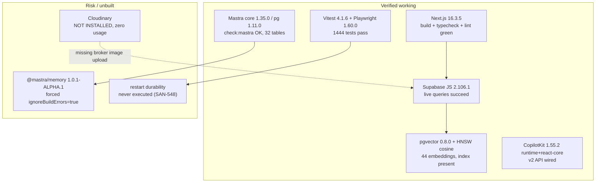

**Diagram read:** the request path (Next.js → Supabase → pgvector) is verified end to end. The three
risk nodes are an alpha memory package that disabled a safety switch, a documented-but-absent media
service, and an unexecuted durability proof. None is a rental *trust* gap, but the roadmap must not
assume any of them away.

---

## §35 · Live database validation

### 35.1 Ownership chain — where the broker product dies

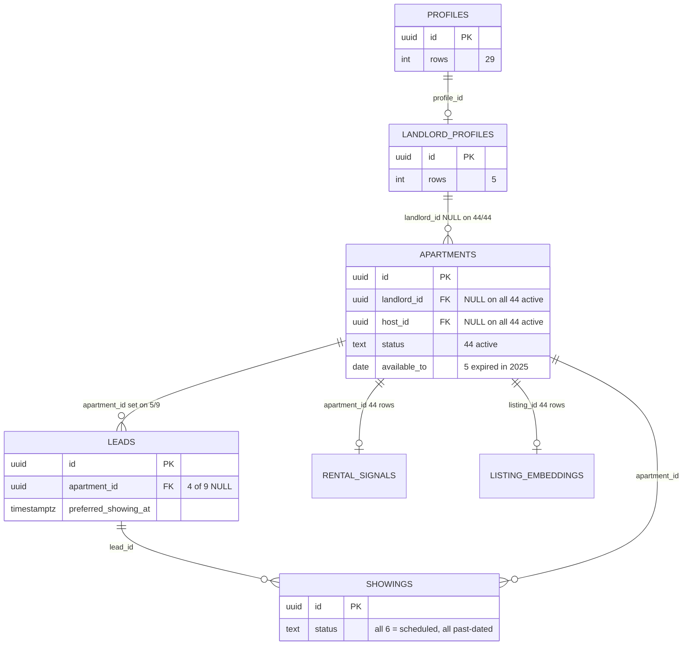

`acting_landlord_ids()` resolves broker scope from `landlord_profiles`, and every downstream RLS
policy on `apartments`, `leads` and `showings` depends on it. With `landlord_id` NULL on all 44
active rows the chain is **structurally intact and operationally empty**.

### 35.2 The showing lifecycle never closes

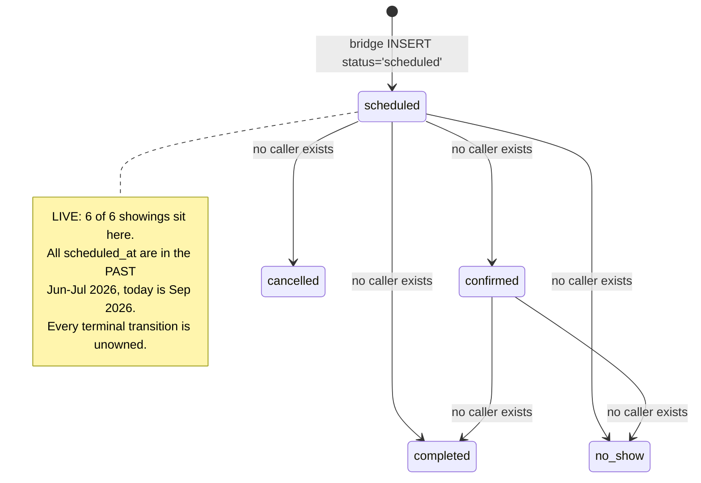

`showings_status_check` permits all five states, but **no code path ever writes one**. SAN-474
asserts `showing.status == 'scheduled'` — an assertion that passes happily on permanently stale rows.
This is the clearest "green test, broken outcome" in the domain (§21 D18).

### 35.3 Security advisors — scoped to rentals

Live Supabase security advisories, filtered to what rentals owns:

| Advisor | Count | Rental-relevant? | Verdict |
|---|---|---|---|
| `anon_security_definer_function_executable` | 27 | `publish_listing`, `request_listing_publish`, **`pause_listing`** | 🟢 **Verified safe** — all three are one-line `SECURITY DEFINER` wrappers over `transition_listing_workflow`, which requires `auth.uid()` **and** ownership and raises `42501` / `broker does not own this apartment` otherwise |
| `authenticated_security_definer_function_executable` | 34 | `acting_landlord_ids` | 🟡 Expected — it is the broker-scope helper RLS needs |
| `rls_disabled_in_public` | 1 | `spatial_ref_sys` | 🟡 PostGIS system table, not rental data — but a genuine ERROR-level finding |
| `extension_in_public` | 3 | `vector`, `pg_trgm`, `postgis` | 🟡 Hygiene; relocating `vector` is non-trivial and version-sensitive |
| `auth_leaked_password_protection` | 1 | all | 🟡 Auth setting, not rental-specific — worth enabling |
| `rls_enabled_no_policy` | 8 | none (all `fashionos_*`) | ⚪ Out of rental scope |

**The important negative result:** the anon-executable listing mutators look alarming and are **not**
an escalation. Verified by reading all three function bodies plus `transition_listing_workflow` —
not by trusting the advisor.

### 35.4 What is still unverified

| Claim | Why unproven |
|---|---|
| RLS A/B (owner allow / other-broker deny) | No owned apartment exists to build the fixture on |
| `supabase db reset` replay | Not executed in this environment |
| Edge Function deployment parity | Deployed versions not compared to repo |
| Restart durability (SAN-548) | Decisive test still skipped |
| p50/p95 search latency | No baseline captured |

---

## §36 · PR #112 merge readiness

### 36.1 Gate state at head `1c681c590`

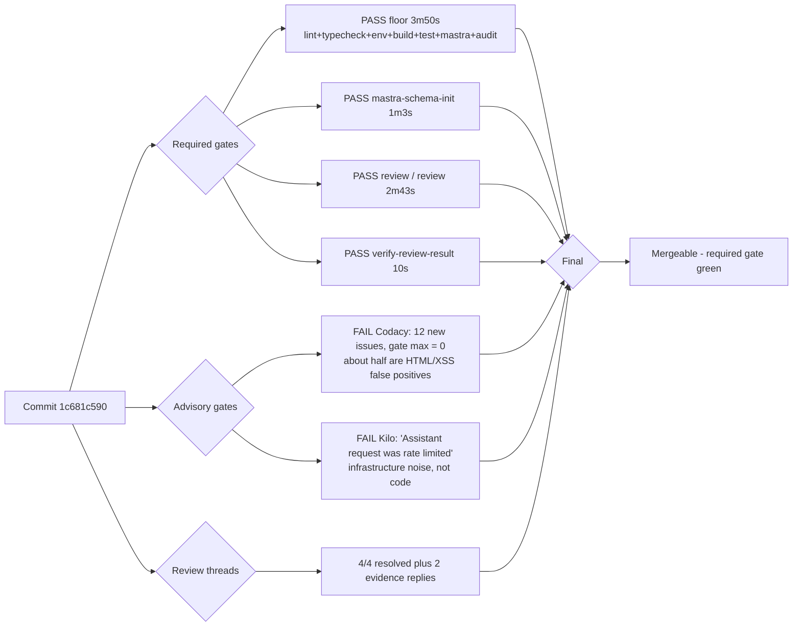

### 36.2 Will this task succeed after merge?

**Yes for SAN-1203's own scope.** The contract change is local, verified at four independent layers
(schema → helper → route → UI), and every external consumer was found and updated:

| Consumer of the changed contract | Status |
|---|---|
| `scheduleViewingInputSchema` | Only the route + submit helper imported it — both updated |
| `ScheduleViewingResult` | Only the submit helper + modal |
| `LeadConfirmation` type | Only the modal constructs it (`grep` confirmed a single producer) |
| `submitScheduleViewing` callers | Only the modal |
| e2e specs mocking the route | Only `SCREEN-008` (`grep` confirmed) — updated + regression gate |
| `OPEN_LEAD_CAPTURED` action payload | No client consumer exists (`grep` confirmed zero) |

**No, for the *rental journey* it is a prerequisite, not the outcome.** SAN-1203 makes the UI honest
about what was committed. It does **not** make the commit atomic (SAN-1286), attach ownership
(SAN-1349), or prove the Edge path (SAN-474).

### 36.3 The one thing that could still fail after merge

`SCREEN-008` cannot be trusted locally. `playwright.config.ts` sets `reuseExistingServer: true`
against `http://localhost:3001`, so a run silently reuses **whichever checkout already owns that
port**. Independently confirmed — an external reviewer's attempt picked up a different Next.js
checkout and had to be abandoned. Until SAN-1341 separates the suites, any local Playwright
"proof" for rentals is **evidence of unknown provenance**.

### 36.4 Remaining Codacy findings — dismissed with evidence

| Finding | Verdict |
|---|---|
| "HTML passed in to function `setNativeValue`", "Unencoded input `window.HTMLInputElement.prototype`", "Unencoded input `.value` used in HTML context" | ❌ **NOISE** — Codacy's XSS heuristics firing on jsdom DOM APIs inside a test. No HTML rendering and no user-controlled string in that path |
| "Method `edgeResponse` has 110 lines of code (limit is 100)" | ❌ **NOISE** — `edgeResponse` is **7 lines** (`route.test.ts:42-48`); Codacy measured the enclosing scope |
| braces in `afterEach`, empty async flush, empty-arrow resolver, hoisted setter | ✅ **Fixed** in `1c681c590` |

Running calibration for the rental review set: **bot findings checked 16 · confirmed 6 · false 10**
(≈38% precision). Every false positive would have caused a regression or added noise if applied
without executing the check — including the `% 24` removal that would have computed the wrong
timezone offset.

---

## §37 · Plan corrections — the Linear plan is directionally right but not executable as written

A forensic pass over the *Real Estate (MDE)* view and the two plan documents (SAN-1315 epic body,
SAN-1270 tracker body) found the plan's **direction** sound — correctness and proof gates rather than
features — but its **executable form** broken in ways that would silently stall the roadmap.

View reconciliation after the off-label tasks were added: `REAL_ESTATE` **125** (was 112 — the +13
matches exactly the tasks added in §19A), `RENTV2` 203, overlapping.

### 37.1 The gates the plan depends on are invisible where the plan is read

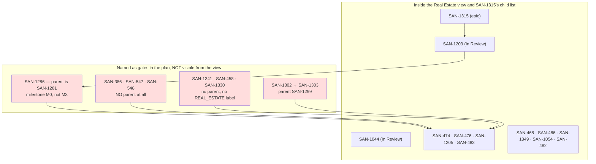

**Why this is load-bearing:** SAN-1315 names ten gate issues it does not own. Its own
"must be green before production promotion" list (SAN-1330, SAN-1341, SAN-1302→1303→548) cannot be
enumerated from the epic, from the view label, or from the child list. The roadmap's blockers are
invisible exactly where the roadmap is read — and the lane's single heavy implementation task
(SAN-1286) belongs to a *different epic and milestone*.

**Correction:** add a **gate register** — one table in SAN-1270 listing all ten non-child gates by ID
with their real parent — and reparent or explicitly cross-link them. Also note two relation
inconsistencies: SAN-1091 is `duplicateOf` SAN-1104 yet still Backlog/Urgent with its own scope and an
empty `blocks` list, and SAN-386 lists SAN-381 (Done) among the issues it blocks.

### 37.2 The plan's baselines are stale or self-contradictory

| # | Plan states | Verified | Correction |
|---|---|---|---|
| P1 | SAN-1315 + SAN-1270: main `c24f241b2…` | main is `47728db6b` | Re-pin |
| P2 | SAN-1203 + SAN-1286 + the forensic doc: main `11ea63d3c…` | same | Re-pin — **four distinct SHAs across one plan family** |
| P3 | SAN-1315 + SAN-1270: "`/rentals` → 15 cards rendered" as *baseline health* | 5 of those 15 show **2025** availability | Restate as "15 rendered, **5 expired**" |
| P4 | SAN-1315/SAN-1270 list SAN-1333 as 🟢 Completed env fix; SAN-1349 says "reuse, do not redo" | SAN-1349's own gap list still names the live `MOCK_RENTALS` fallback | Keep SAN-1333 Done but move the **fallback removal** to SAN-1349 with a fail-closed test (D4a) |
| P5 | SAN-1315 §3 treats the atomic RPC as future work to be reused | `p1_schedule_tour_atomic` **already exists and is granted to `service_role`** (`20260406120003_p1_atomic_grants.sql`); the bridge still insert→insert→delete | Reframe SAN-1286 as *"call the RPC and delete the split path"*, not greenfield |
| P6 | SAN-1044: "Live Supabase already has the apartment FK/index foundation" | The dedupe index **is** defined at `20260405120000_core_phase_corrections.sql:103-110` and **missing live** | Say "defined in migration, absent in production" — it is **replay drift**, not unwritten work (D7) |
| P7 | SAN-1315 §0A: "Do not rediscover … known live apartment-attribution gaps" | Of the 4 NULL-`apartment_id` leads, **3 have no `listing_id` at all** and **1 is the smoke row** `smoke-1779608858227` | Record the breakdown so the lane cannot re-discover it (D13) |
| P8 | SAN-1315 §0: "Start Rentals now. The current foundation is sufficient" | `_shared/rate-limit.ts:35-45` **fails open** on the anonymous mutation path | Add the fail-open limiter to the epic's **stop conditions**, not only the audit (D16) |
| P9 | SAN-1349 names the `rentalAgent` "mock data" prompt | SAN-1315 and SAN-1270 never mention it | Add it as a gate item on SAN-1349/SAN-1054 (D11/N1) |
| P10 | SAN-1315 §12 acceptance criteria reference SAN-386 by a **stale title/slug** | Linear title is "Make rental hybrid search obey hard filters before semantic ranking" | SAN-1270's own AC #2 requires titles/URLs to match Linear |

### 37.3 Nothing in the plan is actually started

**Zero of the 27 audited critical-path issues has a single checked acceptance box**, while their
bodies publish percentages of 10–90% and the epic claims 42%.

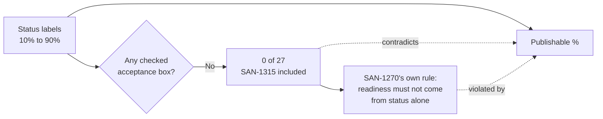

The tracker's stated method ("readiness uses evidence, not issue state alone") is the right method;
its published numbers do not follow it.

### 37.4 Statuses that are structurally impossible

| Issue | Status | Why it cannot be true | Correct status |
|---|---|---|---|
| **SAN-1044** | In Review | `blockedBy SAN-1286` is In Progress at 32%; its own stop condition says do not proceed while SAN-1286 is incomplete | Todo |
| **SAN-548** | In Review | `blockedBy SAN-1303` is **Todo**; its own body says the decisive durability test is still skipped | Blocked |
| **SAN-386** | In Review | 0/8; its body says the tests "do not cover this failure mode" — and the bypass is still live (D2) | In Progress |
| **SAN-547** | In Review | 0/10; `resourceId = userId ?? "anonymous"` is still on main (D17) | In Progress |
| **SAN-1203** | In Review | 0/8 and the body still says `preferredAt`/`showingId` are optional — **but PR #112 fixes exactly that** | In Review is now **correct**; body % and boxes are stale (§33.6) |
| **SAN-473** | In Review | Completion is conditional on SAN-1203, and Linear has **no** `blockedBy` edge | Add the edge; treat as a verify-only duplicate |
| **SAN-1059** | Backlog / **Medium** | Named as a production gate in three diagrams, with **no relations at all** | High + linked to SAN-483 |
| **SAN-468 / SAN-486** | Backlog / High, no relations | Carry the plan's loudest live defect ("must be green before SAN-483") | Move into the promotion gate |

### 37.5 Outcomes with no owner in the plan

| Gap | Verified | Should be owned by |
|---|---|---|
| **The six stranded showings** | All 6 past-dated, all still `scheduled`, all 4 rental ones on **expired** apartments (D18) | SAN-1056 / SAN-1048 (both Backlog, absent from every gate) — or add a row to SAN-1059's matrix |
| **The hybrid RPCs' missing migration** | `hybrid_search_*` live-only; a migration comment confirms it; SAN-386 must modify one of them | **SAN-1305** — never named as a rental prerequisite |
| **Broker-owned fixture creation** | 44/44 active unowned; the plan assumes a fixture exists | SAN-1104 / SAN-1107 (Todo and outside the gate list) |
| **Rental replay-parity proof** | Index drift (P6) + live-only RPCs (D12) prove replay ≠ production | Fold into SAN-1286 or SAN-1304/SAN-1313 — the rental plan inherited SAN-1281's *child* but not its parity gate |
| **The broker-facing surface** | SAN-476 proves *data* visibility only | SAN-1204 (Todo, 0 gates) |
| **Performance baseline** | SAN-1315 puts the baseline in SAN-1205 (Todo/15%, double-blocked) | Move baseline capture into SAN-482 so SAN-483 has a budget even if SAN-1205 slips |
| **Edge Function provenance** | SAN-1286/SAN-474 make `chat-lead-capture` the trusted boundary | SAN-1289 — not referenced by the rental plan |

### 37.6 Plan risks that survive every task passing

1. **The plan's graph is not the graph Linear enforces.** SAN-483's real `blockedBy` is
   {SAN-1054, SAN-548, SAN-386, SAN-1349, SAN-1205}; the prose adds SAN-1330/SAN-1341. Automation
   reading Linear would declare SAN-483 unblocked while the plan still requires more.
2. **Two of three "start-now" lanes have no owner of record** (SAN-386, SAN-547 parentless).
   Parallelism is the plan's core bet; orphaned parallel lanes stall silently.
3. **The durability half of the gate starts in another epic at 0%,** via a package pin that names
   **no target version** (SAN-1302).
4. **Availability correctness is owned by two Backlog issues with no relations** — they can be
   deprioritised without breaking anything in Linear, while 5 of 15 live cards keep shipping 2025.
5. **Playwright cannot produce trustworthy evidence today** (`reuseExistingServer: true`, §36.3), and
   SAN-1205 must build the canonical journey on top of it.
6. **Duplicate ownership still in the view:** `RE-TRUST-001` exists twice (SAN-1235 Backlog +
   SAN-1316 Duplicate); SAN-1091 duplicates SAN-1104; SAN-1045/SAN-467 → SAN-327; SAN-470 → SAN-1043;
   SAN-999/SAN-1053/SAN-1220. A reader sees two or three owners per outcome.

### 37.7 Ordered plan changes

1. **Fix identity before sequencing** — correct the statuses in 37.4; add the missing
   `blockedBy SAN-1203` on SAN-473; give SAN-1059, SAN-468 and SAN-486 relations; link
   SAN-1330/SAN-1341/SAN-1302/SAN-1303/SAN-458 to one named release gate.
2. **Publish a gate register** naming all ten non-child gates with their real parents (37.1).
3. **Re-pin every baseline** (P1–P3): one SHA, one card count *with the expired count*, one
   apartment count *with the NULL-ownership count*.
4. **Split SAN-1286** into (a) call the existing RPC and delete the split path, (b) restore the
   missing index + preflight dedupe + replay parity proof (P5, P6).
5. **Name the missing owners** as edits, not new epics (37.5) — especially **SAN-1305** as a named
   SAN-386/SAN-483 prerequisite.
6. **Move SAN-468/SAN-486 into the promotion gate** with "5/15 rendered cards show 2025 availability"
   as the acceptance measure, and raise SAN-1059 to High.
7. **Add the fail-open limiter and the agent-truth sentence to the epic's stop conditions** (P8, P9).
8. **Move the performance baseline into SAN-482** so certification is never blocked on a slip.
9. **Prune the view** so each outcome has exactly one owner (37.6 item 6).
10. **Only then re-sequence**, and re-issue SAN-1270 as a single evidence table (its own AC #7 already
    requires removing superseded tables — it currently carries three).

**Bottom line:** the plan is not wrong about *what* to do. It is not yet *executable*: its baselines
are stale, ten of its gates are invisible from where it is read, none of its 27 issues has one
verified acceptance box, one gate is structurally impossible, two of its loudest live defects have no
enforcing owner, and a shipped-and-granted atomic RPC is being planned as new work while the search
RPCs it depends on exist only in production.

---

## §38 · Stack audit findings — one new HIGH defect, and a version plan

### 38.1 D20 — CopilotKit thread endpoints were authorization-open ✅ FIXED (PR #122)

> **Status update 2026-09-26.** This defect was verified in source on `47728db6b` and has since been
> **fixed and merged** in PR #122 (merge `979940c5b`). The analysis below is retained as the original
> evidence. The fix: a pure two-path authorization decision in `copilotkit-auth.ts` (a presented bearer
> is validated or rejected including when the key is unconfigured; identity is server-derived), plus
> new thread-ownership enforcement (`src/lib/copilotkit-thread-ownership.ts`) — foreign thread → `403`,
> shared `anonymous`/unowned → `401`, new thread allowed — running **before** CopilotKit/AG-UI handling.
> `COPILOTKIT_API_KEY` is now required by the runtime env contract. Verified on current `main`: all four
> probes return the required statuses and a valid service bearer still receives `200`.

A dependency audit surfaced an upstream report; this was then **verified directly in MDE source**
rather than accepted. The chain is real:

| Step | Evidence |
|---|---|
| 1. All paths reach the runtime | `src/app/api/copilotkit/[[...path]]/route.ts:108-110` — `export const GET = handleCopilotKit; export const POST = handleCopilotKit;` with the comment *"Catch-all so GET /api/copilotkit/info and POST /api/copilotkit both reach the Hono handler."* So `GET /threads` and `POST /threads/clear` are routed to the CopilotKit handler |
| 2. No scoped runner is supplied | `route.ts:55-63` — `new CopilotRuntime({ agents: getLocalAgentsWithLogging({...}) })`. **No `runner`** ⇒ CopilotKit's default in-memory runner |
| 3. Auth fails **open** when the key is absent | `src/lib/copilotkit-auth.ts:30` — `if (!expectedKey) return null;` → **every request authorized, any origin** |
| 4. Auth also allows any same-origin request | `copilotkit-auth.ts:35` — `if (isSameOriginBrowserRequest(req)) return null;` |
| 5. Nothing enforces the key exists | `grep COPILOTKIT scripts/check-env-contract.mjs` → **no match**. It is documented in `.env.example:54` but absent from both the required and optional sets of the env contract |

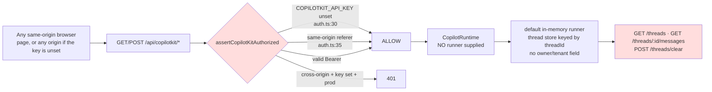

**Upstream context:** CopilotKit issue **#7198** ("Unauthenticated cross-thread read and global wipe
on the default in-memory runner", opened 2026-09-16) reports exactly this on 1.72.0 and was **closed
without a default-runner fix** (only a debug-feed PR and a docs PR). The `identifyUser` authorization
callback exists **only** on the Intelligence-mode options; in SSE mode there is no per-thread
authorization hook in 1.55.2 or 1.73.0. **An upgrade does not fix this.**

**Severity: HIGH.** Worst case is a cross-user read of chat thread history and a global thread wipe.
Two mitigations reduce but do not remove it: MDE persists conversation state in **Mastra/Supabase**
(`mastra_threads`/`mastra_messages`), not in the CopilotKit runner, so the exposed store is the
runtime's own thread cache; and `userId` *is* resolved and placed in Mastra's `RequestContext`
(`route.ts:86-99`) — the gap is that CopilotKit's thread endpoints never consult it.

**Required fix (application-side, because upstream shipped none):**
1. Reject thread-management paths in the route **before** the runtime (e.g. return 404 for
   `threads`/`threads/clear` if the product does not use them).
2. Otherwise supply a `runner` scoped by the already-resolved `userId`, and fail closed when it is
   absent.
3. Treat a missing `COPILOTKIT_API_KEY` as **deny** in production (invert `auth.ts:30`), and add it to
   `check-env-contract.mjs` so its absence fails a deploy.

**Owner:** SAN-547 (isolation) with SAN-1330 (fail-closed promotion). This is the strongest argument
in the whole audit for the fail-closed release gate: **the platform currently treats a missing secret
as "allow".**

### 38.2 A repo guard that cannot run

`npm run audit:copilotkit-v2` → `node scripts/audit-copilotkit-v2-map.mjs` — **the file does not
exist.** The two sibling scripts (`-no-new-v1.mjs`, `-depcruise-proof.mjs`) do. The broken script is
referenced by **no CI workflow**, so nobody notices. A guard that cannot run is worse than no guard:
it implies enforcement that does not exist. Fix: repair or delete it, and wire the survivor into Floor.

### 38.3 Version findings — what to upgrade and what absolutely not to

| Package | Installed | Latest | Verdict |
|---|---|---|---|
| `next` | 16.3.5 | 16.3.5 | 🟢 **Current and clean.** All 66 known Next advisories are patched at ≤16.3.3, so 16.3.5 is not vulnerable — including GHSA-2xp9-vwfh-vxw4 and GHSA-p293-qw3h-jr36. **Do not touch.** |
| `@copilotkit/runtime` + `react-core` | 1.55.2 | 1.73.0 | 🟡 Behind; **v2 surface still present** in 1.73.0 (verified symbol-by-symbol). Upgrade is API-compatible **but fixes nothing security-wise** (§38.1). While upgrading, move the route import from the bare root barrel to `@copilotkit/runtime/v2` — it currently mixes a v1 entrypoint with `/v2` clients, which violates the repo's own no-mixing invariant. |
| `@mastra/core` / `pg` / `memory` / `libsql` | 1.35.0 / 1.11.0 / **1.0.1-alpha.1** / **1.1.0-alpha.2** | 1.67.0 / 1.25.0 / **1.30.0** / 1.23.0 | 🟠 Large drift; **no symbol renames** for the 8 APIs MDE uses. The alpha→stable memory move plus `PostgresStore({disableInit:true})` is a **semantics/data** migration, not a rename. Gate against the live DB with the existing `check:mastra*` scripts. |
| `zod` | 3.25.76 | 4.6.5 | 🟥 **Do not upgrade yet.** 8 single-argument `z.record(z.unknown())` sites are **hard breaks** in v4, plus 36 `z.string().uuid()` sites become stricter. **Cheap prep valid in both versions:** mechanically rewrite the 8 `z.record(...)` calls to the two-argument form now. |
| `typescript` | 5.9.3 | 7.0.2 | 🟥 Two majors; the build does not typecheck by design. **Do not.** |
| `vitest` | 4.1.6 | 5.0.1 (4.1.11 patch) | 🟡 **Patch now** to 4.1.11 — GHSA-82fw-gwwq-j7x9 (path traversal, moderate, dev-only), one-line within-major bump. |
| `@ai-sdk/google` | 2.0.74 | 4.0.76 | 🟡 Low advisory; within-major fix at 2.0.97. **Do not** take 4.x. |
| `@supabase/supabase-js` / `@playwright/test` | 2.106.1 / 1.60.0 | 2.116.0 / 1.63.0 | 🟢 No advisories; opportunistic within-major bumps |
| `cloudinary` | — | 2.11.0 | ⚪ Not installed, not used (§34.3). **No action.** |

`npm audit` totals: **47 issues — 0 critical, 12 high, 18 moderate, 17 low.** The high-severity set is
**transitive and dev-only** (chiefly `undici` pulled in by `jsdom`), so it is a lockfile-refresh task,
not a hand-pinning one. One item to check: `package.json` overrides pin `shell-quote ">=1.8.4"` while
audit still flags GHSA-395f-4hp3-45gv (range `<=1.8.4`) — confirm the override resolves above the
patched boundary.

> **Caveat for whoever owns the Floor:** `next.config.ts` sets `typescript.ignoreBuildErrors: true`,
> so `next build` will **not** catch any zod-4 or Mastra type break. Only `npm run typecheck` would.
> Any major migration here needs the typecheck gate to be real first (D14).

### 38.4 The SAN-386 accelerator: pgvector iterative scans are OFF

Live pgvector is **0.8.0**, which added iterative index scans — and they are **off by default**.
pgvector applies filters *after* the approximate index scan, so with HNSW and default
`hnsw.ef_search = 40`, a filter matching ~10% of rows yields roughly **4** rows. This is a concrete
mechanism for the symptom SAN-386 is chasing.

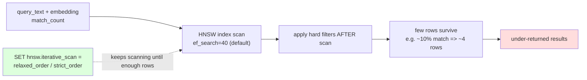

**Action for SAN-386:** add `SET LOCAL hnsw.iterative_scan = relaxed_order` inside the semantic
search RPCs **before** considering an extension bump or an index-strategy change. Do not change
`vector_cosine_ops`/HNSW — Supabase recommends HNSW precisely for filtering-plus-vector workloads.

### 38.5 Reference URLs — exactly what to read for each fix

| Fix | Source | Instruction |
|---|---|---|
| Enable iterative scans (SAN-386) | https://github.com/pgvector/pgvector#iterative-index-scans | Read the iterative-scan section; add `SET LOCAL hnsw.iterative_scan = relaxed_order` in the search RPC. Bounded by `hnsw.max_scan_tuples` |
| HNSW vs IVFFlat guidance | https://supabase.com/docs/guides/ai/vector-indexes | Confirms HNSW for robustness under changing data — **no index change needed** |
| pgvector release history | https://github.com/pgvector/pgvector/blob/master/CHANGELOG.md | Confirms 0.8.0 introduced iterative scans; 0.8.6 is current |
| CopilotKit thread exposure | https://github.com/CopilotKit/CopilotKit/issues/7198 | The open/closed report. Read the closure comments before assuming an upgrade helps — it does not |
| CopilotKit v2 runtime reference | https://docs.copilotkit.ai/ | Verify the v2 entrypoint before moving the route import to `@copilotkit/runtime/v2` |
| Next.js type config | https://nextjs.org/docs/app/api-reference/config/next-config-js/typescript | Documents that `ignoreBuildErrors` requires a separate `tsc --noEmit` gate — which is the Floor's `typecheck` step |
| Next.js advisories | https://github.com/vercel/next.js/security/advisories | All 66 advisories patched at ≤16.3.3; 16.3.5 is clean |
| zod 4 migration | https://zod.dev/v4/changelog | `z.record` single-arg removal, `.uuid()` strictness |
| Supabase RLS/advisor guidance | https://supabase.com/docs/guides/database/database-linter | Reconcile the 27 anon-executable `SECURITY DEFINER` findings (§35.3) |
| Mastra storage | https://mastra.ai/docs/reference/storage/postgresql | `PostgresStore({disableInit})` semantics before the family upgrade (SAN-1303) |

### 38.6 Net effect on readiness

Two of these change the plan rather than the score:

1. ~~**D20 raises the AI-isolation gate's severity.**~~ **✅ RESOLVED 2026-09-26 (PR #122).** D20 was a
   **verified, unauthenticated-reachable** thread-management surface plus a fail-open secret check, and
   it *was* live: a foreign-origin unauthenticated `info` probe returned `200` + agent inventory on the
   stale production build. It is now fixed on `main` — thread ownership is enforced before
   CopilotKit/AG-UI handling and a missing key fails closed. **The `AI truth + isolation` figure of 25%
   was depressed by D20 and must be recomputed**, not carried forward. **D17 / `SAN-547` remains open**
   and is still the binding constraint on this gate.
2. **§38.3 is a strong argument for SAN-1330.** The platform treated a missing secret as *allow*. A
   fail-closed promotion gate is not hygiene here; it is the control that would have caught it — and it
   is why the env contract now requires `COPILOTKIT_API_KEY`.

**Also note:** fixing the code does not fix production. As of 2026-09-26, `www.mdeai.co` was serving a
**pre-fix build** (`dpl_HSVuMHDPY…`, 2026-09-24) — roughly 37 h older than the merge — and git-triggered
auto-deploy had stopped 148 commits earlier at PR #86. **The D20 probes still fail against production
until `main` is redeployed.**
