# mdeai Marketing & Business Pages

> **One line:** mdeai is multi-sided — we don't just market to travellers (Camila/Andrés/Tourist), we must also acquire **supply** (event hosts, venues, rental brokers) and sell **B2B services** (AI builds, event marketing, sponsorships). This ranks the **top 18 pages** to add, with purpose, audience, revenue lever, grade, and score.

## Scoring rubric

`Score /100 = Strategic value (35) + Revenue / conversion potential (35) + MVP-timing fit (20) + Low build effort (10)`
Grades: **A** ≥88 · **A-** 83–87 · **B+** 80–82 · **B** 74–79 · **C+** 68–73 · **C** <68.

## Ranked pages (top 18)

| # | Page | Route | Purpose | Audience | Revenue lever | Phase | Grade | Score |
|---|---|---|---|---|---|---|---|---:|
| 1 | **Home** | `/` | Top of funnel; concierge entry + verticals | All | Activation | Now | **A** | 98 |
| 2 | **For Event Hosts** | `/host` (landing) | Convert Roberto → publish events; supply growth | Event hosts | Listing/tx fees | Now | **A** | 92 |
| 3 | **Neighborhood guides** | `/medellin/[barrio]` | SEO organic acquisition (Laureles, Poblado…) | Tourists/movers | Organic traffic → leads | Now–P2 | **A** | 90 |
| 4 | **For Venues** | `/venues` | Restaurants/cafés/nightlife list + market themselves | Venue owners | Featured placement, ads | Now | **A** | 88 |
| 5 | **Blog / Guides hub** | `/blog` | SEO content engine feeding guides | Tourists/movers | Organic + affiliate | P2 | **A-** | 86 |
| 6 | **For Rentals / Brokers** ("Rentals AI") | `/partners/rentals` | Brokers list units; AI drafts + answers leads | Rental brokers | Lead fees / subscription | Now | **A-** | 85 |
| 7 | **AI Agency — AI services for companies** | `/business/ai` | Sell mdeai's AI build/automation to local businesses | Companies (B2B) | Services revenue (high $) | P2 | **A-** | 84 |
| 8 | **Contact / Book a demo** | `/contact` | Capture supply + B2B leads | Hosts/venues/B2B | Sales pipeline | Now | **B+** | 82 |
| 9 | **About** | `/about` | Trust + story + team; "why mdeai" | All | Trust → conversion | Now | **B+** | 80 |
| 10 | **Partnerships** | `/partners` | Biz dev: integrations, tourism boards, hotels | Partners | Channel deals | P2 | **B+** | 80 |
| 11 | **Event Marketing services** | `/business/event-marketing` | Paid promotion/boost for events | Hosts/venues | Ad/boost revenue | P2 | **B** | 79 |
| 12 | **Sponsors / Sponsorship** | `/sponsors` | Brands sponsor events + contests | Sponsors/brands | Sponsorship revenue | P2 | **B** | 78 |
| 13 | **How it works** | `/how-it-works` | Explainer → activation | New consumers | Conversion | Now | **B** | 78 |
| 14 | **Contests / Giveaways** | `/contests` | Engagement + lead gen + sponsor tie-in | Consumers + sponsors | Lead gen + sponsor $ | P2 | **B** | 76 |
| 15 | **Pricing** | `/pricing` | Host/venue/business plan tiers | Supply + B2B | Conversion clarity | P2 | **B** | 75 |
| 16 | **Event features for Venues** | `/venues/features` | Deep product page for venue tooling | Venue owners | Upsell | P2 | **B** | 74 |
| 17 | **Social Media Management (Postiz)** | `/business/social` | Done-for-you social scheduling service | Venues/hosts/SMBs | Services/retainer | P3 | **C+** | 70 |
| 18 | **Press / Media kit** | `/press` | Credibility + logos + assets | Media/partners | Indirect trust | P3 | **C** | 62 |

*(Deferred: Careers `/careers` C-55; Legal `/legal/privacy`+`/terms` = compliance, required but not marketing-scored.)*

## Site tree — marketing & business

```mermaid
graph TD
  H["/ Home (A·98)"]

  subgraph Consumer
    A["/about (B+·80)"]
    HW["/how-it-works (B·78)"]
    G["/medellin/[barrio] guides (A·90)"]
    BL["/blog (A-·86)"]
    CT["/contests (B·76)"]
    PR["/pricing (B·75)"]
  end

  subgraph "Supply — acquire inventory"
    HOST["/host — For Event Hosts (A·92)"]
    VEN["/venues — For Venues (A·88)"]
    VENF["/venues/features (B·74)"]
    REN["/partners/rentals — Rentals AI / Brokers (A-·85)"]
  end

  subgraph "Business — mdeai as service/agency (B2B)"
    BIZ["/business (hub)"]
    AIA["/business/ai — AI services (A-·84)"]
    EVM["/business/event-marketing (B·79)"]
    SOC["/business/social — Postiz (C+·70)"]
    SPON["/sponsors (B·78)"]
    PART["/partners — Partnerships (B+·80)"]
  end

  subgraph "Trust & Legal"
    CON["/contact — Book a demo (B+·82)"]
    PRESS["/press (C·62)"]
    LEG["/legal/privacy · /legal/terms"]
  end

  H --> A & HW & G & BL & CT & PR
  H --> HOST & VEN & REN
  VEN --> VENF
  H --> BIZ
  BIZ --> AIA & EVM & SOC
  H --> SPON & PART
  H --> CON & PRESS & LEG
```



### ASCII fallback

```
/ (Home · A·98)
├── Consumer
│   ├── /about ............................ B+·80
│   ├── /how-it-works ..................... B·78
│   ├── /medellin/[barrio]  (SEO guides) .. A·90
│   ├── /blog ............................. A-·86
│   ├── /contests ......................... B·76
│   └── /pricing .......................... B·75
├── Supply (acquire inventory)
│   ├── /host  (For Event Hosts) .......... A·92
│   ├── /venues  (For Venues) ............. A·88
│   │   └── /venues/features ............. B·74
│   └── /partners/rentals  (Rentals AI) .. A-·85
├── Business — B2B / agency
│   ├── /business  (hub)
│   │   ├── /business/ai  (AI services) .. A-·84
│   │   ├── /business/event-marketing .... B·79
│   │   └── /business/social  (Postiz) ... C+·70
│   ├── /sponsors ........................ B·78
│   └── /partners  (Partnerships) ........ B+·80
└── Trust & Legal
    ├── /contact  (Book a demo) .......... B+·82
    ├── /press ........................... C·62
    └── /legal/{privacy,terms}  (required)
```

## Three audiences, three jobs

| Cluster | Who | The job-to-be-done | Top pages |
|---|---|---|---|
| **Consumer** | Camila, Andrés, Tourist | Discover + plan + book | Home, Guides, Blog, How-it-works |
| **Supply** | Roberto (hosts), venues, brokers | List & get bookings/leads | /host, /venues, /partners/rentals |
| **Business (B2B)** | Local companies, sponsors, partners | Buy reach / AI / sponsorship | /business/ai, /sponsors, /business/event-marketing |

## How this maps to today's sitemap

Already planned (⚫ POST in `sitemap.md`) — just need design: **`/about`**, **`/partners`**, **`/legal/*`**. Everything else here is **net-new**. The `/broker/*` operator dashboard already exists (POST) and is the *logged-in* counterpart to the **`/venues`** + **`/partners/rentals`** marketing landings.

## Competitor reference

- **Mindtrip Business** (`/business`) — B2B: embed the AI trip-planner / API for travel brands. Our analog = **`/business/ai`** (sell the AI capability) + partnerships.
- **Mindtrip Creator Program** (`/creator-program`) — creators build guides and earn (links, tip jar, booking commissions). mdeai analog is **local guides/hosts**, but note: this is a *creator-economy* play we've so far treated as out-of-model. If we want it, it becomes a **`/creators`** page (B, ~75) — flagged as optional, not in the top-18 above.

## Recommendation — build order

**Launch-critical (do first):** `/host` (#2, supply) · `/about` (#9, trust) · `/contact` (#8, lead capture). These directly serve Roberto + credibility + pipeline with low effort.
**Fast SEO win (start content now, compounds):** `/medellin/[barrio]` guides (#3) + `/blog` (#5).
**Revenue expansion (Phase 2):** `/venues` (#4) → `/business/ai` (#7) → `/sponsors` (#12).
**Defer:** Postiz social service, press, careers.

## Open questions

1. Do we pursue the **creator-economy** angle (Mindtrip-style guides + payouts), or stay marketplace + B2B-services only?
2. Is the **AI Agency** (`/business/ai`) a real near-term revenue line, or positioning only? It changes how prominent it is on Home.
3. Postiz / social-media management — **first-party feature** or **resold service**? Affects whether it's a product page or an agency offer.
