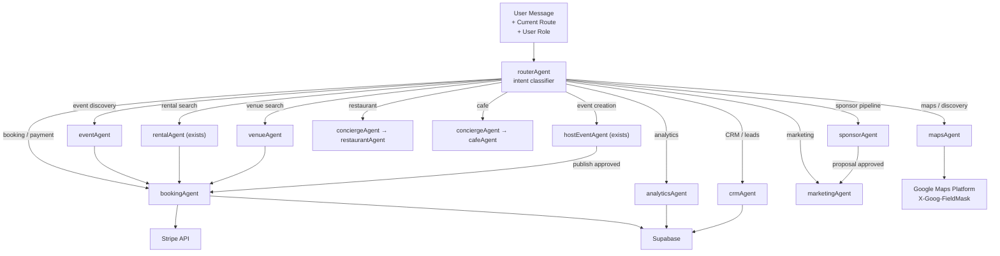

# Agent Design Reference
> All agents for the AI-Native Marketplace Platform

---

## Agent Table

| Agent | Purpose | Key Inputs | Key Outputs | Phase |
|---|---|---|---|---|
| **routerAgent** | Classify intent, route to specialist, preserve context in handoff | User message, current route, role | `route_to_agent(name)`, intent classification | Core |
| **eventAgent** | Event discovery, detail, availability, booking initiation | Search query, user preferences, date range | EventCards, map pins, availability status | Core |
| **rentalAgent** | Rental search, lead capture, viewing scheduling | Search constraints, user profile, budget | RentalCards, match scores, inquiry drafts | Core |
| **venueAgent** | Venue search, shortlisting, availability, booking inquiry | Event requirements (capacity, type, date) | VenueCards, shortlist, proposal draft | Core |
| **bookingAgent** | Unified booking across all domains, payment processing | entity_id, entity_type, user_id, quantity | Booking record, Stripe session, confirmation | Core |
| **mapsAgent** | Place pins, cluster results, calculate travel time, enrich from Places API | Location query, entity type, radius | Pin coordinates, place data, neighborhood clusters | Core |
| **conciergeAgent** | General discovery, multi-domain Q&A, tourist itinerary, local recommendations | Open-ended intent, location, time | Multi-domain results, itinerary plan | Core |
| **ticketingAgent** | Ticket tier management, promo codes, waitlist, Stripe price objects | Event ID, tier config, promo params | Ticket tiers, Stripe prices, waitlist records | MVP |
| **sponsorAgent** | Sponsor pipeline, brand-fit scoring, proposal generation, ROI tracking | Sponsor profile, event list | Fit scores, proposal docs, CRM updates | MVP |
| **crmAgent** | Lead qualification, stage moves, follow-up scheduling, reply drafting | Lead inquiry, contact info, context | Lead score, stage update, draft reply | MVP |
| **analyticsAgent** | Data Q&A, chart generation, trend explanation, period comparison | Natural language question, period, domain | Charts, narrative answers, export data | MVP |
| **marketingAgent** | Campaign copy, social posts, email sequences, WhatsApp campaigns | Event details, brand voice, channels | Copy variants, scheduled sends | Advanced |
| **automationAgent** | Trigger-driven workflows, webhook processing, multi-step orchestration | Trigger event, payload, workflow config | Executed workflow, notifications, audit log | Advanced |
| **partnerAgent** | Partner onboarding, service matching, inquiry routing | Partner service profile, event requirements | Partner profile, match results, proposal | Advanced |

---

## Agent Architecture Diagram



---

## Working Memory Schema

```typescript
// Zod schema — synced between Mastra agent and React via useCoAgent
const MdeState = z.object({
  // User preferences (persisted across sessions)
  preferences: z.object({
    budget: z.object({ min: z.number(), max: z.number() }).optional(),
    neighborhoods: z.array(z.string()).optional(),
    eventGenres: z.array(z.string()).optional(),
    diningVibes: z.array(z.string()).optional(),
    noiseLevel: z.enum(["quiet", "moderate", "lively"]).optional(),
    outdoorPreference: z.boolean().optional(),
  }),
  
  // Current session state
  activeSearch: z.object({
    domain: z.enum(["events", "rentals", "venues", "restaurants", "cafes", "nightlife"]).optional(),
    query: z.string().optional(),
    results: z.array(z.any()).optional(),
    mapPins: z.array(z.object({ lat: z.number(), lng: z.number(), label: z.string() })).optional(),
  }),
  
  // Active workflow state
  activeWorkflow: z.object({
    name: z.string().optional(),
    step: z.number().optional(),
    draft: z.any().optional(),
  }),
  
  // User context
  userRole: z.enum(["consumer", "host", "admin", "sponsor"]).optional(),
  currentRoute: z.string().optional(),
})
```

---

## Tool Inventory by Agent

| Agent | Tools |
|---|---|
| **routerAgent** | `classify_intent`, `route_to_agent`, `get_current_context` |
| **eventAgent** | `search_events`, `get_event_detail`, `check_availability`, `create_booking_intent` |
| **rentalAgent** | `search_rentals`, `get_rental_detail`, `submit_inquiry`, `schedule_viewing`, `score_lead` |
| **venueAgent** | `search_venues`, `get_venue_detail`, `check_venue_availability`, `shortlist_venue`, `send_venue_inquiry` |
| **bookingAgent** | `create_booking`, `process_payment`, `add_to_calendar`, `send_confirmation`, `check_idempotency` |
| **mapsAgent** | `place_pins`, `cluster_places`, `search_nearby_places`, `get_travel_time`, `enrich_from_places_api` |
| **sponsorAgent** | `score_brand_fit`, `search_events_for_sponsor`, `generate_proposal`, `track_campaign_roi`, `update_sponsor_stage` |
| **crmAgent** | `get_leads`, `qualify_lead`, `move_stage`, `schedule_followup`, `draft_reply`, `send_bulk_reply` |
| **analyticsAgent** | `query_supabase`, `generate_chart`, `explain_trend`, `compare_periods`, `export_csv` |
| **marketingAgent** | `generate_campaign_copy`, `create_social_post`, `draft_email_sequence`, `send_whatsapp` (HITL) |
