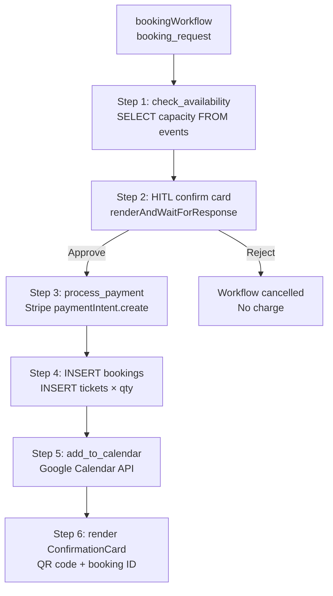
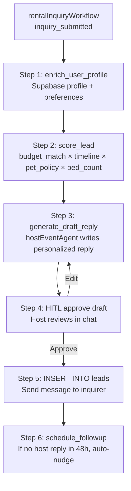

# Workflow Design Reference

---

## Workflow Table

| Workflow | Inputs | Steps | Outputs | Phase |
|---|---|---|---|---|
| **createEventWorkflow** | `{title, date, capacity, host_id, description?}` | 1. Parse basics → 2. Venue shortlist (Places+Supabase) → 3. HITL venue select → 4. Suggest ticket tiers → 5. Return draft | Event draft in working memory + venue selected | Core |
| **venueSearchWorkflow** | `{capacity, type, location, event_date}` | 1. Query Supabase venues → 2. Enrich from Places API → 3. Score against requirements → 4. Return top 4 ranked | Ranked venue list + map pins | Core |
| **rentalInquiryWorkflow** | `{rental_id, user_id, message, move_in, duration}` | 1. Enrich user profile → 2. Score lead → 3. Generate draft reply → 4. HITL approve → 5. INSERT leads → 6. Schedule follow-up | Lead in DB + draft sent to host | Core |
| **bookingWorkflow** | `{entity_id, entity_type, user_id, quantity, tier?}` | 1. Check availability → 2. HITL confirm card → 3. Stripe payment → 4. INSERT booking + tickets → 5. Calendar invite → 6. Confirmation card | Booking record + Stripe PI + QR code | Core |
| **ticketWorkflow** | `{event_id, tiers[]}` | 1. Validate capacity math → 2. HITL tier confirmation → 3. Stripe price.create per tier → 4. UPDATE event record | Active ticket tiers with Stripe payment links | MVP |
| **sponsorDiscoveryWorkflow** | `{sponsor_profile}` | 1. Score all active events vs brand profile → 2. Filter by budget + timing → 3. Rank by audience overlap → 4. Render top 10 | Ranked opportunity list with fit scores | MVP |
| **crmLeadWorkflow** | `{lead_source, contact_info, entity_id, message}` | 1. Deduplicate check → 2. Enrich from Supabase → 3. Score (budget/timeline/fit) → 4. Route to owner → 5. Draft first touch → 6. HITL send | Qualified lead in pipeline + first message | MVP |
| **analyticsWorkflow** | `{question, period, domain}` | 1. Parse question → 2. Build SQL query → 3. Execute on Supabase → 4. Generate chart data → 5. Write narrative | Chart + prose answer in chat | MVP |
| **marketingWorkflow** | `{event_id, channels[], launch_time}` | 1. Extract event data → 2. Generate copy per channel → 3. HITL approve all → 4. Schedule sends → 5. Track | Campaign live + analytics tracking | Advanced |
| **whatsappWorkflow** | `{segment, message_template, event_id}` | 1. Get opted-in segment → 2. Personalize per user → 3. HITL approve → 4. Send via WhatsApp API → 5. Track delivery | Delivered messages + open rate | Advanced |
| **automationWorkflow** | `{trigger_event, payload}` | 1. Parse trigger → 2. Route to correct workflow → 3. Execute → 4. Log | Depends on triggered workflow | Advanced |
| **recommendationWorkflow** | `{user_id, domain, count}` | 1. Load user taste model → 2. Score active inventory → 3. Filter by availability → 4. Rank → 5. Push proactively | Personalized recommendation list | Advanced |

---

## Core Workflows — Mermaid Diagrams

### bookingWorkflow

### rentalInquiryWorkflow

