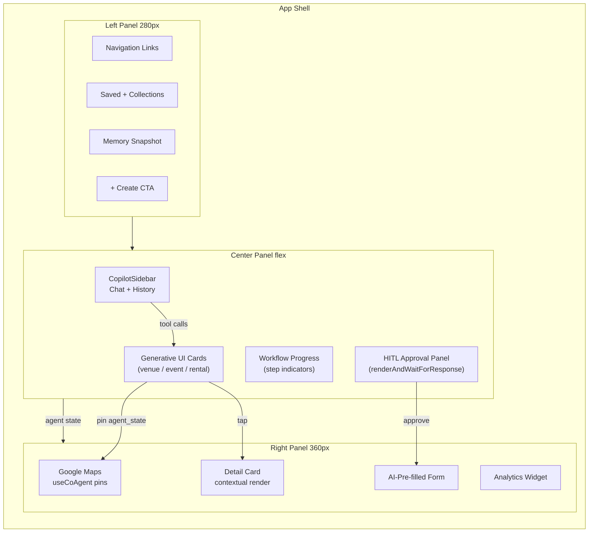

# Three-Panel Layout — Core UI Shell
> Applies to: all discovery, host, admin, and CRM routes  
> Phase: Core

---

## Purpose

The three-panel layout is the primary workspace for every power surface in the platform. The center panel is the **primary interaction surface** — AI chat is not a sidebar accessory, it IS the interface. Maps, details, and approvals live in the right panel, visible contextually without navigation.

---

## Desktop Wireframe (1280px+)

```
┌────────────────────────────────────────────────────────────────────────────────┐
│ ▣ mdeai                                    🔔  [Roberto ▾]                     │
├─────────────────┬──────────────────────────────────────┬───────────────────────┤
│  LEFT 280px     │  CENTER — flex grow                  │  RIGHT 360px          │
│  ─────────────  │  ────────────────────────────────    │  ──────────────────── │
│  🏠 Home        │                                      │                       │
│  📅 Events      │  ┌──────────────────────────────┐   │  ┌─────────────────┐  │
│  🏠 Rentals     │  │  💬 Chat messages             │   │  │  🗺️ Google Map  │  │
│  🏢 Venues      │  │                               │   │  │                 │  │
│  🍽️ Restaurants │  │  AI: "Here are 3 rooftop      │   │  │  [pin] ●        │  │
│  ☕ Cafes       │  │  venues matching your event   │   │  │  [pin] ●        │  │
│  🌙 Nightlife   │  │  for 250 guests..."           │   │  │  [pin] ●        │  │
│  ─────────────  │  │                               │   │  │                 │  │
│  📌 Saved       │  │  ┌──────────────────────┐    │   │  └─────────────────┘  │
│  🕐 Recent      │  │  │ 📍 Casa Bali          │    │   │                       │
│  🧠 Memory      │  │  │ Rooftop · Cap 300     │    │   │  ┌─────────────────┐  │
│  ─────────────  │  │  │ $120/hr · ⭐ 4.8      │    │   │  │ DETAIL / HITL   │  │
│  [+ Create]     │  │  │ [View] [Shortlist]    │    │   │  │ panel renders   │  │
│                 │  │  └──────────────────────┘    │   │  │ context here    │  │
│                 │  │                               │   │  └─────────────────┘  │
│                 │  │  ┌──────────────────────┐    │   │                       │
│                 │  │  │ 📍 Sky Terrace        │    │   │  ┌─────────────────┐  │
│                 │  │  │ Rooftop · Cap 250     │    │   │  │ ANALYTICS or    │  │
│                 │  │  │ $95/hr · ⭐ 4.6       │    │   │  │ APPROVAL QUEUE  │  │
│                 │  │  │ [View] [Shortlist]    │    │   │  └─────────────────┘  │
│                 │  │  └──────────────────────┘    │   │                       │
│                 │  │                               │   │                       │
│                 │  │  ────────────────────────    │   │                       │
│                 │  │  ┌──────────────────────┐    │   │                       │
│                 │  │  │ 🤖 Type a message...  │    │   │                       │
│                 │  │  │                  [▶] │    │   │                       │
│                 │  │  └──────────────────────┘    │   │                       │
│                 │  └──────────────────────────────┘   │                       │
└─────────────────┴──────────────────────────────────────┴───────────────────────┘
```

---

## Tablet Wireframe (768px–1279px)

```
┌──────────────────────────────────────────────────────────────────┐
│  ▣ mdeai          [≡ Menu]              🔔  [Avatar]             │
├──────────────────────────────────────────────────────────────────┤
│                                                                  │
│   ┌──────────────────────────┐  ┌──────────────────────────┐    │
│   │  AI Chat + Cards         │  │  Map / Canvas            │    │
│   │  (flex, ~50%)            │  │  (flex, ~50%)            │    │
│   │                          │  │                          │    │
│   │  ┌──────────────────┐    │  │  [Google Map tiles]      │    │
│   │  │ VenueCard         │   │  │                          │    │
│   │  └──────────────────┘    │  │  [pin ●] [pin ●]         │    │
│   │  ┌──────────────────┐    │  │                          │    │
│   │  │ VenueCard         │   │  └──────────────────────────┘    │
│   │  └──────────────────┘    │                                  │
│   │                          │  ┌──────────────────────────┐    │
│   │  [Type a message... ▶]   │  │ Detail drawer (slide up) │    │
│   └──────────────────────────┘  └──────────────────────────┘    │
│                                                                  │
├──────────────────────────────────────────────────────────────────┤
│  🏠 Home   📅 Events   🏠 Rentals   📌 Saved   👤 Me            │
└──────────────────────────────────────────────────────────────────┘
```

---

## Mobile Wireframe (< 768px)

```
┌─────────────────────────────────────────┐
│  ← Back    mdeai Events    🔔           │
├─────────────────────────────────────────┤
│                                         │
│  [List ⊞]  [Map 🗺]  — toggle          │
│                                         │
│  ┌─────────────────────────────────┐   │
│  │ 📍 Casa Bali                    │   │
│  │ Rooftop · 300 cap · $120/hr     │   │
│  │ ⭐ 4.8  · El Poblado           │   │
│  │ [View Details]                  │   │
│  └─────────────────────────────────┘   │
│                                         │
│  ┌─────────────────────────────────┐   │
│  │ 📍 Sky Terrace                  │   │
│  │ Rooftop · 250 cap · $95/hr      │   │
│  │ ⭐ 4.6  · Laureles             │   │
│  │ [View Details]                  │   │
│  └─────────────────────────────────┘   │
│                                         │
│                                         │
│                         ┌───────────┐  │
│                         │ 💬 Chat   │  │
│                         │  (FAB)    │  │
│                         └───────────┘  │
├─────────────────────────────────────────┤
│  🏠    📅    🗺️    📌    👤            │
└─────────────────────────────────────────┘
```

---

## Panel Responsibilities

| Panel | Width | Owns | CopilotKit | Updates On |
|---|---|---|---|---|
| **Left** | 280px fixed | Navigation, saved collections, memory preview, role switcher | `useCopilotReadable` (nav context) | Route change; new memory saved |
| **Center** | flex grow | Chat history, generative cards, workflow progress, HITL panels, empty state | `CopilotSidebar`, `useCopilotAction(render)`, `renderAndWaitForResponse` | Every agent message; tool call result |
| **Right** | 360px fixed | Google Maps pins, detail view, analytics widgets, form panels, approval queue | `useCoAgent` state → pins; conditional render per context | Agent calls `place_pins`, `show_detail`, `render_form` |

---

## Left Panel — Component List

```
┌──────────────────────────┐
│  ▣ mdeai          v      │  ← logo + collapse toggle
├──────────────────────────┤
│  HOME                    │  ← section header
│  🏠 Home                 │
│  🔍 Explore              │
├──────────────────────────┤
│  DISCOVER                │
│  📅 Events               │  ← active = highlighted
│  🏠 Rentals              │
│  🏢 Venues               │
│  🍽️ Restaurants          │
│  ☕ Cafes                │
│  🌙 Nightlife            │
├──────────────────────────┤
│  MY STUFF                │
│  📌 Saved (12)           │
│  🎟️ My Tickets           │
│  🕐 Recent               │
├──────────────────────────┤
│  HOSTING                 │
│  📋 My Events            │
│  🏠 My Rentals           │
├──────────────────────────┤
│  🧠 Memory               │  ← last 3 agent-remembered facts
│  "Prefers outdoor seating"│
│  "Budget: $1,200/mo"     │
│  "Likes jazz events"     │
├──────────────────────────┤
│  [+ Create Event]        │  ← primary CTA
└──────────────────────────┘
```

---

## Right Panel — Context Modes

The right panel renders different content based on agent state:

| Mode | Trigger | Content |
|---|---|---|
| **Map** (default) | Any discovery search | Google Maps with agent-placed pins |
| **Detail** | User taps card / agent calls `show_detail` | Venue/event/rental detail card |
| **HITL** | `renderAndWaitForResponse` fires | Approval card with confirm/reject |
| **Analytics** | Admin route active | KPI widget + sparkline chart |
| **Form** | Agent pre-fills a form | AI-populated form fields |
| **Empty** | No search yet | Placeholder with suggested prompts |

---

## Mermaid Layout Diagram



---

## Responsive Breakpoints

| Breakpoint | Layout | Chat | Map |
|---|---|---|---|
| `>= 1280px` | 3-column | Full sidebar | Right panel always visible |
| `768–1279px` | 2-column | Chat + cards left | Map right (same row) |
| `< 768px` | Single column | FAB expands to full-screen | Toggle: list ↔ map |

---

## Empty State — Center Panel

```
┌──────────────────────────────────────────┐
│                                          │
│         🤖 How can I help you?           │
│                                          │
│   Try asking:                            │
│                                          │
│  ┌─────────────────────────────────┐    │
│  │ "Find jazz events this weekend" │    │
│  └─────────────────────────────────┘    │
│  ┌──────────────────────────────────┐   │
│  │ "Furnished apartment in Laureles" │  │
│  └──────────────────────────────────┘  │
│  ┌───────────────────────────────────┐  │
│  │ "Rooftop venue for 200 people"    │  │
│  └───────────────────────────────────┘  │
│  ┌────────────────────────────────────┐ │
│  │ "Best tacos near Parque Lleras"    │ │
│  └────────────────────────────────────┘ │
│                                          │
│  [Type a message...              ▶ ]    │
└──────────────────────────────────────────┘
```
