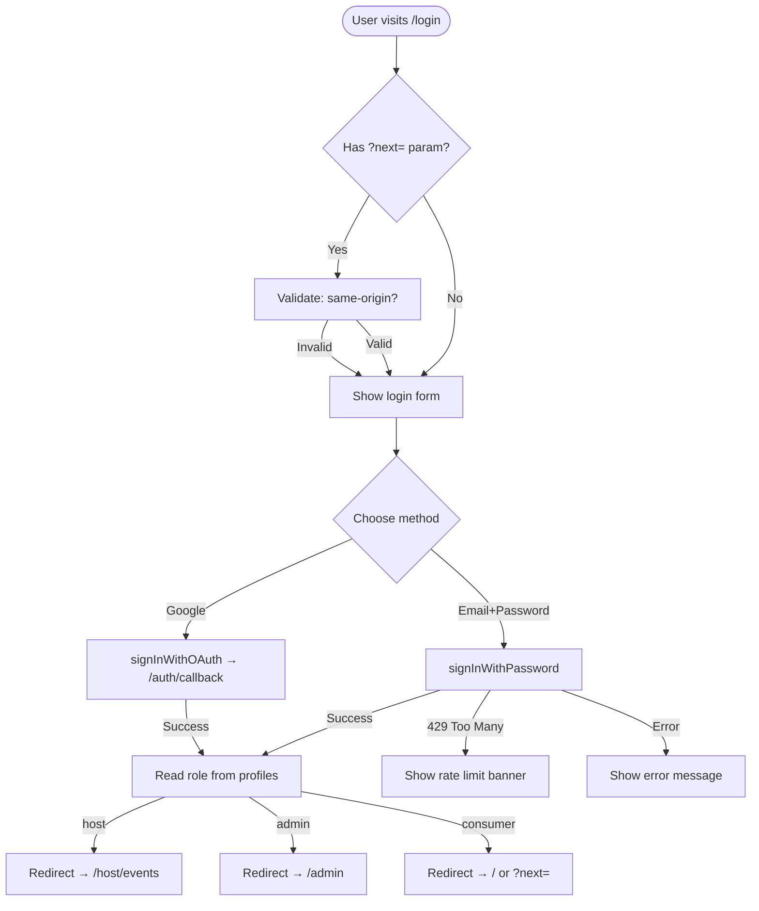

# Login
> Route: `/login`  
> User: All roles (Consumer, Host, Admin, Sponsor)  
> Phase: Core · P0

---

## Page Goal

Authenticate an existing user and redirect them to the appropriate post-login destination. Must be fast (< 2s to session), accessible, and not expose PII in URLs.

---

## User Stories

- As Camila, I want to log in with my Google account so I don't need to remember a password.
- As Roberto, I want to use email + password so I can log in from any browser.
- As a returning user, I want to be remembered so I don't re-authenticate on every visit.
- As a user who forgot my password, I want a quick recovery flow.

---

## Desktop Wireframe

```
┌────────────────────────────────────────────────────────────────────────────────┐
│  ▣ mdeai                                                                       │
├────────────────────────────────────────────────────────────────────────────────┤
│                                                                                │
│                         ┌──────────────────────────┐                          │
│                         │  Welcome back             │                          │
│                         │  Sign in to mdeai        │                          │
│                         │                          │                          │
│                         │  [🔵 Continue with Google]│                          │
│                         │                          │                          │
│                         │  ─────── or ────────      │                          │
│                         │                          │                          │
│                         │  Email                   │                          │
│                         │  [camila@example.com___] │                          │
│                         │                          │                          │
│                         │  Password                │                          │
│                         │  [••••••••••____________]│                          │
│                         │  [Forgot password?]      │                          │
│                         │                          │                          │
│                         │  [Sign In]               │                          │
│                         │                          │                          │
│                         │  Don't have an account?  │                          │
│                         │  [Create account →]      │                          │
│                         └──────────────────────────┘                          │
│                                                                                │
└────────────────────────────────────────────────────────────────────────────────┘
```

---

## Mobile Wireframe

```
┌─────────────────────────────────────┐
│  ▣ mdeai                           │
│  ─────────────────────────────     │
│                                     │
│  Welcome back                       │
│  Sign in to mdeai                  │
│                                     │
│  [🔵 Continue with Google]         │
│                                     │
│  ─────── or ────────               │
│                                     │
│  Email                              │
│  [camila@example.com___________]   │
│                                     │
│  Password                           │
│  [••••••••••____________________]  │
│                                     │
│  [Forgot password?]                 │
│                                     │
│  [Sign In]                          │
│                                     │
│  Don't have an account?            │
│  [Create account →]                │
└─────────────────────────────────────┘
```

---

## States

### Loading (after form submit)

```
┌──────────────────────────────────────┐
│  [Signing in...]                     │
│  ⏳ spinner next to button           │
│  Fields disabled                     │
└──────────────────────────────────────┘
```

### Error — Wrong Password

```
┌──────────────────────────────────────┐
│  Email                               │
│  [camila@example.com]                │
│                                      │
│  Password                            │
│  [•••••••] ← red border             │
│  🔴 Incorrect email or password.     │
│     [Forgot password?]               │
│                                      │
│  [Try Again]                         │
└──────────────────────────────────────┘
```

### Error — Too Many Attempts (Rate Limited)

```
┌──────────────────────────────────────┐
│  ⚠️ Too many attempts                │
│  Please wait 60 seconds before       │
│  trying again, or use               │
│  [Forgot password?] to reset.        │
└──────────────────────────────────────┘
```

### Error — Account Not Found

```
┌──────────────────────────────────────┐
│  🔴 No account found for this email. │
│  [Create an account →]               │
└──────────────────────────────────────┘
```

### Success — Redirect

```
┌──────────────────────────────────────┐
│  ✅ Signed in                        │
│  Redirecting...                      │
└──────────────────────────────────────┘
```
Redirect logic:
- `?next=` param → go there (only if same-origin, not `/logout`, not `/admin` unless role=admin)
- Host role → `/host/events`
- Admin role → `/admin`
- Consumer (default) → `/`

### Forgot Password Flow

```
┌──────────────────────────────────────┐
│  Reset your password                 │
│                                      │
│  Enter your email and we'll send     │
│  a reset link.                       │
│                                      │
│  [camila@example.com____________]    │
│  [Send Reset Link]                   │
│                                      │
│  ← Back to Sign In                  │
└──────────────────────────────────────┘

→ After submit:
┌──────────────────────────────────────┐
│  ✅ Check your email                 │
│  We sent a reset link to             │
│  camila@example.com                  │
│  (expires in 60 minutes)             │
└──────────────────────────────────────┘
```

---

## Components

| Component | Notes |
|---|---|
| `LoginCard` | Centered card, max-w-md, p-8 |
| `GoogleOAuthButton` | Supabase `signInWithOAuth({ provider: "google" })` |
| `EmailPasswordForm` | Controlled; shows field-level errors |
| `ForgotPasswordModal` | Inline or overlay; `supabase.auth.resetPasswordForEmail` |
| `AuthDivider` | "─── or ───" visual separator |
| `AuthErrorBanner` | `🔴` message for auth failures |
| `RateLimitBanner` | `⚠️` countdown for too-many-attempts |

---

## Data Contract / Auth Flow

```typescript
// Supabase email+password login
const { error } = await supabase.auth.signInWithPassword({
  email,
  password
})

// Google OAuth
await supabase.auth.signInWithOAuth({
  provider: "google",
  options: { redirectTo: `${origin}/auth/callback` }
})

// Password reset
await supabase.auth.resetPasswordForEmail(email, {
  redirectTo: `${origin}/auth/reset-password`
})
```

Supabase session is stored in cookies by `@supabase/ssr`. Redirect after login is handled in `src/app/auth/callback/route.ts`.

---

## Security Requirements

- **No PII in URL** — never put email in query params
- **Rate limiting** — Supabase auth has built-in; show countdown on 429
- **`?next=` validation** — parse and allow only same-origin paths; strip external domains silently
- **No "email exists" oracle** — wrong-password and account-not-found show the same "Incorrect email or password" message (no enumeration)
- **HTTPS only** — middleware redirects HTTP → HTTPS in production

---

## RLS / Auth

Login itself is Supabase Auth — no custom RLS policy needed. Post-login, the session JWT is used for all subsequent Supabase queries, which hit standard table RLS policies.

```sql
-- Ensure profiles.id = auth.uid() (set up in F01)
CREATE POLICY "users_own_profile"
  ON profiles FOR ALL
  USING (id = auth.uid());
```

---

## Mermaid — Login Flow



---

## Analytics Events

| Event | Properties |
|---|---|
| `auth.login_started` | `method`: `email` \| `google` |
| `auth.login_success` | `method`, `role` |
| `auth.login_failed` | `method`, `error_type` |
| `auth.password_reset_requested` | — |

---

## MVP / Post-MVP Scope

| Feature | Phase |
|---|---|
| Email + password login | Core P0 |
| Google OAuth | Core P0 |
| Forgot password | Core P0 |
| Rate limit UI | Core P0 |
| Role-based redirect | Core P0 |
| Magic link (passwordless) | MVP |
| Phone / WhatsApp OTP | Post-MVP |
| SSO (enterprise) | Post-MVP |
