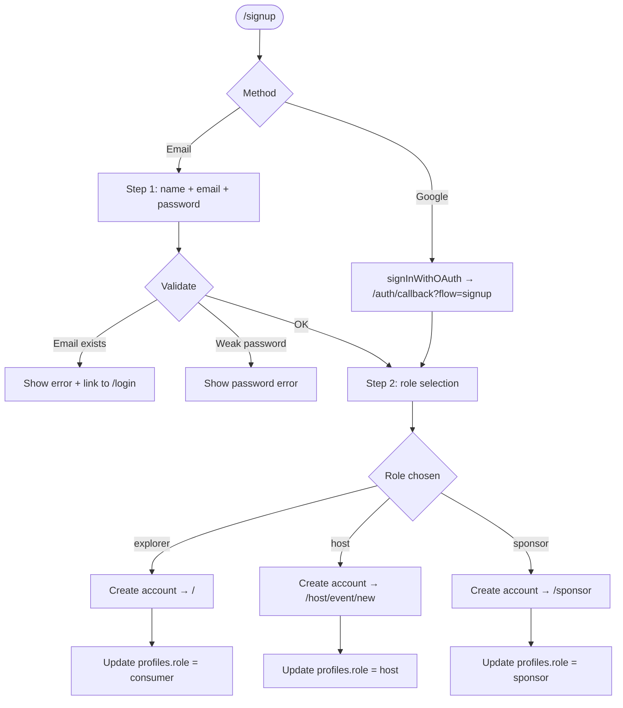

# Sign Up
> Route: `/signup`  
> User: New users (Consumer, Host, Sponsor)  
> Phase: Core · P0

---

## Page Goal

Register a new user, collect their role, and onboard them into the right part of the platform. Roberto lands in `/host/event/new`. Camila lands on `/`. Sponsors land on `/sponsor`.

---

## User Stories

- As Camila, I want to sign up with Google in one click so I can start browsing events immediately.
- As Roberto, I want to register as a Host so I see the host dashboard after signup.
- As a sponsor, I want to indicate my role at signup so the platform knows what to show me.
- As a new user, I want clear feedback if my email is already registered.

---

## Desktop Wireframe — Step 1: Account Info

```
┌────────────────────────────────────────────────────────────────────────────────┐
│  ▣ mdeai                                                                       │
├────────────────────────────────────────────────────────────────────────────────┤
│                                                                                │
│                         ┌──────────────────────────┐                          │
│                         │  Create your account      │                          │
│                         │  Step 1 of 2             │                          │
│                         │                          │                          │
│                         │  [🔵 Sign up with Google] │                          │
│                         │                          │                          │
│                         │  ─────── or ────────      │                          │
│                         │                          │                          │
│                         │  Full Name               │                          │
│                         │  [Camila González______]  │                          │
│                         │                          │                          │
│                         │  Email                   │                          │
│                         │  [camila@example.com___] │                          │
│                         │                          │                          │
│                         │  Password                │                          │
│                         │  [Create password______] │                          │
│                         │  Min 8 chars             │                          │
│                         │                          │                          │
│                         │  [Continue →]            │                          │
│                         │                          │                          │
│                         │  Already have an account?│                          │
│                         │  [Sign in →]             │                          │
│                         └──────────────────────────┘                          │
│                                                                                │
└────────────────────────────────────────────────────────────────────────────────┘
```

---

## Desktop Wireframe — Step 2: Role Selection

```
┌────────────────────────────────────────────────────────────────────────────────┐
│  ▣ mdeai                                                                       │
├────────────────────────────────────────────────────────────────────────────────┤
│                                                                                │
│                         ┌──────────────────────────┐                          │
│                         │  How will you use mdeai? │                          │
│                         │  Step 2 of 2             │                          │
│                         │                          │                          │
│                         │  ┌──────────────────────┐│                          │
│                         │  │  🙋 I'm exploring     ││ ← selected (default)    │
│                         │  │  Find events, rentals,││                          │
│                         │  │  and places to go.   ││                          │
│                         │  └──────────────────────┘│                          │
│                         │                          │                          │
│                         │  ┌──────────────────────┐│                          │
│                         │  │  🎪 I'm a Host        ││                          │
│                         │  │  Organize events and  ││                          │
│                         │  │  manage ticket sales. ││                          │
│                         │  └──────────────────────┘│                          │
│                         │                          │                          │
│                         │  ┌──────────────────────┐│                          │
│                         │  │  💼 I'm a Sponsor     ││                          │
│                         │  │  Find events to       ││                          │
│                         │  │  partner with.        ││                          │
│                         │  └──────────────────────┘│                          │
│                         │                          │                          │
│                         │  [Create Account]        │                          │
│                         └──────────────────────────┘                          │
│                                                                                │
└────────────────────────────────────────────────────────────────────────────────┘
```

---

## Mobile Wireframe — Step 1

```
┌─────────────────────────────────────┐
│  ▣ mdeai                           │
│  ─────────────────────────────     │
│                                     │
│  Create your account               │
│  Step 1 of 2                       │
│                                     │
│  [🔵 Sign up with Google]          │
│                                     │
│  ─────── or ────────               │
│                                     │
│  Full Name                          │
│  [Camila González______________]   │
│                                     │
│  Email                              │
│  [camila@example.com___________]   │
│                                     │
│  Password (min 8 chars)             │
│  [Create password_______________]  │
│                                     │
│  [Continue →]                       │
│                                     │
│  Already have an account?          │
│  [Sign in →]                       │
└─────────────────────────────────────┘
```

## Mobile Wireframe — Step 2

```
┌─────────────────────────────────────┐
│  ← Back                            │
│                                     │
│  How will you use mdeai?           │
│  Step 2 of 2                       │
│                                     │
│  ┌───────────────────────────────┐ │
│  │  🙋 I'm exploring             │ │ ← selected
│  │  Find events, rentals, places │ │
│  └───────────────────────────────┘ │
│                                     │
│  ┌───────────────────────────────┐ │
│  │  🎪 I'm a Host                │ │
│  │  Organize events & tickets    │ │
│  └───────────────────────────────┘ │
│                                     │
│  ┌───────────────────────────────┐ │
│  │  💼 I'm a Sponsor             │ │
│  │  Find events to partner with  │ │
│  └───────────────────────────────┘ │
│                                     │
│  [Create Account]                   │
└─────────────────────────────────────┘
```

---

## States

### Validation Error — Email Already Registered

```
┌──────────────────────────────────────┐
│  Email                               │
│  [camila@example.com] ← red border  │
│  🔴 This email is already registered.│
│     [Sign in instead →]              │
└──────────────────────────────────────┘
```

### Validation Error — Weak Password

```
┌──────────────────────────────────────┐
│  Password                            │
│  [pass] ← red border                │
│  🔴 Password must be at least 8      │
│     characters.                      │
└──────────────────────────────────────┘
```

### Loading (after Create Account)

```
┌──────────────────────────────────────┐
│  [Creating account...]               │
│  ⏳ spinner                          │
│  Fields disabled                     │
└──────────────────────────────────────┘
```

### Success — Email Verification Required

```
┌──────────────────────────────────────┐
│  ✉️ Check your email                 │
│  We sent a confirmation link to      │
│  camila@example.com                  │
│                                      │
│  Click the link to activate your    │
│  account.                            │
│                                      │
│  Didn't get it? [Resend email]       │
└──────────────────────────────────────┘
```

### Success — Google OAuth (no verification needed)

Google OAuth users are auto-confirmed. After Google callback, go directly to role selection (Step 2), then redirect.

---

## Post-Signup Redirect

| Role selected | Redirect destination |
|---|---|
| Explorer (consumer) | `/` |
| Host | `/host/event/new` with AI onboarding prompt |
| Sponsor | `/sponsor` |

---

## Components

| Component | Notes |
|---|---|
| `SignupStep1` | Name, email, password form with Google OAuth |
| `SignupStep2` | Role card selector (Explorer / Host / Sponsor) |
| `RoleCard` | Clickable card with icon + description; highlights on select |
| `GoogleOAuthButton` | Same as login; same `supabase.signInWithOAuth` |
| `PasswordStrengthMeter` | Optional visual; green at 8+ chars |
| `AuthErrorBanner` | Field-level or form-level errors |
| `EmailSentConfirmation` | Post-signup state for email verification |

---

## Data Contract / Auth Flow

```typescript
// Step 1: create user
const { data, error } = await supabase.auth.signUp({
  email,
  password,
  options: {
    data: { full_name: name }  // stored in auth.users.raw_user_meta_data
  }
})

// Step 2: write role to profiles
await supabase
  .from("profiles")
  .update({ role })
  .eq("id", data.user.id)

// Google OAuth (single step; role set on callback)
await supabase.auth.signInWithOAuth({
  provider: "google",
  options: { redirectTo: `${origin}/auth/callback?flow=signup` }
})
```

`profiles` row is created by a Supabase `auth.users` trigger (INSERT on auth.users → INSERT profiles). Role defaults to `consumer`; Step 2 updates it.

---

## Security Requirements

- **No enumeration** — email-already-registered message is acceptable at signup (unlike login) because the user is trying to create an account; redirect to sign-in does not confirm the password
- **Password minimum** — 8 chars; enforce client-side AND server-side (Supabase Auth settings)
- **Email verification** — required for email+password; skip for OAuth
- **HTTPS only** — middleware redirect
- **No role escalation** — `role: "admin"` cannot be set via signup form; admin role set only by existing admin in `/admin/users`

---

## RLS Policy

```sql
-- profiles: users can only insert/update their own row
ALTER TABLE profiles ENABLE ROW LEVEL SECURITY;

CREATE POLICY "users_insert_own_profile"
  ON profiles FOR INSERT
  WITH CHECK (id = auth.uid());

CREATE POLICY "users_update_own_profile"
  ON profiles FOR UPDATE
  USING (id = auth.uid());

-- prevent self-promotion to admin
CREATE POLICY "no_role_escalation"
  ON profiles FOR UPDATE
  USING (id = auth.uid())
  WITH CHECK (role IN ('consumer', 'host', 'sponsor'));
```

---

## Mermaid — Signup Flow



---

## Analytics Events

| Event | Properties |
|---|---|
| `auth.signup_started` | `method`: `email` \| `google` |
| `auth.signup_step2_viewed` | — |
| `auth.signup_completed` | `method`, `role` |
| `auth.signup_failed` | `reason` |
| `auth.email_verification_sent` | — |
| `auth.email_resent` | — |

---

## MVP / Post-MVP Scope

| Feature | Phase |
|---|---|
| Email + password signup | Core P0 |
| Google OAuth signup | Core P0 |
| Role selection (Explorer/Host/Sponsor) | Core P0 |
| Email verification | Core P0 |
| Loading / error / success states | Core P0 |
| Referral code at signup | MVP |
| Invite-only host signup | MVP |
| Phone verification | Post-MVP |
