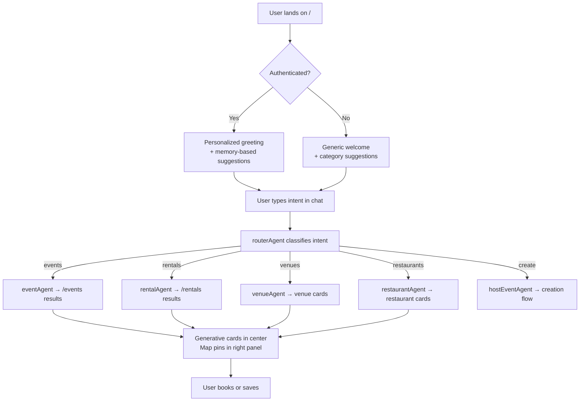

# Home — AI Concierge
> Route: `/`  
> User: All (consumer default)  
> Phase: Core · P0

---

## Page Goal
Replace the traditional homepage hero + category grid with a chat-first concierge. The first thing the user sees is an invitation to talk. The agent understands any intent — events, rentals, restaurants, venues — and routes intelligently.

---

## User Stories
- As a tourist, I want to describe my evening and get a complete plan, so I don't have to switch between 5 apps.
- As a local, I want to say "what's on this weekend" and get personalized results, not a category filter.
- As a new user, I want to understand what the platform does within 5 seconds.

---

## Desktop Wireframe

```
┌────────────────────────────────────────────────────────────────────────────────┐
│  ▣ mdeai                                      🔔 Notifications  [Sign In]     │
├─────────────────┬──────────────────────────────────────┬───────────────────────┤
│  LEFT 280px     │  CENTER                              │  RIGHT 360px          │
│  ─────────────  │  ────────────────────────────────    │  ──────────────────── │
│  🏠 Home  ←    │                                      │                       │
│  📅 Events      │      Good evening, Camila 👋         │  ┌─────────────────┐  │
│  🏠 Rentals     │                                      │  │  Medellín        │  │
│  🏢 Venues      │      What would you like to do?      │  │  [Google Map]    │  │
│  🍽️ Restaurants │                                      │  │                  │  │
│  ☕ Cafes       │  ┌──────────────────────────────┐   │  │  El Poblado ●    │  │
│  🌙 Nightlife   │  │  Suggestions:                │   │  │  Laureles ●      │  │
│  ─────────────  │  │                              │   │  │  El Centro ●     │  │
│  📌 Saved (3)   │  │  🎵 Jazz Night · Fri 9pm     │   │  │                  │  │
│  🕐 Recent      │  │  🏠 2BR Laureles · $950/mo   │   │  └─────────────────┘  │
│  ─────────────  │  │  🍽️ New restaurant · Provenza│   │                       │
│  🧠 Memory      │  │  🏢 Venue · Parque Lleras    │   │  ┌─────────────────┐  │
│  "Likes jazz"   │  │                              │   │  │  Trending        │  │
│  "Laureles"     │  └──────────────────────────────┘   │  │  ─────────────  │  │
│  "$1,200 budget"│                                      │  │  🎤 Salsa Night  │  │
│  ─────────────  │  ┌──────────────────────────────┐   │  │  this Saturday   │  │
│  [+ Create]     │  │  💬 Tell me what you need... │   │  │                  │  │
│                 │  │                          [▶] │   │  │  🏠 New Listing  │  │
│                 │  └──────────────────────────────┘   │  │  El Estadio      │  │
│                 │                                      │  └─────────────────┘  │
└─────────────────┴──────────────────────────────────────┴───────────────────────┘
```

---

## Mobile Wireframe

```
┌─────────────────────────────────────────┐
│  ▣ mdeai                    [Sign In]  │
├─────────────────────────────────────────┤
│                                         │
│     Good evening, Camila 👋             │
│     What would you like to do?          │
│                                         │
│  ┌─────────────────────────────────┐   │
│  │ 🎵 Jazz Night · Fri 9pm         │   │
│  └─────────────────────────────────┘   │
│  ┌─────────────────────────────────┐   │
│  │ 🏠 2BR Laureles · $950/mo       │   │
│  └─────────────────────────────────┘   │
│  ┌─────────────────────────────────┐   │
│  │ 🍽️ New: Oci.Mde · Provenza     │   │
│  └─────────────────────────────────┘   │
│                                         │
│  [Explore Map  🗺️]                     │
│                                         │
│                      ┌──────────────┐  │
│                      │  💬 Chat FAB │  │
│                      └──────────────┘  │
├─────────────────────────────────────────┤
│  🏠    📅    🗺️    📌    👤            │
└─────────────────────────────────────────┘
```

---

## Components
- `GreetingHeader` — personalized with name + time of day
- `SuggestionCards` — 3–4 AI-generated suggestions from working memory
- `CopilotChat` (center) or `CopilotPopup` FAB (mobile)
- `MiniMap` — Medellín map with neighborhood highlights (right panel)
- `TrendingWidget` — trending events/listings this week (right panel)
- `RecentActivity` — last 3 interactions (left panel)
- `MemorySnapshot` — 3 remembered facts (left panel)

---

## Data Sources
| Data | Source | Agent |
|---|---|---|
| Personalized suggestions | Working memory + Supabase events | `conciergeAgent` |
| Trending events | Supabase `events` by booking count | Pre-fetched server component |
| Trending rentals | Supabase `rentals` by inquiry count | Pre-fetched server component |
| Map neighborhoods | Static GeoJSON + Supabase event counts | Client-side |
| Memory facts | Mastra LibSQL thread store | `conciergeAgent` |

---

## User Actions
| Action | What Happens |
|---|---|
| Type in chat | `routerAgent` classifies intent → routes to specialist agent |
| Click suggestion card | Pre-fills chat with that intent → immediate search |
| Click "Explore Map" | Opens full-screen map explorer |
| Click category in left nav | Navigates to domain page (e.g. `/events`) |
| Click `+ Create` | Opens `hostEventAgent` creation flow |

---

## AI Features
| Feature | Hook | Behavior |
|---|---|---|
| Personalized greeting | Working memory | Shows name + remembered preferences |
| Smart suggestions | `conciergeAgent` | 4 cards generated from memory + trending data |
| Intent routing | `routerAgent` | "Find a cafe" → `cafeAgent`; "Create event" → `hostEventAgent` |
| Persistent memory | `useCopilotReadable` | Agent always knows user role, saved items, last searches |

---

## Success State
- User types intent → agent responds with relevant cards within 2 seconds
- Map shows neighborhood activity overlays
- Suggestions reflect actual history (not generic)

## Empty State (new user)
- Generic greeting: "Welcome to mdeai — what are you looking for?"
- 4 generic suggestion cards by category
- No memory section in left panel

## Loading State (initial page load)

```
┌────────────────────────────────────────────────────────┐
│  Good evening...                                       │
│  ─────────────────────────────────────────────────    │
│  [███████████████░░░░░░░░░░░░░░]  ← suggestion skeleton│
│  [███████████████░░░░░░░░░░░░░░]  ← suggestion skeleton│
│  [███████████████░░░░░░░░░░░░░░]  ← suggestion skeleton│
│                                                        │
│  [Loading map...] ← right panel skeleton              │
└────────────────────────────────────────────────────────┘
```

Personalized greeting appears as soon as auth resolves; suggestion cards animate in when agent responds (< 2s target).

## Error State (agent timeout)

```
┌────────────────────────────────────────────────────────┐
│  Good evening, Camila 👋                               │
│  ─────────────────────────────────────────────────    │
│  🔴 Chat is temporarily unavailable.                   │
│     Browse by category while we reconnect.            │
│                                                        │
│  [📅 Events]  [🏠 Rentals]  [🍽️ Restaurants]         │
│  [🏢 Venues]  [☕ Cafes]    [🌙 Nightlife]            │
└────────────────────────────────────────────────────────┘
```

## Offline State (no network)

```
┌────────────────────────────────────────────────────────┐
│  ▣ mdeai · Offline                                    │
│  ─────────────────────────────────────────────────    │
│  📡 No internet connection                             │
│                                                        │
│  Recently viewed (cached):                            │
│  🎵 Jazz Night · Fri Jan 10 · saved                  │
│  🏠 Apto El Estadio · Laureles                        │
│                                                        │
│  [Retry Connection]                                    │
└────────────────────────────────────────────────────────┘
```

Offline: show cached suggestion cards from `localStorage`; disable chat input with "No internet — chat unavailable" tooltip; map shows last-rendered tiles.

## Empty State (new user, no memory)

```
┌────────────────────────────────────────────────────────┐
│  Welcome to mdeai 👋                                   │
│  Medellín's AI-powered city guide.                    │
│  ─────────────────────────────────────────────────    │
│  [🎵 Events]  [🏠 Rentals]  [🍽️ Food]               │
│  [🏢 Venues]  [☕ Work]     [🌙 Nightlife]            │
│                                                        │
│  [💬 Tell me what you're looking for...]              │
└────────────────────────────────────────────────────────┘
```

No memory section in left panel. No personalized greeting. 4 generic category suggestion cards.

---

## Mermaid User Flow


