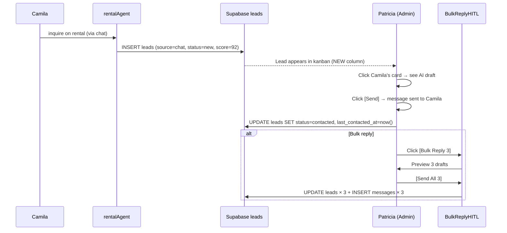

# CRM Leads Pipeline
> Route: `/admin/crm`  
> User: Admin (Patricia) + Hosts  
> Phase: MVP · P1  
> Audit score: 81/100 → **89/100** (v2)

---

## Page Goal

Surface and prioritize rental/venue/event inquiries for follow-up. AI scores leads, drafts replies, and surfaces time-sensitive ones. Patricia works from the kanban; hosts access their own pipeline via `/host/rentals` or `/host/events/[id]/attendees`.

---

## Desktop Wireframe

```
┌────────────────────────────────────────────────────────────────────────────────┐
│  ▣ mdeai  CRM — Leads Pipeline                                    🔔  Patricia│
├─────────────────┬──────────────────────────────────────┬───────────────────────┤
│  LEFT 280px     │  CENTER — Kanban Pipeline            │  RIGHT 360px          │
│  ─────────────  │                                      │                       │
│  Pipeline       │  NEW (4)  CONTACTED (3)  VIEWING(2)  │  ┌─────────────────┐  │
│  Total: 18      │  CLOSED-WON(1)  CLOSED-LOST(2)       │  │  Lead Detail    │  │
│  ─────────────  │  ─────────────────────────────────   │  │  Camila G       │  │
│  Domain         │  ┌──────────┐ ┌────────────┐         │  │  ─────────────  │  │
│  ● Rentals      │  │Camila G  │ │Ana R       │         │  │  Source: Chat   │  │
│  ○ Events       │  │Score: 92 │ │Score: 85   │         │  │  Assigned: Rosa │  │
│  ○ Venues       │  │Src: Chat │ │Src: Form   │         │  │  Inquiry: 2BR   │  │
│  ○ Sponsors     │  │→ Rosa    │ │→ Rosa      │         │  │  Budget: $950+  │  │
│  ─────────────  │  │2hr ago   │ │Contacted   │         │  │  Move-in: Jan 15│  │
│  Assigned To    │  │[Reply]   │ │[Schedule]  │         │  │  Pets: Yes      │  │
│  ● All          │  └──────────┘ └────────────┘         │  │  Score: 92/100  │  │
│  ○ Rosa         │                                      │  │  ─────────────  │  │
│  ○ Carlos       │  ┌──────────┐ ┌────────────┐         │  │  AI Draft Reply:│  │
│  ─────────────  │  │Miguel T  │ │Carlos M    │         │  │  "Hi Camila,    │  │
│  Source         │  │Score: 71 │ │Score: 78   │         │  │  Great to hear  │  │
│  ● All          │  │Src: Form │ │Src: Chat   │         │  │  from you..."   │  │
│  ○ Chat         │  │→ Carlos  │ │→ Carlos    │         │  │  [Edit] [Send▶] │  │
│  ○ Form         │  │1 day ago │ │Viewing set │         │  └─────────────────┘  │
│  ○ WhatsApp     │  │[Reply]   │ │[Confirm]   │         │                       │
│  ─────────────  │  └──────────┘ └────────────┘         │  ┌─────────────────┐  │
│  Time Period     │                                      │  │  AI Summary     │  │
│  ● This week    │  ─────── CLOSED-WON ──────           │  │  "Reply to      │  │
│  ○ This month   │  ┌──────────┐                         │  │  Camila first   │  │
│  ─────────────  │  │Diego F   │                         │  │  — highest score│  │
│  Actions        │  │Signed ✅ │                         │  │  2h unanswered" │  │
│  [Export CSV]   │  │$950/mo   │                         │  └─────────────────┘  │
│  [Bulk Reply]   │  └──────────┘                         │                       │
│                 │  ┌──────────────────────────────┐   │                       │
│                 │  │ 💬 Ask about your leads  [▶] │   │                       │
│                 │  └──────────────────────────────┘   │                       │
└─────────────────┴──────────────────────────────────────┴───────────────────────┘
```

---

## HITL — Bulk Reply Preview

```
┌────────────────────────────────────────────────────────┐
│  📨 Send Bulk Replies (3 leads)                        │
│                                                        │
│  Lead: Camila G                                        │
│  "Hi Camila, great to hear from you! The apartment    │
│  at El Estadio is available Jan 15..."                 │
│                                                        │
│  Lead: Ana R                                           │
│  "Hi Ana, thanks for your inquiry. We'd love to..."   │
│                                                        │
│  Lead: Miguel T                                        │
│  "Hi Miguel, thanks for reaching out..."              │
│                                                        │
│  [✅ Send All 3]   [Edit Individually]   [Cancel]     │
│                                                        │
│  These messages will be logged in the audit history.  │
└────────────────────────────────────────────────────────┘
```

---

## States

### Loading State

```
┌────────────────────────────────────────────────────────┐
│  CRM — Leads Pipeline                                  │
│  [███░░░░░░░░] [███░░░░░░░░] [███░░░░░░░░]             │ ← kanban columns
│  Loading leads...                                      │
└────────────────────────────────────────────────────────┘
```

### Empty State (no leads yet)

```
┌────────────────────────────────────────────────────────┐
│  CRM — Leads Pipeline                                  │
│                                                        │
│  📥  No leads yet                                     │
│                                                        │
│  Leads appear here when users inquire about          │
│  rentals, venues, or event partnerships.             │
│                                                        │
│  [View Active Listings]                               │
└────────────────────────────────────────────────────────┘
```

### Error State

```
┌────────────────────────────────────────────────────────┐
│  🔴 Could not load pipeline.                           │
│     [Retry]                                            │
└────────────────────────────────────────────────────────┘
```

---

## Mobile Wireframe

```
┌─────────────────────────────────────┐
│  ← CRM · Leads (18)               │
│  [Filter ▾] [Assigned: All ▾]      │
│  ─────────────────────────────     │
│  🔴 Camila G · Rental · Score 92   │
│  Src: Chat · → Rosa · 2h ago       │
│  [Reply] [Move →]                  │
│                                     │
│  🟡 Ana R · Rental · Score 85      │
│  Src: Form · → Rosa · Contacted    │
│  [Schedule] [Move →]               │
│                                     │
│  🟡 Miguel T · Rental · Score 71   │
│  Src: Form · → Carlos · 1d ago     │
│  [Reply] [Move →]                  │
│  ─────────────────────────────     │
│  [💬 Ask about leads]              │
└─────────────────────────────────────┘
```

---

## Components

| Component | Props | Notes |
|---|---|---|
| `KanbanBoard` | `columns[]`, `isLoading` | Pipeline stages as columns; leads as cards |
| `KanbanSkeleton` | — | Loading state |
| `KanbanEmptyState` | `onViewListings` | First-run empty |
| `LeadCard` | `lead`, `onReply`, `onMove` | Shows name, score, **source**, **assigned**, time since inquiry |
| `AIScoreBadge` | `score` | Green 80+, yellow 60–79, red <60 |
| `SourceBadge` | `source: chat \| form \| whatsapp` | Where lead originated |
| `AssignedBadge` | `assignee` | Who owns this lead |
| `LeadDetailPanel` | `lead`, `draft` | Full detail + AI draft reply in right panel |
| `BulkReplyButton` | `selectedLeads`, `onSend` | Requires HITL before sending |
| `BulkReplyHITL` | `respond`, `leads[]`, `drafts[]` | Preview all drafts with send/edit/cancel |
| `LeadAssignDropdown` | `lead`, `agents[]` | Reassign owner |

---

## Data Contract

```typescript
type Lead = {
  id: string
  user_id: string
  display_name: string      // from profiles
  entity_id: string         // rental_id | venue_id | event_id
  entity_type: "rental" | "venue" | "event"
  message: string
  status: "new" | "contacted" | "viewing" | "closed_won" | "closed_lost"
  score: number             // 0–100, AI-computed
  source: "chat" | "form" | "whatsapp" | "direct"  // NEW field
  assigned_to: string | null  // admin user_id; NEW field
  created_at: string
  last_contacted_at: string | null
}
```

---

## AI Features

| Feature | Trigger | HITL? | Notes |
|---|---|---|---|
| Lead scoring | On inquiry create | No — auto | `score` on `leads` row |
| Priority surfacing | Page load | No | "Reply to Camila — highest score, 2h unanswered" |
| Draft reply | Click lead card | No — shows in panel | Editable before send |
| Bulk reply drafts | Click [Bulk Reply] | Yes — HITL | Preview all drafts before batch send |
| Follow-up nudge | 48h no reply | No — notification | "Ana hasn't replied — want a gentle nudge?" |
| Stage move | Chat command | No | "Move Camila to Viewing Scheduled" |

---

## RLS Policy

```sql
-- Admins see all leads; hosts see only their own
ALTER TABLE leads ENABLE ROW LEVEL SECURITY;

CREATE POLICY "admin_all_leads"
  ON leads FOR ALL
  USING (
    EXISTS (
      SELECT 1 FROM profiles WHERE id = auth.uid() AND role = 'admin'
    )
  );

CREATE POLICY "host_own_leads"
  ON leads FOR SELECT
  USING (
    entity_id IN (
      SELECT id FROM rentals WHERE host_id = auth.uid()
      UNION ALL
      SELECT id FROM venues WHERE owner_id = auth.uid()
    )
  );
```

---

## Mermaid — CRM Lead Flow



---

## Analytics Events

| Event | Properties |
|---|---|
| `crm.lead_viewed` | `lead_id`, `score` |
| `crm.lead_replied` | `lead_id`, `was_ai_draft` |
| `crm.bulk_reply_sent` | `lead_count` |
| `crm.lead_stage_changed` | `lead_id`, `from_stage`, `to_stage` |
| `crm.lead_assigned` | `lead_id`, `assignee` |
| `crm.csv_exported` | `filter_domain`, `count` |

---

## MVP / Post-MVP Scope

| Feature | Phase |
|---|---|
| Kanban with 5 stages | MVP P1 |
| AI score badge | MVP P1 |
| Source + assigned fields | MVP P1 |
| AI draft reply (single) | MVP P1 |
| Bulk reply with HITL | MVP P1 |
| Loading / empty / error states | MVP P1 |
| WhatsApp integration | Advanced |
| CRM email sync | Post-MVP |
| SLA tracking | Post-MVP |
