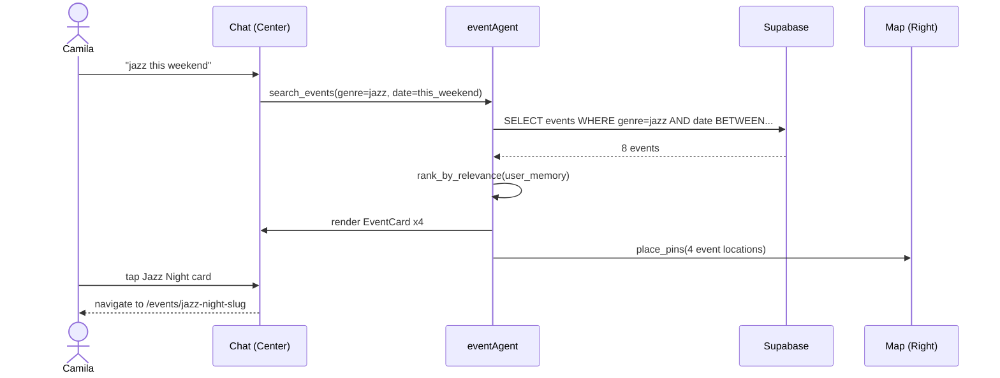

# Event Discovery
> Route: `/events`  
> User: Consumer  
> Phase: Core · P0

---

## Page Goal
Replace keyword search + date filter with a chat-first event discovery surface. AI understands intent ("jazz this weekend", "networking for founders", "something free near me") and surfaces ranked, explained recommendations alongside a live map.

---

## Desktop Wireframe

```
┌────────────────────────────────────────────────────────────────────────────────┐
│  ▣ mdeai                              Events            🔔  [Camila ▾]        │
├─────────────────┬──────────────────────────────────────┬───────────────────────┤
│  LEFT 280px     │  CENTER                              │  RIGHT 360px          │
│  ─────────────  │  ─────────────────────────────────   │  ──────────────────── │
│  📅 Events  ←  │                                      │                       │
│  • This Weekend │  AI: "Found 4 events matching         │  ┌─────────────────┐  │
│  • This Week    │  'jazz this weekend in El Poblado'.   │  │  🗺️ Medellín    │  │
│  • Free         │  Sorted by relevance."               │  │                  │  │
│  • Networking   │                                      │  │  [●] Jazz Night  │  │
│  ─────────────  │  ┌─────────────────────────────┐    │  │  [●] Salsa       │  │
│  By Type        │  │ 🎵 Jazz Night at Casa Bali   │    │  │  [●] Startup MX  │  │
│  • Music        │  │ Fri Jan 10 · 9pm–1am         │    │  │  [●] Comedy      │  │
│  • Networking   │  │ El Poblado · $25 · 48 left   │    │  │                  │  │
│  • Art          │  │ ⭐ AI pick: "Matches your    │    │  └─────────────────┘  │
│  • Food         │  │ jazz preference"             │    │                       │
│  • Sports       │  │ [View Details] [Save ♡]      │    │  ┌─────────────────┐  │
│  ─────────────  │  └─────────────────────────────┘    │  │ Filter by        │  │
│  Neighborhoods  │                                      │  │ ○ This weekend   │  │
│  • El Poblado   │  ┌─────────────────────────────┐    │  │ ● This week      │  │
│  • Laureles     │  │ 💃 Salsa Social · Laureles   │    │  │ ─────────────── │  │
│  • El Centro    │  │ Sat Jan 11 · 8pm–12am        │    │  │ Price            │  │
│  • Envigado     │  │ Laureles · Free · 120 left   │    │  │ [──●──────] $50  │  │
│  ─────────────  │  │ [View Details] [Save ♡]      │    │  └─────────────────┘  │
│  📌 Saved (3)   │  └─────────────────────────────┘    │                       │
│                 │                                      │                       │
│                 │  ┌─────────────────────────────┐    │                       │
│                 │  │ 💼 Startup Mixer · Ruta N    │    │                       │
│                 │  │ Sun Jan 12 · 4–7pm           │    │                       │
│                 │  │ El Centro · $15 · 32 left    │    │                       │
│                 │  │ [View Details] [Save ♡]      │    │                       │
│                 │  └─────────────────────────────┘    │                       │
│                 │                                      │                       │
│                 │  ────────────────────────────────    │                       │
│                 │  ┌──────────────────────────────┐   │                       │
│                 │  │ 💬 What kind of event?   [▶] │   │                       │
│                 │  └──────────────────────────────┘   │                       │
└─────────────────┴──────────────────────────────────────┴───────────────────────┘
```

---

## Mobile Wireframe

```
┌─────────────────────────────────────────┐
│  ← Back    Events    [List⊞] [Map🗺]   │
├─────────────────────────────────────────┤
│                                         │
│  [💬 What kind of event?          ▶ ]  │
│                                         │
│  AI: "4 jazz events this weekend"       │
│                                         │
│  ┌─────────────────────────────────┐   │
│  │ 🎵 Jazz Night · Casa Bali       │   │
│  │ Fri · 9pm · $25 · 48 left       │   │
│  │ ⭐ AI pick                      │   │
│  │ [View]  [Save ♡]                │   │
│  └─────────────────────────────────┘   │
│  ┌─────────────────────────────────┐   │
│  │ 💃 Salsa Social · Laureles      │   │
│  │ Sat · 8pm · Free · 120 left     │   │
│  │ [View]  [Save ♡]                │   │
│  └─────────────────────────────────┘   │
│  ┌─────────────────────────────────┐   │
│  │ 💼 Startup Mixer · Ruta N       │   │
│  │ Sun · 4pm · $15 · 32 left       │   │
│  │ [View]  [Save ♡]                │   │
│  └─────────────────────────────────┘   │
│  [Load more events...]                  │
├─────────────────────────────────────────┤
│  🏠    📅←    🗺️    📌    👤           │
└─────────────────────────────────────────┘
```

---

## Components
- `EventCard` — event name, date/time, venue, price, seats left, AI pick badge, save button
- `CopilotSidebar` (center) — chat + card results
- `MapPanel` — Google Maps with event pins (right panel)
- `FilterPanel` — date range, price, type, neighborhood (right panel)
- `AIPick` badge — "Matches your jazz preference" (working memory–driven)
- `SeatsBadge` — urgency signal ("48 left", "Almost sold out!")
- `SaveButton` — heart icon, adds to saved collection

---

## Data Sources
| Data | Source | Agent |
|---|---|---|
| Events list | Supabase `events` WHERE status=published | `eventAgent` |
| Ranking + AI pick | Working memory match score | `eventAgent` |
| Map pins | `useCoAgent` state from agent search | `mapsAgent` |
| User preferences | Mastra working memory | `conciergeAgent` |

---

## User Actions
| Action | Result |
|---|---|
| Type in chat | `eventAgent` re-searches with new intent |
| Click event card | Navigate to `/events/[slug]` |
| Click Save ♡ | Add to saved collection (optimistic UI) |
| Click map pin | Right panel shows event detail card |
| Toggle List/Map (mobile) | Switch view mode |
| Click filter chip | Agent re-queries with filter applied |

---

## AI Features
- `AIPick` badge: agent explains why this event matches user's history
- Pre-populated suggestions from working memory on route load
- "Almost sold out" urgency: agent surfaces scarcity signals
- Nearby restaurant suggestion: "After the jazz night, Oci.Mde is 200m away"

---

## Success State
- 3–6 ranked event cards appear in under 2 seconds
- Map pins match cards
- AI explains its top pick

## Empty State
```
┌────────────────────────────────┐
│  No events found for that      │
│  search. Try:                  │
│  • "This weekend in Medellín"  │
│  • "Free events near me"       │
│  • "Networking next week"      │
└────────────────────────────────┘
```

## Error State
- Supabase offline: show cached results with "Results may be out of date" banner

---

## Mermaid User Flow


