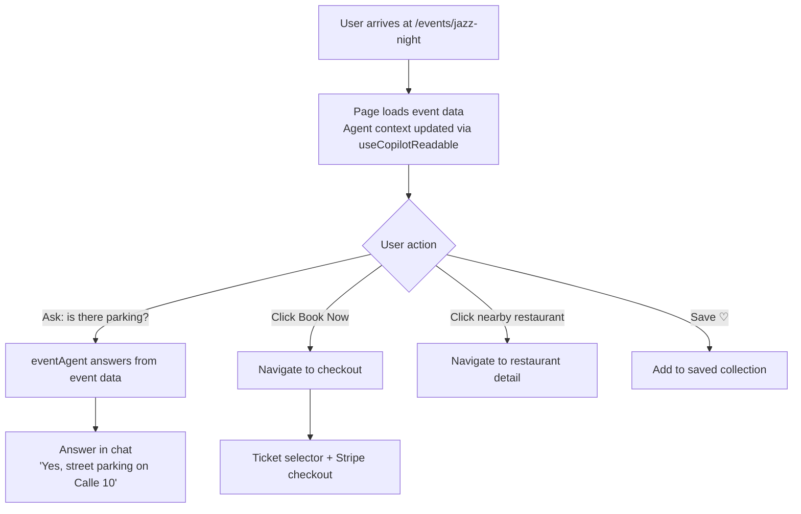

# Event Details
> Route: `/events/[slug]`  
> User: Consumer  
> Phase: Core · P0

---

## Page Goal
Replace static event page (scroll to buy) with an AI-native detail view. Agent is already context-aware of this event and can answer questions, suggest companions, recommend nearby restaurants, and initiate booking — all from chat.

---

## Desktop Wireframe

```
┌────────────────────────────────────────────────────────────────────────────────┐
│  ▣ mdeai  ← Events                    Jazz Night at Casa Bali    🔔           │
├─────────────────┬──────────────────────────────────────┬───────────────────────┤
│  LEFT 280px     │  CENTER                              │  RIGHT 360px          │
│  ─────────────  │                                      │  ──────────────────── │
│  ← Back to      │  ┌──────────────────────────────┐   │  ┌─────────────────┐  │
│  Events         │  │  [Event Hero Photo]           │   │  │  🗺️ Casa Bali   │  │
│  ─────────────  │  │  Jazz Night at Casa Bali      │   │  │  El Poblado     │  │
│  📅 This Event  │  │  Fri Jan 10 · 9pm–1am         │   │  │  [map pin ●]    │  │
│                 │  └──────────────────────────────┘   │  └─────────────────┘  │
│  Event Info     │                                      │                       │
│  📍 Casa Bali   │  ┌─────────────────────────────┐    │  ┌─────────────────┐  │
│  📅 Fri Jan 10  │  │  🎫 Tickets                  │    │  │  Book Tickets   │  │
│  ⏰ 9pm–1am     │  │  ─────────────────────────   │    │  │  ─────────────  │  │
│  💰 From $25    │  │  GA · $25 · 48 remaining     │    │  │  GA  $25   [+2] │  │
│  🎟️ 48 left     │  │  VIP · $60 · 12 remaining    │    │  │  VIP $60   [+1] │  │
│  ─────────────  │  │  [Select Tickets ▶]          │    │  │  ─────────────  │  │
│  Host           │  └─────────────────────────────┘    │  │  Total: $50     │  │
│  [Avatar] Diego │                                      │  │                 │  │
│  ⭐ 4.9 host    │  ┌─────────────────────────────┐    │  │ [Book Now — $50]│  │
│  ─────────────  │  │  📝 About this event         │    │  │                 │  │
│  Share          │  │  Live jazz from the city's   │    │  │  ─────────────  │  │
│  [🔗] [📱]     │  │  top quartet. Cocktails.     │    │  │  ⚡ AI: "Based  │  │
│  ─────────────  │  │  Open bar 9–11pm.            │    │  │  on your taste, │  │
│  Nearby         │  └─────────────────────────────┘    │  │  this is a 92%  │  │
│  🍽️ Oci.Mde    │                                      │  │  match"         │  │
│  200m · ⭐4.8  │  ┌─────────────────────────────┐    │  └─────────────────┘  │
│  ☕ Pergamino  │  │  AI Chat                     │    │                       │
│  400m          │  │  ─────────────────────────   │    │  ┌─────────────────┐  │
│                 │  │  💬 Ask about this event...  │    │  │ Nearby Dining   │  │
│                 │  └─────────────────────────────┘    │  │ 🍽️ Oci.Mde 200m│  │
│                 │                                      │  │ ☕ Pergamino    │  │
└─────────────────┴──────────────────────────────────────┴───────────────────────┘
```

---

## Mobile Wireframe

```
┌─────────────────────────────────────────┐
│  ← Back                      [Share]    │
├─────────────────────────────────────────┤
│  [Event Hero Photo                    ] │
│                                         │
│  Jazz Night at Casa Bali               │
│  🎵 Music · El Poblado                 │
│  📅 Fri Jan 10 · 9pm–1am              │
│  💰 From $25 · 🎟️ 48 left             │
│                                         │
│  [Book Tickets         ▶  $25]         │
│                                         │
│  ─────────────────────────────────────  │
│  About                                  │
│  Live jazz quartet. Open bar 9-11pm.    │
│  Cocktails throughout the night.        │
│                                         │
│  ─────────────────────────────────────  │
│  Nearby dining                          │
│  🍽️ Oci.Mde · 200m · ⭐4.8            │
│  ☕ Pergamino · 400m · ⭐4.9           │
│                                         │
│  ─────────────────────────────────────  │
│  ⚡ AI: "92% match based on your taste" │
│                                         │
│  [💬 Ask about this event]             │
├─────────────────────────────────────────┤
│  🏠    📅←    🗺️    📌    👤           │
└─────────────────────────────────────────┘
```

---

## Components
- `EventHero` — full-width photo + title overlay
- `EventMetadata` — date, time, venue, price, seats left
- `TicketSelector` — GA/VIP tier with quantity stepper (right panel)
- `BookingCTA` — sticky "Book Now" button with total price
- `AIPick` — match score + explanation from working memory
- `NearbyDining` — agent-suggested restaurants within 500m
- `EventChat` — context-aware chat ("Is there parking?", "What's the dress code?")
- `HostBadge` — host avatar, rating, event count

---

## Data Sources
| Data | Source |
|---|---|
| Event details | Supabase `events` JOIN `venues` |
| Ticket tiers + availability | Supabase `ticket_tiers` |
| Match score | `eventAgent` working memory |
| Nearby dining | Google Places API (within 500m) |
| Host profile | Supabase `users` + host stats |

---

## User Actions
| Action | Result |
|---|---|
| Click `Book Now` | Navigate to `/events/[slug]/checkout` |
| Ask in chat | `eventAgent` answers from event context |
| Click nearby restaurant | Navigate to restaurant detail |
| Save event ♡ | Add to saved, update left panel |
| Share | Copy link / share sheet |

---

## AI Features
- Agent reads `useCopilotReadable` with full event data — can answer any question
- Match score calculated from working memory preferences
- Nearby dining suggestions auto-generated post-search
- "48 seats left" urgency handled by agent watching inventory signals

---

## Mermaid User Flow


