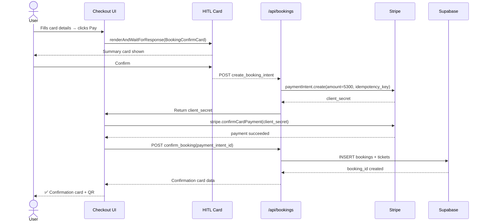

# Event Checkout
> Route: `/events/[slug]/checkout`  
> User: Consumer  
> Phase: Core · P0

---

## Page Goal
Streamlined 2-step checkout: ticket selection → payment. AI pre-fills whatever it knows (quantity from prior chat, payment method from profile). HITL approval card shows full summary before charge.

---

## Desktop Wireframe

```
┌────────────────────────────────────────────────────────────────────────────────┐
│  ▣ mdeai  ← Jazz Night at Casa Bali                              🔔           │
├─────────────────┬──────────────────────────────────────┬───────────────────────┤
│  LEFT 280px     │  CENTER                              │  RIGHT 360px          │
│  STEP PROGRESS  │                                      │                       │
│                 │  STEP 2 OF 2 — Payment               │  ┌─────────────────┐  │
│  [●]─────[●]   │  ─────────────────────────────────   │  │  Order Summary  │  │
│  Tickets Payment│                                      │  │  ─────────────  │  │
│                 │  ┌──────────────────────────────┐   │  │  Jazz Night     │  │
│  ─────────────  │  │  ✅ 2× GA — confirmed         │   │  │  Fri Jan 10    │  │
│  Order Summary  │  └──────────────────────────────┘   │  │                 │  │
│  Jazz Night     │                                      │  │  2× GA  $25    │  │
│  Fri Jan 10     │  ┌──────────────────────────────┐   │  │  Subtotal  $50  │  │
│  2× GA  $50     │  │  Card Number                  │   │  │  Fees      $3   │  │
│  Fees    $3     │  │  [●●●● ●●●● ●●●● ____]        │   │  │  Total    $53   │  │
│  ─────────────  │  │                               │   │  │  ─────────────  │  │
│  Secure         │  │  Expiry        CVC            │   │  │  🔒 Stripe      │  │
│  🔒 Stripe      │  │  [MM/YY]       [●●●]          │   │  │  secure payment │  │
│                 │  │                               │   │  └─────────────────┘  │
│                 │  │  Name on card                 │   │                       │
│                 │  │  [Camila González_____________]│   │  ┌─────────────────┐  │
│                 │  │                               │   │  │  ⚡ AI           │  │
│                 │  │  Email                        │   │  │  "Ticket will   │  │
│                 │  │  [camila@email.com____________]│   │  │  be in your     │  │
│                 │  │                               │   │  │  wallet after   │  │
│                 │  │  [Pay $53 — Book Tickets]     │   │  │  payment"       │  │
│                 │  └──────────────────────────────┘   │  └─────────────────┘  │
│                 │                                      │                       │
│                 │  ┌──────────────────────────────┐   │                       │
│                 │  │  💬 Questions before booking? │   │                       │
│                 │  └──────────────────────────────┘   │                       │
└─────────────────┴──────────────────────────────────────┴───────────────────────┘
```

---

## HITL Approval State (fires before Stripe charge)

```
┌──────────────────────────────────────────┐
│  🤖 Confirm your booking                 │
│                                          │
│  Event:   Jazz Night at Casa Bali        │
│  Date:    Friday Jan 10, 9pm–1am         │
│  Tickets: 2× General Admission           │
│  Total:   $53 (incl. fees)               │
│                                          │
│  Payment: Visa ending 4242               │
│                                          │
│  ┌────────────────┐  ┌────────────────┐  │
│  │  ✅ Confirm    │  │  ✕ Cancel      │  │
│  └────────────────┘  └────────────────┘  │
└──────────────────────────────────────────┘
```

---

## Confirmation State

```
┌──────────────────────────────────────────┐
│                                          │
│         ✅ You're going!                 │
│                                          │
│   Jazz Night at Casa Bali               │
│   Friday Jan 10 · 9pm–1am               │
│                                          │
│   [QR CODE]                             │
│   Booking #JN-2025-0089                 │
│                                          │
│   Added to calendar ✓                   │
│   Tickets in wallet ✓                   │
│                                          │
│   [View My Tickets]  [Share Event]      │
│                                          │
│   🤖 "Oci.Mde is 200m away — book       │
│   a dinner table before the show?"      │
│                                          │
└──────────────────────────────────────────┘
```

---

## Components
- `StepProgress` — 2-step indicator (Tickets → Payment)
- `TicketSummary` — read-only confirmation of selection
- `StripeCardElement` — embedded Stripe card input
- `OrderSummary` — line items + fees + total (right panel)
- `HITLBookingCard` — `renderAndWaitForResponse` approval before charge
- `ConfirmationCard` — QR code + booking ID + next actions
- `PostBookingAI` — agent cross-sell after confirmation

---

## Data Sources
| Data | Source |
|---|---|
| Ticket tiers + prices | Supabase `ticket_tiers` |
| Stripe payment intent | Stripe `checkout.session.create` |
| Booking record | Supabase `bookings` + `tickets` |
| Idempotency key | UUID generated client-side |

---

## Stripe Flow



---

## Error States
- Card declined: "Payment failed — please check your card details"
- Sold out after HITL: "Sorry, these tickets just sold out. Join waitlist?"
- Session expired: "Your session expired — restart checkout"
