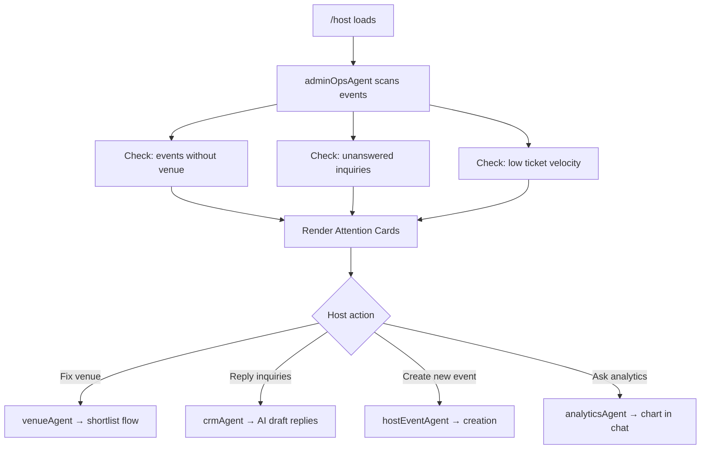

# Host Dashboard
> Route: `/host`  
> User: Event Host (Roberto persona)  
> Phase: Core · P0

---

## Page Goal
Replace the traditional host admin portal (forms, tables, export reports) with an AI-native workspace. Roberto opens this and immediately sees what needs attention. He can manage everything from chat — no menu navigation required.

---

## Desktop Wireframe

```
┌────────────────────────────────────────────────────────────────────────────────┐
│  ▣ mdeai  Host Dashboard                                          🔔  Roberto │
├─────────────────┬──────────────────────────────────────┬───────────────────────┤
│  LEFT 280px     │  CENTER                              │  RIGHT 360px          │
│  ─────────────  │                                      │                       │
│  📋 Dashboard←  │  Good morning, Roberto 👋            │  ┌─────────────────┐  │
│  📅 My Events   │                                      │  │  Revenue        │  │
│  🎟️ Tickets     │  ── Needs Attention (AI) ──          │  │  This month     │  │
│  👥 Attendees   │                                      │  │  $2,840  ↑12%   │  │
│  📊 Analytics   │  ┌─────────────────────────────┐    │  │  [Sparkline]    │  │
│  🏢 Venues      │  │ ⚡ Jazz Night · Fri Jan 10   │    │  └─────────────────┘  │
│  ─────────────  │  │ 48 tickets remaining         │    │                       │
│  Quick Actions  │  │ No venue confirmed yet ⚠️    │    │  ┌─────────────────┐  │
│  [+ New Event]  │  │ [Fix Now] [Remind Me]        │    │  │  Upcoming       │  │
│  [+ New Rental] │  └─────────────────────────────┘    │  │  ─────────────  │  │
│  ─────────────  │                                      │  │  🎵 Jazz Night  │  │
│  AI Summary     │  ┌─────────────────────────────┐    │  │  Fri · 48 left  │  │
│  "2 events need │  │ ⚡ Salsa Social reply needed  │    │  │  $25 GA · $60 VIP│ │
│  attention"     │  │ 3 attendees sent questions   │    │  │  ─────────────  │  │
│  "3 inquiries   │  │ [Reply All with AI Draft]    │    │  │  💃 Salsa Social │  │
│  pending reply" │  └─────────────────────────────┘    │  │  Sat · 120 left │  │
│                 │                                      │  │  Free           │  │
│                 │  ── All Events ──                    │  └─────────────────┘  │
│                 │                                      │                       │
│                 │  ┌─────────────────────────────┐    │  ┌─────────────────┐  │
│                 │  │ 🎵 Jazz Night · Jan 10       │    │  │  Pending        │  │
│                 │  │ 152/200 sold · $25 GA        │    │  │  3 inquiries    │  │
│                 │  │ [Manage] [View Analytics]    │    │  │  [Review All]   │  │
│                 │  └─────────────────────────────┘    │  └─────────────────┘  │
│                 │                                      │                       │
│                 │  ┌──────────────────────────────┐   │                       │
│                 │  │ 💬 Ask about your events [▶] │   │                       │
│                 │  └──────────────────────────────┘   │                       │
└─────────────────┴──────────────────────────────────────┴───────────────────────┘
```

---

## Mobile Wireframe

```
┌─────────────────────────────────────────┐
│  ▣ Host Dashboard          🔔  Roberto  │
├─────────────────────────────────────────┤
│  ⚡ Needs Attention                     │
│                                         │
│  ┌─────────────────────────────────┐   │
│  │ Jazz Night — no venue set ⚠️    │   │
│  │ [Fix Now]                       │   │
│  └─────────────────────────────────┘   │
│  ┌─────────────────────────────────┐   │
│  │ 3 attendee questions pending    │   │
│  │ [Reply with AI Draft]           │   │
│  └─────────────────────────────────┘   │
│                                         │
│  This Month: $2,840 ↑12%               │
│                                         │
│  Upcoming Events (2)                    │
│  🎵 Jazz Night · Fri · 48 left         │
│  💃 Salsa Social · Sat · 120 left      │
│                                         │
│                      ┌───────────────┐  │
│                      │ 💬 Chat       │  │
│                      └───────────────┘  │
│  [+ Create Event]                       │
├─────────────────────────────────────────┤
│  🏠  📋←  📅  🎟️  👤                  │
└─────────────────────────────────────────┘
```

---

## Components
- `AttentionWidget` — AI-surfaced blockers (no venue set, unread inquiries, low ticket sales)
- `EventList` — upcoming events with ticket status, quick actions
- `RevenueWidget` — monthly revenue with sparkline trend (right panel)
- `UpcomingPanel` — next 2 events with key metrics (right panel)
- `PendingInquiries` — unread attendee questions with AI draft CTA (right panel)
- `HostChat` — `hostEventAgent` accessible via chat; can query "how are ticket sales?" inline

---

## Data Sources
| Data | Source |
|---|---|
| Events list | Supabase `events` WHERE host_id = current_user |
| Ticket counts | Supabase `tickets` aggregated |
| Revenue | Stripe payment data via API |
| Inquiries | Supabase `leads` + `messages` |
| AI attention items | `adminOpsAgent` exception detection |

---

## Event Status States

Every event card shows a status badge. Colors and allowed actions vary by status.

| Status | Badge | Allowed Actions |
|---|---|---|
| `draft` | `🔘 Draft` (gray) | Edit, Publish, Delete |
| `published` | `🟢 Live` (green) | Manage tickets, View analytics, Cancel |
| `sold_out` | `🔴 Sold Out` (red) | Add waitlist, View attendees |
| `cancelled` | `⚫ Cancelled` (dark) | View (read-only), Refund status |
| `past` | `⬜ Past` (light) | View analytics, Download attendees |

### Draft Event Card

```
┌─────────────────────────────────────────────────────┐
│ 🔘 Draft  🎵 February Jazz                          │
│ Feb 14 · No venue set · Tickets not configured     │
│ [Continue Setup]  [Delete Draft]                   │
└─────────────────────────────────────────────────────┘
```

### Cancelled Event Card

```
┌─────────────────────────────────────────────────────┐
│ ⚫ Cancelled  🎵 December Salsa                     │
│ Dec 20 · 89 refunds pending · $2,225 returned      │
│ [View Refund Status]                               │
└─────────────────────────────────────────────────────┘
```

---

## Loading State

```
┌────────────────────────────────────────────────────────┐
│  Host Dashboard                                        │
│  ─────────────────────────────────────────────────    │
│  [████████████████░░░░░░░░░░░░░░] ← attention skeleton │
│  [████████████████░░░░░░░░░░░░░░] ← event card skeleton│
│  Revenue loading...                                    │
└────────────────────────────────────────────────────────┘
```

## Empty State (no events yet)

```
┌────────────────────────────────────────────────────────┐
│  Good morning, Roberto 👋                              │
│  ─────────────────────────────────────────────────    │
│  📅  No events yet                                    │
│                                                        │
│  Create your first event and start selling tickets.  │
│                                                        │
│  [+ Create Event]                                     │
│  or just say: "Create a jazz night for next Friday"  │
└────────────────────────────────────────────────────────┘
```

## Error State (agent offline)

```
┌────────────────────────────────────────────────────────┐
│  ⚠️ Could not load dashboard data.                    │
│     Your events are shown below (cached).             │
│     AI attention items unavailable.                   │
│     [Retry]                                           │
└────────────────────────────────────────────────────────┘
```

---

## AI Features
- "Needs Attention" is entirely AI-generated: agent scans events and surfaces only blockers
- "Reply All with AI Draft" — `crmAgent` drafts reply to all pending questions simultaneously
- Chat: "How many tickets have I sold this month?" → chart inline
- "Create a similar event to Jazz Night but for February" → pre-fills creation form

---

## Mermaid Flow


