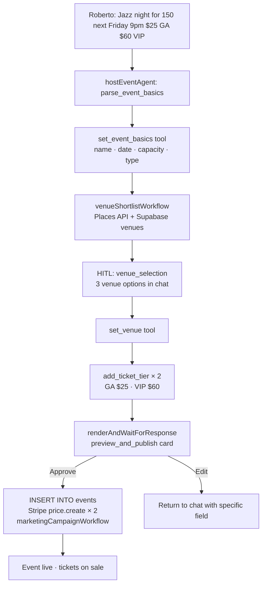

# Create Event — AI Wizard
> Route: `/host/event/new`  
> User: Event Host (Roberto persona)  
> Phase: Core · P0

---

## Page Goal
Replace the 12-field form wizard with a single chat prompt. Roberto says what he wants. The agent fills everything, suggests a venue, proposes ticket tiers, and waits for his approval before publishing.

---

## Desktop Wireframe — Step 1: Chat Input

```
┌────────────────────────────────────────────────────────────────────────────────┐
│  ▣ mdeai  Create Event                                            🔔  Roberto │
├─────────────────┬──────────────────────────────────────┬───────────────────────┤
│  LEFT 280px     │  CENTER                              │  RIGHT 360px          │
│  WIZARD STEPS   │                                      │                       │
│  ─────────────  │                                      │  ┌─────────────────┐  │
│  ● 1. Basics    │   Hi Roberto! Let's create your      │  │  What I need    │  │
│  ○ 2. Venue     │   event. Just describe it and        │  │  from you:      │  │
│  ○ 3. Tickets   │   I'll take care of the rest.        │  │  ─────────────  │  │
│  ○ 4. Review    │                                      │  │  ✓ Event name   │  │
│  ○ 5. Publish   │  ┌──────────────────────────────┐   │  │  ✓ Date + time  │  │
│  ─────────────  │  │ 💬 Describe your event...     │   │  │  ✓ Capacity     │  │
│  Quick Fill     │  │                               │   │  │  ✓ Ticket price │  │
│  Past Event:    │  │ Roberto types:                │   │  │                 │  │
│  "Jazz Night"   │  │ "Jazz night for 150 people    │   │  │  Optional:      │  │
│  [Use as base]  │  │  next Friday at 9pm in        │   │  │  ○ Description  │  │
│  ─────────────  │  │  El Poblado, tickets $25 GA   │   │  │  ○ Venue pref.  │  │
│  Templates      │  │  and $60 VIP"                 │   │  │  ○ Co-hosts     │  │
│  🎵 Concert     │  │                          [▶] │   │  └─────────────────┘  │
│   💼 Conference  │  └──────────────────────────────┘   │                       │
│   🎭 Theater     │                                      │                       │
│  🎉 Party       │                                      │                       │
└─────────────────┴──────────────────────────────────────┴───────────────────────┘
```

---

## Desktop Wireframe — Step 2: Agent Fills Draft

```
┌────────────────────────────────────────────────────────────────────────────────┐
│  ▣ mdeai  Create Event                                            🔔  Roberto │
├─────────────────┬──────────────────────────────────────┬───────────────────────┤
│  LEFT 280px     │  CENTER                              │  RIGHT 360px          │
│  WIZARD STEPS   │                                      │                       │
│  ✅ 1. Basics   │  AI: "Got it! Here's your draft:"   │  ┌─────────────────┐  │
│  ● 2. Venue     │                                      │  │  Event Draft    │  │
│  ○ 3. Tickets   │  ┌──────────────────────────────┐   │  │  ─────────────  │  │
│  ○ 4. Review    │  │  📋 Event Draft               │   │  │  Name:          │  │
│  ○ 5. Publish   │  │  Name: Jazz Night             │   │  │  Jazz Night     │  │
│  ─────────────  │  │  Date: Fri Jan 10 · 9pm–1am   │   │  │                 │  │
│                 │  │  Capacity: 150                 │   │  │  Date:          │  │
│                 │  │  Type: Music · Jazz            │   │  │  Fri Jan 10     │  │
│                 │  │  Status: Draft ✏️              │   │  │  9pm–1am        │  │
│                 │  │                               │   │  │                 │  │
│                 │  │  [Looks good] [Edit a field]  │   │  │  Capacity: 150  │  │
│                 │  └──────────────────────────────┘   │  │  Type: Music    │  │
│                 │                                      │  │                 │  │
│                 │  AI: "Now let's find a venue.        │  │  Tickets:       │  │
│                 │  Here are 3 rooftop options          │  │  GA $25         │  │
│                 │  for 150 in El Poblado:"             │  │  VIP $60        │  │
│                 │                                      │  └─────────────────┘  │
│                 │  ┌──────────────────────────────┐   │                       │
│                 │  │ 🏢 Casa Bali · $120/hr · ⭐4.8│  │  ┌─────────────────┐  │
│                 │  │ [Select]                      │   │  │  🗺️ Venues      │  │
│                 │  └──────────────────────────────┘   │  │  near El Poblado│  │
│                 │  ┌──────────────────────────────┐   │  │  [pin ●][pin ●] │  │
│                 │  │ 🏢 Sky Top · $95/hr · ⭐4.6  │   │  └─────────────────┘  │
│                 │  │ [Select]                      │   │                       │
│                 │  └──────────────────────────────┘   │                       │
└─────────────────┴──────────────────────────────────────┴───────────────────────┘
```

---

## Desktop Wireframe — Step 4: HITL Review + Publish

```
┌────────────────────────────────────────────────────────────────────────────────┐
│  ▣ mdeai  Create Event · Review & Publish                         🔔  Roberto │
├─────────────────┬──────────────────────────────────────┬───────────────────────┤
│  LEFT 280px     │  CENTER — HITL Approval              │  RIGHT 360px          │
│  ✅ 1. Basics   │                                      │                       │
│  ✅ 2. Venue    │  ┌──────────────────────────────┐   │  ┌─────────────────┐  │
│  ✅ 3. Tickets  │  │  🎵 Jazz Night               │   │  │ Revenue Estimate│  │
│  ● 4. Review    │  │  ─────────────────────────   │   │  │ ─────────────── │  │
│  ○ 5. Publish   │  │  📅 Fri Jan 10 · 9pm–1am    │   │  │ GA 120 sold     │  │
│                 │  │  📍 Casa Bali · El Poblado   │   │  │ × $25 = $3,000  │  │
│                 │  │  👥 Capacity: 150             │   │  │                 │  │
│                 │  │  🎟️ GA $25 · VIP $60          │   │  │ VIP 30 sold     │  │
│                 │  │  Tickets on sale immediately  │   │  │ × $60 = $1,800  │  │
│                 │  │                               │   │  │                 │  │
│                 │  │  Est. revenue: $4,800         │   │  │ Total est:      │  │
│                 │  │  Platform fee: 5% = $240      │   │  │ $4,800          │  │
│                 │  │  Net: $4,560                  │   │  └─────────────────┘  │
│                 │  │                               │   │                       │
│                 │  │  ┌──────────┐  ┌──────────┐  │   │  ┌─────────────────┐  │
│                 │  │  │ ✅Publish │  │ ✏️ Edit  │  │   │  │  After publish  │  │
│                 │  │  └──────────┘  └──────────┘  │   │  │  Agent will:    │  │
│                 │  │                               │   │  │  ✓ Create Stripe│  │
│                 │  └──────────────────────────────┘   │  │  ✓ Generate promo│ │
│                 │                                      │  │  ✓ Notify saved │  │
│                 │                                      │  └─────────────────┘  │
└─────────────────┴──────────────────────────────────────┴───────────────────────┘
```

---

## Components
- `WizardSteps` — step progress indicator (left panel)
- `EventChat` — primary creation interface
- `EventDraftCard` — live preview of event data as agent fills it
- `VenueCards` — 2–3 venue options with Select button
- `HITLPublishCard` — `renderAndWaitForResponse` — full event summary before publishing
- `RevenueEstimator` — live calculation based on capacity × ticket prices (right panel)
- `MapPanel` — venue pins (right panel, step 2)
- `PostPublishChecklist` — what agent does after Roberto approves (right panel)

---

## Data Sources
| Step | Data | Source |
|---|---|---|
| Step 1 | Past event templates | Supabase `events` WHERE host_id |
| Step 2 | Venue options | Supabase `venues` + Places API |
| Step 3 | Comparable ticket prices | Supabase `ticket_tiers` aggregated |
| Step 4 | Stripe price creation | Stripe API on publish |

---

## Mastra Agent Architecture



---

## AI: What Reduces vs What Increases

| Traditional | AI-Native |
|---|---|
| 12 form fields | 1 chat message |
| Venue research: 2 hours | Venue shortlist: 30 seconds |
| Manual ticket pricing | AI suggests based on comparable events |
| Estimate revenue yourself | Agent calculates live |
| Forget to create promo | Agent auto-generates promo copy post-publish |
