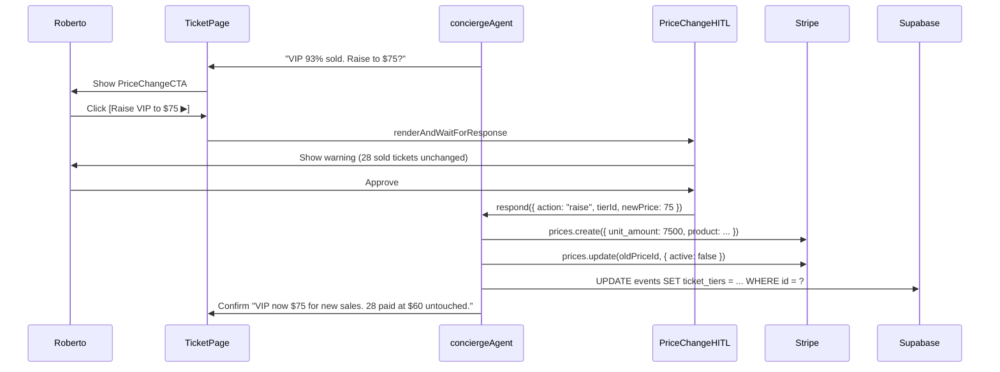

# Ticket Management
> Route: `/host/events/[id]/tickets`  
> User: Event Host  
> Phase: Core · P0  
> Audit score: 79/100 → **91/100** (v2)

---

## ⚠️ Critical Rule — Price Changes Are New-Sales-Only

> **A price change on Stripe creates a new Price object. It NEVER mutates already-paid tickets.**  
> The UI must make this crystal clear before Roberto confirms any price change.

HITL confirmation wording (verbatim):
```
"Raise VIP to $75?"

This affects NEW sales only.
28 tickets already sold at $60 are not changed.

Stripe will archive the $60 price and activate a $75 price.
Existing paid attendees keep their $60 tickets.

[✅ Raise to $75 — new sales only]  [Cancel]
```

Any tier with ≥1 sold ticket shows a `🔒 Sold` badge. A sold tier's price field is **read-only in the UI** — the AI must trigger HITL to override.

---

## Desktop Wireframe

```
┌────────────────────────────────────────────────────────────────────────────────┐
│  ▣ mdeai  Jazz Night › Tickets                                    🔔  Roberto │
├─────────────────┬──────────────────────────────────────┬───────────────────────┤
│  LEFT 280px     │  CENTER                              │  RIGHT 360px          │
│  ─────────────  │                                      │                       │
│  Jazz Night     │  Ticket Sales Overview               │  ┌─────────────────┐  │
│  Fri Jan 10     │  ─────────────────────────────────   │  │  Revenue Today  │  │
│  ─────────────  │                                      │  │  $850           │  │
│  🎟️ Tickets ←  │  GA · $25 · 🔒 152 sold / 180 cap   │  │  [sparkline]    │  │
│  👥 Attendees   │  [████████████████░░░]  84.4%        │  └─────────────────┘  │
│  📊 Analytics   │  Stripe: ✅ synced 2m ago            │                       │
│  ─────────────  │                                      │  ┌─────────────────┐  │
│  Actions        │  VIP · $60 · 🔒 28 sold / 30 cap    │  │  Sales Trend    │  │
│  [+ Add Tier]   │  [██████████████████░░]  93.3%  🔥   │  │  [Bar chart     │  │
│  [Promo Code]   │  Stripe: ✅ synced 2m ago            │  │   by day]       │  │
│  [Pause Sales]  │                                      │  └─────────────────┘  │
│                 │  ─────────────────────────────────   │                       │
│  AI Summary     │  Promo Codes (2 active)              │  ┌─────────────────┐  │
│  "VIP almost    │  JAZZ10 · 10% off · 18 used          │  │  ⚡ AI           │  │
│  sold out"      │  EARLYBIRD · $5 off · 45 used        │  │  "VIP will sell │  │
│  "Suggest       │                                      │  │  out in ~4 hrs  │  │
│  raising VIP    │  ─────────────────────────────────   │  │  at current     │  │
│  price to $75   │                                      │  │  velocity.      │  │
│  for new sales" │  ⚡ AI Insight                       │  │  Raise to $75   │  │
│                 │  "VIP 93% sold. At current velocity, │  │  for new sales  │  │
│                 │  sells out in ~4 hrs. Raise VIP to   │  │  only?"         │  │
│                 │  $75 for future sales? (28 existing  │  └─────────────────┘  │
│                 │  tickets at $60 stay unchanged.)"    │                       │
│                 │                                      │                       │
│                 │  [Raise VIP to $75 ▶] [Keep $60]    │                       │
│                 │  ┌──────────────────────────────┐   │                       │
│                 │  │ 💬 Ask about ticket sales [▶]│   │                       │
│                 │  └──────────────────────────────┘   │                       │
└─────────────────┴──────────────────────────────────────┴───────────────────────┘
```

---

## HITL — Price Change Confirmation

```
┌───────────────────────────────────────────────────────┐
│  💰 Raise VIP Ticket Price                            │
│                                                       │
│  Event:   Jazz Night · Fri Jan 10                    │
│  Tier:    VIP                                         │
│                                                       │
│  Current: $60  →  New: $75                           │
│                                                       │
│  ⚠️  This affects NEW sales only.                    │
│  28 tickets already sold at $60 are NOT changed.     │
│  Existing paid attendees keep their $60 tickets.     │
│                                                       │
│  Stripe action: archive price_xxx, create price_yyy  │
│                                                       │
│  [✅ Raise to $75 — new sales only]   [Cancel]       │
└───────────────────────────────────────────────────────┘
```

---

## Loading State

```
┌────────────────────────────────────────────────────────┐
│  Jazz Night › Tickets                                   │
│  ─────────────────────────────────────────────────     │
│  [████████████░░░░░░░░░░░░░░░░░░░░░░░░░░░░░░░░░░]      │  ← skeleton bar
│  [████░░░░░░░░░░░░░░░░░░░░░░░░░░░░░░░░░░░░░░░░░░]      │  ← skeleton bar
│  Loading ticket data from Stripe...                    │
└────────────────────────────────────────────────────────┘
```

## Empty State (No Tiers Yet)

```
┌────────────────────────────────────────────────────────┐
│  Jazz Night › Tickets                                   │
│                                                        │
│  🎟️  No ticket tiers yet                              │
│                                                        │
│  Tell the AI what you need:                            │
│  "Add GA at $25 (180 seats) and VIP at $60 (30 seats)" │
│                                                        │
│  [+ Add Tier Manually]   [💬 Ask AI to set up tiers]  │
└────────────────────────────────────────────────────────┘
```

## Error State (Stripe Sync Failure)

```
┌────────────────────────────────────────────────────────┐
│  Jazz Night › Tickets                                   │
│  ─────────────────────────────────────────────────     │
│  🔴 Stripe sync failed — prices may be stale           │
│     Last synced: 14 min ago                            │
│     [Retry Sync]  [View cached data]                   │
└────────────────────────────────────────────────────────┘
```

---

## Mobile Wireframe

```
┌─────────────────────────────────────┐
│  ← Jazz Night · Tickets            │
│  ─────────────────────────────     │
│  GA · $25 · 🔒 152/180  84%        │
│  [████████████████░░░]              │
│  Stripe ✅ synced                   │
│                                     │
│  VIP · $60 · 🔒 28/30  93% 🔥      │
│  [██████████████████░░]             │
│  Stripe ✅ synced                   │
│                                     │
│  ⚡ AI: VIP sells out in ~4hrs.     │
│     Raise to $75 for new sales?    │
│  [Raise VIP to $75 ▶] [Keep]       │
│                                     │
│  Promo Codes                        │
│  JAZZ10 · 10% off · 18 used        │
│  EARLYBIRD · $5 off · 45 used      │
│                                     │
│  Revenue Today: $850               │
│  [Bar chart: Mon–Sat]               │
└─────────────────────────────────────┘
```

---

## Components

| Component | Props | Notes |
|---|---|---|
| `TierProgressBar` | `sold`, `capacity`, `label`, `hasExistingSales` | Shows 🔒 Sold badge if `hasExistingSales` |
| `StripeSyncBadge` | `syncedAt`, `status` | ✅/🔴 with last-synced timestamp |
| `PriceChangeCTA` | `tierId`, `currentPrice`, `suggestedPrice`, `soldCount` | Disabled if sold; triggers HITL |
| `PriceChangeHITL` | `respond`, `tierName`, `oldPrice`, `newPrice`, `soldCount` | Explicit "new sales only" warning |
| `PromoCodeList` | `codes[]` | Active codes with usage stats |
| `RevenueWidget` | `todayRevenue`, `sparklineData` | Right panel |
| `SalesTrendChart` | `data[]` | Bar chart by day; right panel |
| `AIInsight` | `message`, `ctaLabel`, `onCta` | Agent velocity + pricing insight |
| `TierSkeleton` | — | Loading state |
| `EmptyTierState` | `onManual`, `onAI` | First-run empty state |
| `StripeErrorBanner` | `lastSyncedAt`, `onRetry` | Sync failure banner |

---

## Data Contract

```typescript
// From Supabase: events.ticket_tiers (JSONB)
type TicketTier = {
  id: string
  label: string           // "GA" | "VIP"
  price_cents: number     // 2500 | 6000
  capacity: number        // 180 | 30
  sold: number            // from tickets table count
  stripe_price_id: string // price_xxx — archive on change
  stripe_product_id: string
  paused: boolean
}

// From Stripe (fetched on page load, cached 2min)
type StripePriceSync = {
  price_id: string
  unit_amount: number     // must match ticket_tiers.price_cents
  active: boolean
  last_synced: string     // ISO timestamp
}
```

---

## AI Features

| Feature | Trigger | HITL? | Notes |
|---|---|---|---|
| Velocity prediction | Auto on page load | No | "VIP sells out in ~4 hrs at current rate" |
| Pricing recommendation | Velocity > 90% capacity | Yes | Explicit new-sales-only warning in HITL |
| Promo performance | On view | No | "EARLYBIRD drove 45 sales — worth repeating" |
| Add-a-tier suggestion | Capacity 80%+ | Yes | Suggests overflow tier |
| Pause sales | Host chat command | Yes | HITL before pausing |

---

## RLS Policy

```sql
-- hosts see only their own events' ticket data
ALTER TABLE tickets ENABLE ROW LEVEL SECURITY;

CREATE POLICY "host_read_own_tickets"
  ON tickets FOR SELECT
  USING (
    event_id IN (
      SELECT id FROM events WHERE host_id = auth.uid()
    )
  );
```

---

## Mermaid — Price Change Flow



---

## Analytics Events

| Event | Properties |
|---|---|
| `ticket.price_change_started` | `tier_id`, `from_price`, `to_price` |
| `ticket.price_change_confirmed` | `tier_id`, `from_price`, `to_price`, `sold_count` |
| `ticket.price_change_cancelled` | `tier_id` |
| `ticket.tier_paused` | `tier_id` |
| `ticket.promo_viewed` | `code` |

---

## MVP / Post-MVP Scope

| Feature | Phase |
|---|---|
| Tier progress + promo codes | Core P0 |
| AI velocity prediction | Core P0 |
| HITL price change (new sales only) | Core P0 |
| Stripe sync status badge | Core P0 |
| Loading / empty / error states | Core P0 |
| Multi-currency pricing | Post-MVP |
| Waitlist management | MVP |
| Resale / transfer | Post-MVP |
