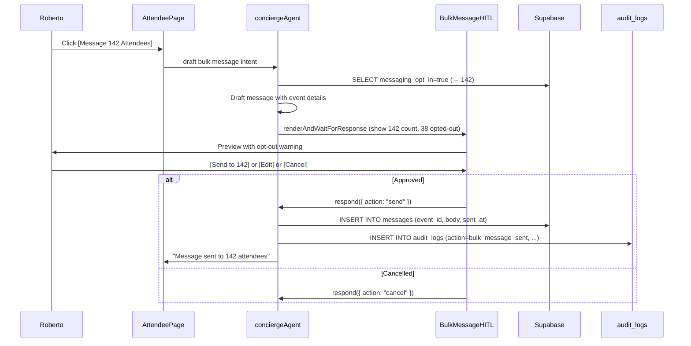

# Attendee Management
> Route: `/host/events/[id]/attendees`  
> User: Event Host  
> Phase: Core · P1  
> Audit score: 78/100 → **90/100** (v2)

---

## ⚠️ Critical Rules — Bulk Messaging

> **1. Consent gate:** Only contact attendees who opted in to host communications at checkout.  
> **2. HITL required:** Every bulk message (even AI-drafted) must be previewed and approved before send.  
> **3. Rate limit:** Maximum 1 message per attendee per 24-hour period. UI shows countdown.  
> **4. Audit log:** Every sent message writes to `audit_logs(action="bulk_message_sent", user_id, event_id, recipient_count, message_preview, sent_at)`.  
> **5. CSV export:** Requires `role = host` AND event ownership. PII (email, phone) never exposed to browser; download is server-generated signed URL.

---

## Desktop Wireframe

```
┌────────────────────────────────────────────────────────────────────────────────┐
│  ▣ mdeai  Jazz Night › Attendees (180)                            🔔  Roberto │
├─────────────────┬──────────────────────────────────────┬───────────────────────┤
│  LEFT 280px     │  CENTER                              │  RIGHT 360px          │
│  ─────────────  │                                      │                       │
│  Jazz Night     │  [🔍 Search attendees...]  [⬇ CSV]  │  ┌─────────────────┐  │
│  ─────────────  │  ─────────────────────────────────   │  │  Attendee Stats  │  │
│  🎟️ Tickets     │                                      │  │  ─────────────  │  │
│  👥 Attendees ← │  NAME             TIER   PAID  ✓    │  │  GA:  152 (84%) │  │
│  📊 Analytics   │  ─────────────────────────────────   │  │  VIP: 28 (16%)  │  │
│  ─────────────  │  Camila González  GA    $25   —      │  │  Checked in: 0  │  │
│  Messaging      │  Miguel Torres    VIP   $60   —      │  │  ─────────────  │  │
│  ─────────────  │  Ana Rodríguez    GA    $25   —      │  │  Messaging      │  │
│  Opted-in: 142  │  [+ 177 more...]                     │  │  Opt-in: 142    │  │
│  Next msg in:   │                                      │  │  Rate limit:    │  │
│  12h 34m        │  ─────────────────────────────────   │  │  Next in 12h    │  │
│  [Message 142]  │  Pending Questions (3)               │  └─────────────────┘  │
│  [Check In]     │  ─────────────────────────────────   │                       │
│                 │  Camila: "Is there parking?"         │  ┌─────────────────┐  │
│  AI Summary     │  Miguel: "What's the dress code?"    │  │  ⚡ AI Draft     │  │
│  "3 questions   │  Ana: "Can I bring a guest?"         │  │  ─────────────  │  │
│  unanswered"    │                                      │  │  "Hi everyone!  │  │
│  "142 opted-in  │  [Draft AI Reply to All 3 ▶]        │  │  Jazz Night is  │  │
│  for messages"  │                                      │  │  tomorrow...    │  │
│  "Rate limit    │  ─────────────────────────────────   │  │  [Preview] [✗]" │  │
│  resets in 12h" │                                      │  └─────────────────┘  │
│                 │  ┌──────────────────────────────┐   │                       │
│                 │  │ 💬 Message your attendees [▶]│   │                       │
│                 │  └──────────────────────────────┘   │                       │
└─────────────────┴──────────────────────────────────────┴───────────────────────┘
```

---

## HITL — Bulk Message Preview

```
┌────────────────────────────────────────────────────────┐
│  📨 Send Message to Attendees                          │
│                                                        │
│  Recipients: 142 opted-in attendees                   │
│  ⚠️  38 attendees opted out — not included            │
│                                                        │
│  Preview:                                              │
│  ┌──────────────────────────────────────────────────┐ │
│  │ Hi [Name]! Jazz Night is tomorrow at 9pm.        │ │
│  │ Parking: street parking on Calle 10.             │ │
│  │ Dress code: smart casual.                        │ │
│  │ See you there! — Roberto via mdeai               │ │
│  └──────────────────────────────────────────────────┘ │
│                                                        │
│  [✏️ Edit]   [✅ Send to 142 attendees]   [Cancel]    │
│                                                        │
│  This action will be logged to your audit history.    │
└────────────────────────────────────────────────────────┘
```

---

## Rate Limit Banner

```
┌────────────────────────────────────────────────────────┐
│  ⏳ Message cooldown active                            │
│  You sent a bulk message 11h 26m ago.                  │
│  Next message available in: 00:34                     │
│  (1 message per 24h per attendee)                     │
└────────────────────────────────────────────────────────┘
```

---

## Check-In Mode (Mobile-First)

```
┌─────────────────────────────────────┐
│  ← Jazz Night · Check-In Mode      │
│  ─────────────────────────────     │
│  [🔍 Scan QR]                      │
│                                     │
│  Or search by name:                 │
│  [Miguel Torres________________]    │
│                                     │
│  ✅ Miguel Torres — VIP            │
│     Ticket #JN-0089 · Valid        │
│     [Mark Checked In]               │
│                                     │
│  Checked in: 45 / 180              │
│  ████░░░░░░░░░░░░ 25%              │
└─────────────────────────────────────┘
```

### Check-In Error States

```
┌─────────────────────────────────────┐
│  ❌ Invalid QR                      │
│  Ticket #JN-XXXX not found.        │
│  May be for a different event.      │
│  [Try Again]                        │
└─────────────────────────────────────┘

┌─────────────────────────────────────┐
│  ⚠️ Already Checked In             │
│  Miguel Torres checked in at 9:14pm │
│  [Override]  [Cancel]               │
└─────────────────────────────────────┘
```

---

## Loading State

```
┌────────────────────────────────────────────────────────┐
│  Jazz Night › Attendees                                │
│  ─────────────────────────────────────────────────    │
│  [███████████████░░░░░░░░░░░░░░░░░░░░░░░░░░░░░░░░]    │ ← skeleton row
│  [███████████████░░░░░░░░░░░░░░░░░░░░░░░░░░░░░░░░]    │ ← skeleton row
│  [███████████████░░░░░░░░░░░░░░░░░░░░░░░░░░░░░░░░]    │ ← skeleton row
│  Loading attendee list...                              │
└────────────────────────────────────────────────────────┘
```

## Empty State (No Attendees Yet)

```
┌────────────────────────────────────────────────────────┐
│  Jazz Night › Attendees                                │
│                                                        │
│  🎫  No attendees yet                                 │
│                                                        │
│  Ticket sales are live. Attendees will appear         │
│  here as tickets are purchased.                       │
│                                                        │
│  [View Ticket Sales]   [Share Event]                  │
└────────────────────────────────────────────────────────┘
```

## Error State

```
┌────────────────────────────────────────────────────────┐
│  🔴 Could not load attendees                           │
│     Check your connection and try again.               │
│     [Retry]                                            │
└────────────────────────────────────────────────────────┘
```

---

## Mobile Wireframe (Attendee List)

```
┌─────────────────────────────────────┐
│  ← Jazz Night · Attendees (180)    │
│  [🔍 Search...]                    │
│  ─────────────────────────────     │
│  Camila González · GA · $25        │
│  Miguel Torres   · VIP · $60       │
│  Ana Rodríguez   · GA · $25        │
│  [Load 177 more...]                 │
│  ─────────────────────────────     │
│  Questions (3)                      │
│  Camila: "Is there parking?"       │
│  [Reply All with AI]               │
│  ─────────────────────────────     │
│  Messaging: 142 opted-in           │
│  Rate limit: 12h 34m remaining     │
│  [Message Attendees]               │
└─────────────────────────────────────┘
```

---

## Components

| Component | Props | Notes |
|---|---|---|
| `AttendeeTable` | `attendees[]`, `isLoading` | Virtualized list; skeleton on load |
| `AttendeeTableSkeleton` | — | Loading state |
| `AttendeeEmptyState` | `onViewTickets`, `onShare` | First-run empty |
| `QuestionList` | `questions[]` | Threaded Q&A from attendees |
| `BulkMessageButton` | `optInCount`, `cooldownEndsAt`, `onMessage` | Disabled during cooldown |
| `MessageCooldownBanner` | `cooldownEndsAt` | Rate limit indicator |
| `BulkMessageHITL` | `respond`, `recipientCount`, `optOutCount`, `draft` | HITL with consent count + opt-out note |
| `AttendeeStatWidget` | `ga`, `vip`, `checkedIn`, `optIn` | Right panel stats |
| `CheckInMode` | `eventId` | Mobile QR scanner + name lookup |
| `CheckInSuccess` | `name`, `tier`, `ticketId` | Green confirmation |
| `CheckInError` | `reason` | `invalid` \| `already_checked_in` |
| `CSVExportButton` | `eventId` | Server-generated signed URL; no PII in browser |

---

## Data Contract

```typescript
// From Supabase
type Attendee = {
  user_id: string
  display_name: string        // from profiles
  tier: string                // "GA" | "VIP"
  amount_paid_cents: number
  checked_in: boolean
  checked_in_at: string | null
  messaging_opt_in: boolean   // collected at checkout
  ticket_id: string
}

// Messaging state (from event record)
type MessagingState = {
  opted_in_count: number      // attendees where messaging_opt_in = true
  last_message_sent_at: string | null
  cooldown_until: string | null  // last_message_sent_at + 24h
}

// Audit log (write-only from server)
type AuditLog = {
  action: "bulk_message_sent"
  user_id: string             // host
  event_id: string
  recipient_count: number
  message_preview: string     // first 200 chars
  sent_at: string
}
```

---

## AI Features

| Feature | Trigger | HITL? | Notes |
|---|---|---|---|
| Draft reply to questions | "Draft AI Reply to All 3" | Yes — HITL before send | Answers parking, dress code, etc. |
| Event-day reminder | Host chat: "send reminder" | Yes — HITL with opt-in count | Rate limit enforced server-side |
| Dietary summary | Auto on page load | No — read-only | "12 vegetarians, 4 vegans" |
| Check-in rate alert | Check-in rate < 50% at event start | No — notification | "Low check-in — send an arrival nudge?" |
| Post-event survey | After event end time | Yes — HITL | Opt-in only; audit logged |
| No-show analysis | After event | No — read-only | "40 no-shows — want feedback survey?" |

---

## RLS Policy

```sql
-- Hosts see only attendees of their own events
ALTER TABLE tickets ENABLE ROW LEVEL SECURITY;

CREATE POLICY "host_read_own_event_attendees"
  ON tickets FOR SELECT
  USING (
    event_id IN (
      SELECT id FROM events WHERE host_id = auth.uid()
    )
  );

-- Audit log: insert-only for server, no reads by host
ALTER TABLE audit_logs ENABLE ROW LEVEL SECURITY;

CREATE POLICY "server_insert_audit_logs"
  ON audit_logs FOR INSERT
  WITH CHECK (true); -- service role only; anon cannot insert
```

---

## Mermaid — Bulk Message Flow



---

## Analytics Events

| Event | Properties |
|---|---|
| `attendee.list_viewed` | `event_id`, `attendee_count` |
| `attendee.message_started` | `event_id`, `opt_in_count` |
| `attendee.message_sent` | `event_id`, `recipient_count` |
| `attendee.message_cancelled` | `event_id` |
| `attendee.checkin_started` | `event_id` |
| `attendee.checkin_success` | `event_id`, `ticket_id`, `tier` |
| `attendee.checkin_failed` | `event_id`, `reason` |
| `attendee.csv_exported` | `event_id` |

---

## MVP / Post-MVP Scope

| Feature | Phase |
|---|---|
| Attendee table + check-in | Core P1 |
| Q&A reply (AI draft + HITL) | Core P1 |
| Bulk message with consent gate + HITL | Core P1 |
| Rate limit (1/24h) | Core P1 |
| Audit log for messages | Core P1 |
| CSV export (server-signed URL) | Core P1 |
| Loading / empty / error states | Core P1 |
| Two-way attendee chat | MVP |
| Dietary / accessibility summary | MVP |
| Post-event survey automation | Advanced |
| NFC check-in | Post-MVP |
