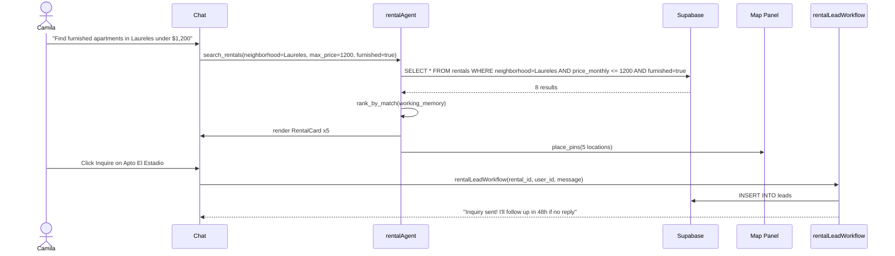

# Rental Search
> Route: `/rentals`  
> User: Consumer (Camila persona)  
> Phase: Core · P0

---

## Page Goal
Chat-first rental search. User says what they need, agent surfaces ranked listings with map pins. No filter forms, no checkbox trees. The conversation IS the search.

---

## Desktop Wireframe

```
┌────────────────────────────────────────────────────────────────────────────────┐
│  ▣ mdeai  Rentals                                                 🔔           │
├─────────────────┬──────────────────────────────────────┬───────────────────────┤
│  LEFT 280px     │  CENTER                              │  RIGHT 360px          │
│  ─────────────  │                                      │                       │
│  🏠 Rentals ←  │  AI: "5 furnished apartments in       │  ┌─────────────────┐  │
│  ─────────────  │  Laureles under $1,200/month.         │  │  🗺️ Medellín    │  │
│  Neighborhood   │  Sorted by match score."             │  │                 │  │
│  • Laureles ✓  │                                      │  │  [●] Apt 1      │  │
│  • El Poblado   │  ┌─────────────────────────────┐    │  │  [●] Apt 2      │  │
│  • Envigado     │  │ 🏠 Apto El Estadio           │    │  │  [●] Apt 3      │  │
│  • Bello        │  │ Laureles · 2BR · Furnished   │    │  │  [●] Apt 4      │  │
│  ─────────────  │  │ $950/mo · ⭐ 92% match       │    │  │  [●] Apt 5      │  │
│  Price          │  │ 300Mbps · Walk to Parque     │    │  │                 │  │
│  [$500–$1,500]  │  │ [Inquire] [Schedule Viewing] │    │  └─────────────────┘  │
│  ─────────────  │  └─────────────────────────────┘    │                       │
│  Bedrooms       │                                      │  ┌─────────────────┐  │
│  ○ Studio       │  ┌─────────────────────────────┐    │  │  Match Filters   │  │
│  ● 1BR          │  │ 🏠 Apt Barrio Laureles       │    │  │  ─────────────  │  │
│  ○ 2BR          │  │ Laureles · 1BR · Furnished   │    │  │  ✓ Furnished    │  │
│  ○ 3BR+         │  │ $1,100/mo · ⭐ 88% match     │    │  │  ✓ Fast wifi    │  │
│  ─────────────  │  │ Gym · Pool · Balcony         │    │  │  ✓ Pet-friendly │  │
│  Furnished      │  │ [Inquire] [Schedule Viewing] │    │  │  ─────────────  │  │
│  ● Yes ○ No    │  └─────────────────────────────┘    │  │  Move-in date   │  │
│  ─────────────  │                                      │  │  [Jan 15 ▾]     │  │
│  📌 Saved (2)   │  ┌─────────────────────────────┐    │  └─────────────────┘  │
│                 │  │ 🏠 Apt Cerca Parque Berrío   │    │                       │
│                 │  │ Laureles · 2BR · Furnished   │    │                       │
│                 │  │ $1,200/mo · ⭐ 85% match     │    │                       │
│                 │  │ [Inquire] [Schedule Viewing] │    │                       │
│                 │  └─────────────────────────────┘    │                       │
│                 │  ──────────────────────────────────  │                       │
│                 │  ┌──────────────────────────────┐   │                       │
│                 │  │ 💬 Refine search...      [▶] │   │                       │
│                 │  └──────────────────────────────┘   │                       │
└─────────────────┴──────────────────────────────────────┴───────────────────────┘
```

---

## Mobile Wireframe

```
┌─────────────────────────────────────────┐
│  ← Back   Rentals   [List⊞] [Map🗺]    │
├─────────────────────────────────────────┤
│  [💬 2BR furnished in Laureles...  ▶]  │
│  AI: "5 matches under $1,200/mo"        │
├─────────────────────────────────────────┤
│  ┌─────────────────────────────────┐   │
│  │ 🏠 Apto El Estadio              │   │
│  │ Laureles · 2BR · $950/mo        │   │
│  │ ⭐ 92% match · 300Mbps wifi     │   │
│  │ [Inquire]  [View Details]       │   │
│  └─────────────────────────────────┘   │
│  ┌─────────────────────────────────┐   │
│  │ 🏠 Apt Barrio Laureles          │   │
│  │ Laureles · 1BR · $1,100/mo      │   │
│  │ ⭐ 88% match · Gym + Pool       │   │
│  │ [Inquire]  [View Details]       │   │
│  └─────────────────────────────────┘   │
│  [Load more...]                         │
├─────────────────────────────────────────┤
│  🏠    📅    🗺️    📌    👤            │
└─────────────────────────────────────────┘
```

---

## Components
- `RentalCard` — photo, name, neighborhood, beds, price, match score, wifi/amenities badges
- `MatchScore` — "92% match" badge powered by working memory preferences
- `InquireButton` — triggers `rentalLeadWorkflow` (CRM entry + AI draft reply)
- `ScheduleViewingButton` — triggers viewing slot selection flow
- `MapPanel` — Google Maps with property pins (right panel)
- `FilterPanel` — neighborhood, price range, beds, furnished, move-in date (right panel)

---

## Data Sources
| Data | Source | Agent |
|---|---|---|
| Rental listings | Supabase `rentals` WHERE status=active | `rentalAgent` |
| Match score | Working memory (budget, beds, neighborhood, amenities) | `rentalAgent` |
| Map pins | `useCoAgent` state | `mapsAgent` |
| Wifi/amenity data | Supabase `rental_amenities` | `rentalAgent` |

---

## User Actions
| Action | Result |
|---|---|
| Type in chat | `rentalAgent` re-searches with new constraints |
| Click Inquire | `rentalLeadWorkflow` starts; AI drafts message to host |
| Click Schedule Viewing | Opens slot picker; creates viewing in DB |
| Click card | Navigate to `/rentals/[id]` |
| Toggle map | Switch to full-screen map view |
| Save ♡ | Add to saved collection |

---

## AI Features
- Match score from working memory: "You said $1,200/mo, 2BR, Laureles, furnished"
- Agent explains why each listing was ranked: "Highest wifi speed + closest to metro"
- After inquiry: "Your message has been sent. I'll follow up if no response in 48 hours"

---

## States

### Loading State (search in progress)

```
┌────────────────────────────────────────────────────────┐
│  💬 AI: Searching furnished apartments in Laureles...  │
│  ─────────────────────────────────────────────────    │
│  [████████████████░░░░░░░░░░░░░░░░░░░░░░░░░░░░░░]    │ ← skeleton card
│  [████████░░░░░░░░░░░░░░░░]  [████░░░░░░░░░░░░░░]    │
│                                                        │
│  [████████████████░░░░░░░░░░░░░░░░░░░░░░░░░░░░░░]    │ ← skeleton card
│  [████████░░░░░░░░░░░░░░░░]  [████░░░░░░░░░░░░░░]    │
└────────────────────────────────────────────────────────┘
```

Skeleton cards appear immediately; real cards replace them as `rentalAgent` streams results.

### Empty State (no results)

```
┌────────────────────────────────────────────────────────┐
│  💬 AI: "I searched 240 listings and found             │
│  nothing under $800 in El Poblado with a pool.        │
│  Want me to try nearby Laureles, or raise the         │
│  budget to $1,000?"                                    │
│                                                        │
│  [Try Laureles ▶]  [Budget $1,000 ▶]  [Refine...]   │
└────────────────────────────────────────────────────────┘
```

Agent always explains _why_ there are no results and offers next steps.

### Error State (Supabase query failed)

```
┌────────────────────────────────────────────────────────┐
│  🔴 Couldn't load rentals — please try again.         │
│     [Retry]                                            │
└────────────────────────────────────────────────────────┘
```

### Data Freshness Badge

Each `RentalCard` shows when listing data was last verified:

```
┌─────────────────────────────────────────────────────┐
│ 🏠 Apto El Estadio                                  │
│ Laureles · 2BR · Furnished · $950/mo                │
│ ⭐ 92% match                                         │
│ Updated 2 days ago ✓  ← freshness indicator         │
│ [Inquire] [Schedule Viewing]                        │
└─────────────────────────────────────────────────────┘
```

Freshness thresholds:
| Updated | Badge |
|---|---|
| < 24h | `Updated today ✓` (green) |
| 1–7 days | `Updated N days ago` (neutral) |
| > 7 days | `⚠️ Listing may be outdated` (yellow) |
| > 30 days | `🔴 Verify availability` (red) |

---

## Mermaid User Flow


