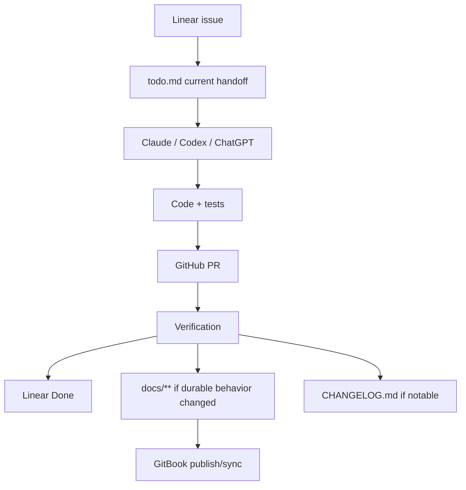
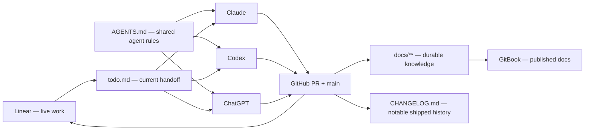

# MDE AI — Work, Docs, and Agent Collaboration Plan

**Purpose:** make Linear, `todo.md`, GitHub, docs/GitBook, `CHANGELOG.md`, Claude, Codex, and ChatGPT work as one simple system without creating duplicate sources of truth.

## Task 1 · Current MDE setup audit

| Area | Current state | Decision |
|---|---|---|
| Shared agent rules | `AGENTS.md` is the canonical cross-agent repository guide | **KEEP** |
| Claude adapter | `CLAUDE.md` still duplicates routing rules and does not yet behave as a thin adapter to `AGENTS.md` | **RECONCILE** |
| Codex | `.agents/skills/` mirrors canonical project skills for Codex | **KEEP** |
| ChatGPT | No explicit repo startup/handoff contract | **ADD lightweight workflow** |
| Linear | Current `docs/README.md` and `docs/tasks/INDEX.md` correctly make Linear live work truth | **KEEP** |
| Legacy Linear docs | Root `linear.md` still says disk task docs are authoritative and contains stale project data | **ARCHIVE / REWRITE** |
| Task handoff | Root `todo.md` is missing; the shared startup sequence below is **future-state until this file is created** | **CREATE short handoff file** |
| Changelog | Root `CHANGELOG.md` is missing | **CREATE** |
| Canonical docs | Numbered `docs/01`–`08` structure is established | **KEEP** |
| Docs validation | `npm run check:docs` exists | **KEEP** |
| GitBook | Root `gitbook-docs.yaml` is committed and prepares site-level Git Sync; publishing/sync is not yet the canonical production workflow | **FINISH + VERIFY** |
| Claude workspace docs | `.claude/README.md` contains stale details that conflict with current `AGENTS.md`/settings | **UPDATE** |

## Task 2 · Source-of-truth model

Use one owner for each kind of information.

| System / file | Owns | Must not become |
|---|---|---|
| **Linear** | live tasks, status, priority, dependencies, blockers, ownership | duplicate product documentation |
| **`todo.md`** | current work handoff: now, blocked, next, branch/PR, last verification | full backlog or roadmap |
| **GitHub PR + merged `main`** | exact implementation evidence | product roadmap |
| **`docs/**`** | durable product, architecture, operations, testing, domain knowledge | live execution tracker |
| **GitBook** | published/readable view of approved canonical docs | a second editable source of truth |
| **`CHANGELOG.md`** | notable verified shipped outcomes | commit log or planned work |
| **`AGENTS.md`** | shared rules for Claude, Codex, ChatGPT, and other agents | current task list |
| **`CLAUDE.md`** | Claude-specific adapter only | duplicate of `AGENTS.md` |



## Task 3 · Create `todo.md` as the shared agent handoff

Create root `todo.md` and keep it intentionally small: ideally 20–60 lines.

Recommended shape:

```markdown
# Current MDE execution context

Live task truth: https://linear.app/amo100/project/mde-ai-bb25cababf6c/issues

## In progress
- SAN-#### · Task name
  - Current state:
  - Blocker:
  - Next action:
  - Branch / PR:

## Next
1. SAN-#### · Task name
2. SAN-#### · Task name

## Recent handoff
- Last verified:
- Tests run:
- Important decision:
- Continue from:

## Durable sources
- Docs: docs/README.md
- Docs index: docs/index-docs.md
- Changelog: CHANGELOG.md
```

Rules:

1. Linear stays authoritative.
2. Every substantive entry should reference a `SAN-####` issue.
3. Remove completed task detail after merge/verification.
4. Keep only recent context another agent needs to continue safely.
5. Do not copy the full Linear backlog into this file.

## Task 4 · Create `CHANGELOG.md` for notable verified outcomes

Use Keep a Changelog style with an `Unreleased` section.

```markdown
# Changelog

All notable changes to MDE AI are documented here.

## [Unreleased]

### Added

### Changed

### Fixed

### Security
```

Entry rule:

```text
verified user-visible or operational outcome
→ CHANGELOG.md

small refactor / test-only cleanup / formatting
→ Git history only
```

Good MDE entry:

```markdown
### Fixed
- Made rental viewing confirmation wait for the committed database result, preventing false-success messages. Linear: SAN-1203. PR: #123.
```

Do not add changelog entries for planned work.

## Task 5 · Make Linear the only live work system

Current canonical rule already exists in `docs/README.md` and `docs/tasks/INDEX.md`: keep it.

Required cleanup:

1. Archive or rewrite root `linear.md`; it currently contradicts the current model by making disk task docs authoritative.
2. Review `linear-reference.md`; keep only durable Linear usage guidance that still matches the current `amo100` workspace/project.
3. Remove stale references to old workspace/project URLs, old cycles, old repository roots, and old task prefixes from active docs.
4. Keep `docs/tasks/` limited to durable authoring conventions, not live issue mirrors.
5. Each substantive PR should link its Linear issue.

Recommended lifecycle:

```text
Backlog → Todo → In Progress → In Review → Done
```

`Done` means acceptance criteria were actually verified, not merely coded.

## Task 6 · Add a GitBook publishing workflow

GitHub `docs/**` remains canonical. GitBook is a publication/retrieval layer.

Recommended first implementation:

1. Create `docs/07-operations/gitbook.md` with the publishing and ownership rules, and verify it matches the already-committed root `gitbook-docs.yaml`.
2. Connect the MDE GitBook site to this repository and `main` with **site-level Git Sync**; keep `gitbook-docs.yaml` as the single mapping from GitBook spaces to existing documentation directories.
3. Publish only current canonical docs; keep `docs/_archive/` out of primary navigation/retrieval.
4. Add minimal frontmatter only where it improves GitBook/search quality:

```yaml
---
title: "Clear human-readable title"
description: "One sentence explaining exactly what this page answers."
---
```

5. Let GitBook expose its generated Markdown/LLM/Model Context Protocol (MCP) surfaces rather than manually duplicating them in the repo.
6. Test retrieval with real questions from Claude, Codex, and ChatGPT.
7. Do not edit canonical content directly in GitBook unless the approved workflow synchronizes it back to GitHub.

### GitBook success test

An agent should be able to answer:

- What is the source of truth?
- How does this feature work?
- Where is the current implementation?
- How is it verified?
- What is planned vs shipped?

without retrieving archived or stale docs as current truth.

## Task 7 · Standardize Claude, Codex, and ChatGPT startup

All agents should start from the same repository reality.

### Shared startup sequence

**Future-state until `todo.md` exists.** Until then, agents must read `AGENTS.md`, the referenced Linear issue, current branch/PR state, and affected canonical docs directly.

```text
1. Read AGENTS.md.
2. Read todo.md for current handoff.
3. Open the referenced Linear issue.
4. Verify current branch / PR / git status.
5. Read linked canonical docs.
6. Inspect current source and tests.
7. Use the narrowest canonical project skill.
8. Implement the smallest safe change.
9. Run relevant verification.
10. Update PR / Linear / todo / docs / changelog only where appropriate.
```

### Claude

- Target state: keep `CLAUDE.md` as a thin adapter to `AGENTS.md`; first reconcile its duplicated routing rules with the current `using-mde-skills` → canonical-owner routing in `AGENTS.md`.
- Update `.claude/README.md` so it describes the current skill/hook layout and current CopilotKit rules.
- Session hooks may surface branch, `todo.md`, and verification reminders, but must not invent task truth.

### Codex

- Continue using `AGENTS.md` as the primary repo instruction file.
- Keep `.agents/skills/` as the Codex-accessible mirror of canonical project skills.
- Do not create a separate `CODEX.md` unless a Codex-only requirement appears.

### ChatGPT

- Use `AGENTS.md` as the shared repo contract when working through GitHub/Desktop/Work-style tooling.
- At the start of substantial repository work, explicitly read `AGENTS.md`, `todo.md`, the Linear issue, and affected docs/source.
- Do not rely on old chat context when current repo/Linear evidence is available.

## Task 8 · Agent completion and handoff rules

Before an agent reports completion:

```text
implementation
→ relevant tests
→ git diff review
→ PR state
→ Linear acceptance criteria
→ durable docs if behavior changed
→ changelog if notable
→ todo handoff if work remains
```

Handoff example:

```markdown
## In progress
- SAN-#### · Task name
  - Current: implementation merged in PR #123
  - Blocker: production smoke not yet run
  - Last verified: Vitest + Playwright pass
  - Next: run production smoke, then move Linear to Done
```

This allows Claude → Codex → ChatGPT handoffs without repeating the whole project history.

## Task 9 · Clean up stale agent documentation

Priority fixes:

1. `.claude/README.md` — reconcile skill ownership, hook list, current paths, and CopilotKit guidance with `AGENTS.md` + `.claude/settings.json`.
2. `linear.md` — archive/rewrite stale source-of-truth and old workspace/cycle details.
3. `linear-reference.md` — reduce to durable Linear guidance or move into `docs/07-operations/linear.md`.
4. Search active docs/skills for stale `todo.md`, retired lifecycle owners, old repository roots, and old workspace URLs.
5. Keep historical stale material only under `docs/_archive/` where it is clearly historical.

## Task 10 · Implementation order

Use small independent PRs rather than one documentation mega-PR.

| Order | Task | Files | Outcome |
|---:|---|---|---|
| **1** | Shared handoff | `todo.md`, `AGENTS.md` | All agents know where current work lives |
| **2** | Changelog | `CHANGELOG.md`, `AGENTS.md` | Notable shipped history is captured consistently |
| **3** | Linear cleanup | `linear.md`, `linear-reference.md`, `docs/tasks/*` | One live work source of truth |
| **4** | Agent docs cleanup | `.claude/README.md`, agent docs | Claude/Codex/ChatGPT rules agree |
| **5** | GitBook workflow | `docs/07-operations/gitbook.md` | Canonical docs can be published/retrieved safely |
| **6** | Automation/CI | scripts/tests only if needed | Drift is caught automatically |

Do not implement all six in one PR.

## Task 11 · Verification plan

Every workflow/docs PR:

```bash
npm run check:docs
git diff --check
```

Agent instruction changes should also run the existing skill/hook verification relevant to the files changed.

Before declaring the whole workflow complete, prove these scenarios:

1. **Claude handoff:** Claude can start from `todo.md` + Linear and continue a task correctly.
2. **Codex handoff:** Codex reads the same issue and follows the same repository rules.
3. **ChatGPT handoff:** ChatGPT can recover current state from the repo + Linear without relying on prior chat history.
4. **Merged task:** notable verified work moves from `todo.md` to `CHANGELOG.md` when appropriate.
5. **Docs change:** canonical GitHub docs publish to GitBook without promoting archive content.
6. **Drift test:** stale task/status claims are caught or clearly separated from live Linear truth.

## Task 12 · Recommended final architecture



## Task 13 · First three implementation proposals

These are proposal names, not actionable Linear issues yet. Before implementation, create each item in the MDE Linear project and replace the proposal name with its real `SAN-` issue ID.

1. **Shared handoff · Add a short `todo.md` handoff and make every agent read it after `AGENTS.md`.**
2. **Changelog · Add `CHANGELOG.md` and define when verified work is notable enough to record.**
3. **Linear cleanup · Retire stale `linear.md` task-truth rules and document the current Linear → PR → verification → docs lifecycle.**

After those three are stable, finish and verify the already-committed `gitbook-docs.yaml` site-level Git Sync workflow rather than creating a second GitBook configuration path.
