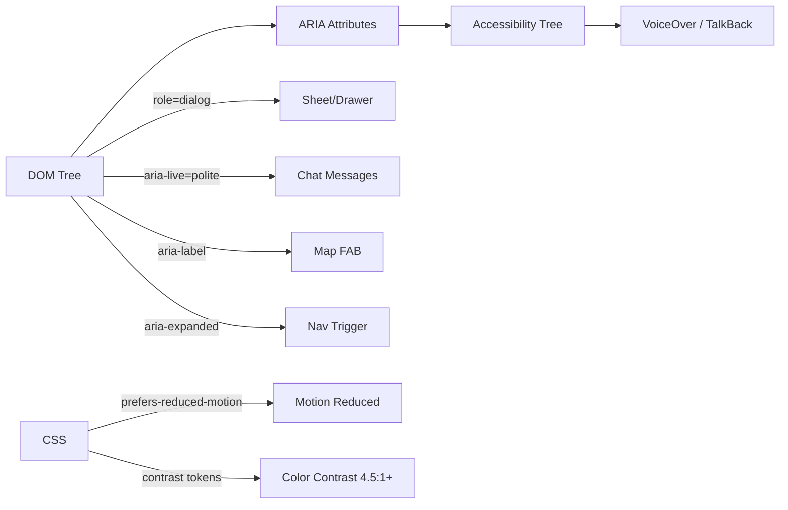

# A11Y-001 — Mobile Accessibility Audit

## Goal
VoiceOver (iOS) + TalkBack (Android) can navigate core concierge flows; focus order is logical; all interactive elements have accessible labels; WCAG 2.1 AA color contrast met; `prefers-reduced-motion` fully respected.

## User story
As a screen reader user on iPhone, I can navigate the concierge chat, read rental cards with VoiceOver, and complete a search without seeing the map.

## Screen / path
`/` + `/login` + `/events/[slug]` — all user-facing surfaces

## Current status
**Not Started** — depends on M3 features (chat composer, cards, map) being production-ready. Auditing incomplete surfaces wastes cycles.

## Build scope

### Frontend — ARIA + semantic HTML
- All icon-only buttons: `aria-label` required
  - FAB: `aria-label={pinCount > 0 ? \`Open map with ${pinCount} pins\` : "Open map"}` ✅ (already in `map-mobile-sheet.tsx`)
  - Nav drawer trigger: `aria-label="Open navigation"` + `aria-expanded={open}` + `aria-controls="nav-drawer"`
  - Close buttons in sheets: `aria-label="Close"`
- Sheets/drawers: `role="dialog"` + `aria-modal="true"` + `aria-labelledby` pointing to SheetTitle
- Map container: `aria-label="Interactive map showing search results"` + `role="region"`
- Card list: `role="list"` on wrapper, `role="listitem"` or `role="article"` on cards
- Card `aria-label`: `"${venue.name}, ${type}, ${city}"` (name + type + location)
- AI streaming response: `aria-live="polite"` on the message container — announces new messages to screen readers
- Skip-to-main link: already in `layout.tsx` — verify it works and is focusable
- Chip buttons: `aria-pressed` state for active chips
- Form inputs: `<label>` element or `aria-label` on all inputs (no placeholder-only labeling)

### CSS — color contrast
- Verify all text meets WCAG 2.1 AA (4.5:1 normal, 3:1 large):
  - `--foreground` on `--background`: oklch values — check with contrast checker
  - `--foreground-muted` on `--background-elevated`: verify ≥ 4.5:1
  - `--accent` gold on dark backgrounds: verify ≥ 3:1 for large text CTAs
- Fix any contrast failures in `globals.css` token values

### CSS — reduced motion
- `prefers-reduced-motion: reduce` in `globals.css` already covers `map-sheet-content` and `nav-drawer-content`
- Extend to cover: card hover transitions, chip press animations, AI streaming dots, skeleton pulse animation (replace `animate-pulse` with static opacity)

### Focus management
- Sheet/drawer open: `useEffect` → `firstFocusableElement.focus()` after mount
- Sheet/drawer close: `useEffect` → return focus to trigger button
- Tab order: `[skip-main] → [header nav] → [chat input] → [results] → [map FAB]`
- No focus traps outside dialog/sheet primitives

## Mermaid — accessibility layer



## Acceptance criteria
- [ ] `@axe-core/playwright` reports 0 AA violations on `/` at 390px
- [ ] `@axe-core/playwright` reports 0 AA violations on `/login`
- [ ] FAB has `aria-label` (verified with axe and manual VoiceOver test)
- [ ] Nav drawer trigger has `aria-expanded` and `aria-controls`
- [ ] All sheets have `role="dialog"` and `aria-modal="true"`
- [ ] AI message container has `aria-live="polite"`
- [ ] Color contrast ≥ 4.5:1 on all body text (Lighthouse contrast check)
- [ ] Tab order: skip-main → header → chat input → results (no missing focusable elements)
- [ ] `prefers-reduced-motion` removes ALL transitions and `animate-pulse` animations
- [ ] 0 console errors on happy path at 390px

## Tests
```bash
cd mdeapp
npm install @axe-core/playwright --save-dev
PW_SKIP_WEBSERVER=1 npx playwright test e2e/a11y/A11Y-001-mobile-accessibility.spec.ts
npm run lint
npm run build
npm run audit
```

## Evidence required
- [ ] axe-core report: 0 AA violations on `/` and `/login` (screenshot of test output)
- [ ] Lighthouse accessibility score ≥ 90 (screenshot)
- [ ] Reduced motion: screenshot/video of sheet opening with `prefers-reduced-motion: reduce` active

## Dependencies
- MOB-CHAT-001, MAP-011, MOB-CARD-001 — all must ship before accessibility audit (auditing unstable surfaces is wasted effort)

## Common failure points
1. **VoiceOver ignores `display:none`** — use `aria-hidden="true"` for visually-hidden but DOM-present elements (e.g. closed sheet content if not unmounted)
2. **Portal mount requires explicit `focus()`** — Base UI sheets don't always auto-focus; add `useEffect(() => { ref.current?.focus() }, [open])` on the dialog container
3. **`aria-live` announces during mount** — wrap in `setTimeout(() => setMounted(true), 0)` to avoid immediate announcement of stale content
4. **iOS VoiceOver swipe order ≠ tab order** — test with actual VoiceOver, not just keyboard tab
5. **Color contrast fails in dark mode** — `--foreground-muted` on `--background` may be borderline; test both modes

## Runtime proof

```bash
cd mdeapp && npm run dev
# Chrome DevTools → Accessibility panel → check ARIA tree
# Lighthouse → Accessibility → Mobile
# Target: Accessibility score ≥ 90
```

## Done gate
- [ ] Playwright axe-core test passes: 0 AA violations
- [ ] Lighthouse accessibility ≥ 90 on `/` mobile
- [ ] Reduced motion verified: all transitions disabled
- [ ] Manual VoiceOver test: FAB announces label, sheet announces role=dialog
- [ ] `npm run floor` exit 0
- [ ] Evidence file at `tasks/notes/A11Y-001-evidence.md`
- [ ] INDEX rows match frontmatter `status: Done`

## Do not do
- Do not add `role="presentation"` to semantic elements (cards, lists) — preserves screen reader flow
- Do not use `tabindex > 0` — creates focus order confusion
