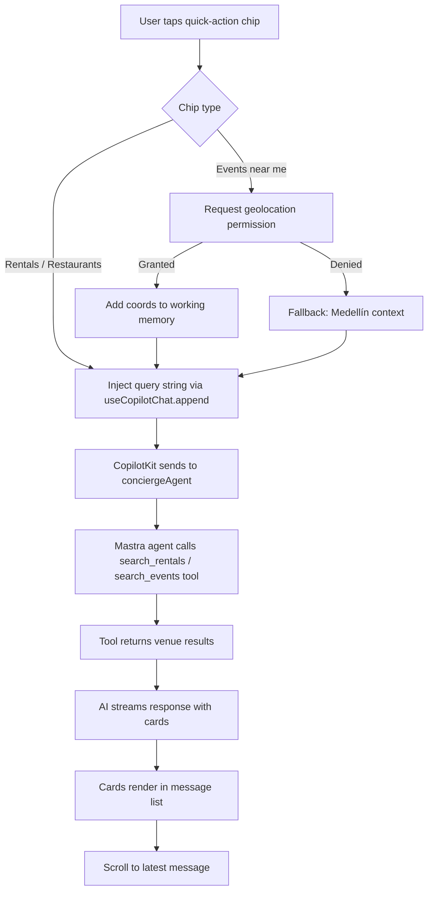

# AIM-010 — Mobile AI Concierge UX — Chips, Voice, Contextual Prompts

## Goal
Quick-action chips above composer on mobile; location-aware prompt suggestions; loading skeleton during AI stream; AI response message spacing optimized for narrow viewport; thread persistence on mobile refresh.

## User story
As **Camila** on mobile, I tap the "Rentals" chip and receive rental cards without typing — the concierge responds with location context already applied.

## Screen / path
`/` — chat surface, `<390px` viewport

## Current status
**Not Started** — depends on MOB-CHAT-001 (composer + keyboard UX) and SCREEN-018 (shell).

## Build scope

### Frontend
- `src/components/chat/quick-chips.tsx` (new)
  - Chips: `flex flex-nowrap gap-2 px-4 py-2 overflow-x-auto scrollbar-hide`
  - Each chip: `h-8 px-3 text-sm rounded-full border border-border bg-background whitespace-nowrap min-w-fit`
  - Tap target wrapper: `min-h-[44px] flex items-center` to meet 44px touch target
  - Labels: "Rentals", "Events near me", "Restaurants", "Plan my day"
  - `data-testid="quick-chip-{label}"` on each chip (kebab-case, e.g. `quick-chip-events-near-me`)
  - `data-testid="quick-chips-container"`
  - On chip tap: inject pre-defined query string via `appendMessage` from `useCopilotChat()` in `@copilotkit/react-core` (v1.55.2 — NOT `.append()`, NOT v2 import path); debounce 300ms to prevent double-fire
- `src/components/chat/message-list.tsx` — message spacing
  - Message bubble: `py-3 px-4` on mobile, `md:py-4` on tablet+
  - AI response container: `aria-live="polite"` (also serves A11Y-001)
  - Streaming skeleton (from MOB-CHAT-001): 3-line pulse visible during stream
- `src/hooks/use-geolocation.ts` (new or extend)
  - `navigator.geolocation.getCurrentPosition` — request on "Events near me" chip tap only
  - On success: add coords to Mastra `workingMemory` via `useCoAgent` state update
  - On denial: fallback string "Medellín, Colombia" injected into context
  - `data-testid="location-permission-banner"` if permission was denied
- Thread persistence — **do NOT create `use-thread-persistence.ts`**; thread ID is already managed by `ThreadNavProvider` / `useThreadNav` in `src/lib/chat/thread-nav-context.tsx`. If URL persistence (`?t=xxx`) is desired, extend `ThreadNavProvider` with `router.replace` on `setActiveThreadId`, do not create a parallel hook.
- `src/components/chat/empty-state.tsx`
  - `data-testid="chat-empty-state"` — visible before first message; shows chips prominently
  - Voice input icon: `data-testid="voice-input-button"` — render as disabled with `aria-disabled="true"` for MVP

### CopilotKit (v1.55.2 — `@copilotkit/react-core` v1 only)
- `useCoAgent({ name: "conciergeAgent" })` for state access — agent name must match `Mastra({ agents: { conciergeAgent } })` key exactly
- `appendMessage` from `useCopilotChat()` used by chip tap handler — **not `.append()`** (v2 method that does not exist in v1)

### Mastra
- Geolocation coords added to agent working memory on "Events near me" chip tap

## Acceptance criteria
- [ ] Chips container (`data-testid="quick-chips-container"`) visible above composer at 390px
- [ ] Chip tap sends query without user typing (debounced, fires once)
- [ ] "Events near me" chip requests geolocation permission
- [ ] Geolocation denied → fallback "Medellín" context used (no error thrown)
- [ ] Streaming skeleton visible during AI response (3 animated lines)
- [ ] Messages readable at 390px — no text overflow, `py-3` spacing applied
- [ ] Thread ID (`?t=xxx`) persists in URL and survives page refresh
- [ ] Empty state (`data-testid="chat-empty-state"`) shows when no messages
- [ ] Chips scroll horizontally if overflow — no wrapping that breaks layout
- [ ] Voice input button present (`data-testid="voice-input-button"`) in disabled state for MVP
- [ ] 0 console errors on chip tap + AI response render

## Tests
```bash
cd mdeapp && npm test -- --run
npm run lint
npm run typecheck
npm run build
npm run verify:console
npm run floor
PW_SKIP_WEBSERVER=1 npx playwright test e2e/screens/AIM-010-mobile-ai.spec.ts --project=chromium
```

## Evidence required
- [ ] Screenshot: chips visible above composer at 390px
- [ ] Screenshot: AI response cards after chip tap
- [ ] Playwright spec pass

## Dependencies
- MOB-CHAT-001 (composer + keyboard UX — not yet Done)
- SCREEN-018 (shell with safe areas — not yet Done)

## Runtime proof (dev restart + Browser)

### Step 1 — Restart dev server
```bash
lsof -ti :3001 | xargs -r kill -9
cd mdeapp && npm run dev
```
Probe:
```bash
curl -s -o /dev/null -w "AIM-010 → %{http_code}\n" --max-time 15 -L http://localhost:3001/
```

### Step 2 — Browser MCP proof
| Step | Action | Pass |
|------|--------|------|
| 1 | Navigate `http://localhost:3001/` at 390×844 | Empty state + chips visible |
| 2 | Tap "Rentals" chip | Query sent, skeleton shows |
| 3 | Wait for AI response | Rental cards render |
| 4 | Refresh page | Thread ID in URL → same thread restored |
| 5 | Console check | 0 errors |

---

## Chip tap → agent tool call → card render



## Common failure points
1. **Geolocation denied — dead loader** — if "Events near me" chip waits for geolocation permission and the user denies, the chip handler must time out after 3s and fall back to "Medellín" context; otherwise the AI stream never starts.
2. **CopilotKit stream drops → permanent loading state** — if the SSE connection drops mid-stream, the skeleton stays animated forever; add a 30s timeout that resets streaming state and shows an error toast.
3. **Chip double-fire without debounce** — a fast double-tap on a chip calls `appendMessage` twice, sending two identical queries; debounce at 300ms and disable chips while `isLoading` is true.
4. **Thread URL param cleared by Next.js router** — `router.push` without `{ scroll: false }` can cause a page scroll reset; always use `router.replace('/?t=' + id, { scroll: false })` for thread persistence.
5. **Chip overflow wrapping** — if `flex-wrap` is accidentally applied to chips container, chips wrap to 2 rows and push the composer down; enforce `flex-nowrap` and `overflow-x-auto`.

## Done gate (all required)
- [ ] Dev server restarted clean
- [ ] Browser MCP: navigate + snapshot + console clean + screenshot
- [ ] Playwright spec pass
- [ ] `npm run floor` exit 0
- [ ] Thread URL persistence verified (refresh test)
- [ ] Screenshots under `mdeapp/tmp/screenshots/AIM-010/`

## Do not do
- Do not implement actual voice input for MVP — render voice button in disabled state only
- Do not wrap chips — use `flex-nowrap` + horizontal scroll
