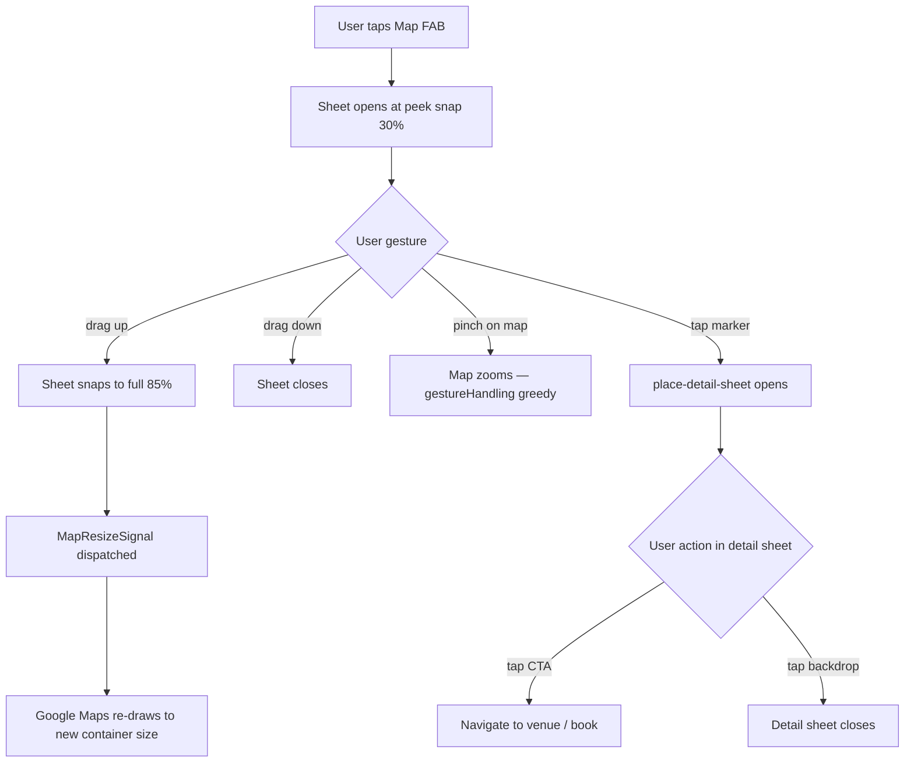

# MAP-011 — Mobile Map Interaction System

## Goal
Pinch-zoom on ChatMap works without triggering page scroll; mobile marker tap opens detail sheet; bottom sheet has 2 snap points (peek 30%, full 85%); no map gesture conflicts with page scroll.

## User story
As **Camila** on Android, I pinch-zoom the map inside the bottom sheet without accidentally scrolling the page behind it.

## Screen / path
`/` — map sheet, `<390px` viewport; map panel hidden on mobile (`lg:hidden`)

## Current status
**Not Started** — depends on SCREEN-018 (FAB + sheet scaffold) and MAP-001 (ChatMap component).

## Build scope

### Frontend
- `src/components/chat/map-mobile-sheet.tsx` (already exists — extend, do not recreate)
  - Disk uses **shadcn `<Sheet side="bottom">`** — no snap points. Decision: extend with snap-point behavior using CSS `height` transitions on drag, OR add `vaul` dependency for native snap. Confirm choice before implementing; this task defaults to extending the existing shadcn Sheet.
  - Add `data-testid="map-snap-peek"` (sheet at ~30% height) and `data-testid="map-snap-full"` (sheet at 85dvh)
  - Map container inside sheet: `style={{ touchAction: "none" }}` to prevent browser scroll intercepting pinch
  - On height change → dispatch `MapResizeSignal` so Google Maps re-draws
  - Close on outside-backdrop tap: shadcn Sheet handles this via `onOpenChange`
- `src/components/maps/ChatMap.tsx` (already exists at this path — NOT `src/components/map/chat-map.tsx`)
  - Uses **`@vis.gl/react-google-maps`** `<APIProvider>` + `<Map>` — NOT `useJsApiLoader`
  - `gestureHandling="greedy"` prop on `<Map>` — captures all touch events (✅ already on disk)
  - `mapId` required on all `<Map>` instances (✅ already on disk per CLAUDE.md)
  - `IntersectionObserver` for lazy map init: skip Google Maps init until sheet enters viewport
  - Marker tap handler: call `setSelectedPlace(place)` → triggers detail sheet
- Place detail sheet — use/extend pattern from `src/components/chat/cafe-detail-mobile-sheet.tsx` (already exists)
  - Do NOT create a third sheet type under `src/components/map/`; add to `src/components/chat/` alongside existing sheets
  - `data-testid="place-detail-sheet"`; renders on marker tap
  - Contains: venue name, type, distance, CTA button
- Clustering: currently inline in `ChatMap.tsx` via `ClusteredCategoryMarkers.tsx` — extend existing, do not create `cluster-renderer.tsx`
- FAB badge: `data-testid="map-fab-pin-count"` showing visible pin count

### Mobile-specific
- Map panel: `hidden lg:block` — desktop-only sidebar; mobile via sheet only
- `MapResizeSignal`: custom event dispatched on sheet snap change, consumed in `chat-map.tsx`

### Supabase / Mastra
- None

## Acceptance criteria
- [ ] Pinch-zoom works on map without triggering page scroll (`gestureHandling: "greedy"` confirmed)
- [ ] Marker tap opens `data-testid="place-detail-sheet"` on mobile
- [ ] Bottom sheet snaps to 30% (peek) and 85% (full) — Vaul `snapPoints={[0.3, 0.85]}`
- [ ] No scroll conflict: scrolling outside sheet does not scroll map; dragging sheet handle does not pan map
- [ ] Cluster tap zooms map to cluster bounds
- [ ] Sheet closes on outside-backdrop tap
- [ ] `MapResizeSignal` triggers on snap point change; map re-renders correctly
- [ ] FAB shows pin count badge (`data-testid="map-fab-pin-count"`)
- [ ] Map panel hidden on mobile (`hidden lg:block` verified at 390px)
- [ ] Desktop map panel visible at 1024px+ viewport
- [ ] `mapId` present on all `<Map>` instances (required for `AdvancedMarker`)
- [ ] 0 console errors on map open + marker tap

## Tests
```bash
cd mdeapp && npm test -- --run
npm run lint
npm run typecheck
npm run build
npm run verify:console
npm run floor
PW_SKIP_WEBSERVER=1 npx playwright test e2e/screens/MAP-011-mobile-map.spec.ts --project=chromium
```

## Evidence required
- [ ] Screenshot: map sheet at peek snap (30%) and full snap (85%)
- [ ] Screenshot: place-detail-sheet open after marker tap
- [ ] Playwright mobile spec pass

## Dependencies
- SCREEN-018 ✅ (FAB + sheet)
- MAP-001 (ChatMap component — `@vis.gl/react-google-maps` `APIProvider` pattern)

## Runtime proof (dev restart + Browser)

### Step 1 — Restart dev server
```bash
lsof -ti :3001 | xargs -r kill -9
cd mdeapp && npm run dev
```
Probe:
```bash
curl -s -o /dev/null -w "MAP-011 → %{http_code}\n" --max-time 15 -L http://localhost:3001/
```

### Step 2 — Browser MCP proof
| Step | Action | Pass |
|------|--------|------|
| 1 | Navigate `http://localhost:3001/` at 390×844 | FAB visible |
| 2 | Tap FAB | Sheet opens at peek (30%) snap |
| 3 | Drag sheet to full | Sheet at 85%, map fills sheet |
| 4 | Pinch-zoom on map | Zoom works, no page scroll |
| 5 | Tap map marker | `place-detail-sheet` renders |
| 6 | Console check | 0 errors |

---

## Mobile map interaction flow



## Common failure points
1. **Google Maps touch vs browser scroll conflict** — without `gestureHandling: "greedy"`, two-finger scroll on mobile pans the page instead of the map; always set this on mobile sheet maps.
2. **iOS Safari elastic bounce** — the sheet drag handle and the browser elastic bounce interfere; Vaul handles most of this but requires `overscroll-behavior: contain` on the sheet body element.
3. **Pinch fires `wheel` event on desktop** — in Playwright desktop tests, simulate pinch via `page.evaluate` wheel delta rather than pointer events for reliable cross-browser testing.
4. **Cluster click during map animation** — if user taps a cluster while a `panTo` animation is running, the cluster bounds calculation can return stale data; debounce cluster tap handler by 150ms.
5. **`AdvancedMarker` requires `mapId`** — Google Maps throws a runtime error if `mapId` is missing; verify this is enforced in the `<Map>` component, not just the marker.

## Done gate (all required)
- [ ] Dev server restarted clean
- [ ] Browser MCP: navigate + snapshot + console clean + screenshot
- [ ] Playwright spec pass (chromium mobile viewport)
- [ ] `npm run floor` exit 0
- [ ] `mapId` present on all `<Map>` instances verified
- [ ] Screenshots under `mdeapp/tmp/screenshots/MAP-011/`

## Do not do
- Do not use `gestureHandling: "cooperative"` on mobile — it breaks pinch-zoom in sheets
- Do not render the map panel visible on mobile (must be `hidden lg:block`)
